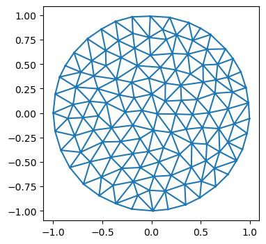
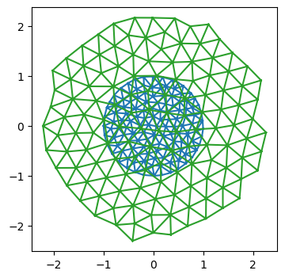

# Simulation test case - optimize mesh to make triangles equilateral


Let’s start with a simple test case to see whether the technology
developed so far actually works. The goal is to move the vertices of
triangulation so all triangle edge lengths are as close to some
ℓ<sub>0</sub> as possible. We specify a pseudo-energy $E=\_{ij}
(|\_i-\_j| - \_0)^2 $, and then minimize it using the JAX-provided
gradients w.r.t the vertex positions.

This defines the “forward pass” of our “dynamical” model. In a second
step, we can optimize over the model parameters, like ℓ<sub>0</sub>, to
make the dynamics return some desired shape, for examlpe.

<!-- WARNING: THIS FILE WAS AUTOGENERATED! DO NOT EDIT! -->

``` python
import numpy as np
import matplotlib as mpl
import matplotlib.pyplot as plt

import copy

from tqdm.notebook import tqdm
```

``` python
import jax
import jax.numpy as jnp
```

``` python
jax.config.update("jax_enable_x64", True)
jax.config.update("jax_debug_nans", False)
jax.config.update('jax_log_compiles', False)
```

``` python
from jaxtyping import Float, Int, Bool, PyTree 
from typing import Any, Iterable, List, Dict, Tuple, NamedTuple
from enum import IntEnum

import dataclasses

import functools
```

``` python
# import previously defined modules
from triangulax import mesh as msh
from triangulax.mesh import TriMesh, HeMesh, GeomMesh
```

#### JAX-compatible scientific computing libraries - useful in future steps

    import diffrax # ODE solvers
    import lineax # linear solvers
    import optimistix # optimisation (scientific-computing style, e.g. conjugate gradient)
    import optax # optimisation (ML-style, e.g. ADAM)

### Forward pass - minimize energy

``` python
import equinox as eqx

# equinox has automated "filtering" of JAX-transforms. So we can work with objects which are not just pytrees of arrays
# (like neural networks) and appy jit, vmap etc
```

``` python
# load example mesh
mesh = TriMesh.read_obj("test_meshes/disk.obj")
hemesh = HeMesh.from_triangles(mesh.vertices.shape[0], mesh.faces)
geommesh = GeomMesh(*hemesh.n_items, vertices=mesh.vertices)

hemesh
```

    Warning: readOBJ() ignored non-comment line 3:
      o flat_tri_ecmc

    HeMesh(N_V=131, N_HE=708, N_F=224)

``` python
fig = plt.figure(figsize=(4, 4))
plt.triplot(*geommesh.vertices.T, mesh.faces)
plt.axis("equal");
```



``` python
lengths = jnp.linalg.norm(geommesh.vertices[hemesh.orig]-geommesh.vertices[hemesh.dest], axis=1)
tri_areas = -jax.vmap(msh.get_polygon_area)(geommesh.vertices[hemesh.faces])

lengths.mean(), tri_areas.mean()
```

    (Array(0.18296366, dtype=float64), Array(0.01391806, dtype=float64))

We write the energy_function using a geommesh as an argument. This is
overkill for present purposes ince only the vertex positions matter, but
is useful to test the machinery. For more complicated simulations, we
will want to use GeomMesh as a wrapper for the various arrays.

``` python
@jax.jit
def energy_function(geommesh: GeomMesh, hemesh: HeMesh, ell_0: float=1):
    edge_lengths = jnp.linalg.norm(geommesh.vertices[hemesh.orig]-geommesh.vertices[hemesh.dest], axis=1)
    edge_energy = jnp.mean((edge_lengths/ell_0-1)**2) # this way, term is "auto-normalized"
    # let's add a term for the triangle areas
    a_0 = (np.sqrt(3)/4) * ell_0**2 # area of equilateral triangle
    tri_area = -jax.vmap(msh.get_polygon_area)(geommesh.vertices[hemesh.faces])
    area_energy = jnp.mean((tri_area/a_0-1)**2)
    #jax.debug.print("E_l: {E_l}, E_a: {E_a}",  E_l=edge_energy, E_a=area_energy)
    # this is how you can print inside a JITed-function
    return edge_energy + area_energy
```

``` python
energy_function(geommesh, hemesh)
```

    Array(1.60519339, dtype=float64)

``` python
# using functools.partial, we can fill in some of our function's args, like so:

functools.partial(energy_function, hemesh=hemesh, ell_0=1)(geommesh)
```

    Array(1.60519339, dtype=float64)

``` python
val, grad = jax.value_and_grad(energy_function)(geommesh, hemesh) # computing value and grad works

val, grad, grad.vertices.shape # the gradient is another GeomMesh with the same structure
```

    (Array(1.60519339, dtype=float64),
     GeomMesh(D=2,N_V=131, N_HE=708, N_F=224),
     (131, 2))

``` python
connectivity_grad = jax.grad(energy_function, argnums=1, allow_int=True)(geommesh, hemesh)
# we can even compute the gradient w.r.t to the connectivity matrix. It is also a HeMesh
connectivity_grad, connectivity_grad.dest[0] # whatever that means
```

    (HeMesh(N_V=131, N_HE=708, N_F=224), np.void((b'',), dtype=[('float0', 'V')]))

#### Optimization run

``` python
# parameters of the energy
ell_0 = 0.5

# parameters of the "optimizer"
step_size = 0.05
N_steps = 10000

@jax.jit
def make_step(geommesh: GeomMesh, hemesh: HeMesh, ell_0: float = 1, step_size: float = 0.01):
    loss, grad = jax.value_and_grad(energy_function)(geommesh, hemesh, ell_0=ell_0)

    # update - can be streamlined with equinox
    updated_vertices = geommesh.vertices - step_size*grad.vertices
    geommesh_updated = dataclasses.replace(geommesh, vertices=updated_vertices)
    return geommesh_updated, hemesh, loss # explicitly return the hemesh - may need to be updated by flips!

# define inital condition
geommesh_optimized = copy.copy(geommesh)
hemesh_optimized = copy.copy(hemesh)

losses = []

for step in range(N_steps):
    geommesh_optimized, hemesh_optimized, loss = make_step(geommesh_optimized, hemesh_optimized,
                                                           ell_0=ell_0, step_size=step_size)
    losses.append(loss)

losses = np.array(losses)
```

``` python
fig = plt.figure(figsize=(4, 3))
plt.plot(losses)
```


``` python
fig = plt.figure(figsize=(4, 4))
plt.triplot(*geommesh.vertices.T, hemesh.faces)
plt.triplot(*geommesh_optimized.vertices.T, hemesh_optimized.faces)
plt.axis("equal");
```


``` python
lengths_optimized = jnp.linalg.norm(geommesh_optimized.vertices[hemesh_optimized.orig]
                                   -geommesh_optimized.vertices[hemesh_optimized.dest], axis=1)
jnp.abs(lengths_optimized-ell_0).mean(), lengths_optimized.mean()
```

    (Array(0.03342644, dtype=float64), Array(0.50208086, dtype=float64))

### Meta-training

Eventually, we aim to learn some dynamical rules for a tissue mechanics
model that make the tissue carry out some desired behavior, like making
a target shape.

As a toy example, let’s take the above “dynamics” which minimizes the
pseudo-energy to make all triangles equilateral. It depends on the
parameter ℓ<sub>0</sub>. Relaxation of the pseudo-energy for some number
of steps defines our “forward pass”. Let’s try to optimize ℓ<sub>0</sub>
so that the tissue, at the end of the energy relaxation, has some target
size (of course, a contrived problem, since we know the solution from
the start).

``` python
# package the whole training process into a JITed function

@functools.partial(jax.jit, static_argnames=['N_steps'])
def relax_energy(initial_geommesh: GeomMesh, initial_hemesh: HeMesh, ell_0: float = 1,
                 step_size: float = 0.01, N_steps: int = 1):

    # define initial condition
    geommesh_optimized = copy.copy(initial_geommesh)
    hemesh_optimized = copy.copy(initial_hemesh)

    # use a jax.lax.fori_loop loop for training. Much faster JIT-compilation than a Python for loop.
    loss = 0
    init = (initial_geommesh, initial_hemesh, loss)
    loop_fun = lambda i, carry: make_step(carry[0], carry[1], ell_0=ell_0, step_size=step_size) 
    geommesh_optimized, hemesh_optimized, loss = jax.lax.fori_loop(0, N_steps, loop_fun, init, unroll=None)
    
    return (geommesh_optimized, hemesh_optimized), loss
```

``` python
(geommesh_optimized, hemesh_optimized), losses = relax_energy(geommesh, hemesh, ell_0=0.5, step_size=0.05, N_steps=5000)
losses
```

    Array(0.04463656, dtype=float64)

``` python
fig = plt.figure(figsize=(4, 4))
plt.triplot(*geommesh.vertices.T, hemesh.faces)
plt.triplot(*geommesh_optimized.vertices.T, hemesh_optimized.faces)
plt.axis("equal");
```


``` python
```

    28.9 ms ± 285 μs per loop (mean ± std. dev. of 7 runs, 100 loops each)

#### Define Meta-training loss

Now we need to define our meta-training loss. In this case, it’s just
the deviation of the average edge length from the total. Note how the
meta-loss is *distinct* from the pseudo-energy we minimize during the
forward pass.

Let’s use the `equinox` library to handle our problem, in anticipation
of more complex ones down the line.

``` python
class RelaxationDynamics(eqx.Module): # we create a model wrapping our relaxational dynamics 
    ell_0: jax.Array
    step_size : float = eqx.field(static=True)
    N_steps : int = eqx.field(static=True)

    def __call__(self, initial_geommesh: GeomMesh, initial_hemesh: HeMesh) -> Tuple[GeomMesh, HeMesh]:
        init = (initial_geommesh, initial_hemesh, 0)
        loop_fun = lambda i, carry: make_step(carry[0], carry[1], ell_0=self.ell_0, step_size=self.step_size)
        geommesh_optimized, hemesh_optimized, loss = jax.lax.fori_loop(0, N_steps, loop_fun, init, unroll=None)
        return geommesh_optimized, hemesh_optimized
```

``` python
# define the meta-loss

def meta_loss(model: RelaxationDynamics, initial_geommesh: GeomMesh, initial_hemesh: HeMesh,  meta_ell0: float) -> float:
    geommesh_optimized, hemesh_optimized = model(initial_geommesh, initial_hemesh)
    lengths = jnp.linalg.norm(geommesh_optimized.vertices[hemesh_optimized.orig]
                              -geommesh_optimized.vertices[hemesh_optimized.dest], axis=-1)
    return jnp.mean((lengths/meta_ell0-1)**2)
```

``` python
# initialize the model, and test evaluating it

step_size = 0.01
N_steps = 20000

initial_ell0 = 0.4

meta_ell0 = 0.3

model_initial = RelaxationDynamics(ell_0=jnp.array([initial_ell0]), step_size=step_size, N_steps=N_steps)
model_initial(geommesh, hemesh), meta_loss(model_initial, geommesh, hemesh, meta_ell0=meta_ell0)
```

    ((GeomMesh(D=2,N_V=131, N_HE=708, N_F=224),
      HeMesh(N_V=131, N_HE=708, N_F=224)),
     Array(0.11642016, dtype=float64))

``` python
# let's check that the model still does what we want - looks good!
geommesh_trained, hemesh_trained = model_initial(geommesh, hemesh)

fig = plt.figure(figsize=(4, 4))
plt.triplot(*geommesh.vertices.T, hemesh.faces)
plt.triplot(*geommesh_trained.vertices.T, hemesh_trained.faces)
plt.axis("equal");
```



#### Batching

To evaluate the loss, we want to average over a bunch of initial
conditions. These are analogous to *batches* in a normal ML problem.

``` python
geommesh
```

    GeomMesh(D=2,N_V=131, N_HE=708, N_F=224)

``` python
## Let us create a bunch of meshes with different initial positions and see if we can batch over them using vmap

key = jax.random.key(0)
sigma = 0.02

batch_geom = []
batch_he = []
for i in range(3):
    key, subkey = jax.random.split(key)
    random_noise = jax.random.normal(subkey, shape=geommesh.vertices.shape)
    batch_geom.append(dataclasses.replace(geommesh, vertices=geommesh.vertices+sigma*random_noise))
    batch_he.append(copy.copy(hemesh))

# we use a jax.tree.map to "push" the list axis into the underlying arrays.
batch_he_array = msh.tree_stack(batch_he)
batch_geom_array = msh.tree_stack(batch_geom)
batch_geom_array, batch_geom_array.vertices.shape
```

    (GeomMesh(D=2,N_V=131, N_HE=708, N_F=224), (3, 131, 2))

``` python
# The result is a single mesh object with batch axes

batch_geom_array_out, batch_he_array_out = jax.vmap(model_initial)(batch_geom_array, batch_he_array) 
batch_geom_array_out, batch_geom_array_out.vertices.shape, batch_he_array_out.orig.shape
```

    (GeomMesh(D=2,N_V=131, N_HE=708, N_F=224), (3, 131, 2), (3, 708))

``` python
# we can unpack things again into a list of meshes

batch_geom_out = msh.tree_unstack(batch_geom_array_out)
batch_he_out = msh.tree_unstack(batch_he_array_out)
```

``` python
# still works

i = 2
fig = plt.figure(figsize=(4, 4))
plt.triplot(*batch_geom[i].vertices.T, batch_he[i].faces)
plt.triplot(*batch_geom_out[i].vertices.T, batch_he_out[i].faces)
plt.axis("equal");
```


``` python
# the batches are not identical, which is good.
not np.allclose(batch_geom_out[0].vertices, batch_geom_out[1].vertices)
```

    True

##### Compute the batched loss

``` python
# This is the right way to vmap the loss
jax.vmap(meta_loss, in_axes=(None, 0,0, None))(model_initial, batch_geom_array, batch_he_array, 0.8)
```

    Array([0.25692552, 0.25749475, 0.25687504], dtype=float64)

``` python
# check against non-vmapped version. pretty similar, floating point errors likely at origin of differences
[meta_loss(model_initial, batch_geom_out[i], batch_he_out[i], 0.8) for i in range(3)]
```

    [Array(0.24862364, dtype=float64),
     Array(0.24863551, dtype=float64),
     Array(0.24863234, dtype=float64)]

### Outer optimization

Now we are in a position to “optiomize” our model parameter `ell_0`.
Based on [equinox CNN
tutorial](https://docs.kidger.site/equinox/examples/mnist/#training).

``` python
def batched_meta_loss(model, batch_geom_array, batch_he_array, meta_ell0):
    return jnp.mean(jax.vmap(meta_loss, in_axes=(None, 0,0, None))(model, batch_geom_array, batch_he_array, meta_ell0))

batched_meta_loss_jit = jax.jit(batched_meta_loss)
```

``` python
## Let's do a short profiling run - how much does JIT-compilation save? I guess a little!
```

    364 ms ± 2.93 ms per loop (mean ± std. dev. of 7 runs, 1 loop each)

``` python
```

    466 ms ± 6.8 ms per loop (mean ± std. dev. of 7 runs, 1 loop each)

``` python
# hyper-parameters for the outer learning step.

BATCH_SIZE = 3
LEARNING_RATE = 1e-2
LEARNING_STEPS = 20
print_every = 2

step_size = 0.01
N_steps = 20000

META_ELL0 = 0.4
initial_ell0 = 0.2

model_initial = RelaxationDynamics(ell_0=jnp.array([initial_ell0]), step_size=step_size, N_steps=N_steps)
```

``` python
loss, grads = eqx.filter_jit(eqx.filter_value_and_grad(batched_meta_loss))(model_initial,
                                                                           batch_geom_array, batch_he_array, META_ELL0)
```

``` python
loss, grads, grads.ell_0
```

    (Array(0.24848878, dtype=float64),
     RelaxationDynamics(ell_0=f64[1], step_size=0.01, N_steps=20000),
     Array([-2.48070057], dtype=float64))

#### Forward and reverse mode autodiff

Since we are differentiation w.r.t. a small number of parameters (justy
1: ℓ<sub>0</sub>), we can use forward mode automatic differentiation for
increased efficiency. This may be the case more generally: if we want to
learn “translationally invariant” models, where the parameters for all
cells are equal, the parameter count we want to differentiate by may be
small. Forward mode autodiff is also somewhat more “forgiving” when it
comes to control flow.

See: https://docs.jax.dev/en/latest/notebooks/autodiff_cookbook.html

``` python
@eqx.filter_jit
def outer_optimizer_step(model: RelaxationDynamics,
                         batch_geom: GeomMesh, batch_he: HeMesh) -> Tuple[RelaxationDynamics, float]:
    
    # compute loss and grad on batch
    
    #loss, grads = eqx.filter_value_and_grad(batched_meta_loss)(model, batch_geom_array, batch_he_array, META_ELL0)
    #updates = jax.tree.map(lambda g: None if g is None else -LEARNING_RATE * g, grads)
    #model = eqx.apply_updates(model, updates)
    # grads is a PyTree with the same leaves as the trainable arrays of the model

    # same story, but using forward mode autodiff
    loss, grads = eqx.filter_jvp(lambda model: batched_meta_loss(model, batch_geom_array, batch_he_array, META_ELL0),
                                 primals=[model,], tangents=[model,])
    grads = grads/model.ell_0 # we used the current model values as a tangent vector, so we need to normalize
    model = dataclasses.replace(model, ell_0=model.ell_0-LEARNING_RATE*grads)
    
    return model, loss
```

``` python
model_stepped, loss = outer_optimizer_step(model_initial, batch_geom_array, batch_he_array)
```

``` python
loss, model_initial.ell_0, model_stepped.ell_0
```

    (Array(0.24848878, dtype=float64),
     Array([0.2], dtype=float64),
     Array([0.22480701], dtype=float64))

``` python
model = model_initial

for step in tqdm(range(LEARNING_STEPS)): # in the future, could also iterate over the initial conditions/batches
    model, loss = outer_optimizer_step(model, batch_geom_array, batch_he_array)
    if (step % print_every) == 0:
        print(f"Step: {step}, loss: {loss}, param: {model.ell_0}")

# 19s with forward mode vs 32s with reverse mode.
```

      0%|          | 0/20 [00:00<?, ?it/s]

    Step: 0, loss: 0.24848877513396528, param: [0.22480701]
    Step: 2, loss: 0.14704976288187782, param: [0.26531774]
    Step: 4, loss: 0.08837946252729874, param: [0.29610925]
    Step: 6, loss: 0.05458715535792681, param: [0.31944763]
    Step: 8, loss: 0.03524215346058198, param: [0.33709312]
    Step: 10, loss: 0.024176542728598434, param: [0.35045283]
    Step: 12, loss: 0.017795094517620076, param: [0.36062556]
    Step: 14, loss: 0.01405819184500635, param: [0.36843856]
    Step: 16, loss: 0.0118282405357572, param: [0.37449757]
    Step: 18, loss: 0.0104714494134906, param: [0.37924151]

Looks good - the optimizer converges to the correct value of
ℓ<sub>0</sub>.

### Next steps

Success: we can solve this (stupid) toy problem. Our JAX-compatible
infrastructure for vertex models seems to work, and we can autodiff
through a simulation. Next steps:

1.  Toy simulations *with T1s*
2.  More complex models - say, the area-perimeter vertex model
3.  Play around with neural ODEs and neural optimizers more generally.
