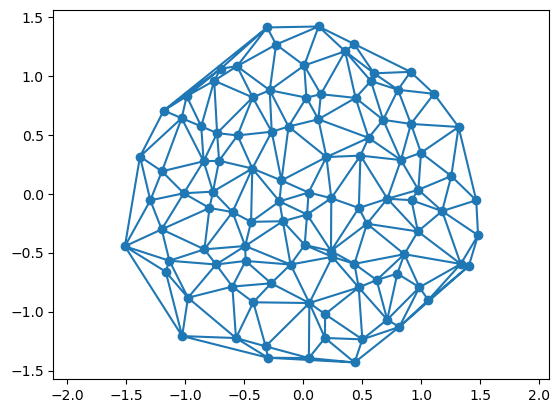

<!-- WARNING: THIS FILE WAS AUTOGENERATED! DO NOT EDIT! -->

## Loading, processing, and saving triangular meshes

`triangulax` is a library for working with triangular meshes using JAX.
In this notebook, however, we define some tools for loading, processing,
and saving triangular meshes *outside* of JAX. The dataclass
[`TriMesh`](https://nikolas-claussen.github.io/triangulax/triangular_meshes.html#trimesh)
keeps the different pieces of a triangulation in one place. The use case
of this module is to interface with JAX-external code, like the
excellent `igl` geometry processing library, prepare initial conditions
for simulations, etc. The data structure for JAX-based code is defined
in the `mesh` module, notebook 03.

The simplest way to represent a triangulation is by a list of vertices
and faces (triangles):

1.  A set of vertices, i.e., a (*N*<sub>*V*</sub>, 2) dimensional array
    datatype `float`.
2.  A set of faces, a (*N*<sub>*F*</sub>, 3) dimensional array of
    datatype `int`. Each row is an ordered triple of vertex indices that
    form a face.
3.  (Optional) A set of face centers, a (*N*<sub>*F*</sub>, 2)
    dimensional array of datatype `float`. An entry is the position of
    the dual vertex of a the triangulation face (think circumcenter).

To read and write, we use the `.obj`-file format. We will also make
heavy use of the `igl` geometry processing library. The
[`TriMesh`](https://nikolas-claussen.github.io/triangulax/triangular_meshes.html#trimesh)
class is a “holder” for loading, saving, visualizing, etc meshes, and
not to be used for numerical computation. .

### Cell tilings and triangular meshes

One use case of `triangulax` is simulations of 2D cell tilings. The
simplest way to represent a cell tiling is by its *dual* triangular mesh
(one triangulation vertex per cell). We will represent cell tilings by
2D Voronoi tessellations and variants thereof (like power diagrams).
This means that we can represent the cell network as a 2D triangulation
with vertices *V* and faces *F*. We will first consider the case where
the number of vertices does not change. Cells can, however, rearrange
(T1-transitions/edge flips in the triangulation). Such flips also
conserve the number of faces and edges.

------------------------------------------------------------------------

<a
href="https://github.com/nikolas-claussen/triangulax/blob/main/triangulax/triangular.py#L30"
target="_blank" style="float:right; font-size:smaller">source</a>

### TriMesh

``` python

def TriMesh(
    vertices:Float[Array, 'n_vertices dim'], faces:Int[Array, 'n_faces 3'], face_positions:Union=None
)->None:

```

*Simple class for reading, holding, transforming, and saving triangular
meshes.*

A TriMesh comprises vertices and faces, describing a surface in 2d or
3d. In addition, there can be a 2d/3d position for every face (think
Voronoi dual of the triangulation).

Vertices and faces are jnp.arrays. Each face is a triple of vertex
indices. Vertices and faces are ordered - this is essential so that we
know which attribute vector entry goes to which vector/edge/face. Faces
in a face are assumed to be in counter-clockwise order.

Meshes are read and written in the .obj format
(https://en.wikipedia.org/wiki/Wavefront\_.obj_file). To store
*face_positions*, we abuse the `vn` (vertex normal) entry of an .obj
file. Face positions will be written in order corresponding to faces.
When reading from an .obj file, edges are recomputed from faces and
initialized in alpha-numerical ordering. An .obj file expects 3d
positions; the z-position is ignored when reading and set to 0 when
writing for 2d meshes.

**Attributes**

dim : int = 2

vertices : Float\[jax.Array, “n_vertices dim”\]

faces : Int\[jax.Array, “n_faces 3”\]

face_positions : Float\[jax.Array, “n_faces dim”\]

**Property methods (use like attributes)**

n_vertices : int

has_inf_vertex : bool

**Static methods**

read_obj : str -\> TriMesh

**Methods**

write_obj : str -\> None

``` python
# test reading a mesh

mesh = TriMesh.read_obj("test_meshes/disk.obj")
```

    Warning: readOBJ() ignored non-comment line 3:
      o flat_tri_ecmc

``` python
# test computing the circumcenter of each face. should be equidistant to all vertex points

dists = jnp.stack([jnp.linalg.norm(mesh.vertices[mesh.faces[:,i]]-mesh.face_positions, axis=1) for i in [0,1,2]], axis=1)

jnp.allclose(dists[:,0], dists[:,1]) and jnp.allclose(dists[:,1], dists[:,2])
```

    Array(True, dtype=bool)

``` python
# test writing face positions to vn entries

mesh = TriMesh.read_obj("test_meshes/disk.obj")
filename = "test_meshes/disk_write_test.obj"
mesh.write_obj(filename, save_face_positions=True)
mesh = TriMesh.read_obj(filename, read_face_positions=True)
```

    Warning: readOBJ() ignored non-comment line 3:
      o flat_tri_ecmc

### Creating meshes and plotting

Some functions to create meshes based on the Delaunay triangulation of a
point set.

1.  Poisson (vertices placed uniformly at random) in disk or box
2.  Ginibre (vertices placed at uniform with self-repulsion)
3.  Triangular lattice

Some functions for plotting meshes:

1.  Plot triangulation with vertex and face labels (for debugging)
2.  Plot cell tesselation

------------------------------------------------------------------------

<a
href="https://github.com/nikolas-claussen/triangulax/blob/main/triangulax/triangular.py#L174"
target="_blank" style="float:right; font-size:smaller">source</a>

### generate_triangular_lattice

``` python

def generate_triangular_lattice(
    nx:int, ny:int
)->Float[Array, 'nx*ny 2']:

```

*Get points for rectangular patch of triangular lattice with nx, ny
points.*

------------------------------------------------------------------------

<a
href="https://github.com/nikolas-claussen/triangulax/blob/main/triangulax/triangular.py#L166"
target="_blank" style="float:right; font-size:smaller">source</a>

### generate_poisson_points

``` python

def generate_poisson_points(
    n_vertices:int, limit_x:float=1, limit_y:float=1
)->Float[Array, 'n_vertices 2']:

```

*Sample n_vertices points from the Poisson ensemble in rectangle*
\[-limit_x/2, limit_x/2\] \* \[-limit_y/2, limit_y/2\].

------------------------------------------------------------------------

<a
href="https://github.com/nikolas-claussen/triangulax/blob/main/triangulax/triangular.py#L157"
target="_blank" style="float:right; font-size:smaller">source</a>

### generate_ginibre_points

``` python

def generate_ginibre_points(
    n_vertices:int
)->Float[Array, 'n_vertices 2']:

```

*Sample n_vertices points from the Ginibre ensemble. Points are scaled
to unit disk.*

``` python
#points = generate_triangular_lattice(10, 10)

points = generate_ginibre_points(100)
mesh = TriMesh(vertices=points, faces=jnp.array(spatial.Delaunay(points).simplices))

plt.triplot(*points.T, mesh.faces)

plt.scatter(*points.T)
plt.axis("equal")
```

    (np.float64(-1.6629634499549866),
     np.float64(1.632395327091217),
     np.float64(-1.5740285992622376),
     np.float64(1.561158287525177))



### Elementary book-keeping using list-of-triangles data structure

------------------------------------------------------------------------

<a
href="https://github.com/nikolas-claussen/triangulax/blob/main/triangulax/triangular.py#L188"
target="_blank" style="float:right; font-size:smaller">source</a>

### get_adjacent_vertex_indices

``` python

def get_adjacent_vertex_indices(
    faces:Int[Array, 'n_faces 3'], n_vertices:int
)->list:

```

*For each vertex, get the indices of the adjacent vertices in correct
order.* For boundary vertices, this list contains the vertex itself.

``` python
mesh = TriMesh.read_obj("test_meshes/disk.obj")

neighbors = get_adjacent_vertex_indices(mesh.faces, mesh.n_vertices)
```

    /var/folders/vm/1jl6rjln6n9cjt54vsr9n4800000gr/T/ipykernel_46976/2048334256.py:80: UserWarning: Explicitly requested dtype <class 'jax.numpy.float64'> requested in array is not available, and will be truncated to dtype float32. To enable more dtypes, set the jax_enable_x64 configuration option or the JAX_ENABLE_X64 shell environment variable. See https://github.com/jax-ml/jax#current-gotchas for more.
      mesh = TriMesh(jnp.array(vertices[:,:dim], dtype=jnp.float64), jnp.array(faces, dtype=jnp.int64), face_positions=None)
    Warning: readOBJ() ignored non-comment line 3:
      o flat_tri_ecmc
    /var/folders/vm/1jl6rjln6n9cjt54vsr9n4800000gr/T/ipykernel_46976/2048334256.py:80: UserWarning: Explicitly requested dtype <class 'jax.numpy.int64'> requested in array is not available, and will be truncated to dtype int32. To enable more dtypes, set the jax_enable_x64 configuration option or the JAX_ENABLE_X64 shell environment variable. See https://github.com/jax-ml/jax#current-gotchas for more.
      mesh = TriMesh(jnp.array(vertices[:,:dim], dtype=jnp.float64), jnp.array(faces, dtype=jnp.int64), face_positions=None)
