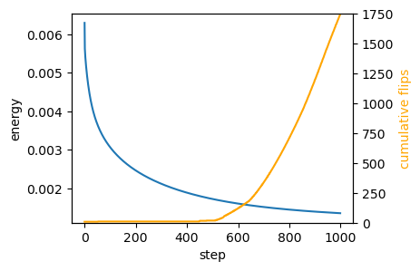

# Area-perimeter self-propelled Voronoi model


After the toy example of notebook 02, let’s try to implement a slightly
more complicated model, the self-propelled Voronoi area-perimeter
Voronoi (VAP) model of [Bi et al.,
2016](https://journals.aps.org/prx/abstract/10.1103/PhysRevX.6.021011).
This 2D model comprises most of the ingredients we will see in more
general simulations, from a coding perspective.

In brief, in the VAP, cells are modeled as the Voronoi tesselation for a
series of centroids **v**<sub>*i*</sub> (our triangulation vertices).
Their overdamped dynamics comprises two terms: self-propulsion and
relaxation of an elastic energy:
$$\partial_t \mathbf{v}\_i = -\nabla\_{\mathbf{v}\_i} E\_{AP} + v_0 \hat{\mathbf{n}}\_i$$
For each cell *i*, $\hat{\mathbf{n}}\_i$ is a unit vector (so we will
represent it by an angle *θ*<sub>*i*</sub>) that determines the
direction of motion. Units of time are chosen so that the coefficient of
∇*E*<sub>*A**P*</sub> is 1. The energy is defined in terms of the
Voronoi area *a*<sub>*i*</sub> and Voronoi perimeter *p*<sub>*i*</sub>
of each cell:
*E*<sub>*A**P*</sub> = ∑<sub>*i*</sub>*k*<sub>*a*</sub>(*a*<sub>*i*</sub> − *a*<sub>0</sub>)<sup>2</sup> + *k*<sub>*p*</sub>(*p*<sub>*i*</sub> − *p*<sub>0</sub>)<sup>2</sup>
where *k*<sub>*a*</sub>, *k*<sub>*p*</sub> are elastic constants, and
*a*<sub>0</sub>, *p*<sub>0</sub> are the target area and perimeter. They
define the “shape index” $s_0= p_0/\sqrt{a_0}$. The key physics is that
above a critical shape index *s*<sub>0</sub><sup>\*</sup>, the model has
a degenerate set of ground states, since for a large *p*<sub>0</sub>,
there are many polygons with the given target area and perimeter (think
floppy balloon).

The orientation *θ*<sub>*i*</sub> of each cell is also dynamic. It
undergoes rotational diffusion:
*d**θ*<sub>*i*</sub> = *D*<sub>*θ*</sub>*d**W*<sub>*t*, *i*</sub>
where *d**W*<sub>*t*, *i*</sub> is Brownian motion, independent for each
cell *i*, and *D*<sub>*θ*</sub> is the diffusion constant.

#### Numerics

The cell array connectivity will be represented by a
[`HeMesh`](https://nikolas-claussen.github.io/triangulax/triangulation_datastructure.html#hemesh)
(see notebook 01). The geometry is fully described by the triangulation
vertex positions, the Voronoi cell centroids. We also need a scalar
vertex attribute for the angle *θ*<sub>*i*</sub>.

To numerically calculate the energy *E*<sub>*A**P*</sub>, we can obtain
Voronoi area and perimeter for each mesh “corner” using the
`triangulax.trigonometry` module. Then we can use the gather/scatter
operation `triangulax.meshsum_he_to_vertex_opposite` to sum all corners
belonging to a cell (see notebook 01, “Computing cell areas, perimeters,
etc via corners”). Boundary cells can be handled by “mirroring”, i.e.,
all corners count twice when computing the area/perimeter. Given the
energy, JAX autodiff gives us the gradients.

To time-evolve the mesh geometry, we can use `diffrax`, like in notebook
02. `diffrax` can also deal with SDEs, like the Langevin equation for
cell angles. After each timestep, we need to check if the Voronoi edge
lengths are below some threshold (the edge lengths can be computed on
the fly), and, if so, we need to carry out edge flips. See notebook 01.
We need to ensure that we do not immidiately “re-flip” an edge. This
could be done, for example, via “cool down” period (an edge flipped at
step *t* cannot be flipped again for the next few steps), or by
calculating if the edge is shrinking or growing.

It would also be great to generate some visualizations of the time
evolution of the mesh using the
[`cellplot`](https://nikolas-claussen.github.io/triangulax/triangulation_datastructure.html#cellplot)
function, maybe with a user-controlled slider to show the different time
steps.

The code should respect the coding style (JAX-compatibility, type hints,
etc) used in previous notebooks. To start, let’s define the energy and
check that relaxation of the energy leads to a state where the
*a*<sub>*i*</sub> = *a*<sub>0</sub> and
*p*<sub>*i*</sub> = *p*<sub>0</sub> constraints are fullfilled (as good
as possible).

<!-- WARNING: THIS FILE WAS AUTOGENERATED! DO NOT EDIT! -->

### Setup

``` python
import copy
import dataclasses
from typing import Tuple

import numpy as np
import matplotlib.pyplot as plt

import jax
import jax.numpy as jnp
from jaxtyping import Float, Bool, Int
import diffrax

from tqdm.notebook import tqdm
```

``` python
jax.config.update("jax_enable_x64", True)
jax.config.update("jax_debug_nans", False)
jax.config.update("jax_log_compiles", False)
```

``` python
from triangulax import mesh as msh
from triangulax.mesh import TriMesh, HeMesh, GeomMesh
from triangulax import trigonometry as trig
```

``` python
from importlib import reload
```

``` python
reload(msh); reload(trig)
```

    <module 'triangulax.trigonometry' from '/Users/nc1333/Documents/Princeton/Coding/triangulax/triangulax/trigonometry.py'>

### Read in test data

``` python
mesh = TriMesh.read_obj("test_meshes/disk.obj")
hemesh = HeMesh.from_triangles(mesh.vertices.shape[0], mesh.faces)
geommesh = GeomMesh(*hemesh.n_items, vertices=mesh.vertices)
geommesh = msh.set_voronoi_face_positions(geommesh, hemesh)

hemesh, geommesh
```

    Warning: readOBJ() ignored non-comment line 3:
      o flat_tri_ecmc

    (HeMesh(N_V=131, N_HE=708, N_F=224), GeomMesh(D=2,N_V=131, N_HE=708, N_F=224))

``` python
fig, ax = plt.subplots(figsize=(4, 4))
ax.add_collection(msh.cellplot(hemesh, geommesh.face_positions,
                               cell_colors=np.array([0.7, 0.7, 0.9, 0.4]),
                               mpl_polygon_kwargs={"lw": 0.5, "ec": "k"}))
ax.set_aspect("equal")
ax.autoscale_view();
```


## Voronoi cell geometry (area & perimeter)

We compute areas from corner contributions and perimeters from dual-edge
lengths, using gather/scatter operations on the half-edge mesh. Boundary
cells are handled by mirroring (doubling the area/perimeter).

``` python
@jax.jit
def compute_cell_geometry(geommesh: GeomMesh, hemesh: HeMesh
                          ) -> Tuple[Float[jax.Array, " n_vertices"],
                                     Float[jax.Array, " n_vertices"]]:
    """Compute Voronoi areas and perimeters for each cell."""

    a = hemesh.dest[hemesh.nxt]
    b = hemesh.dest[hemesh.prv]
    c = hemesh.dest
    corner_areas = jax.vmap(trig.get_voronoi_corner_area)(
        geommesh.vertices[a], geommesh.vertices[b], geommesh.vertices[c])
    cell_areas = msh.sum_he_to_vertex_opposite(hemesh, corner_areas)
    cell_areas = jnp.where(hemesh.is_bdry, 2.0 * cell_areas, cell_areas)

    #face_positions = msh.get_voronoi_face_positions(geommesh.vertices, hemesh)
    #dual_lengths = msh.get_signed_dual_he_length(face_positions, hemesh)
    #dual_lengths = jnp.nan_to_num(dual_lengths, nan=0.0)
    #cell_perimeters = msh.sum_he_to_vertex_incoming(hemesh, dual_lengths)
    
    corner_perims = jax.vmap(trig.get_voronoi_corner_perimeter)(
        geommesh.vertices[a], geommesh.vertices[b], geommesh.vertices[c])
    corner_perims = jnp.clip(corner_perims, 0)
    cell_perims = msh.sum_he_to_vertex_opposite(hemesh, corner_perims)
    cell_perims = jnp.where(hemesh.is_bdry, 2.0 * cell_perims, cell_perims)

    return cell_areas, cell_perims

@jax.jit
def energy_ap(geommesh: GeomMesh, hemesh: HeMesh, a0: float, p0: float,
              k_a: float = 1.0, k_p: float = 1.0) -> Float[jax.Array, ""]:
    """Area-perimeter energy for Voronoi cells."""
    cell_areas, cell_perimeters = compute_cell_geometry(geommesh, hemesh)
    return jnp.mean(k_a * (cell_areas - a0) ** 2 + k_p * (cell_perimeters - p0) ** 2)
```

``` python
cell_areas, cell_perimeters = compute_cell_geometry(geommesh, hemesh)

a_mean, p_mean = (cell_areas[~hemesh.is_bdry].mean(), cell_perimeters[~hemesh.is_bdry].mean())
a_mean, p_mean, p_mean/np.sqrt(a_mean)
```

    (Array(0.02756258, dtype=float64),
     Array(0.63463959, dtype=float64),
     Array(3.82267399, dtype=float64))

``` python
# double check against "manual" area and "perimeter" computation using mesh traversal
```

## Energy relaxation (no self-propulsion)

We first relax the area–perimeter energy to verify that the constraints
are satisfied.

``` python
@jax.jit
def relax_energy_step(geommesh: GeomMesh, hemesh: HeMesh,
              a0: float, p0: float,
              step_size: float = 0.01,
              k_a: float = 1.0, k_p: float = 1.0) -> Tuple[GeomMesh, Float[jax.Array, ""]]:
    loss, grad = jax.value_and_grad(energy_ap)(geommesh, hemesh, a0, p0, k_a, k_p)
    updated_vertices = geommesh.vertices - step_size * grad.vertices
    geommesh_updated = dataclasses.replace(geommesh, vertices=updated_vertices)
    return geommesh_updated, loss


# energy parameters
a0 = a_mean
s0 = 3.5
p0 = s0*jnp.sqrt(a0)

# relaxation parameters
step_size = 0.02
n_steps = 10000

geommesh_relaxed = copy.copy(geommesh)
losses = []

for _ in range(n_steps):
    geommesh_relaxed, loss = relax_energy_step(geommesh_relaxed, hemesh, a0, p0, step_size=step_size)
    losses.append(loss)

losses = jnp.array(losses)
```

``` python
fig = plt.figure(figsize=(4, 3))
plt.plot(np.asarray(losses))
plt.xlabel("step")
plt.ylabel("energy");
```


``` python
geommesh_relaxed = msh.set_voronoi_face_positions(geommesh_relaxed, hemesh)

fig, ax = plt.subplots(figsize=(4, 4))
ax.add_collection(msh.cellplot(hemesh, geommesh.face_positions,
                               cell_colors=np.array([0.7, 0.7, 0.9, 0.2]),
                               mpl_polygon_kwargs={"lw": 0.5, "ec": "tab:blue"}))
ax.add_collection(msh.cellplot(hemesh, geommesh_relaxed.face_positions,
                               cell_colors=np.array([0.9, 0.6, 0.6, 0.2]),
                               mpl_polygon_kwargs={"lw": 0.5, "ec": "tab:red"}))
ax.set_aspect("equal")
ax.autoscale_view();
```


``` python
areas_relaxed, perim_relaxed = compute_cell_geometry(geommesh_relaxed, hemesh)
jnp.abs(areas_relaxed - a0)[hemesh.is_bdry].mean(), jnp.abs(perim_relaxed - p0)[hemesh.is_bdry].mean()
```

    (Array(0.06599055, dtype=float64), Array(0.00919191, dtype=float64))

### Relaxation with T1s

Next, let’s allow T1s. To ensure we don’t flip the same edge multiple
times, let’s use a cooldown period.

``` python
cooldown_steps = 5
l_min_T1 = 0.0

n_steps = 10000
cooldown_counter = jnp.zeros(hemesh.n_hes)
sim_steps = jnp.arange(n_steps)
```

# this is the simulation as a simple for loop:

hemesh_relaxed = copy.copy(hemesh) geommesh_relaxed =
copy.copy(geommesh) losses = \[\] flip_count = \[\] for \_ in
tqdm(sim_steps): \# step energy geommesh_relaxed, loss =
relax_energy_step(geommesh_relaxed, hemesh_relaxed, a0, p0,
step_size=step_size) \# compute signed edge lengths, flip, and update
cooldown counter face_positions =
msh.get_voronoi_face_positions(geommesh_relaxed.vertices,
hemesh_relaxed) edge_lengths =
msh.get_signed_dual_he_length(geommesh_relaxed.vertices, face_positions,
hemesh_relaxed) to_flip = (edge_lengths \< l_min_T1) & (cooldown_counter
== 0) hemesh_relaxed = msh.flip_all(hemesh_relaxed, to_flip)
cooldown_counter = jnp.where(to_flip, cooldown_steps,
jnp.clip(cooldown_counter-1, 0)) losses.append(loss)
flip_count.append(to_flip.sum())

losses = jnp.array(losses) flip_count = jnp.array(flip_count)

``` python
# package simulation time step into a function for jax.lax.scan
@jax.jit
def scan_fun(carry: Tuple[GeomMesh,HeMesh, Int[jax.Array, " n_steps"]], x: Float[jax.Array, " n_steps"]):
    geommesh_relaxed, hemesh_relaxed, cooldown_counter = carry
    # step energy
    geommesh_relaxed, loss = relax_energy_step(geommesh_relaxed, hemesh_relaxed, a0, p0, step_size=step_size)
    # compute signed edge lengths, flip, and update cooldown counter
    face_positions = msh.get_voronoi_face_positions(geommesh_relaxed.vertices, hemesh_relaxed)
    edge_lengths = msh.get_signed_dual_he_length(geommesh_relaxed.vertices, face_positions, hemesh_relaxed)
    to_flip = (edge_lengths < l_min_T1) & (cooldown_counter == 0)
    hemesh_relaxed = msh.flip_all(hemesh_relaxed, to_flip)
    # update cooldown counter
    cooldown_counter = jnp.where(to_flip, cooldown_steps, jnp.clip(cooldown_counter-1, 0))
    return (geommesh_relaxed, hemesh_relaxed, cooldown_counter), jnp.array([loss, to_flip.sum()])

(geommesh_relaxed, hemesh_relaxed, _), return_arr = jax.lax.scan(scan_fun, (geommesh, hemesh, cooldown_counter), sim_steps) 

losses, flip_count = return_arr.T
```

``` python
fig = plt.figure(figsize=(4, 3))
plt.plot(losses[::int(n_steps/1000)])
plt.xlabel("step")
plt.ylabel("energy")

# add a twin y axis that shows the cummulative number of flips
ax2 = plt.gca().twinx()
ax2.plot(jnp.cumsum(flip_count)[::int(n_steps/1000)], color="orange")
ax2.set_ylabel("cumulative flips", color="orange")
ax2.set_ylim([0,flip_count.sum()+1])
```



``` python
geommesh_relaxed = msh.set_voronoi_face_positions(geommesh_relaxed, hemesh_relaxed)

fig, ax = plt.subplots(figsize=(4, 4))
ax.add_collection(msh.cellplot(hemesh, geommesh.face_positions,
                               cell_colors=np.array([0.7, 0.7, 0.9, 0.2]),
                               mpl_polygon_kwargs={"lw": 0.5, "ec": "tab:blue"}))
ax.add_collection(msh.cellplot(hemesh_relaxed, geommesh_relaxed.face_positions,
                               cell_colors=np.array([0.9, 0.6, 0.6, 0.2]),
                               mpl_polygon_kwargs={"lw": 0.5, "ec": "tab:red"}))
ax.set_aspect("equal")
ax.autoscale_view();
```


``` python
areas_relaxed, perim_relaxed = compute_cell_geometry(geommesh_relaxed, hemesh)
jnp.abs(areas_relaxed - a0)[hemesh.is_bdry].mean(), jnp.abs(perim_relaxed - p0)[hemesh.is_bdry].mean()
```

    (Array(0.06731324, dtype=float64), Array(0.0121022, dtype=float64))

\[AI generated content below\]

## Overdamped dynamics with self-propulsion (deterministic)

We integrate
$\partial_t \mathbf{v}\_i = -\nabla\_{\mathbf{v}\_i} E\_{AP} + v_0\hat{\mathbf{n}}\_i$
with fixed orientations.

``` python
@jax.tree_util.register_dataclass
@dataclasses.dataclass
class VAPState:
    """State for VAP dynamics."""
    geommesh: GeomMesh
    theta: Float[jax.Array, " n_vertices"]


@jax.jit
def vap_vector_field(t: float, state: VAPState, args: Tuple) -> VAPState:
    hemesh, a0, p0, v0, k_a, k_p = args
    grad_geom = jax.grad(energy_ap)(state.geommesh, hemesh, a0, p0, k_a, k_p)
    n_hat = jnp.stack([jnp.cos(state.theta), jnp.sin(state.theta)], axis=-1)
    velocity = -grad_geom.vertices + v0 * n_hat
    dgeom = dataclasses.replace(
        state.geommesh,
        vertices=velocity,
        face_positions=jnp.zeros_like(state.geommesh.face_positions),
    )
    dtheta = jnp.zeros_like(state.theta)
    return VAPState(geommesh=dgeom, theta=dtheta)
```

``` python
key = jax.random.key(0)
theta0 = jax.random.uniform(key, shape=(hemesh.n_vertices,), minval=0.0, maxval=2 * np.pi)

state0 = VAPState(geommesh=geommesh_relaxed, theta=theta0)
args = (hemesh, a0, p0, 0.02, 1.0, 1.0)

term = diffrax.ODETerm(vap_vector_field)
solver = diffrax.Tsit5()

dt = 0.05
t0 = 0.0
t1 = 1.0
step_times = jnp.arange(t0, t1 + dt, dt)

state = state0
solver_state = solver.init(term, t0, t0 + dt, state0, args)

def scan_fun(carry, t):
    solver_state, state, tprev = carry
    state, _, _, solver_state, _ = solver.step(term, tprev, t, state, args, solver_state, made_jump=False)
    return (solver_state, state, t), state

init = (solver_state, state0, t0)
(_, state_final, _), traj = jax.lax.scan(scan_fun, init, step_times[1:])

state_final
```

    VAPState(geommesh=GeomMesh(D=2,N_V=131, N_HE=708, N_F=224), theta=Array([2.62924358, 1.35902442, 6.06529362, 3.60969331, 3.34407765,
           2.22993501, 5.54810903, 3.97449415, 3.3539648 , 1.20419685,
           5.36695019, 0.37346808, 4.04254935, 6.24593336, 3.78256938,
           2.43986234, 1.86427401, 4.04350545, 2.65350913, 5.86673077,
           3.28952069, 3.49530224, 3.61134731, 3.25868309, 0.49483695,
           2.65597033, 5.44847081, 0.0815077 , 1.80236259, 3.88571405,
           0.78212587, 3.1742906 , 5.65305943, 0.03552294, 1.03057226,
           0.49984771, 0.75858611, 5.28357365, 2.11062344, 4.08461608,
           1.90394486, 3.08182229, 4.11747439, 0.32242419, 2.87977266,
           1.64838549, 3.99764578, 3.02082432, 3.96065204, 0.80522438,
           0.14948794, 4.84820085, 1.01252678, 3.03934314, 6.23419932,
           1.30784405, 0.92344992, 0.65224909, 1.43848565, 1.87620624,
           3.94727408, 3.32947945, 6.09053058, 4.85059338, 0.60390009,
           3.62798414, 5.91464415, 6.20134698, 0.90452161, 5.37227617,
           4.70125311, 0.24225895, 3.14981522, 5.74799062, 3.75328237,
           1.98555718, 3.83604906, 6.08376748, 1.12812114, 3.94329588,
           5.96146155, 3.15743965, 5.36572252, 1.38305247, 4.21158314,
           0.62448226, 6.25140285, 0.33132314, 3.30349371, 3.39250697,
           1.7903447 , 4.70071342, 1.13107472, 4.34020999, 4.681111  ,
           4.28852299, 2.95713743, 4.17502547, 1.74408207, 0.86079415,
           0.03538471, 5.83681193, 3.85763446, 4.26437849, 3.3072995 ,
           1.56063907, 3.22774219, 4.08125906, 0.64092348, 2.81884839,
           4.07437153, 2.24100076, 2.23559404, 0.50889602, 4.35402081,
           2.82450091, 4.864591  , 4.59168174, 4.33505167, 0.25874837,
           0.19473722, 3.43090963, 0.91323554, 3.28793035, 1.75618521,
           1.60907037, 2.34992684, 0.07139381, 5.80785391, 0.42435074,
           4.72387567], dtype=float64))

``` python
geommesh_final = msh.set_voronoi_face_positions(state_final.geommesh, hemesh)

fig, ax = plt.subplots(figsize=(4, 4))
ax.add_collection(msh.cellplot(hemesh, geommesh_relaxed.face_positions,
                               cell_colors=np.array([0.7, 0.7, 0.9, 0.2]),
                               mpl_polygon_kwargs={"lw": 0.5, "ec": "tab:blue"}))
ax.add_collection(msh.cellplot(hemesh, geommesh_final.face_positions,
                               cell_colors=np.array([0.9, 0.6, 0.6, 0.2]),
                               mpl_polygon_kwargs={"lw": 0.5, "ec": "tab:red"}))
ax.set_aspect("equal")
ax.autoscale_view();
```


### Stochastic orientation + T1 flips (step-by-step)

We now include rotational diffusion for *θ*<sub>*i*</sub> and perform
edge flips when Voronoi dual edges fall below a threshold. A short
cooldown avoids immediate re-flips.

``` python
@jax.jit
def compute_velocity(geommesh: GeomMesh, hemesh: HeMesh, theta: Float[jax.Array, " n_vertices"],
                     a0: float, p0: float, v0: float, k_a: float = 1.0, k_p: float = 1.0
                     ) -> Float[jax.Array, "n_vertices 2"]:
    """Overdamped velocity with self-propulsion."""
    grad_geom = jax.grad(energy_ap)(geommesh, hemesh, a0, p0, k_a, k_p)
    n_hat = jnp.stack([jnp.cos(theta), jnp.sin(theta)], axis=-1)
    return -grad_geom.vertices + v0 * n_hat


def step_with_diffrax(state: VAPState, solver_state: diffrax.AbstractSolverState,
                      tprev: float, tnext: float, args: Tuple, key: jax.Array,
                      d_theta: float) -> Tuple[VAPState, diffrax.AbstractSolverState, jax.Array]:
    """One ODE step with diffrax + Euler-Maruyama update for angles."""
    term = diffrax.ODETerm(vap_vector_field)
    solver = diffrax.Tsit5()
    state, _, _, solver_state, _ = solver.step(term, tprev, tnext, state, args, solver_state, made_jump=False)
    key, subkey = jax.random.split(key)
    dt = tnext - tprev
    noise = jax.random.normal(subkey, shape=state.theta.shape)
    theta = state.theta + jnp.sqrt(2.0 * d_theta * dt) * noise
    state = VAPState(geommesh=state.geommesh, theta=theta)
    return state, solver_state, key


def apply_t1_flips(geommesh: GeomMesh, hemesh: HeMesh, cooldown: jax.Array,
                   l_min: float, cooldown_steps: int
                   ) -> Tuple[GeomMesh, HeMesh, jax.Array, Bool[jax.Array, "n_hes"]]:
    """Flip short edges with a cooldown to avoid immediate re-flips."""
    geommesh = msh.set_voronoi_face_positions(geommesh, hemesh)
    dual_lengths = jnp.abs(msh.get_signed_dual_he_length(geommesh, hemesh))
    dual_lengths = jnp.nan_to_num(dual_lengths, nan=jnp.inf)
    eligible = (dual_lengths < l_min) & hemesh.is_unique & (~hemesh.is_bdry_edge)
    eligible = eligible & (cooldown == 0)
    hemesh_new = msh.flip_all(hemesh, eligible)
    cooldown = jnp.maximum(cooldown - 1, 0)
    flipped = eligible | eligible[hemesh.twin]
    cooldown = cooldown.at[flipped].set(cooldown_steps)
    geommesh_new = msh.set_voronoi_face_positions(geommesh, hemesh_new)
    return geommesh_new, hemesh_new, cooldown, flipped
```

``` python
# simulation parameters
dt = 0.02
n_steps = 200
save_every = 5

v0 = 0.03
d_theta = 0.1

l_min = 0.02
cooldown_steps = 5

geommesh_sim = copy.copy(geommesh_relaxed)
hemesh_sim = copy.copy(hemesh)
theta = jax.random.uniform(jax.random.key(1), shape=(hemesh_sim.n_vertices,), minval=0.0, maxval=2 * np.pi)
state = VAPState(geommesh=geommesh_sim, theta=theta)
cooldown = jnp.zeros(hemesh_sim.n_hes, dtype=int)
key = jax.random.key(2)

term = diffrax.ODETerm(vap_vector_field)
solver = diffrax.Tsit5()

traj = []
tprev = 0.0
for step in range(n_steps):
    tnext = tprev + dt
    args = (hemesh_sim, a0, p0, v0, 1.0, 1.0)
    solver_state = solver.init(term, tprev, tnext, state, args)
    state, solver_state, key = step_with_diffrax(state, solver_state, tprev, tnext, args, key, d_theta)
    geommesh_sim, hemesh_sim, cooldown, flipped = apply_t1_flips(
        state.geommesh, hemesh_sim, cooldown, l_min, cooldown_steps
    )
    state = VAPState(geommesh=geommesh_sim, theta=state.theta)
    if (step % save_every) == 0:
        traj.append((dataclasses.replace(geommesh_sim), copy.copy(hemesh_sim)))
    tprev = tnext

len(traj)
```

    40

``` python
def plot_state(idx: int) -> None:
    geom, hem = traj[idx]
    fig, ax = plt.subplots(figsize=(4, 4))
    ax.add_collection(msh.cellplot(hem, geom.face_positions,
                                   cell_colors=np.array([0.7, 0.7, 0.9, 0.4]),
                                   mpl_polygon_kwargs={"lw": 0.5, "ec": "k"}))
    ax.set_aspect("equal")
    ax.autoscale_view()
    ax.set_title(f"frame {idx}")


plot_state(0)
```

``` python
try:
    import ipywidgets as widgets
    from IPython.display import display

    slider = widgets.IntSlider(value=0, min=0, max=len(traj) - 1, step=1, description="frame")
    widgets.interact(plot_state, idx=slider)
except Exception as exc:
    print(f"ipywidgets unavailable ({exc}). Showing last frame instead.")
    plot_state(len(traj) - 1)
```
