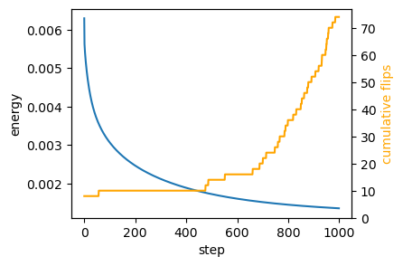
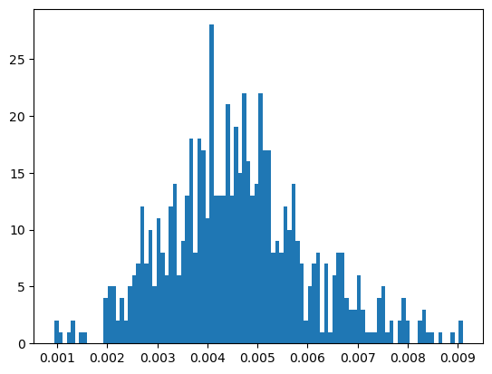
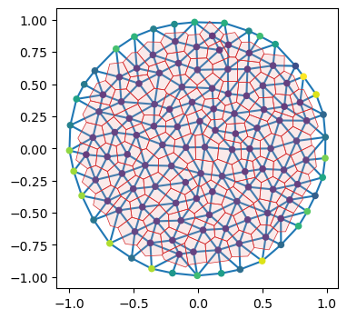

# Area-perimeter self-propelled Voronoi model


After the toy example of notebook 02, let’s try to implement a slightly
more complicated model, the self-propelled Voronoi area-perimeter
Voronoi (VAP) model of [Bi et al.,
2016](https://journals.aps.org/prx/abstract/10.1103/PhysRevX.6.021011).
This 2D model comprises most of the ingredients we will see in more
general simulations, from a coding perspective.

In brief, in the VAP, cells are modeled as the Voronoi tesselation for a
series of centroids **v**<sub>*i*</sub> (our triangulation vertices).
Their overdamped dynamics comprises two terms: self-propulsion and
relaxation of an elastic energy:
$$\partial_t \mathbf{v}\_i = -\nabla\_{\mathbf{v}\_i} E\_{AP} + v_0 \hat{\mathbf{n}}\_i$$
For each cell *i*, $\hat{\mathbf{n}}\_i$ is a unit vector (so we will
represent it by an angle *θ*<sub>*i*</sub>) that determines the
direction of motion. Units of time are chosen so that the coefficient of
∇*E*<sub>*A**P*</sub> is 1. The energy is defined in terms of the
Voronoi area *a*<sub>*i*</sub> and Voronoi perimeter *p*<sub>*i*</sub>
of each cell:
*E*<sub>*A**P*</sub> = ∑<sub>*i*</sub>*k*<sub>*a*</sub>(*a*<sub>*i*</sub> − *a*<sub>0</sub>)<sup>2</sup> + *k*<sub>*p*</sub>(*p*<sub>*i*</sub> − *p*<sub>0</sub>)<sup>2</sup>
where *k*<sub>*a*</sub>, *k*<sub>*p*</sub> are elastic constants, and
*a*<sub>0</sub>, *p*<sub>0</sub> are the target area and perimeter. They
define the “shape index” $s_0= p_0/\sqrt{a_0}$. The key physics is that
above a critical shape index *s*<sub>0</sub><sup>\*</sup>, the model has
a degenerate set of ground states, since for a large *p*<sub>0</sub>,
there are many polygons with the given target area and perimeter (think
floppy balloon).

The orientation *θ*<sub>*i*</sub> of each cell is also dynamic. It
undergoes rotational diffusion:
*d**θ*<sub>*i*</sub> = *D*<sub>*θ*</sub>*d**W*<sub>*t*, *i*</sub>
where *d**W*<sub>*t*, *i*</sub> is Brownian motion, independent for each
cell *i*, and *D*<sub>*θ*</sub> is the diffusion constant.

#### Numerics

The cell array connectivity will be represented by a
[`HeMesh`](https://nikolas-claussen.github.io/triangulax/triangulation_datastructure.html#hemesh)
(see notebook 01). The geometry is fully described by the triangulation
vertex positions, the Voronoi cell centroids. We also need a scalar
vertex attribute for the angle *θ*<sub>*i*</sub>.

To numerically calculate the energy *E*<sub>*A**P*</sub>, we can obtain
Voronoi area and perimeter for each mesh “corner” using the
`triangulax.trigonometry` module. Then we can use the gather/scatter
operation `triangulax.meshsum_he_to_vertex_opposite` to sum all corners
belonging to a cell (see notebook 01, “Computing cell areas, perimeters,
etc via corners”). Boundary cells can be handled by “mirroring”, i.e.,
all corners count twice when computing the area/perimeter. Given the
energy, JAX autodiff gives us the gradients.

To time-evolve the mesh geometry, we can use `diffrax`, like in notebook
02. `diffrax` can also deal with SDEs, like the Langevin equation for
cell angles. After each timestep, we need to check if the Voronoi edge
lengths are below some threshold (the edge lengths can be computed on
the fly), and, if so, we need to carry out edge flips. See notebook 01.
We need to ensure that we do not immidiately “re-flip” an edge. This
could be done, for example, via “cool down” period (an edge flipped at
step *t* cannot be flipped again for the next few steps), or by
calculating if the edge is shrinking or growing.

It would also be great to generate some visualizations of the time
evolution of the mesh using the
[`cellplot`](https://nikolas-claussen.github.io/triangulax/triangulation_datastructure.html#cellplot)
function, maybe with a user-controlled slider to show the different time
steps.

The code should respect the coding style (JAX-compatibility, type hints,
etc) used in previous notebooks. To start, let’s define the energy and
check that relaxation of the energy leads to a state where the
*a*<sub>*i*</sub> = *a*<sub>0</sub> and
*p*<sub>*i*</sub> = *p*<sub>0</sub> constraints are fullfilled (as good
as possible).

<!-- WARNING: THIS FILE WAS AUTOGENERATED! DO NOT EDIT! -->

### Setup

``` python
import copy
import dataclasses
from typing import Tuple

import numpy as np
import matplotlib.pyplot as plt

import jax
import jax.numpy as jnp

import functools

import diffrax

from jaxtyping import Float, Bool, Int
from enum import IntEnum

from tqdm.notebook import tqdm
```

``` python
jax.config.update("jax_enable_x64", True)
jax.config.update("jax_debug_nans", True)
jax.config.update("jax_log_compiles", False)
```

``` python
from triangulax import mesh as msh
from triangulax.mesh import TriMesh, HeMesh, GeomMesh
from triangulax import trigonometry as trig
```

``` python
from importlib import reload

#reload(msh)
reload(trig)
```

    <module 'triangulax.trigonometry' from '/Users/nc1333/Documents/Princeton/Coding/triangulax/triangulax/trigonometry.py'>

### Read in test data

``` python
mesh = TriMesh.read_obj("test_meshes/disk.obj")
hemesh = HeMesh.from_triangles(mesh.vertices.shape[0], mesh.faces)
geommesh = GeomMesh(*hemesh.n_items, vertices=mesh.vertices)
geommesh = msh.set_voronoi_face_positions(geommesh, hemesh)

hemesh, geommesh
```

    Warning: readOBJ() ignored non-comment line 3:
      o flat_tri_ecmc

    (HeMesh(N_V=131, N_HE=708, N_F=224), GeomMesh(D=2,N_V=131, N_HE=708, N_F=224))

``` python
fig, ax = plt.subplots(figsize=(4, 4))
ax.add_collection(msh.cellplot(hemesh, geommesh.face_positions,
                               cell_colors=np.array([0.7, 0.7, 0.9, 0.4]),
                               mpl_polygon_kwargs={"lw": 0.5, "ec": "k"}))
ax.set_aspect("equal")
ax.autoscale_view();
```


## Voronoi cell geometry (area & perimeter)

We compute areas from corner contributions and perimeters from dual-edge
lengths, using gather/scatter operations on the half-edge mesh. Boundary
cells are handled by mirroring (doubling the area/perimeter).

``` python
@functools.partial(jax.jit, static_argnames=['clip_max'])
def get_cell_area(geommesh: GeomMesh, hemesh: HeMesh, clip_max: float = 10) ->Float[jax.Array, " n_vertices"]:
    """Compute Voronoi area for each cell. Clips corner values for stability."""
    a = hemesh.dest[hemesh.nxt]
    b = hemesh.dest[hemesh.prv]
    c = hemesh.dest
    corner_areas = jax.vmap(trig.get_voronoi_corner_area)(
        geommesh.vertices[a], geommesh.vertices[b], geommesh.vertices[c])
    corner_areas = jnp.where(hemesh.is_bdry_he, 0, corner_areas)
    #corner_areas = jnp.clip(corner_areas, -clip_max, clip_max)
    cell_areas = msh.sum_he_to_vertex_opposite(hemesh, corner_areas)
    cell_areas = jnp.where(hemesh.is_bdry, 2.0 * cell_areas, cell_areas)
    return cell_areas

@functools.partial(jax.jit, static_argnames=['clip_max'])
def get_cell_perimeter(geommesh: GeomMesh, hemesh: HeMesh, clip_max: float = 10) -> Float[jax.Array, " n_vertices"]:
    """Compute Voronoi perimeters for each cell. Clips corner values for stability."""
    a = hemesh.dest[hemesh.nxt]
    b = hemesh.dest[hemesh.prv]
    c = hemesh.dest
    corner_perims = jax.vmap(trig.get_voronoi_corner_perimeter)(
        geommesh.vertices[a], geommesh.vertices[b], geommesh.vertices[c])
    corner_perims = jnp.where(hemesh.is_bdry_he, 0, corner_perims)
    #corner_perims = jnp.clip(corner_perims, 0, clip_max)
    cell_perims = msh.sum_he_to_vertex_opposite(hemesh, corner_perims)
    cell_perims = jnp.where(hemesh.is_bdry, 2.0 * cell_perims, cell_perims)
    return cell_perims

@jax.jit
def energy_ap(geommesh: GeomMesh, hemesh: HeMesh, a0: float, p0: float,
              k_a: float = 1.0, k_p: float = 1.0) -> Float[jax.Array, ""]:
    """Area-perimeter energy for Voronoi cells."""
    cell_areas = get_cell_area(geommesh, hemesh)    
    cell_perimeters = get_cell_perimeter(geommesh, hemesh)
    return jnp.mean(k_a * (cell_areas - a0) ** 2 + k_p * (cell_perimeters - p0) ** 2)
```

``` python
cell_areas, cell_perimeters = (get_cell_area(geommesh, hemesh), get_cell_perimeter(geommesh, hemesh))

a_mean, p_mean = (cell_areas[~hemesh.is_bdry].mean(), cell_perimeters[~hemesh.is_bdry].mean())
a_mean, p_mean, p_mean/np.sqrt(a_mean)
```

    NonConcreteBooleanIndexError: Array boolean indices must be concrete; got bool[708]

    See https://docs.jax.dev/en/latest/errors.html#jax.errors.NonConcreteBooleanIndexError
    ---------------------------------------------------------------------------
    NonConcreteBooleanIndexError              Traceback (most recent call last)
    Cell In[288], line 1
    ----> 1 cell_areas, cell_perimeters = (get_cell_area(geommesh, hemesh), get_cell_perimeter(geommesh, hemesh))
          3 a_mean, p_mean = (cell_areas[~hemesh.is_bdry].mean(), cell_perimeters[~hemesh.is_bdry].mean())
          4 a_mean, p_mean, p_mean/np.sqrt(a_mean)

        [... skipping hidden 15 frame]

    Cell In[287], line 9, in get_cell_area(geommesh, hemesh, clip_max)
          6 c = hemesh.dest
          7 corner_areas = jax.vmap(trig.get_voronoi_corner_area)(
          8     geommesh.vertices[a], geommesh.vertices[b], geommesh.vertices[c])
    ----> 9 corner_areas = corner_areas.at[hemesh.is_bdry_he].set(0.0)
         10 #corner_areas = jnp.clip(corner_areas, -clip_max, clip_max)
         11 cell_areas = msh.sum_he_to_vertex_opposite(hemesh, corner_areas)

    File ~/miniforge3/envs/triangulax/lib/python3.14/site-packages/jax/_src/numpy/array_methods.py:854, in _IndexUpdateRef.set(self, values, indices_are_sorted, unique_indices, mode, out_sharding, wrap_negative_indices)
        852   assert isinstance(out_sharding, (NamedSharding, PartitionSpec))
        853   out_sharding = canonicalize_sharding(out_sharding, '.set')
    --> 854 return scatter._scatter_update(
        855     self.array, self.index, values, lax_slicing.scatter,
        856     indices_are_sorted=indices_are_sorted, unique_indices=unique_indices,
        857     mode=mode, out_sharding=out_sharding,  # type: ignore
        858     normalize_indices=wrap_negative_indices)

    File ~/miniforge3/envs/triangulax/lib/python3.14/site-packages/jax/_src/ops/scatter.py:81, in _scatter_update(x, idx, y, scatter_op, indices_are_sorted, unique_indices, mode, normalize_indices, out_sharding)
         77   y = jnp.asarray(y)
         79 # XLA gathers and scatters are very similar in structure; the scatter logic
         80 # is more or less a transpose of the gather equivalent.
    ---> 81 treedef, static_idx, dynamic_idx = indexing.split_index_for_jit(idx, x.shape)
         83 internal_scatter = partial(
         84     _scatter_impl, scatter_op=scatter_op, treedef=treedef,
         85     static_idx=static_idx, indices_are_sorted=indices_are_sorted,
         86     unique_indices=unique_indices, mode=mode,
         87     normalize_indices=normalize_indices)
         88 if out_sharding is not None:

    File ~/miniforge3/envs/triangulax/lib/python3.14/site-packages/jax/_src/numpy/indexing.py:755, in split_index_for_jit(idx, shape)
        751   raise TypeError(f"JAX does not support string indexing; got {idx=}")
        753 # Expand any (concrete) boolean indices. We can then use advanced integer
        754 # indexing logic to handle them.
    --> 755 idx = _expand_bool_indices(idx, shape)
        757 leaves, treedef = tree_flatten(idx)
        758 dynamic = [None] * len(leaves)

    File ~/miniforge3/envs/triangulax/lib/python3.14/site-packages/jax/_src/numpy/indexing.py:1092, in _expand_bool_indices(idx, shape)
       1088   abstract_i = core.get_aval(i)
       1090 if not core.is_concrete(i):
       1091   # TODO(mattjj): improve this error by tracking _why_ the indices are not concrete
    -> 1092   raise errors.NonConcreteBooleanIndexError(abstract_i)
       1093 elif np.ndim(i) == 0:
       1094   out.append(bool(i))

    NonConcreteBooleanIndexError: Array boolean indices must be concrete; got bool[708]

    See https://docs.jax.dev/en/latest/errors.html#jax.errors.NonConcreteBooleanIndexError

``` python
# double check against "manual" area and "perimeter" computation using mesh traversal
```

## Energy relaxation (no self-propulsion)

We first relax the area–perimeter energy to verify that the constraints
are satisfied.

``` python
@jax.jit
def relax_energy_step(geommesh: GeomMesh, hemesh: HeMesh,
              a0: float, p0: float,
              step_size: float = 0.01,
              k_a: float = 1.0, k_p: float = 1.0) -> Tuple[GeomMesh, Float[jax.Array, ""]]:
    loss, grad = jax.value_and_grad(energy_ap)(geommesh, hemesh, a0, p0, k_a, k_p)
    updated_vertices = geommesh.vertices - step_size * grad.vertices
    geommesh_updated = dataclasses.replace(geommesh, vertices=updated_vertices)
    return geommesh_updated, loss


# energy parameters
a0 = a_mean
s0 = 3.5
p0 = s0*jnp.sqrt(a0)

# relaxation parameters
step_size = 0.02
n_steps = 10000

geommesh_relaxed = copy.copy(geommesh)
losses = []

for _ in range(n_steps):
    geommesh_relaxed, loss = relax_energy_step(geommesh_relaxed, hemesh, a0, p0, step_size=step_size)
    losses.append(loss)

losses = jnp.array(losses)
```

``` python
fig = plt.figure(figsize=(4, 3))
plt.plot(np.asarray(losses))
plt.xlabel("step")
plt.ylabel("energy");
```


``` python
geommesh_relaxed = msh.set_voronoi_face_positions(geommesh_relaxed, hemesh)

fig, ax = plt.subplots(figsize=(4, 4))
ax.add_collection(msh.cellplot(hemesh, geommesh.face_positions,
                               cell_colors=np.array([0.7, 0.7, 0.9, 0.2]),
                               mpl_polygon_kwargs={"lw": 0.5, "ec": "tab:blue"}))
ax.add_collection(msh.cellplot(hemesh, geommesh_relaxed.face_positions,
                               cell_colors=np.array([0.9, 0.6, 0.6, 0.2]),
                               mpl_polygon_kwargs={"lw": 0.5, "ec": "tab:red"}))
ax.set_aspect("equal")
ax.autoscale_view();
```


``` python
areas_relaxed, perim_relaxed = (get_cell_area(geommesh, hemesh), get_cell_perimeter(geommesh, hemesh))
jnp.abs(areas_relaxed - a0)[hemesh.is_bdry].mean(), jnp.abs(perim_relaxed - p0)[hemesh.is_bdry].mean()
```

    (Array(0.09000695, dtype=float64), Array(0.04928358, dtype=float64))

### Relaxation with T1s

Next, let’s allow T1s. To ensure we don’t flip the same edge multiple
times, let’s use a cooldown period.

``` python
cooldown_steps = 5
l_min_T1 = -0.01

n_steps = 10000
cooldown_counter = jnp.zeros(hemesh.n_hes)
sim_steps = jnp.arange(n_steps)
```

# this is the simulation as a simple for loop:

hemesh_relaxed = copy.copy(hemesh) geommesh_relaxed =
copy.copy(geommesh) losses = \[\] flip_count = \[\] for \_ in
tqdm(sim_steps): \# step energy geommesh_relaxed, loss =
relax_energy_step(geommesh_relaxed, hemesh_relaxed, a0, p0,
step_size=step_size) \# compute signed edge lengths, flip, and update
cooldown counter face_positions =
msh.get_voronoi_face_positions(geommesh_relaxed.vertices,
hemesh_relaxed) edge_lengths =
msh.get_signed_dual_he_length(geommesh_relaxed.vertices, face_positions,
hemesh_relaxed) to_flip = (edge_lengths \< l_min_T1) & (cooldown_counter
== 0) hemesh_relaxed = msh.flip_all(hemesh_relaxed, to_flip)
cooldown_counter = jnp.where(to_flip, cooldown_steps,
jnp.clip(cooldown_counter-1, 0)) losses.append(loss)
flip_count.append(to_flip.sum())

losses = jnp.array(losses) flip_count = jnp.array(flip_count)

``` python
# package simulation time step into a function for jax.lax.scan
@jax.jit
def scan_fun(carry: Tuple[GeomMesh,HeMesh, Int[jax.Array, " n_steps"]], x: Float[jax.Array, " n_steps"]):
    geommesh_relaxed, hemesh_relaxed, cooldown_counter = carry
    # step energy
    geommesh_relaxed, loss = relax_energy_step(geommesh_relaxed, hemesh_relaxed, a0, p0, step_size=step_size)
    # compute signed edge lengths, flip, and update cooldown counter
    face_positions = msh.get_voronoi_face_positions(geommesh_relaxed.vertices, hemesh_relaxed)
    edge_lengths = msh.get_signed_dual_he_length(geommesh_relaxed.vertices, face_positions, hemesh_relaxed)
    to_flip = (edge_lengths < l_min_T1) & (cooldown_counter == 0)
    hemesh_relaxed = msh.flip_all(hemesh_relaxed, to_flip)
    # update cooldown counter
    cooldown_counter = jnp.where(to_flip, cooldown_steps, jnp.clip(cooldown_counter-1, 0))
    return (geommesh_relaxed, hemesh_relaxed, cooldown_counter), jnp.array([loss, to_flip.sum()])

(geommesh_relaxed, hemesh_relaxed, _), return_arr = jax.lax.scan(scan_fun, (geommesh, hemesh, cooldown_counter), sim_steps) 

losses, flip_count = return_arr.T
```

``` python
fig = plt.figure(figsize=(4, 3))
plt.plot(losses[::int(n_steps/1000)])
plt.xlabel("step")
plt.ylabel("energy")

# add a twin y axis that shows the cummulative number of flips
ax2 = plt.gca().twinx()
ax2.plot(jnp.cumsum(flip_count)[::int(n_steps/1000)], color="orange")
ax2.set_ylabel("cumulative flips", color="orange")
ax2.set_ylim([0,flip_count.sum()+1])
```



``` python
geommesh_relaxed = msh.set_voronoi_face_positions(geommesh_relaxed, hemesh_relaxed)

fig, ax = plt.subplots(figsize=(4, 4))
ax.add_collection(msh.cellplot(hemesh, geommesh.face_positions,
                               cell_colors=np.array([0.7, 0.7, 0.9, 0.2]),
                               mpl_polygon_kwargs={"lw": 0.5, "ec": "tab:blue"}))
ax.add_collection(msh.cellplot(hemesh_relaxed, geommesh_relaxed.face_positions,
                               cell_colors=np.array([0.9, 0.6, 0.6, 0.2]),
                               mpl_polygon_kwargs={"lw": 0.5, "ec": "tab:red"}))
ax.set_aspect("equal")
ax.autoscale_view();
```


``` python
areas_relaxed, perim_relaxed = (get_cell_area(geommesh, hemesh), get_cell_perimeter(geommesh, hemesh))
jnp.abs(areas_relaxed - a0)[~hemesh.is_bdry].mean()/a0, jnp.abs(perim_relaxed - p0)[~hemesh.is_bdry].mean()/p0
```

    (Array(0.09045905, dtype=float64), Array(0.09506297, dtype=float64))

### Using a `diffrax` solver

Note that to use, say, an adaptive time stepping algorithm, we would
need to pass the current time step via the `carry` of `jax.lax.scan` to
the next timestep. We would probably also like to return the timesteps
taken, then.

``` python
# Diffrax-based relaxation step (replaces forward Euler inside the scan)
@jax.jit
def ap_vector_field(
    t: Float[jax.Array, ""],
    y: GeomMesh,
    args: Tuple[HeMesh, float, float, float, float],
    ) -> GeomMesh:
    """RHS for overdamped relaxation of area-perimeter energy."""
    hemesh, a0, p0, k_a, k_p = args
    grad = jax.grad(energy_ap)(y, hemesh, a0, p0, k_a, k_p)
    return jax.tree_util.tree_map(lambda x: -x, grad)

term = diffrax.ODETerm(ap_vector_field)
solver = diffrax.Tsit5()

dt = 0.02
step_times = dt * jnp.arange(n_steps + 1)
```

``` python
@jax.jit
def scan_fun_diffrax(
    carry: Tuple[
        GeomMesh,
        HeMesh,
        Float[jax.Array, " n_hes"],
        Float[jax.Array, ""], # current time
        object, # solver state
    ],
    tnext: Float[jax.Array, ""],
    ) -> Tuple[
        Tuple[
            GeomMesh,
            HeMesh,
            Float[jax.Array, " n_hes"],
            Float[jax.Array, ""],
            object,
        ],
        Float[jax.Array, " 2"],
    ]:
    geommesh_relaxed, hemesh_relaxed, cooldown_counter, tprev, solver_state = carry
    args = (hemesh_relaxed, a0, p0, 1.0, 1.0)
    geommesh_relaxed, _, _, solver_state, _ = solver.step(
        term, tprev, tnext, geommesh_relaxed, args, solver_state, made_jump=False
    )
    loss = energy_ap(geommesh_relaxed, hemesh_relaxed, a0, p0)
    face_positions = msh.get_voronoi_face_positions(geommesh_relaxed.vertices, hemesh_relaxed)
    edge_lengths = msh.get_signed_dual_he_length(geommesh_relaxed.vertices, face_positions, hemesh_relaxed)
    to_flip = (edge_lengths < l_min_T1) & (cooldown_counter == 0)
    hemesh_relaxed = msh.flip_all(hemesh_relaxed, to_flip)
    cooldown_counter = jnp.where(to_flip, cooldown_steps, jnp.clip(cooldown_counter - 1, 0))
    return (geommesh_relaxed, hemesh_relaxed, cooldown_counter, tnext, solver_state), jnp.array([loss, to_flip.sum()])
```

``` python
init_solver_state = solver.init(term, step_times[0], step_times[1], geommesh, (hemesh, a0, p0, 1.0, 1.0))
init = (geommesh, hemesh, cooldown_counter, step_times[0], init_solver_state)
```

``` python
(geommesh_relaxed, hemesh_relaxed, _, _, _), return_arr = jax.lax.scan(
    scan_fun_diffrax, init, step_times[1:])
losses, flip_count = return_arr.T
```

``` python
fig = plt.figure(figsize=(4, 3))
plt.plot(losses[::int(n_steps/1000)])
plt.xlabel("step")
plt.ylabel("energy")

ax2 = plt.gca().twinx()
ax2.plot(jnp.cumsum(flip_count)[::int(n_steps/1000)], color="orange")
ax2.set_ylabel("cumulative flips", color="orange")
ax2.set_ylim([0, flip_count.sum() + 1])
```


``` python
geommesh_relaxed = msh.set_voronoi_face_positions(geommesh_relaxed, hemesh_relaxed)

fig, ax = plt.subplots(figsize=(4, 4))
ax.add_collection(msh.cellplot(hemesh, geommesh.face_positions,
                               cell_colors=np.array([0.7, 0.7, 0.9, 0.2]),
                               mpl_polygon_kwargs={"lw": 0.5, "ec": "tab:blue"}))
ax.add_collection(msh.cellplot(hemesh_relaxed, geommesh_relaxed.face_positions,
                               cell_colors=np.array([0.9, 0.6, 0.6, 0.2]),
                               mpl_polygon_kwargs={"lw": 0.5, "ec": "tab:red"}))
ax.set_aspect("equal")
ax.autoscale_view();
```


## Overdamped dynamics with self-propulsion (deterministic)

Next, let’s add the self-propulsion term. We initialize the angles
*θ*<sub>*i*</sub> at random. We can store the angles as an extra
`vertex_attrib` in our `geommesh`, using the functionality of the
[`GeomMesh`](https://nikolas-claussen.github.io/triangulax/triangulation_datastructure.html#geommesh)
dataclass. We already have an `IntEnum` which we can use as keys to the
`vertex_attrib` dictionary, like described in notebook 01.

As a first step, we can keep the orientations fixed and just integrate
$\partial_t \mathbf{v}\_i = -\nabla\_{\mathbf{v}\_i} E\_{AP} + v_0\hat{\mathbf{n}}\_i$,
like in the above example. We only simulate for a couple of steps.

``` python
class VertexAttribs(IntEnum):
    SELF_PROPULSION_ORIENTATION = 1
```

``` python
jax.config.update("jax_disable_jit", False)
```

``` python
# initialize orientations and store as a vertex attribute
key = jax.random.key(0)
theta0 = jax.random.uniform(key, shape=(hemesh.n_vertices,), minval=0.0, maxval=2 * jnp.pi)

geommesh_sp = copy.copy(geommesh)
geommesh_sp = dataclasses.replace(
    geommesh_sp,
    vertex_attribs={VertexAttribs.SELF_PROPULSION_ORIENTATION: theta0},
)

@jax.jit
def ap_selfprop_vector_field(
    t: Float[jax.Array, ""],
    y: GeomMesh,
    args: Tuple[HeMesh, float, float, float, float, float],
) -> GeomMesh:
    """RHS for overdamped area-perimeter dynamics with self-propulsion."""
    hemesh, a0, p0, v0, k_a, k_p = args
    theta = y.vertex_attribs[VertexAttribs.SELF_PROPULSION_ORIENTATION]
    grad = jax.grad(energy_ap)(y, hemesh, a0, p0, k_a, k_p)
    n_hat = jnp.stack([jnp.cos(theta), jnp.sin(theta)], axis=-1)
    velocity = -grad.vertices + v0 * n_hat
    zero_vertex_attribs = {key: jnp.zeros_like(val) for key, val in y.vertex_attribs.items()}
    return dataclasses.replace(
        y,
        vertices=velocity,
        vertex_attribs=zero_vertex_attribs,
    )

term_sp = diffrax.ODETerm(ap_selfprop_vector_field)
solver_sp = diffrax.Tsit5()

dt_sp = 0.02
n_steps_sp = 20 # begins to fail at 24. degenerate triang at 21
v0_sp = 0.05
step_times_sp = dt_sp * jnp.arange(n_steps_sp + 1)

cooldown_steps = 5
```

``` python
# check magnitude of the gradient forces vs the self-propulsion 

grad0 = jax.grad(energy_ap)(geommesh_sp, hemesh, a0, p0, 1, 1).vertices
sp0 = v0_sp*jnp.stack([jnp.cos(theta0), jnp.sin(theta0)], axis=-1)

jnp.linalg.norm(sp0, axis=-1).mean() / jnp.linalg.norm(grad0, axis=-1).mean()
```

    Array(11.22962167, dtype=float64)

``` python
@jax.jit
def scan_fun_selfprop(
    carry: Tuple[
        GeomMesh,
        HeMesh,
        Float[jax.Array, " n_hes"],
        Float[jax.Array, ""],
        object,
    ],
    tnext: Float[jax.Array, ""],
) -> Tuple[
    Tuple[
        GeomMesh,
        HeMesh,
        Float[jax.Array, " n_hes"],
        Float[jax.Array, ""],
        object,
    ],
    GeomMesh,
    ]:
    geommesh_curr, hemesh_curr, cooldown_counter, tprev, solver_state = carry
    args = (hemesh_curr, a0, p0, v0_sp, 1.0, 1.0)
    geommesh_next, _, _, solver_state, _ = solver_sp.step(
        term_sp, tprev, tnext, geommesh_curr, args, solver_state, made_jump=False
    )
    face_positions = msh.get_voronoi_face_positions(geommesh_next.vertices, hemesh_curr)
    edge_lengths = msh.get_signed_dual_he_length(geommesh_next.vertices, face_positions, hemesh_curr)
    to_flip = (edge_lengths < l_min_T1) & (cooldown_counter == 0)
    hemesh_next = msh.flip_all(hemesh_curr, to_flip)
    cooldown_counter = jnp.where(to_flip, cooldown_steps, jnp.clip(cooldown_counter - 1, 0))
    return (geommesh_next, hemesh_next, cooldown_counter, tnext, solver_state), geommesh_next
```

``` python
cooldown_counter_sp = jnp.zeros(hemesh.n_hes)
init_solver_state_sp = solver_sp.init(
    term_sp, step_times_sp[0], step_times_sp[1], geommesh_sp, (hemesh, a0, p0, v0_sp, 1.0, 1.0)
 )
init = (geommesh_sp, hemesh, cooldown_counter_sp, step_times_sp[0], init_solver_state_sp)
```

``` python
(geommesh_final, hemesh_final, _, _, _), traj = jax.lax.scan(scan_fun_selfprop, init, step_times_sp[1:])
```

``` python
jnp.isnan(geommesh_final.vertices).any()
```

    Array(False, dtype=bool)

``` python
grad = jax.grad(energy_ap)(geommesh_final, hemesh_final, a0, p0, k_a=1, k_p=0)
grad_mag = jnp.linalg.norm(grad.vertices, axis=-1)
```

``` python
# not good! the problem comes from the area term. and it comes from the boundary vertex
# looks like the areas of the boundry cells are very large and seemingly incorrect.

jnp.median(grad_mag), jnp.max(grad_mag), jnp.argmax(grad_mag)
```

    (Array(0.00014209, dtype=float64),
     Array(0.14037264, dtype=float64),
     Array(121, dtype=int64))

``` python
areas = get_cell_area(geommesh_final, hemesh_final)

jnp.median(areas),  areas[121], jnp.median(areas[hemesh_final.is_bdry]), jnp.median(areas[~hemesh_final.is_bdry])
```

    (Array(0.02915907, dtype=float64),
     Array(0.21465219, dtype=float64),
     Array(0.12569305, dtype=float64),
     Array(0.02772169, dtype=float64))

``` python
## let's see if there is an issue with the corner areas.

a = hemesh_final.dest[hemesh_final.nxt]
b = hemesh_final.dest[hemesh_final.prv]
c = hemesh_final.dest
corner_areas = jax.vmap(trig.get_voronoi_corner_area)(
    geommesh_final.vertices[a], geommesh_final.vertices[b], geommesh_final.vertices[c])
```

``` python
corner_areas[hemesh_final.is_bdry_he].mean(), corner_areas[~hemesh_final.is_bdry_he].mean()
```

    (Array(0.05089609, dtype=float64), Array(0.00460842, dtype=float64))

``` python
# do the boundary corners contribute to the cell areas? they should not!

corner_areas_bdry = corner_areas.at[~hemesh_final.is_bdry_he].set(0.0)
```

``` python
msh.sum_he_to_vertex_opposite(hemesh_final, corner_areas_bdry)
```

    Array([0.02517454, 0.        , 0.        , 0.        , 0.        ,
           0.        , 0.        , 0.        , 0.        , 0.0487042 ,
           0.08644553, 0.        , 0.        , 0.        , 0.        ,
           0.        , 0.        , 0.        , 0.        , 0.        ,
           0.06499988, 0.02339914, 0.        , 0.        , 0.        ,
           0.        , 0.        , 0.        , 0.        , 0.        ,
           0.        , 0.        , 0.04013333, 0.05692478, 0.04495243,
           0.        , 0.        , 0.        , 0.        , 0.        ,
           0.        , 0.        , 0.        , 0.        , 0.        ,
           0.        , 0.05362868, 0.05776412, 0.        , 0.        ,
           0.        , 0.        , 0.        , 0.        , 0.        ,
           0.        , 0.        , 0.        , 0.04366292, 0.        ,
           0.        , 0.        , 0.        , 0.        , 0.        ,
           0.        , 0.        , 0.        , 0.        , 0.04170987,
           0.07925454, 0.        , 0.        , 0.        , 0.        ,
           0.        , 0.        , 0.        , 0.        , 0.        ,
           0.03237783, 0.        , 0.        , 0.        , 0.        ,
           0.05462124, 0.02364952, 0.        , 0.        , 0.        ,
           0.        , 0.07522129, 0.        , 0.        , 0.        ,
           0.        , 0.        , 0.        , 0.        , 0.05750567,
           0.0249209 , 0.        , 0.        , 0.        , 0.        ,
           0.        , 0.        , 0.02230205, 0.07650705, 0.        ,
           0.02905593, 0.04757567, 0.03389725, 0.07936265, 0.07846599,
           0.02125864, 0.05127288, 0.07437767, 0.02547047, 0.02517226,
           0.09122537, 0.09751292, 0.05873222, 0.06936521, 0.        ,
           0.        , 0.        , 0.        , 0.        , 0.        ,
           0.01565448], dtype=float64)

``` python
plt.hist(corner_areas[~hemesh_final.is_bdry_he], bins=100); # outliers; likely from boundary
```



``` python
geommesh_sp = msh.set_voronoi_face_positions(geommesh_sp, hemesh)
geommesh_final = msh.set_voronoi_face_positions(geommesh_final, hemesh_final)

fig, ax = plt.subplots(figsize=(4, 4))

#plt.triplot(*geommesh_sp.vertices.T, hemesh.faces)


plt.triplot(*geommesh_final.vertices.T, hemesh_final.faces)
plt.scatter(*geommesh_final.vertices.T, c=areas, cmap="viridis", s=20, vmin=0)


#ax.add_collection(msh.cellplot(hemesh, geommesh_sp.face_positions,
#                               cell_colors=np.array([0.7, 0.7, 0.9, 0.2]),
#                               mpl_polygon_kwargs={"lw": 0.5, "ec": "tab:blue"}))
ax.add_collection(msh.cellplot(hemesh_final, geommesh_final.face_positions,
                               cell_colors=np.array([0.9, 0.6, 0.6, 0.2]),
                               mpl_polygon_kwargs={"lw": 0.5, "ec": "tab:red"}))


ax.set_aspect("equal")
ax.autoscale_view();
```



### Stochastic orientation + T1 flips (step-by-step)

We now include rotational diffusion for *θ*<sub>*i*</sub> and perform
edge flips when Voronoi dual edges fall below a threshold. A short
cooldown avoids immediate re-flips.

### Visualize trajectory

Let’s add an `ipywidget`-based slider plot that allows us to visualize
the trajectory of the mesh’s time evolution.
