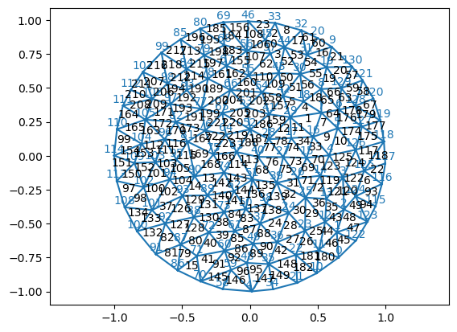

<!-- WARNING: THIS FILE WAS AUTOGENERATED! DO NOT EDIT! -->

## Half-edge meshes

In the
[`TriMesh`](https://nikolas-claussen.github.io/triangulax/triangular_meshes.html#trimesh)
class, we represent a mesh a list of triangles. However, many common
operations are difficult with this data structure. For example, how do
you get all the neighbors of a given vertex, or compute the area of a
dual cell?

For simulation and geometry processing, we need a different
representation of the adjacency information. Typically, this is achieved
by a [half-edge
mesh](https://www.jerryyin.info/geometry-processing-algorithms/half-edge/)
(HE) data structure. We represent the HE data structure by 3 sets of
integer index arrays:

1.  Vertices: 1 (*N*<sub>*V*</sub>,) matrix, whose entry for vertex *i*
    is an arbitrary HE incident on *i*
2.  Edges: 6 (2*N*<sub>*E*</sub>,) matrices, \[`origin`, `dest`, `nxt`,
    `prv`, `twin`, `face`\] for each half-edge (`face` is undefined for
    boundary half-edges).
3.  Faces, 1 (*N*<sub>*F*</sub>, 1) matrix, whose entry for face *i* is
    an arbitrary HE in *i*. (Not to be confused with the
    (*N*<sub>*F*</sub>, 3) matrix of *vertex IDs* used previously).

Additionally, there are two float arrays for vertex and face positions,
as previously. However, we split *combinatorial* and *geometric*
information - a
[`HeMesh`](https://nikolas-claussen.github.io/triangulax/halfedge_datastructure.html#hemesh)
class for the combinatorics, and a couple of regular arrays for the
vertex positions, face positions, and vertex/half-edge/face attributes.
The latter are packaged into a
[`GeomMesh`](https://nikolas-claussen.github.io/triangulax/halfedge_datastructure.html#geommesh)
class. Together, the pair `(GeomMesh, HeMesh)` describes a mesh (like
vertices/faces pair). A named tuple
[`Mesh`](https://nikolas-claussen.github.io/triangulax/halfedge_datastructure.html#mesh)
comines the two.

The first task is to create a helper function to plot mesh connectivity,
and to create the half-edge connectivity matrices from the more
conventional list-of-triangles format. The latter is somewhat involved.

We follow the notes in notebook 02 to ensure JAX compatibility.

------------------------------------------------------------------------

<a
href="https://github.com/nikolas-claussen/triangulax/blob/main/triangulax/mesh.py#L35"
target="_blank" style="float:right; font-size:smaller">source</a>

### label_plot

``` python

def label_plot(
    vertices:Float[Array, 'n_vertices 2'], faces:Int[Array, 'n_faces 3'], hemesh:Union=None, vertex_labels:bool=True,
    face_labels:bool=True, ax:Union=None, fontsize:Union=None
)->None:

```

*For debugging purposes. Plot triangular mesh with face/vertex labels in
black/blue.* If hemesh is not None, the connectivity info from it is
used to plot the half-edge labels.

``` python
mesh = TriMesh.read_obj("test_meshes/disk.obj")

plt.triplot(*mesh.vertices.T, mesh.faces)
label_plot(mesh.vertices, mesh.faces, fontsize=10)
plt.axis("equal")
```

    Warning: readOBJ() ignored non-comment line 3:
      o flat_tri_ecmc

    (np.float64(-1.10003475),
     np.float64(1.09628575),
     np.float64(-1.09934025),
     np.float64(1.09050125))



------------------------------------------------------------------------

<a
href="https://github.com/nikolas-claussen/triangulax/blob/main/triangulax/mesh.py#L61"
target="_blank" style="float:right; font-size:smaller">source</a>

### get_half_edge_arrays_vectorized

``` python

def get_half_edge_arrays_vectorized(
    n_vertices:int, faces:Int[Array, 'n_faces 3']
)->list:

```

*Get half-edge data structure arrays from faces (vectorized).*

Returns: incident, orig, dest, twin, nxt, prv, heface, face_incident

``` python
mesh_high_res = TriMesh.read_obj("test_meshes/torus_high_resolution.obj")
mesh = TriMesh.read_obj("test_meshes/disk.obj")
```

    Warning: readOBJ() ignored non-comment line 3:
      o Torus
    Warning: readOBJ() ignored non-comment line 3:
      o flat_tri_ecmc

``` python
results = get_half_edge_arrays(mesh.vertices.shape[0], mesh.faces)
```

    UsageError: Line magic function `%%timeit` not found.

``` python
# test vectorized vs reference implementation for two meshes

mesh = TriMesh.read_obj("test_meshes/disk.obj")
ref = get_half_edge_arrays(mesh.vertices.shape[0], mesh.faces)
fast = get_half_edge_arrays_vectorized(mesh.vertices.shape[0], mesh.faces)

print("Equal?", all([jnp.array_equal(a, b) for a, b in zip(ref, fast)]))

mesh = TriMesh.read_obj("test_meshes/sphere.obj")
ref = get_half_edge_arrays(mesh.vertices.shape[0], mesh.faces)
fast = get_half_edge_arrays_vectorized(mesh.vertices.shape[0], mesh.faces)

print("Equal?", all([jnp.array_equal(a, b) for a, b in zip(ref, fast)]))
```

    Warning: readOBJ() ignored non-comment line 3:
      o flat_tri_ecmc
    Warning: readOBJ() ignored non-comment line 3:
      o Icosphere

    Equal? True
    Equal? True

``` python
```

    1.11 ms ± 43 μs per loop (mean ± std. dev. of 7 runs, 1,000 loops each)

``` python
```

    CPU times: user 211 ms, sys: 12.6 ms, total: 224 ms
    Wall time: 221 ms

------------------------------------------------------------------------

<a
href="https://github.com/nikolas-claussen/triangulax/blob/main/triangulax/mesh.py#L143"
target="_blank" style="float:right; font-size:smaller">source</a>

### HeMesh

``` python

def HeMesh(
    incident:Int[Array, '*batch n_vertices'], orig:Int[Array, '*batch n_hes'], dest:Int[Array, '*batch n_hes'],
    twin:Int[Array, '*batch n_hes'], nxt:Int[Array, '*batch n_hes'], prv:Int[Array, '*batch n_hes'],
    heface:Int[Array, '*batch n_hes'], face_incident:Int[Array, '*batch n_faces'], inf_vertices:Union=()
)->None:

```

*Half-edge mesh data structure for triangular meshes.*

A half-edge mesh is described by a set of half-edges and several arrays
that specify their connectivity (see markup explanation above). This
class serves as a container for multiple arrays. For future
compatibility with JAX, after initialization, do not modify these arrays
in-place; always return a new HeMesh object. The mesh vertices may live
in whatever dimension - this does not affect the connectivity
bookkeeping.

Half-edge meshes are initialized from a list of triangles and a number
of vertices, and can return the original triangles (e.g., to save as a
.obj).

All information and methods are purely “combinatorial”. The HeMesh class
does *not* contain the vertex or face positions. These are saved in the
GeomHeMesh class that combines a HeMesh (combinatorics) with a couple of
other arrays (geometry).

—Conventions—

For vertices, the `incident` half-edge points *away* from the vertex.

To describe the mesh boundary, there are two options: 1. Initialize from
a triangulation with a boundary. Half-edges without a face (boundary)
are assigned heface=-1. 2. Initialize from a triangulation without
boundary, where certain vertices are “at infinity”. They should have
coordinates \[np.inf, np.inf\]. Each infinity vertex corresponds to one
boundary. For a single boundary, the vertex at infinity is, by
convention, the final one.

Starting from a set of triangles, the half-edges are initialized as
follows: The 1st N_edges half-edges are (origin_vertex,
destination_vertex), in lexicographic order, with origin_vertex \<
destination_vertex. The 2nd N_edges are their twins, in the same order.

**Attributes**

incident : Int\[jax.Array, “n_vertices”\]

orig : Int\[jax.Array, “n_hes”\]

dest : Int\[jax.Array, “n_hes”\]

nxt : Int\[jax.Array, “n_hes”\]

prv : Int\[jax.Array, “n_hes”\]

twin : Int\[jax.Array, “n_hes”\]

heface : Int\[jax.Array, “n_hes”\]

face_incident : Int\[jax.Array, “n_faces”\]

inf_vertices : tuple\[Int\]

**Property methods (use like attributes)**

n_vertices : int

n_hes : int

n_faces : int

n_items : tuple\[int, int, int\]

faces : Int\[jax.Array, “n_faces 3”\]

has_inf_vertex : bool

is_inf_face : Bool\[jax.Array, “n_faces”\]

is_unique : Bool\[jax.Array, “n_hes”\]

is_inf_he : Bool\[jax.Array, “n_hes”\]

is_bdry_he : Bool\[jax.Array, “n_hes”\]

is_bdry_edge : Bool\[jax.Array, “n_hes”\]

is_bdry : Bool\[jax.Array, “n_vertices”\]

**Static methods**

from_triangles : tuple\[int, Int\[jax.Array, “n_faces 3”\],
Int\[jax.Array, “n_boundaries”\] -\> HeMesh

**Class methods**

iterate_around_vertex : int -\> Int\[jax.Array, “n_neighbors”\]

save : str -\> None:

**Static methods**

load : str -\> HeMesh

------------------------------------------------------------------------

<a
href="https://github.com/nikolas-claussen/triangulax/blob/main/triangulax/mesh.py#L366"
target="_blank" style="float:right; font-size:smaller">source</a>

### test_mesh_validity

``` python

def test_mesh_validity(
    h:HeMesh
):

```

*Test if a mesh is valid. Returns True if valid, fails otherwise.*

``` python
mesh = TriMesh.read_obj("test_meshes/disk.obj")
hemesh = HeMesh.from_triangles(mesh.vertices.shape[0], mesh.faces)
```

    Warning: readOBJ() ignored non-comment line 3:
      o flat_tri_ecmc

``` python
test_mesh_validity(hemesh)
```

    True

``` python
# hemeshes can be compared for equali and are registered as py-trees

leafs, ts = jax.tree_util.tree_flatten(hemesh)

hemesh, hemesh == hemesh
```

    (HeMesh(N_V=131, N_HE=708, N_F=224), True)

``` python
# test iteration around vertex
hemesh.dest[hemesh.iterate_around_vertex(69)], hemesh.orig[hemesh.iterate_around_vertex(56)]
```

    (Array([80, 68, 56, 46], dtype=int64),
     Array([56, 56, 56, 56, 56, 56, 56], dtype=int64))

``` python
# boundary in cc-wise order
(hemesh.orig[187], hemesh.dest[187]), hemesh.heface[187], hemesh.is_bdry_he[187],
```

    ((Array(58, dtype=int64), Array(70, dtype=int64)),
     Array(-1, dtype=int64),
     Array(True, dtype=bool))

``` python
hemesh.is_bdry_he[187], hemesh.is_bdry_he[541], hemesh.heface[541]
```

    (Array(True, dtype=bool), Array(False, dtype=bool), Array(145, dtype=int64))

``` python
# to model mesh boundaries, we can add an "infinity" vertex. Not done here, see below
hemesh.has_inf_vertex, hemesh.inf_vertices
```

    (False, ())

``` python
fig = plt.figure(figsize=(14,14))

plt.triplot(*mesh.vertices.T, hemesh.faces)
label_plot(mesh.vertices, hemesh.faces, fontsize=10, hemesh=hemesh, face_labels=False)
plt.axis("equal")
```

    (np.float64(-1.10003475),
     np.float64(1.09628575),
     np.float64(-1.09934025),
     np.float64(1.09050125))


``` python
# here is how you would do mesh traversal with jax.lax. The issues is that the output size needs to be fixed
# ahead of time, so 

self = hemesh
max_valence = 10
v = 10

initial = jnp.hstack([jnp.array([self.incident[v]]), -1*jnp.ones(max_valence-1, dtype=int)])
jax.lax.fori_loop(1, max_valence, lambda i, x: x.at[i].set(self.twin[x[i-1]]), initial)
```

    Array([ 47, 401,  47, 401,  47, 401,  47, 401,  47, 401], dtype=int64)

#### Computing with half-edge meshes

By using the arrays of a half-edge meshes to index vertex- or
face-positions (in increasingly complex ways), we can compute all sorts
of quantities of interests associated with a mesh. Let’s start simple
with primal and dual edge lengths.

------------------------------------------------------------------------

<a
href="https://github.com/nikolas-claussen/triangulax/blob/main/triangulax/mesh.py#L394"
target="_blank" style="float:right; font-size:smaller">source</a>

### get_signed_dual_he_length

``` python

def get_signed_dual_he_length(
    vertices:Float[Array, 'n_vertices 2'], face_positions:Float[Array, 'n_faces 2'], hemesh:HeMesh
)->Float[Array, 'n_hes']:

```

*Compute lengths of dual edges. Boundary dual edges get length 1.
Negative sign = flipped edge.*

------------------------------------------------------------------------

<a
href="https://github.com/nikolas-claussen/triangulax/blob/main/triangulax/mesh.py#L389"
target="_blank" style="float:right; font-size:smaller">source</a>

### get_he_length

``` python

def get_he_length(
    vertices:Float[Array, 'n_vertices dim'], hemesh:HeMesh
)->Float[Array, 'n_hes']:

```

*Get lengths of half-edges (triangulation/primal edges).*

``` python
# edges and dual edges should be orthogonal since we are using circumcenters

edges = mesh.vertices[hemesh.orig]-mesh.vertices[hemesh.dest]
dual_edges = (mesh.face_positions[hemesh.heface]
              -mesh.face_positions[hemesh.heface[hemesh.twin]])

jnp.allclose(jnp.einsum('vi,vi->v', edges[~hemesh.is_bdry_edge], dual_edges[~hemesh.is_bdry_edge]), 0)
```

    Array(True, dtype=bool)

``` python
# computing the signed edge length shows that there are some "flipped" edges.

signed_squared_length = jnp.einsum('vi,vi->v', edges, dual_edges @ trig.get_rot_mat(np.pi/2))
jnp.where((signed_squared_length < -0.0) & ~hemesh.is_bdry_edge )[0]
```

    Array([  9, 185, 191, 335, 363, 539, 545, 689], dtype=int64)

### Boundary and the vertex at infinity

So far, our mesh representations
[`TriMesh`](https://nikolas-claussen.github.io/triangulax/triangular_meshes.html#trimesh)
and
[`HeMesh`](https://nikolas-claussen.github.io/triangulax/halfedge_datastructure.html#hemesh)
work for triangular meshes with and without boundary. In the
[`HeMesh`](https://nikolas-claussen.github.io/triangulax/halfedge_datastructure.html#hemesh)
class, boundary half-edges are assigned to a fictitious `-1` face. This
convention has a downside. It is not possible to modify the boundary
loop of the mesh by edge flips - doing so would result in an invalid
state. In a simulation, this artificially limits the mesh’s ability to
deform. Instead, we can add “vertices at infinity” and connect al edges
in a given boundary to ∞. This turns the mesh into a topological sphere.
Now, one can flip boundary edges without the overall number of
half-edges changing (so the array shape stays the same). Multiple
boundaries are also supported. Each boundary corresponds to a distinct
∞-vertex (for example, 2 for a cylinder).

The coordinates of the fictitious vertices are set to `[np.inf, np.inf]`
by convention. The boundary is found by iterating around ∞. By
convention, ∞-vertices, if they exists, are the final vertices of the
mesh (don’t rely on this - implementation detail).

We generally assume that the mesh has only a single connected component.

The
[`HeMesh`](https://nikolas-claussen.github.io/triangulax/halfedge_datastructure.html#hemesh)
class can deal with both the -1-face and the ∞-vertices conventions. The
latter are listed in the `inf_vertices` attribute of a
[`HeMesh`](https://nikolas-claussen.github.io/triangulax/halfedge_datastructure.html#hemesh).

------------------------------------------------------------------------

<a
href="https://github.com/nikolas-claussen/triangulax/blob/main/triangulax/mesh.py#L406"
target="_blank" style="float:right; font-size:smaller">source</a>

### connect_boundary_to_infinity

``` python

def connect_boundary_to_infinity(
    vertices:Float[Array, 'n_vertices 2'], # Vertex positions.
    faces:Int[Array, 'n_faces 3'], # Faces (triangles) as list of vertex indices.
)->tuple: # Vertex positions with infinity vertices appended.
One infinity vertex per boundary loop.

```

*Connect boundary loop(s) to infinity.*

New vertices are appeneded to the end of vertex array and have
coordinates \[np.inf, np.inf\].

``` python
mesh = TriMesh.read_obj("test_meshes/disk.obj")
hemesh = HeMesh.from_triangles(mesh.vertices.shape[0], mesh.faces)
```

    Warning: readOBJ() ignored non-comment line 3:
      o flat_tri_ecmc

``` python
new_vertices, new_faces, infinity_vertices = connect_boundary_to_infinity(mesh.vertices, mesh.faces)
mesh_infty = TriMesh(vertices=new_vertices, faces=new_faces)
hemesh_infty = HeMesh.from_triangles(mesh_infty.vertices.shape[0], mesh_infty.faces,
                                     inf_vertices=infinity_vertices)
```

``` python
# to get back the original faces/vertices, do this:

_ = hemesh_infty.faces[~hemesh_infty.is_inf_face]

# if you want to re-index the triangles so they only refer to non-infinity vertices:
_ = igl.remove_unreferenced(new_vertices, np.asarray(hemesh_infty.faces[~hemesh_infty.is_inf_face]) )
```

``` python
test_mesh_validity(hemesh_infty), (hemesh.is_bdry == (hemesh_infty.is_bdry[:-1] >0)).all()
```

    (True, Array(True, dtype=bool))

## Mesh geometry and per-mesh variables

Mesh geometry (vertex and face positions) and per-mesh-item (per-face,
per-half-edge, per-vertex) variables are combined into a second data
class, the
[`GeomMesh`](https://nikolas-claussen.github.io/triangulax/halfedge_datastructure.html#geommesh).

------------------------------------------------------------------------

<a
href="https://github.com/nikolas-claussen/triangulax/blob/main/triangulax/mesh.py#L450"
target="_blank" style="float:right; font-size:smaller">source</a>

### GeomMesh

``` python

def GeomMesh(
    n_vertices:int, n_hes:int, n_faces:int, vertices:Float[Array, '*batch n_vertices dim'],
    face_positions:Float[Array, '*batch n_faces 2']=<factory>, vertex_attribs:dict=<factory>,
    he_attribs:dict=<factory>, face_attribs:dict=<factory>
)->None:

```

*Data class for holding mesh geometry and mesh-associated variables.* To
be combined with a HeMesh to specify the connectivity.

One array (for vertex positions) must always be present. A second, but
optional, standard entry is a set of positions for each face. The mesh
coordinates can live in 2d or 3d.

Optionally, vertices, half-edges, and faces can have attributes (stored
as dictionaries). The keys of the dictionary should be taken from a
suitable ‘enum’. The values are ndarrays, whose 0th axis is
(vertices/edges/faces). These attribute dicts are initialized empty and
can be set afterwards.

See documentation on HeMesh

**Attributes**

vertices : Float\[jax.Array, “n_vertices 2”\]

face_positions : Float\[jax.Array, “n_faces 2”\]

vertex_attribs : dict\[IntEnum, Float\[jax.Array, “n_vertices \*”\]\]

he_attribs : dict\[IntEnum, Float\[jax.Array, “n_hes \*”\]\]

face_attribs : dict\[IntEnum, Float\[jax.Array, “n_faces \*”\]\]

**Property methods (use like attributes)**

n_items : tuple\[int, int, int\]

dim : int

**Class methods**

validate_dimensions : bool

**Static methods**

load : str -\> GeomHeMesh

------------------------------------------------------------------------

<a
href="https://github.com/nikolas-claussen/triangulax/blob/main/triangulax/mesh.py#L592"
target="_blank" style="float:right; font-size:smaller">source</a>

### set_voronoi_face_positions

``` python

def set_voronoi_face_positions(
    geommesh:GeomMesh, hemesh:HeMesh
)->GeomMesh:

```

*Set face positions of geommesh to the circumcenters of the faces
defined by hemesh.*

------------------------------------------------------------------------

<a
href="https://github.com/nikolas-claussen/triangulax/blob/main/triangulax/mesh.py#L586"
target="_blank" style="float:right; font-size:smaller">source</a>

### get_voronoi_face_positions

``` python

def get_voronoi_face_positions(
    vertices:Float[Array, 'n_vertices 2'], hemesh:HeMesh
)->Float[Array, 'n_faces 2']:

```

*Get face positions of geommesh to the circumcenters of the faces
defined by hemesh.*

------------------------------------------------------------------------

<a
href="https://github.com/nikolas-claussen/triangulax/blob/main/triangulax/mesh.py#L598"
target="_blank" style="float:right; font-size:smaller">source</a>

### Mesh

``` python

def Mesh(
    args:VAR_POSITIONAL, kwargs:VAR_KEYWORD
):

```

*Combine geometric and connectivity info into a single object.*

``` python
mesh = TriMesh.read_obj("test_meshes/disk.obj")
hemesh = HeMesh.from_triangles(mesh.vertices.shape[0], mesh.faces)
geommesh = GeomMesh(*hemesh.n_items, mesh.vertices, mesh.face_positions)
combined_mesh = Mesh(geommesh, hemesh)
combined_mesh
```

    Warning: readOBJ() ignored non-comment line 3:
      o flat_tri_ecmc

    Mesh(geommesh=GeomMesh(D=2,N_V=131, N_HE=708, N_F=224), hemesh=HeMesh(N_V=131, N_HE=708, N_F=224))

``` python
leafs, ts = jax.tree_util.tree_flatten(geommesh) # also a pytree
ts
```

    PyTreeDef(CustomNode(GeomMesh[(131, 708, 224)], [*, *, {}, {}, {}]))

``` python
geommesh, geommesh.n_vertices, geommesh.vertices.shape, geommesh.check_compatibility(hemesh), geommesh == geommesh
```

    (GeomMesh(D=2,N_V=131, N_HE=708, N_F=224), 131, (131, 2), True, True)

------------------------------------------------------------------------

<a
href="https://github.com/nikolas-claussen/triangulax/blob/main/triangulax/mesh.py#L604"
target="_blank" style="float:right; font-size:smaller">source</a>

### cellplot

``` python

def cellplot(
    hemesh:HeMesh, face_positions:Float[Array, 'n_faces 2'], cell_colors:Union=None, mpl_polygon_kwargs:Union=None
)->PatchCollection:

```

*Plot a cell tesselation.*

cell_colors can be either a single color (for all cells) or a vector of
rgba values. Only interior cells are plotted.

``` python
plt.triplot(*geommesh.vertices.T, hemesh.faces)
polygons = cellplot(hemesh, geommesh.face_positions,
                    cell_colors=np.array([0,0,1,0.5]), mpl_polygon_kwargs={"lw": 1, "ec": "k"})
ax = plt.gca()
ax.add_collection(polygons)

plt.axis("equal")
```

    (np.float64(-1.10003475),
     np.float64(1.09628575),
     np.float64(-1.09934025),
     np.float64(1.09050125))


### Vertex, half-edge, and face properties

In simulations, we will often want to attach extra information to a
mesh’s vertices/edges/faces. In the
[`GeomMesh`](https://nikolas-claussen.github.io/triangulax/halfedge_datastructure.html#geommesh)
class, these are saved in three dictionaries, `vertex_attribs`,
`he_attribs`, `face_attribs`. Each key/value pair represents one
property (for example, the cell target area). All values are arrays, and
the first axis corresponds to the number of vertices/half-edges/faces,
respectively. To keep track of the possible attributes, we use
`IntEnum`’s as keys (this also ensures keys are hashable, as required by
JAX)

``` python
mesh = TriMesh.read_obj("test_meshes/disk.obj")
hemesh = HeMesh.from_triangles(mesh.vertices.shape[0], mesh.faces)
geommmesh = GeomMesh(*hemesh.n_items, mesh.vertices, mesh.face_positions)
```

    Warning: readOBJ() ignored non-comment line 3:
      o flat_tri_ecmc

``` python
# this is how you set up an enum. It is important to use IntEnum, so we can _order_ the enums.
# The precise Enum you will use depends on your application.

class VertexAttribs(IntEnum):
    TARGET_AREA = 1
    TARGET_PERIMETER = 2

class HeAttribs(IntEnum):
    EDGE_TENSION = 1

class FaceAttribs(IntEnum):
    FACE_AREA = 1
```

``` python
# you can iterate over enums, and they are hashable. The latter is essential for JAX!
print([a for a in VertexAttribs])
# there are multiple ways to access enum entries:
hash(VertexAttribs.TARGET_PERIMETER), HeAttribs.EDGE_TENSION, HeAttribs['EDGE_TENSION'], HeAttribs.EDGE_TENSION.name
```

    [<VertexAttribs.TARGET_AREA: 1>, <VertexAttribs.TARGET_PERIMETER: 2>]

    (2, <HeAttribs.EDGE_TENSION: 1>, <HeAttribs.EDGE_TENSION: 1>, 'EDGE_TENSION')

``` python
# at initialization, a HeMesh's attribute dictionaries are empty
geommmesh.vertex_attribs
```

    {}

``` python
# set some attributes

key1 = jax.random.key(0)
_, key2 = jax.random.split(key1)
_, key3 = jax.random.split(key2)

geommmesh = dataclasses.replace(geommmesh, vertex_attribs={VertexAttribs.TARGET_AREA: jax.random.normal(key=key1,shape=geommmesh.n_vertices),
                                                           VertexAttribs.TARGET_PERIMETER: jax.random.normal(key=key2, shape=geommmesh.n_vertices)})
geommmesh = dataclasses.replace(geommmesh, he_attribs={HeAttribs.EDGE_TENSION: jax.random.normal(key=key3, shape=geommmesh.n_hes)})
```

``` python
geommmesh.he_attribs.keys()
```

    dict_keys([<HeAttribs.EDGE_TENSION: 1>])

## Batching

In our simulations, we may want to “batch” over several initial
conditions/random seeds/etc (analogous to batching over training data in
normal ML). In JAX, we can efficiently and concisely vectorize
operations over such “batch axes” with `jax.vmap`.

To batch over our custom data structures, we need to pull a small
trick - convert a list of
[`HeMesh`](https://nikolas-claussen.github.io/triangulax/halfedge_datastructure.html#hemesh)/`GeomMeshe`
instances into a single mesh with a batch axis for the various arrays.
Luckily, this can be [done using JAX’s pytree
tools](https://stackoverflow.com/questions/79123001/storing-and-jax-vmap-over-pytrees).
The resulting meshes have an extra “batch” axis in all their array.

------------------------------------------------------------------------

<a
href="https://github.com/nikolas-claussen/triangulax/blob/main/triangulax/mesh.py#L639"
target="_blank" style="float:right; font-size:smaller">source</a>

### tree_unstack

``` python

def tree_unstack(
    xb:PyTree, axis:int=0
)->list:

```

*Unstack a batched pytree along axis into a list of pytrees.*

------------------------------------------------------------------------

<a
href="https://github.com/nikolas-claussen/triangulax/blob/main/triangulax/mesh.py#L635"
target="_blank" style="float:right; font-size:smaller">source</a>

### tree_stack

``` python

def tree_stack(
    xs:list, axis:int=0
)->PyTree:

```

*Stack a sequence of identical-structure pytrees along a new axis.*

``` python
## Let us create a bunch of meshes with different initial positions and see if we can batch over them using vmap

key = jax.random.key(0)
sigma = 0.02

batch_geom = []
batch_he = []
for i in range(3):
    key, subkey = jax.random.split(key)
    random_noise = jax.random.normal(subkey, shape=geommmesh.vertices.shape)
    batch_geom.append(dataclasses.replace(geommmesh, vertices=geommmesh.vertices+sigma*random_noise))
    batch_he.append(copy.copy(hemesh))
```

``` python
# define a test function to appy over the batch

def test_function(geommesh: GeomMesh, hemesh: HeMesh) -> Float[jax.Array, " n_vertices"]:
    """Dummy test function."""
    return jnp.ones(geommesh.n_vertices)
```

``` python
# naive batching does not work. JAX needs a "struct-of-arrays", but a list of HeMeshes is an "array-of-structs"
# see https://stackoverflow.com/questions/79123001/storing-and-jax-vmap-over-pytrees

try:
    jax.vmap(test_function)(batch_geom, batch_he)
except ValueError as e:
    print("Expected error:", e)
```

    Expected error: vmap got inconsistent sizes for array axes to be mapped:
      * most axes (21 of them) had size 708, e.g. axis 0 of argument geommesh[0].he_attribs[<HeAttribs.EDGE_TENSION: 1>] of type float64[708];
      * some axes (12 of them) had size 131, e.g. axis 0 of argument geommesh[0].vertices of type float64[131,2];
      * some axes (6 of them) had size 224, e.g. axis 0 of argument geommesh[0].face_positions of type float64[224,2]

``` python
# instead, we use a jax.tree.map to "push" the list axis into the underlying arrays.
# the resulting meshes have an extra batch dimension in all of their arrays.

batch_he_array = tree_stack(batch_he)
batch_geom_array = tree_stack(batch_geom)
batch_he_array, batch_geom_array, batch_geom_array.vertices.shape
```

    (HeMesh(N_V=131, N_HE=708, N_F=224),
     GeomMesh(D=2,N_V=131, N_HE=708, N_F=224),
     (3, 131, 2))

``` python
# now it works! The result is a single object with batch axis

batch_out =jax.vmap(test_function)(batch_geom_array, batch_he_array)
batch_out.shape
```

    (3, 131)

``` python
# we can unpack things again into a list of meshes

isinstance(tree_unstack(batch_out), list)
```

    True

## Saving to disk

We save and load
[`TriMesh`](https://nikolas-claussen.github.io/triangulax/triangular_meshes.html#trimesh)
meshes as standard `.obj` files (with the hack of using `vn` lines for
the face positions). The
[`HeMesh`](https://nikolas-claussen.github.io/triangulax/halfedge_datastructure.html#hemesh)
class is basically a collection of arrays, which we can save to disk
using `numpy`.

``` python
from tempfile import TemporaryFile
```

``` python
mesh = TriMesh.read_obj("test_meshes/disk.obj")
hemesh = HeMesh.from_triangles(mesh.vertices.shape[0], mesh.faces)
```

    Warning: readOBJ() ignored non-comment line 3:
      o flat_tri_ecmc

``` python
outfile = TemporaryFile()

hemesh.save(outfile)
_ = outfile.seek(0) # simulates closing & reopening file
npzfile = np.load(outfile)
npzfile.files
```

    ['incident',
     'orig',
     'dest',
     'twin',
     'nxt',
     'prv',
     'heface',
     'face_incident',
     'inf_vertices']

``` python
outfile = TemporaryFile()

hemesh.save(outfile)
_ = outfile.seek(0) # simulates closing & reopening file
reloaded = HeMesh.load(outfile)

np.allclose(reloaded.faces, hemesh.faces)
```

    True
