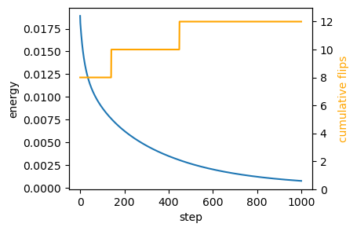
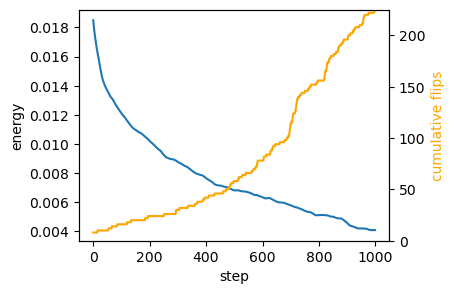

# Area-perimeter self-propelled Voronoi model


After the toy example of notebook 05, let’s implement a slightly more
complicated model, the self-propelled Voronoi area-perimeter Voronoi
(VAP) model of [Bi et al.,
2016](https://journals.aps.org/prx/abstract/10.1103/PhysRevX.6.021011).
This 2D model comprises most of the ingredients we will see in more
general tissue mechanics simulations, from a coding perspective.

In brief, in the VAP, cells are modeled as the Voronoi tesselation for a
series of centroids **v**<sub>*i*</sub> (our triangulation vertices).
Their overdamped dynamics comprises two terms: self-propulsion and
relaxation of an elastic energy:
$$\partial_t \mathbf{v}\_i = -\nabla\_{\mathbf{v}\_i} E\_{AP} + v_0 \hat{\mathbf{n}}\_i$$
For each cell *i*, $\hat{\mathbf{n}}\_i$ is a unit vector (so we will
represent it by an angle *θ*<sub>*i*</sub>) that determines the
direction of motion. Units of time are chosen so that the coefficient of
∇*E*<sub>*A**P*</sub> is 1. The energy is defined in terms of the
Voronoi area *a*<sub>*i*</sub> and Voronoi perimeter *p*<sub>*i*</sub>
of each cell:
*E*<sub>*A**P*</sub> = ∑<sub>*i*</sub>*k*<sub>*a*</sub>(*a*<sub>*i*</sub> − *a*<sub>0</sub>)<sup>2</sup> + *k*<sub>*p*</sub>(*p*<sub>*i*</sub> − *p*<sub>0</sub>)<sup>2</sup>
where *k*<sub>*a*</sub>, *k*<sub>*p*</sub> are elastic constants, and
*a*<sub>0</sub>, *p*<sub>0</sub> are the target area and perimeter. They
define the “shape index” $s_0= p_0/\sqrt{a_0}$. The key physics is that
above a critical shape index *s*<sub>0</sub><sup>\*</sup>, the model has
a degenerate set of ground states, since for a large *p*<sub>0</sub>,
there are many polygons with the given target area and perimeter (think
floppy balloon).

The orientation *θ*<sub>*i*</sub> of each cell is also dynamic. It
undergoes rotational diffusion:
*d**θ*<sub>*i*</sub> = *D*<sub>*θ*</sub>*d**W*<sub>*t*, *i*</sub>
where *d**W*<sub>*t*, *i*</sub> is Brownian motion, independent for each
cell *i*, and *D*<sub>*θ*</sub> is the diffusion constant.

#### Numerics

The cell array connectivity will be represented by a
[`HeMesh`](https://nikolas-claussen.github.io/triangulax/halfedge_datastructure.html#hemesh)
(see notebook 01). The geometry is fully described by the triangulation
vertex positions, the Voronoi cell centroids. We also need a scalar
vertex attribute for the angle *θ*<sub>*i*</sub>. To calculate the
energy *E*<sub>*A**P*</sub>, we obtain Voronoi area and perimeter using
the `linops` module. Boundary cells can be handled by “mirroring”, i.e.,
all corners count twice when computing the area/perimeter. Given the
energy, JAX autodiff gives us the gradients. To time-evolve the mesh
geometry, we can use `diffrax`, like in notebook 05. `diffrax` can also
deal with SDEs, like the Langevin equation for cell angles.

**Note** This notebook is an example, and not meant to be numerically
efficient!

<!-- WARNING: THIS FILE WAS AUTOGENERATED! DO NOT EDIT! -->

``` python
from typing import Tuple

import dataclasses
import copy

import numpy as np

import matplotlib.pyplot as plt

import jax
import jax.numpy as jnp

import diffrax
import lineax

from jaxtyping import Float, Bool, Int
from enum import IntEnum
```

``` python
jax.config.update("jax_enable_x64", True)
jax.config.update("jax_debug_nans", True)
jax.config.update("jax_log_compiles", False)
jax.config.update("jax_disable_jit", False)
```

``` python
from triangulax import trigonometry as trig
from triangulax.triangular import TriMesh
from triangulax import mesh as msh
from triangulax.mesh import HeMesh, GeomMesh
from triangulax import linops
```

``` python
from importlib import reload

#reload(msh)
#reload(trig)
```

#### Read in test data

``` python
mesh = TriMesh.read_obj("test_meshes/disk.obj")
hemesh = HeMesh.from_triangles(mesh.vertices.shape[0], mesh.faces)
geommesh = GeomMesh(*hemesh.n_items, vertices=mesh.vertices)
geommesh = msh.set_voronoi_face_positions(geommesh, hemesh)

hemesh, geommesh
```

    Warning: readOBJ() ignored non-comment line 3:
      o flat_tri_ecmc

    (HeMesh(N_V=131, N_HE=708, N_F=224), GeomMesh(D=2,N_V=131, N_HE=708, N_F=224))

``` python
fig, ax = plt.subplots(figsize=(4, 4))
ax.add_collection(msh.cellplot(hemesh, geommesh.face_positions,
                               cell_colors=np.array([0.7, 0.7, 0.9, 0.4]),
                               mpl_polygon_kwargs={"lw": 0.5, "ec": "k"}))
ax.set_aspect("equal")
ax.autoscale_view();
```


### Voronoi geometry and area-perimeter energy

``` python
@jax.jit
def energy_ap(geommesh: GeomMesh, hemesh: HeMesh, a0: float, p0: float,
              k_a: float = 1.0, k_p: float = 1.0, k_penalty: float=10) -> Float[jax.Array, ""]:
    """Area-perimeter energy for Voronoi cells.
    Adds small penalty for triangles with negative area.
    """
    cell_areas = linops.get_cell_areas(geommesh.vertices, hemesh)    
    cell_perimeters = linops.get_cell_perimeters(geommesh.vertices, hemesh)
    tri_areas = linops.get_triangle_areas(geommesh.vertices, hemesh)
    # add a factor 2x for boundary vertices to account for missing triangles
    cell_areas = jnp.where(hemesh.is_bdry, 2.0 * cell_areas, cell_areas)
    cell_perimeters = jnp.where(hemesh.is_bdry, 2.0 * cell_perimeters, cell_perimeters)

    a_min = 0.25*(a0/2)
    penality = jnp.where(tri_areas < a_min, k_a * (tri_areas-a_min)**2, 0.0).mean()

    return k_a*jnp.mean((cell_areas-a0)**2) + k_p * jnp.mean((cell_perimeters-p0)**2) + k_penalty*penality
```

``` python
cell_areas, cell_perimeters = (linops.get_cell_areas(geommesh.vertices, hemesh),
                               linops.get_cell_perimeters(geommesh.vertices, hemesh))

a_mean, p_mean = (cell_areas[~hemesh.is_bdry].mean(), cell_perimeters[~hemesh.is_bdry].mean())
a_mean, p_mean, p_mean/np.sqrt(a_mean)
```

    (Array(0.02756258, dtype=float64),
     Array(0.63463959, dtype=float64),
     Array(3.82267399, dtype=float64))

``` python
energy_ap(geommesh, hemesh, a0=a_mean, p0=3*jnp.sqrt(a_mean))
```

    Array(0.01891426, dtype=float64)

### Edge flips

After each timestep, we need to check if the Voronoi edge lengths are
below some threshold (the edge lengths can be computed on the fly), and,
if so, we need to carry out edge flips. See notebook 03. We need to
ensure that we do not immidiately “re-flip” an edge. This can be done
via “cool down” period (an edge flipped at step *t* cannot be flipped
again for the next few steps).

``` python
@jax.jit
def apply_flips(geommesh: GeomMesh, hemesh: HeMesh, l_min_T1: float, 
                cooldown_counter: Int[jax.Array, " n_hes"], cooldown_steps: int,
                ) -> Tuple[HeMesh, Int[jax.Array, " n_hes"], Bool[jax.Array, " n_hes"],]:
    """Apply T1 edge flips with a per-edge cooldown."""
    face_positions = msh.get_voronoi_face_positions(geommesh.vertices, hemesh)
    edge_lengths = msh.get_signed_dual_he_length(geommesh.vertices, face_positions, hemesh)
    to_flip = (edge_lengths < l_min_T1) & (cooldown_counter == 0)
    hemesh_next = msh.flip_all(hemesh, to_flip)
    cooldown_counter = jnp.where(to_flip, cooldown_steps, jnp.clip(cooldown_counter-1, 0))
    return hemesh_next, cooldown_counter, to_flip
```

### Energy relaxation (no self-propulsion)

We first only relax the area–perimeter energy. We also need to allow for
topological modifications of the mesh (T1s/edge flips). At every
timestep, we check if any dual cell edge has negative length and flip
it. To ensure we don’t flip the same edge multiple times, let’s use a
cooldown period.

``` python
# energy parameters
a0 = a_mean
s0 = 3
p0 = s0*jnp.sqrt(a0)

# numerical parameters
step_size = 0.02
n_steps = 10000

cooldown_steps = 5
l_min_T1 = 0.0
```

``` python
# relax energy

@jax.jit
def relax_energy_step(geommesh: GeomMesh, hemesh: HeMesh,
              a0: float, p0: float,
              step_size: float = 0.01,
              k_a: float = 1.0, k_p: float = 1.0) -> Tuple[GeomMesh, Float[jax.Array, ""]]:
    loss, grad = jax.value_and_grad(energy_ap)(geommesh, hemesh, a0, p0, k_a, k_p)
    updated_vertices = geommesh.vertices - step_size * grad.vertices
    geommesh_updated = dataclasses.replace(geommesh, vertices=updated_vertices)
    return geommesh_updated, loss

# package simulation time step into a function for jax.lax.scan
@jax.jit
def scan_fun(carry: Tuple[GeomMesh, HeMesh, Int[jax.Array, " n_steps"]], x: Float[jax.Array, " n_steps"]):
    (geommesh_relaxed, hemesh_relaxed), cooldown_counter = carry
    # step energy
    geommesh_relaxed, loss = relax_energy_step(geommesh_relaxed, hemesh_relaxed, a0, p0, step_size=step_size)
    # carry out T1s
    hemesh_relaxed, cooldown_counter, to_flip = apply_flips(geommesh_relaxed, hemesh_relaxed, l_min_T1,
                                                            cooldown_counter, cooldown_steps)

    # return updated carry and metrics
    log = jnp.array([loss, to_flip.sum()])

    return ((geommesh_relaxed, hemesh_relaxed), cooldown_counter), log
```

``` python
cooldown_counter = jnp.zeros(hemesh.n_hes)
sim_steps = jnp.arange(n_steps)

init = ((geommesh, hemesh), cooldown_counter)
((geommesh_relaxed, hemesh_relaxed), _), logs = jax.lax.scan(scan_fun, init, sim_steps) 

energy, flip_count = logs.T
```

``` python
fig = plt.figure(figsize=(4, 3))
plt.plot(energy[::int(n_steps/1000)])
plt.xlabel("step")
plt.ylabel("energy")

# add a twin y axis that shows the cummulative number of flips
ax2 = plt.gca().twinx()
ax2.plot(jnp.cumsum(flip_count)[::int(n_steps/1000)], color="orange")
ax2.set_ylabel("cumulative flips", color="orange")
ax2.set_ylim([0,flip_count.sum()+1])
```



``` python
geommesh_relaxed = msh.set_voronoi_face_positions(geommesh_relaxed, hemesh_relaxed)

fig, ax = plt.subplots(figsize=(4, 4))
ax.add_collection(msh.cellplot(hemesh, geommesh.face_positions,
                               cell_colors=np.array([0.7, 0.7, 0.9, 0.2]),
                               mpl_polygon_kwargs={"lw": 0.5, "ec": "tab:blue"}))
ax.add_collection(msh.cellplot(hemesh_relaxed, geommesh_relaxed.face_positions,
                               cell_colors=np.array([0.9, 0.6, 0.6, 0.2]),
                               mpl_polygon_kwargs={"lw": 0.5, "ec": "tab:red"}))
ax.set_aspect("equal")
ax.autoscale_view();
```


## Overdamped dynamics with self-propulsion

Next, let’s add the self-propulsion term. We initialize the angles
*θ*<sub>*i*</sub> at random. We can store the angles as an extra
`vertex_attrib` in our `geommesh`, using the functionality of the
[`GeomMesh`](https://nikolas-claussen.github.io/triangulax/halfedge_datastructure.html#geommesh)
dataclass. We already have an `IntEnum` which we can use as keys to the
`vertex_attrib` dictionary, like described in notebook 01.

In addition to incorporating the self-propulusion term
$\partial_t \mathbf{v}\_i = -\nabla\_{\mathbf{v}\_i} E\_{AP} + v_0\hat{\mathbf{n}}\_i$,
we need to do (stochastic) time steps for the angle orientation. Let’s
do that with `diffrax`’s SDE solver, like in [this
tutorial](https://docs.kidger.site/diffrax/usage/getting-started/#stochastic-differential-equations-sdes).
Let’s also implement the “pattern” for simulation loops with
`jax.lax.scan` Note that the simulation can diverge if the
self-propulsion term is too strong, due to effects at the boundaries. A
more carefull handling of the boundaries (adding T1s on the boundaries,
or using periodic BCs) is beyond the scope of this notebook.

### Random numbers in JAX

JAX takes a [different
approach](https://docs.jax.dev/en/latest/random-numbers.html) to random
numbers (and hence the noise in our SDE) than numpy. The random numbers
that will be used are specified by a `key` and will thus be reproducible
across simulations. In particular, random numbers are no impediment to
auto-differentiation; they are “frozen” when taking automatic
derivatives.

``` python
## for this model, the simulation state becomes quite complex. Let's define a dataclass to hold it.

@jax.tree_util.register_dataclass
@dataclasses.dataclass
class SimState:
    geommesh: GeomMesh
    hemesh: HeMesh
    cooldown_counter: Int[jax.Array, " n_hes"]
    tprev: Float[jax.Array, ""]
    solver_state_sp: object
    solver_state_sde: object

## we also define a dataclass to hold logging information

@jax.tree_util.register_dataclass
@dataclasses.dataclass
class Log:
    geommesh: GeomMesh
    hemesh: HeMesh
    energy: Float[jax.Array, ""]
    n_flips: Int[jax.Array, ""]
```

``` python
# initialize orientations and store as a vertex attribute

class VertexAttribs(IntEnum):
    SP_ORIENTATION = 1

key = jax.random.key(0)
theta0 = jax.random.uniform(key, shape=(hemesh.n_vertices,), minval=0.0, maxval=2*jnp.pi)

geommesh_sp = dataclasses.replace(geommesh,
                                  vertex_attribs={VertexAttribs.SP_ORIENTATION: theta0})

hemesh_sp = copy.copy(hemesh)
```

``` python
## set simulation parameters

# energy parameters
a0 = a_mean
s0 = 3
p0 = s0*jnp.sqrt(a0)
v0 = 0.005 # self-propulsion speed
ka = 1.0
kp = 1.0

# orientation dynamics parameters
diffusion_coeff_theta = 1.0

# timestepping parameters
step_size = 0.02
n_steps = 5000

cooldown_steps = 5
l_min_T1 = 0.0
```

``` python
# check magnitude of the gradient forces vs the self-propulsion 

grad0 = jax.grad(energy_ap)(geommesh_sp, hemesh, a0, p0, 1, 1).vertices
sp0 = v0*jnp.stack([jnp.cos(theta0), jnp.sin(theta0)], axis=-1)

jnp.linalg.norm(sp0, axis=-1).mean() / jnp.linalg.norm(grad0, axis=-1).mean()
```

    Array(1.5736791, dtype=float64)

``` python
## define the ODE for vertex positions

@jax.jit
def ap_selfprop_vector_field(t: Float[jax.Array, ""],
                             y: GeomMesh,
                             args: Tuple[HeMesh, float, float, float, float, float]) -> GeomMesh:
    """RHS for overdamped area-perimeter dynamics with self-propulsion."""
    hemesh, a0, p0, v0, k_a, k_p = args
    theta = y.vertex_attribs[VertexAttribs.SP_ORIENTATION]
    # combine energy gradient with self-propulsion
    grad = jax.grad(energy_ap)(y, hemesh, a0, p0, k_a, k_p)
    n_hat = jnp.stack([jnp.cos(theta), jnp.sin(theta)], axis=-1)
    velocity = -grad.vertices + v0 * n_hat
    # velocity = jnp.where(hemesh.is_bdry[:,None], 0, velocity)
    # don't update the orientations here
    zero_vertex_attribs = {key: jnp.zeros_like(val) for key, val in y.vertex_attribs.items()} 
    return dataclasses.replace(y, vertices=velocity, vertex_attribs=zero_vertex_attribs,)
term_sp = diffrax.ODETerm(ap_selfprop_vector_field)

## define the SDE and solver for orientation dynamics

key_sde = jax.random.key(0)
def diffusion(t, y, args):
    return lineax.DiagonalLinearOperator(diffusion_coeff_theta*jnp.ones(hemesh_sp.n_vertices))
def drift(t, y, args):
    return jnp.zeros(hemesh_sp.n_vertices)
brownian_motion =  diffrax.VirtualBrownianTree(0, step_size*n_steps,
                                               tol=1e-3, shape=(hemesh_sp.n_vertices,), key=key_sde)
term_sde = diffrax.MultiTerm(diffrax.ODETerm(drift), diffrax.ControlTerm(diffusion, brownian_motion))
## Define solvers

solver_sp = diffrax.Tsit5()
solver_sde = diffrax.EulerHeun()
```

``` python
# initialize the ancillary variables (solver state, cooldown)

solver_state_sp = solver_sp.init(term_sp, 0, step_size, geommesh_sp, (hemesh_sp, a0, p0, v0, ka, kp))
solver_state_sde = solver_sde.init(term_sde, 0, step_size, geommesh_sp.vertex_attribs[VertexAttribs.SP_ORIENTATION], None)

timepoints = step_size * jnp.arange(n_steps)

init = SimState(geommesh=geommesh_sp, hemesh=hemesh_sp,
                cooldown_counter= jnp.zeros(hemesh_sp.n_hes), tprev=timepoints[0],
                solver_state_sp=solver_state_sp, solver_state_sde=solver_state_sde)
```

``` python
# define the scan function - one step of the SDE + ODE coupled system

@jax.jit
def scan_fun(state: SimState, tnext: Float[jax.Array, ""],) -> tuple[SimState, Log]:
    # time-step SDE for self-propulsion orientation
    theta = state.geommesh.vertex_attribs[VertexAttribs.SP_ORIENTATION]
    theta, _, _, solver_state_sde, _ = solver_sde.step(term_sde, state.tprev, tnext, theta,
                                                       None, state.solver_state_sde, made_jump=False)
    # time-step ODE for vertex positions
    args_sp = (state.hemesh, a0, p0, v0, ka, kp,)
    geommesh, _, _, solver_state_sp, _ = solver_sp.step(term_sp, state.tprev, tnext, state.geommesh, args_sp,
                                                        state.solver_state_sp, made_jump=False,)
    geommesh = dataclasses.replace(geommesh, vertex_attribs={VertexAttribs.SP_ORIENTATION: theta})
    # T1 transitions for connectivity
    hemesh, cooldown_counter, to_flip = apply_flips(geommesh, state.hemesh,l_min_T1,
                                                    state.cooldown_counter, cooldown_steps,)
    # make measurements for log
    energy = energy_ap(geommesh, hemesh, a0, p0, ka, kp)
    n_flips=to_flip.sum()
    log = Log(geommesh=geommesh, hemesh=hemesh,
              energy=energy, n_flips=n_flips)
    # package next state
    next_state = SimState(geommesh=geommesh, hemesh=hemesh,
                          cooldown_counter=cooldown_counter, tprev=tnext,
                          solver_state_sp=solver_state_sp, solver_state_sde=solver_state_sde)
    return next_state, log
```

``` python
# Time stepping: scan advances (tprev -> tnext) for both theta and vertex dynamics.
final_state, logs = jax.lax.scan(scan_fun, init, timepoints)
```

``` python
# Measurements logged at each step: geometry, connectivity, energy, and T1 flip counts.

geommesh_traj = msh.tree_unstack(logs.geommesh)
hemesh_traj = msh.tree_unstack(logs.hemesh)
```

### Visualize trajectory

``` python
# total displacement
np.linalg.norm(geommesh_traj[0].vertices-geommesh_traj[-1].vertices, axis=-1).mean()
```

    np.float64(0.0994635637342046)

``` python
fig = plt.figure(figsize=(4, 3))

skip = int(np.ceil(n_steps/1000))
plt.plot(logs.energy[::skip])
plt.xlabel("step")
plt.ylabel("energy")

# add a twin y axis that shows the cummulative number of flips
ax2 = plt.gca().twinx()
ax2.plot(jnp.cumsum(logs.n_flips)[::skip], color="orange")
ax2.set_ylabel("cumulative flips", color="orange")
ax2.set_ylim([0,logs.n_flips.sum()+1])
```



``` python
# angle dynamics are stochastic

fig = plt.figure(figsize=(4, 3))

cell_id = 50

plt.plot(logs.geommesh.vertex_attribs[VertexAttribs.SP_ORIENTATION][:, ::20])

plt.xlabel("step")
plt.ylabel("orientation")
```

    Text(0, 0.5, 'orientation')


``` python
fig, ax = plt.subplots(figsize=(4, 4))

#plt.triplot(*geommesh_traj_sde[0].vertices.T, hemesh_traj_sde[0].faces)

#plt.triplot(*geommesh_traj_sde[-1].vertices.T, hemesh_traj_sde[-1].faces)
#plt.scatter(*geommesh_final.vertices.T, c=areas, cmap="viridis", s=20, vmin=0)


geommesh_traj[-1] = msh.set_voronoi_face_positions(geommesh_traj[-1], hemesh_traj[-1])

ax.add_collection(msh.cellplot(hemesh_traj[0], geommesh_traj[0].face_positions,
                               cell_colors=np.array([0.7, 0.7, 0.9, 0.2]),
                               mpl_polygon_kwargs={"lw": 0.5, "ec": "tab:blue"}))
ax.add_collection(msh.cellplot(hemesh_traj[-1], geommesh_traj[-1].face_positions,
                               cell_colors=np.array([0.9, 0.6, 0.6, 0.2]),
                               mpl_polygon_kwargs={"lw": 0.5, "ec": "tab:red"}))


ax.set_aspect("equal")
ax.autoscale_view();
```


