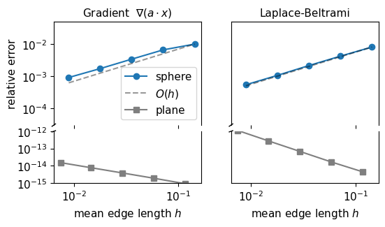
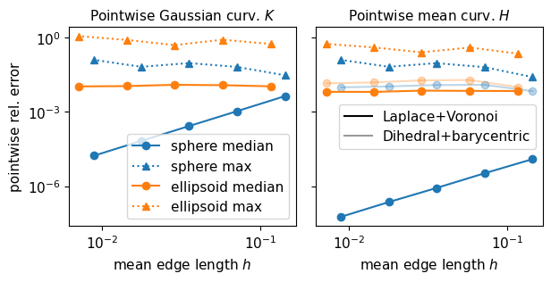
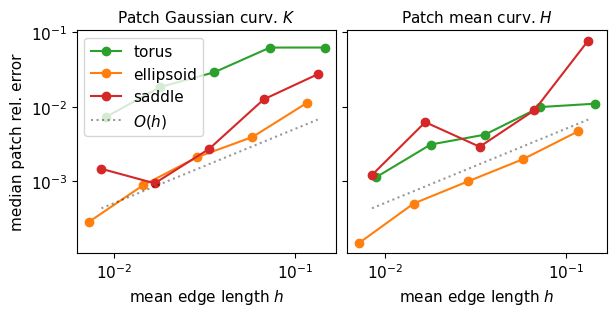
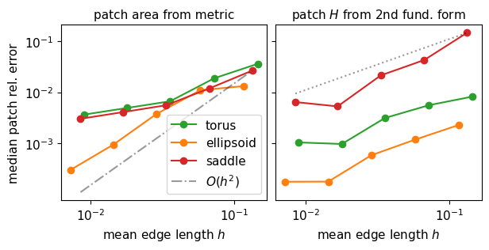

# Convergence of the discrete differential-geometry operators


<!-- WARNING: THIS FILE WAS AUTOGENERATED! DO NOT EDIT! -->

## 1. Test meshes

Each mesh is built from an isotropic remesh (`plane_*`, `sphere_*`,
`torus_*` in `refinement_tests/`, at resolutions = edge length as % of
the bounding-box diagonal, so `4` is coarsest and `0.25` finest) by:

1.  Moving its vertices exactly onto the target surface (project to the
    sphere / torus apply a height deformation for the saddle and an
    anisotropic scaling for the ellipsoid), then
2.  Flipping non-Delaunay edges with `alg.fix_delaunay`. This ensures
    mesh quality.

The five surfaces are the **plane** (*K* = *H* = 0), a **saddle**
$z=\tfrac12(x^2-y^2)$ (a hyperbolic paraboloid, open), the unit
**sphere**, an **ellipsoid** (sphere scaled by (1, 0.8, 0.6)), and a
**torus** (radii 1, 0.25). Delaunay-fixing is slow on the finest meshes,
so the meshes are generated once and saved to
`refinement_tests/delaunay/`; re-running skips meshes that already
exist.

## 2. Analytical reference values

For a surface defined implicitly by as a level set
*F*(*x*, *y*, *z*) = 0, the Gaussian and mean curvatures admit simple
formulas [Goldman 2005](https://doi.org/10.1016/j.cagd.2005.06.005),
which we evaluate by automatic differentiation

$$K=\frac{\nabla F^{\top}\operatorname{adj}(\mathbf H_F)\nabla F}{|\nabla F|^4},\qquad
H=\frac{|\nabla F|^2\operatorname{tr}(\mathbf H_F)-\nabla F^{\top}\mathbf H_F\nabla F}{2|\nabla F|^3},$$

The sign is fixed so an outward-oriented sphere has *H* = +1/*R*. The
next cell checks this against the closed forms for the sphere
(*K* = 1/*R*<sup>2</sup>, *H* = 1/*R*) and the ellipsoid.

``` python
def implicit_curvatures(F, x: Float[jax.Array, "3"]):
    """Gaussian K, mean H, and unit normal at a point x on the implicit surface F(x) = 0 (Goldman 2005)."""
    g = jax.grad(F)(x); Hess = jax.hessian(F)(x); gn2 = g @ g
    adj_H = jnp.array([
        [Hess[1,1]*Hess[2,2]-Hess[1,2]*Hess[2,1], Hess[0,2]*Hess[2,1]-Hess[0,1]*Hess[2,2], Hess[0,1]*Hess[1,2]-Hess[0,2]*Hess[1,1]],
        [Hess[1,2]*Hess[2,0]-Hess[1,0]*Hess[2,2], Hess[0,0]*Hess[2,2]-Hess[0,2]*Hess[2,0], Hess[0,2]*Hess[1,0]-Hess[0,0]*Hess[1,2]],
        [Hess[1,0]*Hess[2,1]-Hess[1,1]*Hess[2,0], Hess[0,1]*Hess[2,0]-Hess[0,0]*Hess[2,1], Hess[0,0]*Hess[1,1]-Hess[0,1]*Hess[1,0]]])
    K = (g @ adj_H @ g) / gn2**2
    H = (gn2*jnp.trace(Hess) - g @ Hess @ g) / (2 * gn2**1.5)
    return K, H, g / jnp.sqrt(gn2)

A_ELL, B_ELL, C_ELL = ELLIPSOID_AXES
IMPLICIT = {
    "sphere":    lambda x: x @ x - 1.0,
    "ellipsoid": lambda x: (x[0]/A_ELL)**2 + (x[1]/B_ELL)**2 + (x[2]/C_ELL)**2 - 1.0,
    "torus":     lambda x: (jnp.sqrt(x[0]**2 + x[1]**2) - TORUS_A)**2 + x[2]**2 - TORUS_C**2,
    "saddle":    lambda x: x[2] - SADDLE_AMPLITUDE * (x[0]**2 - x[1]**2),
    "plane":     lambda x: x[2],
}
def analytic_curvature(name, points):
    """Exact (K, H, unit normal) at each point, from the implicit representation."""
    return jax.vmap(lambda x: implicit_curvatures(IMPLICIT[name], x))(points)
```

``` python
# closed forms (Wikipedia) used only to validate the autodiff implementation
def sphere_KH(R=1.0): return 1/R**2, 1/R
def ellipsoid_KH(x, a=A_ELL, b=B_ELL, c=C_ELL):
    q = (x[...,0]/a**2)**2 + (x[...,1]/b**2)**2 + (x[...,2]/c**2)**2
    return 1/((a*b*c)**2*q**2), jnp.abs(x[...,0]**2+x[...,1]**2+x[...,2]**2-a**2-b**2-c**2)/(2*(a*b*c)**2*q**1.5)

key = jax.random.PRNGKey(0); p = jax.random.normal(key, (500, 3))
p_sphere = p/jnp.linalg.norm(p, axis=1, keepdims=True); p_ellip = p_sphere*jnp.array(ELLIPSOID_AXES)
for name, pts, (Kc, Hc) in [("sphere", p_sphere, sphere_KH()), ("ellipsoid", p_ellip, ellipsoid_KH(p_ellip))]:
    K, H, _ = analytic_curvature(name, pts)
    print(f"{name:10s} max|K-K_closed|={float(jnp.max(jnp.abs(K-Kc))):.1e}  max|H-H_closed|={float(jnp.max(jnp.abs(H-Hc))):.1e}")
```

    sphere     max|K-K_closed|=4.4e-16  max|H-H_closed|=4.4e-16
    ellipsoid  max|K-K_closed|=2.7e-15  max|H-H_closed|=1.8e-15

### Error metric and reference integrals

For a quantity *A* we report the **relative error, normalized by the
surface-average magnitude**,
$|A\_{\rm exact}-A\_{\rm disc}|/\overline{|A|}$ with
$\overline{|A|}=\int_S|A|\\dA/\int_S dA$. Both $\overline{|A|}$ and the
exact region integrals come from a fine parametric quadrature of each
surface, which also fixes the **sectors** used later: 8 octants
(ellipsoid, by coordinate sign), 8 poloidal bands (torus), and 8 angular
sectors inside a disk of radius 0.8 (saddle).

## 3. Differential operators converge pointwise

We first check the two operators that *do* converge pointwise. The
finite-element **gradient** is tested on the ambient-linear field
*u* = *a* ⋅ *x*, whose exact surface gradient is the tangential
projection *a* − (*a* ⋅ *n*) *n* (with the smooth normal *n*). The
area-normalised cotangent **Laplace–Beltrami** operator is tested on
eigen/harmonic fields: on the sphere *Δ*<sub>*S*</sub>*z* = −2*z*, on
the plane *Δ*(*x*<sup>2</sup> + *y*<sup>2</sup>) = 4. Errors are RMS
over faces/vertices, normalised as above. Because the flat-mesh error is
at machine precision while the curved-surface error is *O*(*h*), the
*y*-axis is **broken** into two ranges.

    /var/folders/vm/1jl6rjln6n9cjt54vsr9n4800000gr/T/ipykernel_76998/2921015705.py:57: UserWarning: This figure includes Axes that are not compatible with tight_layout, so results might be incorrect.
      plt.tight_layout(pad=0.1, w_pad=0.4, h_pad=0.1)
    findfont: Font family 'normal' not found.
    findfont: Font family 'normal' not found.
    findfont: Font family 'normal' not found.
    findfont: Font family 'normal' not found.
    findfont: Font family 'normal' not found.
    findfont: Font family 'normal' not found.
    findfont: Font family 'normal' not found.
    findfont: Font family 'normal' not found.
    findfont: Font family 'normal' not found.
    findfont: Font family 'normal' not found.
    findfont: Font family 'normal' not found.
    findfont: Font family 'normal' not found.
    findfont: Font family 'normal' not found.
    findfont: Font family 'normal' not found.
    findfont: Font family 'normal' not found.
    findfont: Font family 'normal' not found.
    findfont: Font family 'normal' not found.
    findfont: Font family 'normal' not found.
    findfont: Font family 'normal' not found.
    findfont: Font family 'normal' not found.
    findfont: Font family 'normal' not found.
    findfont: Font family 'normal' not found.
    findfont: Font family 'normal' not found.
    findfont: Font family 'normal' not found.
    findfont: Font family 'normal' not found.
    findfont: Font family 'normal' not found.
    findfont: Font family 'normal' not found.
    findfont: Font family 'normal' not found.
    findfont: Font family 'normal' not found.
    findfont: Font family 'normal' not found.
    findfont: Font family 'normal' not found.
    findfont: Font family 'normal' not found.



Both operators converge pointwise *O*(*h*) on the sphere and
machine-exact on the plane (the P1 gradient of a linear field is exact
on each triangle, and the cotan Laplacian is exact for the quadratic on
a flat mesh).

## 4. Pointwise curvature: stable, but not convergent

The curvature estimators only converge in the weak sense. Below, the
**median** pointwise error (bulk behavior) and the **maximum** pointwise
error (worst vertex) are shown for *K* and *H* on the sphere and the
ellipsoid. On the near-regular sphere the median converges like
*O*(*h*<sup>2</sup>), but on the ellipsoid, where the mesh is less
regular, the median does not decrease. The maximum error stays bounded
under refinement on both surfaces: the estimators are pointwise
**stable**.

We also compare two discretizations of the mean curvature, using Laplace
operator + Voronoi areas
([`get_mean_curvature_laplace`](https://nikolas-claussen.github.io/triangulax/src/geometric_quantities.html#get_mean_curvature_laplace),
recommended), and dihedral angles + barycentric area.

Note that our implementation matches the `libigl` to machine precision –
lack of pointwise convergence is a property of the discretisation, not a
bug.

``` python
def get_mean_curvature_dihedral_barycentric(vertices, hemesh):
    H_dihedral = geom.get_mean_curvature_dihedral(vertices, hemesh, normalize=False)
    return H_dihedral / geom.get_barycentric_cell_areas(vertices, hemesh)
```

    findfont: Font family 'normal' not found.
    findfont: Font family 'normal' not found.
    findfont: Font family 'normal' not found.
    findfont: Font family 'normal' not found.
    findfont: Font family 'normal' not found.
    findfont: Font family 'normal' not found.
    findfont: Font family 'normal' not found.
    findfont: Font family 'normal' not found.
    findfont: Font family 'normal' not found.
    findfont: Font family 'normal' not found.
    findfont: Font family 'normal' not found.
    findfont: Font family 'normal' not found.
    findfont: Font family 'normal' not found.
    findfont: Font family 'normal' not found.
    findfont: Font family 'normal' not found.
    findfont: Font family 'normal' not found.
    findfont: Font family 'normal' not found.
    findfont: Font family 'normal' not found.
    findfont: Font family 'normal' not found.
    findfont: Font family 'normal' not found.
    findfont: Font family 'normal' not found.
    findfont: Font family 'normal' not found.
    findfont: Font family 'normal' not found.
    findfont: Font family 'normal' not found.
    findfont: Font family 'normal' not found.
    findfont: Font family 'normal' not found.
    findfont: Font family 'normal' not found.
    findfont: Font family 'normal' not found.
    findfont: Font family 'normal' not found.
    findfont: Font family 'normal' not found.
    findfont: Font family 'normal' not found.
    findfont: Font family 'normal' not found.
    findfont: Font family 'normal' not found.
    findfont: Font family 'normal' not found.
    findfont: Font family 'normal' not found.
    findfont: Font family 'normal' not found.
    findfont: Font family 'normal' not found.
    findfont: Font family 'normal' not found.
    findfont: Font family 'normal' not found.
    findfont: Font family 'normal' not found.
    findfont: Font family 'normal' not found.
    findfont: Font family 'normal' not found.
    findfont: Font family 'normal' not found.
    findfont: Font family 'normal' not found.
    findfont: Font family 'normal' not found.
    findfont: Font family 'normal' not found.
    findfont: Font family 'normal' not found.
    findfont: Font family 'normal' not found.
    findfont: Font family 'normal' not found.
    findfont: Font family 'normal' not found.
    findfont: Font family 'normal' not found.
    findfont: Font family 'normal' not found.
    findfont: Font family 'normal' not found.



## 5. What convergence to expect

The behaviour above is exactly what the literature predicts. The
angle-defect and cotangent curvature estimators are **not** guaranteed
to converge pointwise on general meshes; they converge in an
**integrated / weak (“measure”)** sense.

- **Gaussian curvature (angle defect).** The defect
  2*π* − ∑<sub>*i*</sub>*θ*<sub>*i*</sub> is the *integral* of *K* over
  the cell around a vertex (up to higher order); over a closed surface
  it is exactly 2*π**χ* (Gauss–Bonnet). Divided by the cell area it
  converges pointwise only for meshes with special regularity
  properties. However, Cohen-Steiner & Morvan prove that discrete
  curvature **measures** converge over any fixed region, linearly
  *O*(*h*) in the sampling density.
- **Mean curvature (cotangent).** The cotan Laplacian converges to its
  smooth counterpart, but the mean curvature vector
  $\tfrac12 M^{-1}Lx=Hn$ converges only in the sense of
  **distributions** (Wardetzky 2008).

The remedy is to integrate the estimators over regions of **fixed** size
(that do not shrink as *h* → 0), instead of looking per-vertex values
(integrated over cells whose area goes to 0).

## 6. Region-averaged curvature converges

We split each surface into 8 fixed sectors and test
∫<sub>*P*</sub>*A* *d**A* = ∫<sub>*P*</sub>*A* *d**A*/∫<sub>*P*</sub>*d**A*
using the **un-normalised** (integrated) estimators —
∫<sub>*P*</sub>*H* *d**A* ≈ ∑<sub>*i* ∈ *P*</sub>
`get_mean_curvature_*(..., normalize=False)`,
∫<sub>*P*</sub>*K* *d**A* ≈ ∑<sub>*i* ∈ *P*</sub>(2*π* − ∑*θ*)<sub>*i*</sub>,
patch area ∑<sub>*i* ∈ *P*</sub>*A*<sub>*i*</sub> — for the torus,
ellipsoid, and saddle. We plot the median error over the 8 sectors of
the mean and Gaussian curvatures.

    findfont: Font family 'normal' not found.
    findfont: Font family 'normal' not found.
    findfont: Font family 'normal' not found.
    findfont: Font family 'normal' not found.
    findfont: Font family 'normal' not found.
    findfont: Font family 'normal' not found.
    findfont: Font family 'normal' not found.
    findfont: Font family 'normal' not found.
    findfont: Font family 'normal' not found.
    findfont: Font family 'normal' not found.
    findfont: Font family 'normal' not found.
    findfont: Font family 'normal' not found.
    findfont: Font family 'normal' not found.
    findfont: Font family 'normal' not found.
    findfont: Font family 'normal' not found.
    findfont: Font family 'normal' not found.
    findfont: Font family 'normal' not found.
    findfont: Font family 'normal' not found.
    findfont: Font family 'normal' not found.
    findfont: Font family 'normal' not found.
    findfont: Font family 'normal' not found.
    findfont: Font family 'normal' not found.
    findfont: Font family 'normal' not found.
    findfont: Font family 'normal' not found.
    findfont: Font family 'normal' not found.
    findfont: Font family 'normal' not found.
    findfont: Font family 'normal' not found.
    findfont: Font family 'normal' not found.
    findfont: Font family 'normal' not found.
    findfont: Font family 'normal' not found.
    findfont: Font family 'normal' not found.
    findfont: Font family 'normal' not found.



**Region averages converge**, at roughly the *O*(*h*) rate the measure
theory predicts, for all three surfaces — in contrast to the flat
pointwise estimates. Two torus converges more slowly than the others —
its mesh is the least regular.

## 7. Region-averaged metric and second fundamental form

The same holds for the first and second fundamental forms. We test the
**patch area** from the metric ($\sum\_{f\in P}\tfrac12\sqrt{\det g}$ vs
∫<sub>*P*</sub>*d**A*) and the **patch mean curvature** from the shape
operator *S* = *g*<sup>−1</sup>*b* built with
`elastic.get_second_fundamental_form` (an area-weighted per-face average
∑<sub>*f*</sub>*H*<sub>*f*</sub> *A*<sub>*f*</sub>/∑<sub>*f*</sub>*A*<sub>*f*</sub>
vs ∫<sub>*P*</sub>*H* *d**A*). Faces are assigned to sectors by their
centroid.

    findfont: Font family 'normal' not found.
    findfont: Font family 'normal' not found.
    findfont: Font family 'normal' not found.
    findfont: Font family 'normal' not found.
    findfont: Font family 'normal' not found.
    findfont: Font family 'normal' not found.
    findfont: Font family 'normal' not found.
    findfont: Font family 'normal' not found.
    findfont: Font family 'normal' not found.
    findfont: Font family 'normal' not found.
    findfont: Font family 'normal' not found.
    findfont: Font family 'normal' not found.
    findfont: Font family 'normal' not found.
    findfont: Font family 'normal' not found.
    findfont: Font family 'normal' not found.
    findfont: Font family 'normal' not found.
    findfont: Font family 'normal' not found.
    findfont: Font family 'normal' not found.
    findfont: Font family 'normal' not found.
    findfont: Font family 'normal' not found.
    findfont: Font family 'normal' not found.
    findfont: Font family 'normal' not found.
    findfont: Font family 'normal' not found.
    findfont: Font family 'normal' not found.
    findfont: Font family 'normal' not found.
    findfont: Font family 'normal' not found.
    findfont: Font family 'normal' not found.
    findfont: Font family 'normal' not found.
    findfont: Font family 'normal' not found.
    findfont: Font family 'normal' not found.
    findfont: Font family 'normal' not found.
    findfont: Font family 'normal' not found.
    findfont: Font family 'normal' not found.
    findfont: Font family 'normal' not found.
    findfont: Font family 'normal' not found.
    findfont: Font family 'normal' not found.
    findfont: Font family 'normal' not found.
    findfont: Font family 'normal' not found.
    findfont: Font family 'normal' not found.



**Both converge under region averaging:** the metric area at
*O*(*h*<sup>2</sup>), and the second-fundamental- form mean curvature at
 ∼ *O*(*h*) — even though the mid-edge-normal second fundamental form
has an *O*(1) per-face noise floor pointwise. Averaging over a fixed
region recovers a convergent quantity, consistent with the
measure-convergence picture of §5.

## Summary

<table>
<colgroup>
<col style="width: 25%" />
<col style="width: 25%" />
<col style="width: 25%" />
<col style="width: 25%" />
</colgroup>
<thead>
<tr>
<th>quantity</th>
<th>operator</th>
<th>pointwise</th>
<th>region-averaged</th>
</tr>
</thead>
<tbody>
<tr>
<td>gradient</td>
<td><code>linops.compute_gradient_3d</code></td>
<td><span class="math inline"><em>O</em>(<em>h</em>)</span> (exact on
flat)</td>
<td>—</td>
</tr>
<tr>
<td>Laplace–Beltrami</td>
<td><code>linops.compute_cotan_laplace</code></td>
<td><span class="math inline"><em>O</em>(<em>h</em>)</span> (exact on
flat)</td>
<td>—</td>
</tr>
<tr>
<td>Gaussian curvature <span class="math inline"><em>K</em></span></td>
<td><code>geom.get_gaussian_curvature</code></td>
<td>stable, non-convergent</td>
<td><span class="math inline"><em>O</em>(<em>h</em>)</span></td>
</tr>
<tr>
<td>mean curvature <span class="math inline"><em>H</em></span></td>
<td><code>geom.get_mean_curvature_laplace</code></td>
<td>stable, non-convergent</td>
<td><span class="math inline"><em>O</em>(<em>h</em>)</span></td>
</tr>
<tr>
<td>mean curvature (barycentric)</td>
<td>dihedral / barycentric area</td>
<td>worst pointwise</td>
<td><span class="math inline"><em>O</em>(<em>h</em>)</span> after
averaging</td>
</tr>
<tr>
<td>metric / area</td>
<td><code>elastic.get_metric</code></td>
<td>area exact per triangle</td>
<td>patch area <span
class="math inline"><em>O</em>(<em>h</em><sup>2</sup>)</span></td>
</tr>
<tr>
<td>2nd fundamental form</td>
<td><code>elastic.get_second_fundamental_form</code></td>
<td><span class="math inline"><em>O</em>(1)</span> per-face noise</td>
<td>patch <span class="math inline"><em>H</em></span> <span
class="math inline"> ∼ <em>O</em>(<em>h</em>)</span></td>
</tr>
</tbody>
</table>

The differential operators (gradient, Laplace–Beltrami) converge
pointwise. The curvature estimators do **not** converge pointwise on
general meshes — but they are pointwise *stable* and converge in the
**measure / weak** sense, i.e. integrated over fixed regions
(Cohen-Steiner–Morvan 2003; Hildebrandt–Polthier–Wardetzky 2006).
Delaunay-flipping the deformed meshes and normalising the error by the
surface-mean magnitude $\overline{|A|}$ are what make these trends clean
and well-defined. No operator showed a bug: all match `igl` to machine
precision.
