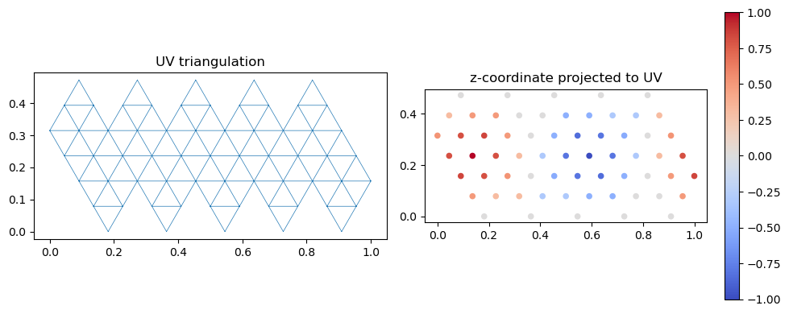
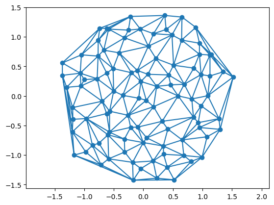

<!-- WARNING: THIS FILE WAS AUTOGENERATED! DO NOT EDIT! -->

## Loading, processing, and saving triangular meshes

`triangulax` is a library for working with triangular meshes using JAX.
This notebook defines tools for loading, processing, and saving
triangular meshes *outside* of JAX. The dataclass
[`TriMesh`](https://nikolas-claussen.github.io/triangulax/src/triangular_meshes.html#trimesh)
keeps the different pieces of a triangulation in one place. This module
allows interfacing with JAX-external code, like the excellent `igl`
geometry processing library, prepare initial conditions for simulations,
etc. The data structure for the JAX-based code is defined in the `mesh`
module, notebook 02.

### Cell tesselations and triangular meshes

One use case of `triangulax` is simulations of 2D cell tesselations. A
convenient way to represent a cell tiling is by its *dual* triangular
mesh. Each cell becomes a triangulation vertex, and corners of the cell
polygons become triangulation faces. This represents the connectivity of
the cell tesselations by a 2D triangulation. For example, Voronoi
tesselations can also be represented by their dual Delaunay
triangulation.

### The [`TriMesh`](https://nikolas-claussen.github.io/triangulax/src/triangular_meshes.html#trimesh) class

A
[`TriMesh`](https://nikolas-claussen.github.io/triangulax/src/triangular_meshes.html#trimesh)
triangulation is a list of vertices and faces (triangles):

1.  A set of vertices, i.e., a (*N*<sub>*V*</sub>, *d*) dimensional
    array datatype `float`, where *d* is 2 or 3.
2.  A set of faces, a (*N*<sub>*F*</sub>, 3) dimensional array of
    datatype `int`. Each row is an ordered triple of vertex indices that
    form a face.
3.  (Optional) A set of face centers, a (*N*<sub>*F*</sub>, *d*)
    dimensional array of datatype `float`. An entry is the position of
    the dual vertex of the triangulation face (think circumcenter).

To read and write, we use the `.obj`-file format. We use the `igl`
geometry processing library. The
[`TriMesh`](https://nikolas-claussen.github.io/triangulax/src/triangular_meshes.html#trimesh)
class is a “holder” for loading, saving, and visualizing meshes, and not
to be used for numerical computation.

### UV maps

To map 3D meshes into a 2D plane for visualization, one can use [UV
maps](https://en.wikipedia.org/wiki/UV_mapping) (the
triangular-mesh-equivalent of a coordinate parametrization for a 2D
surface). UV maps can be read in from `.obj` files and are stored in the
[`TriMesh`](https://nikolas-claussen.github.io/triangulax/src/triangular_meshes.html#trimesh)
object.

A UV map consists of:

1.  **Texture vertices** (`texture_vertices`): a
    (*N*<sub>*T**V*</sub>, 2) array of 2D coordinates. The number of
    texture vertices can differ from the number of mesh vertices
    (e.g. at seams, one mesh vertex maps to multiple UV positions).
2.  **Texture faces** (`texture_faces`): a (*N*<sub>*F*</sub>, 3) array
    of texture vertex indices. `texture_faces[i]` corresponds to
    `faces[i]`.

The mapping between mesh vertices and texture vertices is provided by
the `texture_vertex_to_vertex_map` and `vertex_to_texture_vertex_map`
properties. These enable projecting per-vertex data (e.g. scalar fields,
Laplacian eigenvectors) to the UV domain for 2D visualization.

------------------------------------------------------------------------

<a
href="https://github.com/nikolas-claussen/triangulax/blob/main/triangulax/triangular.py#L32"
target="_blank" style="float:right; font-size:smaller">source</a>

### TriMesh

``` python

def TriMesh(
    vertices:Float[Array, 'n_vertices dim'], faces:Int[Array, 'n_faces 3'], face_positions:Union=None,
    texture_vertices:Union=None, texture_faces:Union=None
)->None:

```

*Simple class for reading, holding, transforming, and saving triangular
meshes.*

A TriMesh comprises vertices and faces, describing a surface in 2d or
3d. In addition, there can be a 2d/3d position for every face (think
Voronoi dual of the triangulation). Optionally, a UV map (texture
vertices and texture faces) can be stored for 3D-to-2D projection.

Vertices and faces are jnp.arrays. Each face is a triple of vertex
indices. Vertices and faces are ordered - this is essential so that we
know which attribute vector entry goes to which vector/edge/face. Faces
in a face are assumed to be in counter-clockwise order.

Meshes are read and written in the .obj format
(https://en.wikipedia.org/wiki/Wavefront\_.obj_file). To store
*face_positions*, we abuse the `vn` (vertex normal) entry of an .obj
file. Face positions will be written in order corresponding to faces.
When reading from an .obj file, edges are recomputed from faces and
initialized in alpha-numerical ordering. An .obj file expects 3d
positions; the z-position is ignored when reading and set to 0 when
writing for 2d meshes.

If the mesh has infinity vertices, a `# triangulax: has_inf_vertex`
comment is written; on read, sentinel values are converted back to
`inf`. Vertices at “infinity” are used to implicitly represent mesh
boundaries for numerical reasons.

**Attributes**

vertices : Float\[jax.Array, “n_vertices dim”\]

faces : Int\[jax.Array, “n_faces 3”\]

face_positions : Float\[jax.Array, “n_faces dim”\] | None

texture_vertices : Float\[jax.Array, “n_texture_vertices 2”\] | None UV
coordinates. Number of texture vertices can differ from number of mesh
vertices.

texture_faces : Int\[jax.Array, “n_faces 3”\] | None Texture vertex
indices per face. `texture_faces[i]` corresponds to `faces[i]`.

**Property methods (use like attributes)**

dim : int

n_vertices : int

has_inf_vertex : bool

has_texture : bool

texture_vertex_to_vertex_map : Int\[jax.Array, “n_texture_vertices”\]
Entry `i` is the mesh vertex index corresponding to texture vertex `i`.

vertex_to_texture_vertex_map : Int\[jax.Array, “n_vertices”\] Entry `i`
is a texture vertex index corresponding to mesh vertex `i`.

**Static methods**

read_obj : str -\> TriMesh

**Methods**

write_obj : str -\> None

``` python
# test reading a mesh

mesh = TriMesh.read_obj("../test_meshes/disk.obj")
```

    Warning: readOBJ() ignored non-comment line 3:
      o flat_tri_ecmc

``` python
# test computing the circumcenter of each face. should be equidistant to all vertex points

dists = jnp.stack([jnp.linalg.norm(mesh.vertices[mesh.faces[:,i]]-mesh.face_positions, axis=1) for i in [0,1,2]], axis=1)

jnp.allclose(dists[:,0], dists[:,1]) and jnp.allclose(dists[:,1], dists[:,2])
```

    Array(True, dtype=bool)

``` python
# test writing face positions to vn entries

mesh = TriMesh.read_obj("../test_meshes/disk.obj")
filename = "../test_meshes/disk_write_test.obj"
mesh.write_obj(filename, save_face_positions=True)
mesh = TriMesh.read_obj(filename, read_face_positions=True)
```

    Warning: readOBJ() ignored non-comment line 3:
      o flat_tri_ecmc

``` python
# test reading a 3D mesh with UV map (sphere.obj has texture data from Blender)

mesh3d = TriMesh.read_obj("../test_meshes/sphere.obj", dim=3)
assert mesh3d.has_texture, "sphere.obj should have UV data"
assert mesh3d.texture_vertices.shape[1] == 2, "texture_vertices should be 2D"
assert mesh3d.texture_faces.shape[0] == mesh3d.faces.shape[0], "texture_faces and faces must have same length"
print(f"Sphere: {mesh3d.n_vertices} vertices, {mesh3d.faces.shape[0]} faces, "
      f"{mesh3d.texture_vertices.shape[0]} texture vertices")
```

    Sphere: 42 vertices, 80 faces, 63 texture vertices

    Warning: readOBJ() ignored non-comment line 3:
      o Icosphere

``` python
# test projecting vertex positions to UV space and plotting the UV map

positions_in_uv = mesh3d.vertices[mesh3d.texture_vertex_to_vertex_map]
assert positions_in_uv.shape == (mesh3d.texture_vertices.shape[0], 3)

fig, (ax1, ax2) = plt.subplots(1, 2, figsize=(10, 4))
ax1.triplot(*mesh3d.texture_vertices.T, mesh3d.texture_faces, lw=0.5)
ax1.set_title("UV triangulation")
ax1.set_aspect("equal")

sc = ax2.scatter(*mesh3d.texture_vertices.T,
                 c=positions_in_uv[:, 2], cmap="coolwarm", s=20)
ax2.set_title("z-coordinate projected to UV")
ax2.set_aspect("equal")
plt.colorbar(sc, ax=ax2)
plt.tight_layout()
```



``` python
# test write/read roundtrip with UV data

mesh3d.write_obj("../test_meshes/sphere_write_test.obj")
mesh3d_reloaded = TriMesh.read_obj("../test_meshes/sphere_write_test.obj", dim=3)
assert mesh3d_reloaded.has_texture
assert jnp.allclose(mesh3d.texture_vertices, mesh3d_reloaded.texture_vertices, atol=1e-5)
assert jnp.array_equal(mesh3d.faces, mesh3d_reloaded.faces)
print("UV write/read roundtrip: OK")
```

    UV write/read roundtrip: OK

``` python
# test that 2D meshes without UV still work as before

mesh2d = TriMesh.read_obj("../test_meshes/disk.obj")
assert not mesh2d.has_texture
assert mesh2d.face_positions is not None  # Voronoi computed automatically
print("2D mesh (no UV) backward compatibility: OK")
```

    2D mesh (no UV) backward compatibility: OK

    Warning: readOBJ() ignored non-comment line 3:
      o flat_tri_ecmc

------------------------------------------------------------------------

<a
href="https://github.com/nikolas-claussen/triangulax/blob/main/triangulax/triangular.py#L266"
target="_blank" style="float:right; font-size:smaller">source</a>

### compute_per_face_jacobian

``` python

def compute_per_face_jacobian(
    source_vertices:Float[Array, 'n_source_vertices d_source'], # Source mesh vertices.
    source_faces:Int[Array, 'n_faces 3'], # Source mesh faces (triangular).
    target_vertices:Float[Array, 'n_target_vertices d_target'], # Target mesh vertices.
    target_faces:Int[Array, 'n_faces 3'], # Target mesh faces (triangular).
)->Float[Array, 'n_faces d_target d_source']: # Per-face Jacobian matrices.

```

*Compute per-face Jacobian matrix for a map between meshes.*

`source_faces[i]` is mapped to `target_faces[i]`. The Jacobian maps
tangent vectors of the source mesh to tangent vectors of the target
mesh, evaluated per face via least-squares.

Typical use: map gradients from a 3D mesh to its 2D UV parametrization::

    jac = compute_per_face_jacobian(mesh.vertices, mesh.faces,
                                    mesh.texture_vertices, mesh.texture_faces)
    gradient_2d = jnp.einsum('fij,fj->fi', jac, gradient_3d)

### Creating meshes and plotting

Some functions to create meshes based on the Delaunay triangulation of a
point set.

1.  Poisson (vertices placed uniformly at random) in disk or box
2.  Ginibre (vertices placed at uniform with self-repulsion)
3.  Triangular lattice

Some functions for plotting meshes:

1.  Plot triangulation with vertex and face labels (for debugging)
2.  Plot cell tesselation

------------------------------------------------------------------------

<a
href="https://github.com/nikolas-claussen/triangulax/blob/main/triangulax/triangular.py#L330"
target="_blank" style="float:right; font-size:smaller">source</a>

### generate_triangular_lattice

``` python

def generate_triangular_lattice(
    nx:int, ny:int
)->Float[Array, 'nx*ny 2']:

```

*Get points for rectangular patch of triangular lattice with nx, ny
points.*

------------------------------------------------------------------------

<a
href="https://github.com/nikolas-claussen/triangulax/blob/main/triangulax/triangular.py#L322"
target="_blank" style="float:right; font-size:smaller">source</a>

### generate_poisson_points

``` python

def generate_poisson_points(
    n_vertices:int, limit_x:float=1, limit_y:float=1
)->Float[Array, 'n_vertices 2']:

```

*Sample n_vertices points from the Poisson ensemble in rectangle*
\[-limit_x/2, limit_x/2\] \* \[-limit_y/2, limit_y/2\].

------------------------------------------------------------------------

<a
href="https://github.com/nikolas-claussen/triangulax/blob/main/triangulax/triangular.py#L313"
target="_blank" style="float:right; font-size:smaller">source</a>

### generate_ginibre_points

``` python

def generate_ginibre_points(
    n_vertices:int
)->Float[Array, 'n_vertices 2']:

```

*Sample n_vertices points from the Ginibre ensemble. Points are scaled
to unit disk.*

``` python
#points = generate_triangular_lattice(10, 10)

points = generate_ginibre_points(100)
mesh = TriMesh(vertices=points, faces=jnp.array(spatial.Delaunay(points).simplices))

plt.triplot(*points.T, mesh.faces)

plt.scatter(*points.T)
plt.axis("equal")
```

    (np.float64(-1.5158254775951099),
     np.float64(1.6648836832643656),
     np.float64(-1.5647768086089484),
     np.float64(1.5000093386295263))



### Elementary book-keeping using list-of-triangles data structure

------------------------------------------------------------------------

<a
href="https://github.com/nikolas-claussen/triangulax/blob/main/triangulax/triangular.py#L344"
target="_blank" style="float:right; font-size:smaller">source</a>

### get_adjacent_vertex_indices

``` python

def get_adjacent_vertex_indices(
    faces:Int[Array, 'n_faces 3'], n_vertices:int
)->list:

```

*For each vertex, get the indices of the adjacent vertices in correct
order.* For boundary vertices, this list contains the vertex itself.

``` python
mesh = TriMesh.read_obj("../test_meshes/disk.obj")

neighbors = get_adjacent_vertex_indices(mesh.faces, mesh.n_vertices)
```

    Warning: readOBJ() ignored non-comment line 3:
      o flat_tri_ecmc
