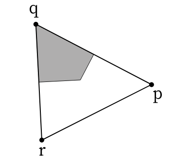

<!-- WARNING: THIS FILE WAS AUTOGENERATED! DO NOT EDIT! -->

## Mesh geometry

Using the half-edge mesh and the adjacency-like operators it defines, we
can compute all sorts of geometric quantities of interest: edge lengths,
cell areas, curvature in 3d, etc.

**Discrete exterior calculus and discrete Hodge star**

Note: triangle area, cell area, edge length, and dual edge lengths are
what’s required for [discrete exterior
calculus](https://www.cs.cmu.edu/~kmcrane/Projects/DDG/paper.pdf).

``` python
from triangulax.triangular import TriMesh
```

``` python
# load test data

mesh = TriMesh.read_obj("../test_meshes/disk.obj")
hemesh = msh.HeMesh.from_triangles(mesh.vertices.shape[0], mesh.faces)
geommesh = msh.GeomMesh(*hemesh.n_items, mesh.vertices, mesh.face_positions)

mesh_3d = TriMesh.read_obj("../test_meshes/disk.obj", dim=3)
geommesh_3d = msh.GeomMesh(*hemesh.n_items, mesh_3d.vertices, mesh_3d.face_positions)
```

    Warning: readOBJ() ignored non-comment line 3:
      o flat_tri_ecmc
    Warning: readOBJ() ignored non-comment line 3:
      o flat_tri_ecmc

### Edge lengths, areas, and normals

------------------------------------------------------------------------

<a
href="https://github.com/nikolas-claussen/triangulax/blob/main/triangulax/geometry.py#L33"
target="_blank" style="float:right; font-size:smaller">source</a>

### get_he_length

``` python

def get_he_length(
    vertices:Float[Array, 'n_vertices dim'], hemesh:HeMesh
)->Float[Array, 'n_hes']:

```

*Get lengths of half-edges (triangulation/primal edges).*

------------------------------------------------------------------------

<a
href="https://github.com/nikolas-claussen/triangulax/blob/main/triangulax/geometry.py#L77"
target="_blank" style="float:right; font-size:smaller">source</a>

### get_dihedral_angles

``` python

def get_dihedral_angles(
    vertices:Float[Array, 'n_vertices dim'], hemesh:HeMesh
)->Float[Array, 'n_hes']:

```

*Get signed dihedral angles (angle between adjacent face normals).*

Positive for convex edges, negative for concave. The sign is determined
by the edge direction

------------------------------------------------------------------------

<a
href="https://github.com/nikolas-claussen/triangulax/blob/main/triangulax/geometry.py#L72"
target="_blank" style="float:right; font-size:smaller">source</a>

### get_face_centroids

``` python

def get_face_centroids(
    vertices:Float[Array, 'n_vertices dim'], hemesh:HeMesh
)->Float[Array, 'n_faces dim']:

```

*Compute centroids (barycenters) of triangular faces.*

------------------------------------------------------------------------

<a
href="https://github.com/nikolas-claussen/triangulax/blob/main/triangulax/geometry.py#L64"
target="_blank" style="float:right; font-size:smaller">source</a>

### get_vertex_normals

``` python

def get_vertex_normals(
    vertices:Float[Array, 'n_vertices dim'], hemesh:HeMesh
)->Float[Array, 'n_vertices dim']:

```

*Compute per-vertex unit normals by area-weighted averaging over
adjacent faces.*

------------------------------------------------------------------------

<a
href="https://github.com/nikolas-claussen/triangulax/blob/main/triangulax/geometry.py#L57"
target="_blank" style="float:right; font-size:smaller">source</a>

### get_triangle_normals

``` python

def get_triangle_normals(
    vertices:Float[Array, 'n_vertices dim'], hemesh:HeMesh
)->Float[Array, 'n_faces dim']:

```

*Compute per-face unit normals. In 2d, this just returns +/-1.*

------------------------------------------------------------------------

<a
href="https://github.com/nikolas-claussen/triangulax/blob/main/triangulax/geometry.py#L52"
target="_blank" style="float:right; font-size:smaller">source</a>

### get_oriented_triangle_areas

``` python

def get_oriented_triangle_areas(
    vertices:Float[Array, 'n_vertices dim'], hemesh:HeMesh
)->Float[Array, 'n_faces dim']:

```

*Compute oriented triangle areas in a mesh. In 3d, this is a vector.*

------------------------------------------------------------------------

<a
href="https://github.com/nikolas-claussen/triangulax/blob/main/triangulax/geometry.py#L47"
target="_blank" style="float:right; font-size:smaller">source</a>

### get_barycentric_cell_areas

``` python

def get_barycentric_cell_areas(
    vertices:Float[Array, 'n_vertices dim'], hemesh:HeMesh
)->Float[Array, 'n_vertices']:

```

*Get area of barycentric dual cell around each vertex. Defined as 1/3 *
sum of adjacent triangle areas.\*

------------------------------------------------------------------------

<a
href="https://github.com/nikolas-claussen/triangulax/blob/main/triangulax/geometry.py#L42"
target="_blank" style="float:right; font-size:smaller">source</a>

### get_triangle_areas

``` python

def get_triangle_areas(
    vertices:Float[Array, 'n_vertices dim'], hemesh:HeMesh
)->Float[Array, 'n_faces']:

```

*Compute triangle areas in a mesh.*

### Total volume and surface area

------------------------------------------------------------------------

<a
href="https://github.com/nikolas-claussen/triangulax/blob/main/triangulax/geometry.py#L100"
target="_blank" style="float:right; font-size:smaller">source</a>

### get_area

``` python

def get_area(
    vertices:Float[Array, 'n_vertices dim'], hemesh:HeMesh
)->Float[Array, '']:

```

*Total surface area.*

------------------------------------------------------------------------

<a
href="https://github.com/nikolas-claussen/triangulax/blob/main/triangulax/geometry.py#L94"
target="_blank" style="float:right; font-size:smaller">source</a>

### get_volume

``` python

def get_volume(
    vertices:Float[Array, 'n_vertices dim'], hemesh:HeMesh
)->Float[Array, '']:

```

*Signed volume of a closed triangulated surface (sums tetrahedra volumes
relative to the origin).*

### Dual and Voronoi construction

------------------------------------------------------------------------

<a
href="https://github.com/nikolas-claussen/triangulax/blob/main/triangulax/geometry.py#L112"
target="_blank" style="float:right; font-size:smaller">source</a>

### set_voronoi_face_positions

``` python

def set_voronoi_face_positions(
    geommesh:GeomMesh, hemesh:HeMesh
)->GeomMesh:

```

*Set face positions of geommesh to the circumcenters of the faces
defined by hemesh.*

------------------------------------------------------------------------

<a
href="https://github.com/nikolas-claussen/triangulax/blob/main/triangulax/geometry.py#L106"
target="_blank" style="float:right; font-size:smaller">source</a>

### get_voronoi_face_positions

``` python

def get_voronoi_face_positions(
    vertices:Float[Array, 'n_vertices 2'], hemesh:HeMesh
)->Float[Array, 'n_faces 2']:

```

*Get face positions of geommesh to the circumcenters of the faces
defined by hemesh.*

------------------------------------------------------------------------

<a
href="https://github.com/nikolas-claussen/triangulax/blob/main/triangulax/geometry.py#L128"
target="_blank" style="float:right; font-size:smaller">source</a>

### get_oriented_dual_he_length

``` python

def get_oriented_dual_he_length(
    vertices:Float[Array, 'n_vertices 2'], face_positions:Float[Array, 'n_faces 2'], hemesh:HeMesh
)->Float[Array, 'n_hes']:

```

*Compute lengths of dual edges. Boundary dual edges get length 1.
Negative sign = flipped edge.*

------------------------------------------------------------------------

<a
href="https://github.com/nikolas-claussen/triangulax/blob/main/triangulax/geometry.py#L122"
target="_blank" style="float:right; font-size:smaller">source</a>

### get_dual_he_length

``` python

def get_dual_he_length(
    face_positions:Float[Array, 'n_faces dim'], hemesh:HeMesh
)->Float[Array, 'n_hes']:

```

*Get lengths of dual/cell half-edges.*

``` python
a = get_dual_he_length(mesh.face_positions, hemesh)
b = get_oriented_dual_he_length(mesh.vertices, mesh.face_positions, hemesh)

jnp.allclose(a[~hemesh.is_bdry_edge], jnp.abs(b)[~hemesh.is_bdry_edge])
```

    Array(True, dtype=bool)

``` python
# edges and dual edges should be orthogonal since we are using circumcenters

face_positions = get_voronoi_face_positions(mesh.vertices, hemesh)

edges = mesh.vertices[hemesh.orig]-mesh.vertices[hemesh.dest]
dual_edges = (face_positions[hemesh.heface]-face_positions[hemesh.heface[hemesh.twin]])

jnp.allclose(jnp.einsum('vi,vi->v', edges[~hemesh.is_bdry_edge], dual_edges[~hemesh.is_bdry_edge]), 0)
```

    Array(True, dtype=bool)

``` python
# computing the signed edge length shows that there are some "flipped" edges.

dual_length = get_oriented_dual_he_length(mesh.vertices, face_positions, hemesh)
jnp.where((dual_length < -0.0) & ~hemesh.is_bdry_edge )[0]
```

    Array([  9, 185, 191, 335, 363, 539, 545, 689], dtype=int64)

### Corner angles, Gaussian curvature, cotangent weights, and Voronoi edge lengths/areas

------------------------------------------------------------------------

<a
href="https://github.com/nikolas-claussen/triangulax/blob/main/triangulax/geometry.py#L179"
target="_blank" style="float:right; font-size:smaller">source</a>

### get_voronoi_edge_areas

``` python

def get_voronoi_edge_areas(
    vertices:Float[Array, 'n_vertices dim'], hemesh:HeMesh
)->Float[Array, 'n_hes']:

```

*Voronoi “area” for an edge: `dual_length * primal_length / 4`.*

Summing over all edges adjacent to a vertex gives the Voronoi cell area.
Computed from cotangent weights. Accurate in any dimension.

------------------------------------------------------------------------

<a
href="https://github.com/nikolas-claussen/triangulax/blob/main/triangulax/geometry.py#L173"
target="_blank" style="float:right; font-size:smaller">source</a>

### get_voronoi_edge_lengths

``` python

def get_voronoi_edge_lengths(
    vertices:Float[Array, 'n_vertices dim'], hemesh:HeMesh
)->Float[Array, 'n_hes']:

```

*Voronoi dual edge lengths computed from cotangent weights. Accurate in
any dimension.*

------------------------------------------------------------------------

<a
href="https://github.com/nikolas-claussen/triangulax/blob/main/triangulax/geometry.py#L165"
target="_blank" style="float:right; font-size:smaller">source</a>

### get_cotan_weights_per_edge

``` python

def get_cotan_weights_per_edge(
    vertices:Float[Array, 'n_vertices dim'], hemesh:HeMesh
)->Float[Array, 'n_hes']:

```

*Average of cotangent of angles opposite to edge.*

------------------------------------------------------------------------

<a
href="https://github.com/nikolas-claussen/triangulax/blob/main/triangulax/geometry.py#L157"
target="_blank" style="float:right; font-size:smaller">source</a>

### get_cotan_weights_per_he

``` python

def get_cotan_weights_per_he(
    vertices:Float[Array, 'n_vertices dim'], hemesh:HeMesh
)->Float[Array, 'n_hes']:

```

*Cotangent of angle opposite to half-edge.*

------------------------------------------------------------------------

<a
href="https://github.com/nikolas-claussen/triangulax/blob/main/triangulax/geometry.py#L150"
target="_blank" style="float:right; font-size:smaller">source</a>

### get_angle_sum

``` python

def get_angle_sum(
    vertices:Float[Array, 'n_vertices dim'], hemesh:HeMesh
)->Float[Array, 'n_vertices']:

```

*Angle sum around vertices. `2*pi - angle_sum` measures Gaussian
curvature.*

------------------------------------------------------------------------

<a
href="https://github.com/nikolas-claussen/triangulax/blob/main/triangulax/geometry.py#L142"
target="_blank" style="float:right; font-size:smaller">source</a>

### get_corner_angles

``` python

def get_corner_angles(
    vertices:Float[Array, 'n_vertices dim'], hemesh:HeMesh
)->Float[Array, 'n_hes']:

```

*Get angles in mesh corners (opposite to half-edges).*

``` python
angles = get_corner_angles(mesh.vertices, hemesh)

np.allclose(get_angle_sum(mesh.vertices, hemesh)[~hemesh.is_bdry], 2*jnp.pi) # mesh is not curved
```

    True

``` python
jnp.allclose(1/jnp.tan(angles), get_cotan_weights_per_he(mesh.vertices, hemesh))
```

    Array(True, dtype=bool)

``` python
# we can either compute the Voronoi-length of a dual edge directly, or from the face positions
voronoi_edge_lengths = get_voronoi_edge_lengths(mesh.vertices, hemesh)
dual_edge_length = get_oriented_dual_he_length(mesh.vertices, mesh.face_positions, hemesh)
```

``` python
jnp.allclose(voronoi_edge_lengths[~hemesh.is_bdry_edge], dual_edge_length[~hemesh.is_bdry_edge])
```

    Array(True, dtype=bool)

### Cell areas, perimeters, etc via corners

To compute, for instance, the cell area using the shoelace formula, you
need to iterate around the faces adjacent to a vertex. This is not
straightforward to vectorize because the number of adjacent faces per
vertex can vary (there can be 5-, 6-, 7-sided cells etc.). One way to
solve this is a scheme in which the lists of adjacent faces are “padded”
in some manner, so that they are all the same length. This is
cumbersome. Instead, let us split all “cell-based” quantities into
contributions from “corners”, i.e., half-edges, like this:


Source:
[CGAL](https://doc.cgal.org/latest/Weights/group__PkgWeightsRefVoronoiRegionWeights.html)

To compute the total area, we can sum over all half-edges (*r*, *p*)
opposite to a vertex *q*.

Via this approach, one can also compute cell perimeter, etc.

------------------------------------------------------------------------

<a
href="https://github.com/nikolas-claussen/triangulax/blob/main/triangulax/geometry.py#L221"
target="_blank" style="float:right; font-size:smaller">source</a>

### get_gaussian_curvature

``` python

def get_gaussian_curvature(
    vertices:Float[Array, 'n_vertices dim'], hemesh:HeMesh
)->Float[Array, 'n_vertices']:

```

*Discrete Gaussian curvature via the angle defect: `(2π - Σθ_i) / A_i`.*

Uses barycentric dual cell areas.

------------------------------------------------------------------------

<a
href="https://github.com/nikolas-claussen/triangulax/blob/main/triangulax/geometry.py#L214"
target="_blank" style="float:right; font-size:smaller">source</a>

### get_voronoi_perimeters

``` python

def get_voronoi_perimeters(
    vertices:Float[Array, 'n_vertices dim'], hemesh:HeMesh
)->Float[Array, 'n_vertices']:

```

*Compute Voronoi cell perimeter for each vertex by summing dual edge
lengths.*

------------------------------------------------------------------------

<a
href="https://github.com/nikolas-claussen/triangulax/blob/main/triangulax/geometry.py#L207"
target="_blank" style="float:right; font-size:smaller">source</a>

### get_voronoi_areas

``` python

def get_voronoi_areas(
    vertices:Float[Array, 'n_vertices dim'], hemesh:HeMesh
)->Float[Array, 'n_vertices']:

```

*Compute Voronoi cell area for each vertex by summing edge areas.*

------------------------------------------------------------------------

<a
href="https://github.com/nikolas-claussen/triangulax/blob/main/triangulax/geometry.py#L189"
target="_blank" style="float:right; font-size:smaller">source</a>

### get_cell_areas_traversal

``` python

def get_cell_areas_traversal(
    geommesh:GeomMesh, hemesh:HeMesh
)->Float[Array, 'n_vertices']:

```

*Compute areas of cells by mesh traversal (don’t use for simulation,
inefficient).*

Boundary vertices get area 0. The sign flip corrects for the winding
order of `iterate_around_vertex` relative to
`[`get_polygon_area`](https://nikolas-claussen.github.io/triangulax/src/trigonometry.html#get_polygon_area)`.

``` python
# for comparison, compute the areas by mesh traversal

cell_areas = get_voronoi_areas(geommesh.vertices, hemesh)
cell_areas = cell_areas.at[hemesh.is_bdry].set(0)

cell_areas_iterative = get_cell_areas_traversal(geommesh, hemesh)

print("Voronoi area max error:", jnp.abs(cell_areas_iterative-cell_areas).max())

# Voronoi perimeters
perimeters = get_voronoi_perimeters(mesh.vertices, hemesh)
print("Voronoi perimeters (mean):", perimeters[~hemesh.is_bdry].mean())

# Gaussian curvature should be 0 for a flat disk (interior vertices)
K = get_gaussian_curvature(mesh.vertices, hemesh)
print("Gaussian curvature (max interior):", jnp.abs(K[~hemesh.is_bdry]).max())

# face centroids
centroids = get_face_centroids(mesh.vertices, hemesh)
print("Face centroids shape:", centroids.shape)
```

    Voronoi area max error: 4.85722573273506e-17
    Voronoi perimeters (mean): 0.6346395879903053
    Gaussian curvature (max interior): 6.078535117627845e-14
    Face centroids shape: (224, 2)

### Mean curvature

Two methods are provided for computing pointwise, per-vertex mean
curvature.

**Steiner (dihedral angle) formula:**
$$H_i = \frac{1}{4a_i} \sum\_{j\sim i} \ell\_{ij} \theta\_{ij} $$
where *θ*<sub>*i**j*</sub> are the dihedral angles between adjacent
triangles, and *a*<sub>*i*</sub> is the barycentric cell area.

**Cotangent Laplacian formula:** using *Δ***x** = 2*H***n**,
$$H_i = -\frac{\mathbf{n}\_i \cdot (\Delta\mathbf{x})\_i}{2 A_i^{\mathrm{vor}}}$$
where *A*<sub>*i*</sub><sup>vor</sup> is the Voronoi cell area and *Δ*
is the cotangent Laplacian.

------------------------------------------------------------------------

<a
href="https://github.com/nikolas-claussen/triangulax/blob/main/triangulax/geometry.py#L264"
target="_blank" style="float:right; font-size:smaller">source</a>

### get_mean_curvature_laplace

``` python

def get_mean_curvature_laplace(
    vertices:Float[Array, 'n_vertices dim'], # Vertex positions.
    hemesh:HeMesh, # Half-edge mesh.
    normalize:bool=True, # Whether to normalize by the Voronoi cell area. If False, returns the integrated mean curvature.
)->Float[Array, 'n_vertices']: # Per-vertex mean curvature.

```

*Compute mean curvature from the cotangent Laplacian: `Δx = 2Hn`.*

------------------------------------------------------------------------

<a
href="https://github.com/nikolas-claussen/triangulax/blob/main/triangulax/geometry.py#L232"
target="_blank" style="float:right; font-size:smaller">source</a>

### get_mean_curvature_dihedral

``` python

def get_mean_curvature_dihedral(
    vertices:Float[Array, 'n_vertices dim'], # Vertex positions.
    hemesh:HeMesh, # Half-edge mesh.
    normalize:bool=True, # Whether to normalize by the barycentric cell area. If False, returns the integrated mean curvature.
)->Float[Array, 'n_vertices']: # Per-vertex mean curvature.

```

*Compute mean curvature of triangulated mesh using Steiner
approximation:* H_i = 1/(4 A_i) \* sum_j \* theta_ij \* l_ij where
theta_ij is the dihedral angle between faces adjacent to edge ij, l_ij
is the length of edge ij, and A_i is the barycentric dual cell area
around vertex i.

``` python
# Test mean curvature on sphere and torus against libigl

# --- Unit sphere ---
v_sphere, f_sphere = igl.read_triangle_mesh("../test_meshes/sphere_fine.obj")
v_sphere = v_sphere / np.linalg.norm(v_sphere, axis=-1, keepdims=True)  # project to unit sphere
hemesh_sphere = msh.HeMesh.from_triangles(v_sphere.shape[0], f_sphere)
v_sphere_jax = jnp.array(v_sphere)

H_dihedral_sphere = get_mean_curvature_dihedral(v_sphere_jax, hemesh_sphere)
H_laplace_sphere = get_mean_curvature_laplace(v_sphere_jax, hemesh_sphere)

_, _, k1_s, k2_s, _ = igl.principal_curvature(v_sphere.astype(np.float64), f_sphere)
H_igl_sphere = (k1_s + k2_s) / 2

print("=== Unit Sphere (H_true = 1.0) ===")
print(f"  igl:      mean={np.mean(np.abs(H_igl_sphere)):.4f},  std={np.std(H_igl_sphere):.4f}")
print(f"  dihedral: mean={float(jnp.mean(jnp.abs(H_dihedral_sphere))):.4f}, std={float(jnp.std(H_dihedral_sphere)):.4f}")
print(f"  laplace:  mean={float(jnp.mean(jnp.abs(H_laplace_sphere))):.4f},  std={float(jnp.std(H_laplace_sphere)):.4f}")
```

    === Unit Sphere (H_true = 1.0) ===
      igl:      mean=1.1134,  std=0.0033
      dihedral: mean=1.0044, std=0.0196
      laplace:  mean=1.0000,  std=0.0000

    Warning: readOBJ() ignored non-comment line 4:
      o Icosphere

``` python
# --- Torus ---
v_torus, f_torus = igl.read_triangle_mesh("../test_meshes/torus.obj")
hemesh_torus = msh.HeMesh.from_triangles(v_torus.shape[0], f_torus)
v_torus_jax = jnp.array(v_torus)

H_dihedral_torus = get_mean_curvature_dihedral(v_torus_jax, hemesh_torus)
H_laplace_torus = get_mean_curvature_laplace(v_torus_jax, hemesh_torus)

_, _, k1_t, k2_t, _ = igl.principal_curvature(v_torus.astype(np.float64), f_torus)
H_igl_torus = (k1_t + k2_t) / 2

print("\n=== Torus ===")
print(f"  igl:      mean={np.mean(np.abs(H_igl_torus)):.4f},  range=[{H_igl_torus.min():.4f}, {H_igl_torus.max():.4f}]")
print(f"  dihedral: mean={float(jnp.mean(jnp.abs(H_dihedral_torus))):.4f},  range=[{float(H_dihedral_torus.min()):.4f}, {float(H_dihedral_torus.max()):.4f}]")
print(f"  laplace:  mean={float(jnp.mean(jnp.abs(H_laplace_torus))):.4f},  range=[{float(H_laplace_torus.min()):.4f}, {float(H_laplace_torus.max()):.4f}]")

# Correlation check
corr_dihedral = float(jnp.corrcoef(jnp.array(H_igl_torus), H_dihedral_torus)[0, 1])
corr_laplace = float(jnp.corrcoef(jnp.array(H_igl_torus), H_laplace_torus)[0, 1])
print(f"\n  Correlation with igl:  dihedral={corr_dihedral:.4f},  laplace={corr_laplace:.4f}")


# Note: the IGL quadratic fitting method does indeed give a different result than the Laplacian and dihedral methods (not a bug).
# The difference between Laplace and dihedral methods is mostly due to the area normalization (voronoi vs barycentric).
```


    === Torus ===
      igl:      mean=2.5613,  range=[1.7344, 4.0399]
      dihedral: mean=2.0051,  range=[1.0084, 3.6089]
      laplace:  mean=1.9372,  range=[1.3435, 2.4066]

      Correlation with igl:  dihedral=0.4923,  laplace=0.6321

    Warning: readOBJ() ignored non-comment line 3:
      o Torus

### Tangent spaces and parallel transport

This section defines tools to work with the tangent space of a surface,
namely:

1.  Local orthonormal bases in 3d coordinate-space for the tangent space
    at each vertex and face.

2.  Parallel transport, which in the discrete setting means the rotation
    matrices that relate the local bases at adjacent triangles or
    vertices.

Based on [Geometry
Central](https://geometry-central.net/surface/geometry/quantities/#tangent-vectors-and-transport).

``` python
# load a 3D mesh for testing tangent space functions

sphere = TriMesh.read_obj("../test_meshes/sphere.obj", dim=3)
hemesh_s = msh.HeMesh.from_triangles(sphere.vertices.shape[0], sphere.faces)
geommesh_s = msh.GeomMesh(*hemesh_s.n_items, sphere.vertices, sphere.face_positions)
```

    Warning: readOBJ() ignored non-comment line 3:
      o Icosphere

------------------------------------------------------------------------

<a
href="https://github.com/nikolas-claussen/triangulax/blob/main/triangulax/geometry.py#L294"
target="_blank" style="float:right; font-size:smaller">source</a>

### get_corner_scaled_angles

``` python

def get_corner_scaled_angles(
    vertices:Float[Array, 'n_vertices dim'], # Vertex positions.
    hemesh:HeMesh, # Half-edge mesh.
)->Float[Array, 'n_hes']: # Rescaled corner angles per halfedge.

```

*Corner angles rescaled so they sum to 2π at interior vertices and π at
boundary vertices.*

Uses the same indexing convention as
[`get_corner_angles`](https://nikolas-claussen.github.io/triangulax/src/geometric_quantities.html#get_corner_angles):
scaled_angles\[he\] is the rescaled angle at vertex dest\[nxt\[he\]\]
(the vertex opposite halfedge he).

``` python
# test: scaled angles should sum to 2π at interior vertices
scaled = get_corner_scaled_angles(geommesh_s.vertices, hemesh_s)
scaled_sums = adj.sum_he_to_vertex_opposite(hemesh_s, scaled)
assert jnp.allclose(scaled_sums[~hemesh_s.is_bdry], 2*jnp.pi, atol=1e-10)

# for disk mesh (has boundary)
scaled_disk = get_corner_scaled_angles(geommesh.vertices, hemesh)
scaled_sums_disk = adj.sum_he_to_vertex_opposite(hemesh, scaled_disk)
assert jnp.allclose(scaled_sums_disk[hemesh.is_bdry], jnp.pi, atol=1e-10)
```

------------------------------------------------------------------------

<a
href="https://github.com/nikolas-claussen/triangulax/blob/main/triangulax/geometry.py#L324"
target="_blank" style="float:right; font-size:smaller">source</a>

### get_face_tangent_basis

``` python

def get_face_tangent_basis(
    vertices:Float[Array, 'n_vertices dim'], # Vertex positions in 3D.
    hemesh:HeMesh, # Half-edge mesh.
)->Float[Array, 'n_faces 2 dim']: # Per-face tangent basis: result[f, 0] = basisX, result[f, 1] = basisY.

```

*Orthonormal tangent basis (basisX, basisY) in 3D world coordinates per
face.*

Convention: basisX is aligned with the face’s incident halfedge
projected onto the face tangent plane. basisY = cross(basisX,
face_normal).

Note: 3D meshes only (uses cross product).

``` python
# test: face tangent basis orthonormality
face_basis = get_face_tangent_basis(geommesh_s.vertices, hemesh_s)
bx, by = face_basis[:, 0], face_basis[:, 1]
face_normals = get_triangle_normals(geommesh_s.vertices, hemesh_s)

# bx · by ≈ 0, |bx| ≈ 1, |by| ≈ 1
print("Max bx·by:", jnp.abs(jax.vmap(jnp.dot)(bx, by)).max())
assert jnp.allclose(jax.vmap(jnp.dot)(bx, by), 0., atol=1e-10)
assert jnp.allclose(jnp.linalg.norm(bx, axis=-1), 1., atol=1e-10)
assert jnp.allclose(jnp.linalg.norm(by, axis=-1), 1., atol=1e-10)

# bx and by should be orthogonal to face normal
print("Max bx·n:", jnp.abs(jax.vmap(jnp.dot)(bx, face_normals)).max())
assert jnp.allclose(jax.vmap(jnp.dot)(bx, face_normals), 0., atol=1e-10)
assert jnp.allclose(jax.vmap(jnp.dot)(by, face_normals), 0., atol=1e-10)
```

    Max bx·by: 9.71445146547012e-17
    Max bx·n: 5.93629416659658e-17

------------------------------------------------------------------------

<a
href="https://github.com/nikolas-claussen/triangulax/blob/main/triangulax/geometry.py#L355"
target="_blank" style="float:right; font-size:smaller">source</a>

### get_vertex_tangent_basis

``` python

def get_vertex_tangent_basis(
    vertices:Float[Array, 'n_vertices dim'], # Vertex positions in 3D.
    hemesh:HeMesh, # Half-edge mesh.
)->Float[Array, 'n_vertices 2 dim']: # Per-vertex tangent basis: result[v, 0] = basisX, result[v, 1] = basisY.

```

*Orthonormal tangent basis (basisX, basisY) in 3D world coordinates per
vertex.*

Convention: basisX is aligned with the vertex’ incident halfedge
projected onto the vertex tangent plane. basisY = cross(basisX,
vertex_normal).

Note: 3D meshes only (uses cross product).

``` python
# test: vertex tangent basis orthonormality
vtx_basis = get_vertex_tangent_basis(geommesh_s.vertices, hemesh_s)
bx_v, by_v = vtx_basis[:, 0], vtx_basis[:, 1]
vtx_normals = get_vertex_normals(geommesh_s.vertices, hemesh_s)

print("Max bx·by:", jnp.abs(jax.vmap(jnp.dot)(bx_v, by_v)).max())
assert jnp.allclose(jax.vmap(jnp.dot)(bx_v, by_v), 0., atol=1e-8)
assert jnp.allclose(jnp.linalg.norm(bx_v, axis=-1), 1., atol=1e-8)
assert jnp.allclose(jnp.linalg.norm(by_v, axis=-1), 1., atol=1e-8)

# orthogonal to vertex normal
print("Max bx·n:", jnp.abs(jax.vmap(jnp.dot)(bx_v, vtx_normals)).max())
assert jnp.allclose(jax.vmap(jnp.dot)(bx_v, vtx_normals), 0., atol=1e-8)
assert jnp.allclose(jax.vmap(jnp.dot)(by_v, vtx_normals), 0., atol=1e-8)
```

    Max bx·by: 7.063619505390424e-17
    Max bx·n: 1.6653345369377348e-16

#### Parallel transport

To define parallel transport across an edge (between the tangent spaces
of two adjacent triangles) or along an edge (between the tangent spaces
of two adjacent vertices), we proceed as follows:

1.  Find the coordinates of the shared edge vector
    **e**<sub>*i**j*</sub> = **v**<sub>*i*</sub> − **v**<sub>*j*</sub>
    in the two local orthonormal bases, (*x*, *y*) and (*x*′, *y*′)
2.  Compute the (minimal) rotation matrix that maps (*x*, *y*) to
    (*x*′, *y*′).

This defines two angles
*ϕ*<sub>*i**j*</sub><sup>*v*</sup>, *ϕ*<sub>*i**j*</sub><sup>*f*</sup>
for each half-edge, the discrete parallel transport map along (“v”) or
across (“f”) the half edge.

------------------------------------------------------------------------

<a
href="https://github.com/nikolas-claussen/triangulax/blob/main/triangulax/geometry.py#L384"
target="_blank" style="float:right; font-size:smaller">source</a>

### get_transport_across_halfedge

``` python

def get_transport_across_halfedge(
    vertices:Float[Array, 'n_vertices dim'], # Vertex positions.
    hemesh:HeMesh, # Half-edge mesh.
)->Float[Array, 'n_hes']: # Transport angle per halfedge (radians). NaN for boundary halfedges.

```

*Rotation angle to transport a tangent vector from one face to the
adjacent face across a halfedge.*

Applying this rotation to a vector in the frame of heface\[he\] gives
the same vector in the frame of heface\[twin\[he\]\]. For boundary half
edges, this is set to 0 (no transport since there’s only one face).

``` python
transports = get_transport_across_halfedge(geommesh_s.vertices, hemesh_s)
jnp.allclose(transports - transports[hemesh_s.twin], 0)
```

    Array(True, dtype=bool)

------------------------------------------------------------------------

<a
href="https://github.com/nikolas-claussen/triangulax/blob/main/triangulax/geometry.py#L418"
target="_blank" style="float:right; font-size:smaller">source</a>

### get_transport_along_halfedge

``` python

def get_transport_along_halfedge(
    vertices:Float[Array, 'n_vertices dim'], # Vertex positions.
    hemesh:HeMesh, # Half-edge mesh.
)->Float[Array, 'n_hes']: # Transport angle per halfedge (radians). NaN for boundary halfedges.

```

*Rotation angle to transport a tangent vector from one vertex to the
next vertex along a halfedge.*

Applying this rotation to a vector in the frame of a vertex gives the
same vector in the frame of the next vertex along the halfedge

``` python
transports = get_transport_along_halfedge(geommesh_s.vertices, hemesh_s)
jnp.allclose(transports - transports[hemesh_s.twin], 0)
```
