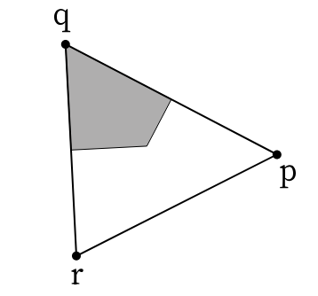

<!-- WARNING: THIS FILE WAS AUTOGENERATED! DO NOT EDIT! -->

## `geometry`: Mesh geometry

Using the half-edge mesh and the adjacency-like operators it defines,
one can compute all sorts of geometric quantities of interest: edge
lengths, cell areas, curvature in 3d, etc.

**Discrete exterior calculus and discrete Hodge star**

Triangle areas, cell areas, edge lengths, and dual edge lengths can be
used to define the discrete version of the Hodge star operator used in
discrete exterior calculus (DEC). See [K.
Crane](https://www.cs.cmu.edu/~kmcrane/Projects/DDG/paper.pdf)’s lecture
notes for an introduction to DEC.

``` python
# load test data

mesh = TriMesh.read_obj("../test_meshes/disk.obj", dim=2)
hemesh = msh.HeMesh.from_triangles(mesh.vertices.shape[0], mesh.faces)
geommesh = msh.GeomMesh(mesh.vertices, mesh.face_positions)

mesh_3d = TriMesh.read_obj("../test_meshes/disk.obj", dim=3)
geommesh_3d = msh.GeomMesh(mesh_3d.vertices, mesh_3d.face_positions)
```

    Warning: readOBJ() ignored non-comment line 3:
      o flat_tri_ecmc
    Warning: readOBJ() ignored non-comment line 3:
      o flat_tri_ecmc

### Edge lengths, areas, and normals

------------------------------------------------------------------------

<a
href="https://github.com/nikolas-claussen/triangulax/blob/main/triangulax/geometry.py#L32"
target="_blank" style="float:right; font-size:smaller">source</a>

### get_he_length

``` python

def get_he_length(
    vertices:Float[Array, 'n_vertices dim'], hemesh:HeMesh
)->Float[Array, 'n_hes']:

```

*Get lengths of half-edges (triangulation/primal edges).*

------------------------------------------------------------------------

<a
href="https://github.com/nikolas-claussen/triangulax/blob/main/triangulax/geometry.py#L38"
target="_blank" style="float:right; font-size:smaller">source</a>

### get_face_centroids

``` python

def get_face_centroids(
    vertices:Float[Array, 'n_vertices dim'], hemesh:HeMesh
)->Float[Array, 'n_faces dim']:

```

*Compute centroids (barycenters) of triangular faces.*

------------------------------------------------------------------------

<a
href="https://github.com/nikolas-claussen/triangulax/blob/main/triangulax/geometry.py#L61"
target="_blank" style="float:right; font-size:smaller">source</a>

### get_barycentric_cell_areas

``` python

def get_barycentric_cell_areas(
    vertices:Float[Array, 'n_vertices dim'], hemesh:HeMesh
)->Float[Array, 'n_vertices']:

```

*Get area of barycentric dual cell around each vertex. Defined as 1/3 *
sum of adjacent triangle areas.\*

------------------------------------------------------------------------

<a
href="https://github.com/nikolas-claussen/triangulax/blob/main/triangulax/geometry.py#L50"
target="_blank" style="float:right; font-size:smaller">source</a>

### get_oriented_triangle_areas

``` python

def get_oriented_triangle_areas(
    vertices:Float[Array, 'n_vertices dim'], hemesh:HeMesh
)->Float[Array, '...']:

```

*Compute oriented (signed) triangle areas in a mesh.*

The shape of the result depends on the embedding dimension. In 3d it is
the area-weighted face normal, of shape `(n_faces, 3)`. In 2d it is a
*scalar* signed area per face, of shape `(n_faces,)`, positive for
counter-clockwise triangles.

------------------------------------------------------------------------

<a
href="https://github.com/nikolas-claussen/triangulax/blob/main/triangulax/geometry.py#L45"
target="_blank" style="float:right; font-size:smaller">source</a>

### get_triangle_areas

``` python

def get_triangle_areas(
    vertices:Float[Array, 'n_vertices dim'], hemesh:HeMesh
)->Float[Array, 'n_faces']:

```

*Compute triangle areas in a mesh.*

------------------------------------------------------------------------

<a
href="https://github.com/nikolas-claussen/triangulax/blob/main/triangulax/geometry.py#L114"
target="_blank" style="float:right; font-size:smaller">source</a>

### get_edge_normals

``` python

def get_edge_normals(
    vertices:Float[Array, 'n_vertices 3'], # Vertex positions.
    hemesh:HeMesh, # Half-edge mesh.
)->Float[Array, 'n_hes 3']: # Unit normal per half-edge.

```

*Unit mid-edge normals: normalized average of the two adjacent face
normals.*

For boundary edges, the normal of the single adjacent face is used.
Indexed per half-edge; twin half-edges carry identical normals.

Note: 3d meshes only.

------------------------------------------------------------------------

<a
href="https://github.com/nikolas-claussen/triangulax/blob/main/triangulax/geometry.py#L103"
target="_blank" style="float:right; font-size:smaller">source</a>

### get_vertex_normals

``` python

def get_vertex_normals(
    vertices:Float[Array, 'n_vertices 3'], hemesh:HeMesh
)->Float[Array, 'n_vertices 3']:

```

*Compute per-vertex unit normals by area-weighted averaging over
adjacent faces.*

Note: 3d meshes only.

------------------------------------------------------------------------

<a
href="https://github.com/nikolas-claussen/triangulax/blob/main/triangulax/geometry.py#L78"
target="_blank" style="float:right; font-size:smaller">source</a>

### get_triangle_orientations

``` python

def get_triangle_orientations(
    vertices:Float[Array, 'n_vertices 2'], # Vertex positions in 2d.
    hemesh:HeMesh, # Half-edge mesh.
)->Float[Array, 'n_faces']: # Orientation (+1/-1/0) per face.

```

*Compute per-face orientation of a 2d mesh: +1, -1, or 0.*

Returns +1 for counter-clockwise (positively oriented) triangles and -1
for clockwise (inverted) triangles. Exactly degenerate, zero-area
triangles give 0. This is the 2d analogue of
[`get_triangle_normals`](https://nikolas-claussen.github.io/triangulax/src/geometric_quantities.html#get_triangle_normals),
and is useful to detect inverted triangles e.g. during mesh
optimization.

Note: 2d meshes only.

------------------------------------------------------------------------

<a
href="https://github.com/nikolas-claussen/triangulax/blob/main/triangulax/geometry.py#L67"
target="_blank" style="float:right; font-size:smaller">source</a>

### get_triangle_normals

``` python

def get_triangle_normals(
    vertices:Float[Array, 'n_vertices 3'], hemesh:HeMesh
)->Float[Array, 'n_faces 3']:

```

*Compute per-face unit normals.*

Note: 3d meshes only. For a 2d mesh, the analogous quantity is the
triangle orientation, see
[`get_triangle_orientations`](https://nikolas-claussen.github.io/triangulax/src/geometric_quantities.html#get_triangle_orientations).

------------------------------------------------------------------------

<a
href="https://github.com/nikolas-claussen/triangulax/blob/main/triangulax/geometry.py#L145"
target="_blank" style="float:right; font-size:smaller">source</a>

### get_dihedral_angles

``` python

def get_dihedral_angles(
    vertices:Float[Array, 'n_vertices 3'], # Vertex positions.
    hemesh:HeMesh, # Half-edge mesh.
)->Float[Array, 'n_hes']: # Signed dihedral angle per half-edge (radians). 0 on boundary edges.

```

*Get signed dihedral angles (angle between adjacent face normals).*

Positive for convex edges, negative for concave. The sign is determined
by the edge direction. Boundary edges have only one adjacent face, so no
dihedral angle is defined there and 0 is returned.

Note: 3d meshes only.

### Total volume and surface area

------------------------------------------------------------------------

<a
href="https://github.com/nikolas-claussen/triangulax/blob/main/triangulax/geometry.py#L188"
target="_blank" style="float:right; font-size:smaller">source</a>

### get_area

``` python

def get_area(
    vertices:Float[Array, 'n_vertices dim'], hemesh:HeMesh
)->Float[Array, '']:

```

*Total surface area.*

------------------------------------------------------------------------

<a
href="https://github.com/nikolas-claussen/triangulax/blob/main/triangulax/geometry.py#L178"
target="_blank" style="float:right; font-size:smaller">source</a>

### get_volume

``` python

def get_volume(
    vertices:Float[Array, 'n_vertices dim'], hemesh:HeMesh, origin:Union=0
)->Float[Array, '']:

```

*Signed volume of a closed triangulated surface (sums tetrahedra volumes
relative to `origin`).*

The result is a mathematically meaningful volume only for a closed,
consistently oriented mesh.

### Dual edge lengths and cell areas (Voronoi construction)

The Voronoi dual of a triangular mesh is a cell tiling with one
polygonal cell for every triangle vertex, one polygon edge per triangle
edge, and one polygon corner per triangle. The corners of the Voronoi
polygon are the triangles’ circumcenters. Therefore, the triangle and
polygon edges are orthogonal. The Voronoi construction works in any
dimension (since it is triangle-intrinsic).

Voronoi duals are important in discrete geometry and numerical
simulations. For example, the Voronoi cell areas *a*<sub>*i*</sub> are a
way to assign areas to each vertex to discretize the area integral over
a surface into a weighted sum over triangulation vertices,
∫*f**d**A* → ∑<sub>*i*</sub>*f*<sub>*i*</sub>*a*<sub>*i*</sub>

------------------------------------------------------------------------

<a
href="https://github.com/nikolas-claussen/triangulax/blob/main/triangulax/geometry.py#L200"
target="_blank" style="float:right; font-size:smaller">source</a>

### set_voronoi_face_positions

``` python

def set_voronoi_face_positions(
    geommesh:GeomMesh, hemesh:HeMesh
)->GeomMesh:

```

*Set face positions of geommesh to the circumcenters of the faces
defined by hemesh.*

------------------------------------------------------------------------

<a
href="https://github.com/nikolas-claussen/triangulax/blob/main/triangulax/geometry.py#L194"
target="_blank" style="float:right; font-size:smaller">source</a>

### get_voronoi_face_positions

``` python

def get_voronoi_face_positions(
    vertices:Float[Array, 'n_vertices dim'], hemesh:HeMesh
)->Float[Array, 'n_faces dim']:

```

*Get face positions of geommesh to the circumcenters of the faces
defined by hemesh.*

------------------------------------------------------------------------

<a
href="https://github.com/nikolas-claussen/triangulax/blob/main/triangulax/geometry.py#L221"
target="_blank" style="float:right; font-size:smaller">source</a>

### get_oriented_dual_he_length

``` python

def get_oriented_dual_he_length(
    vertices:Float[Array, 'n_vertices 2'], face_positions:Float[Array, 'n_faces 2'], hemesh:HeMesh
)->Float[Array, 'n_hes']:

```

*Compute lengths of dual edges. Boundary dual edges get length 1.
Negative sign = flipped edge.*

------------------------------------------------------------------------

<a
href="https://github.com/nikolas-claussen/triangulax/blob/main/triangulax/geometry.py#L210"
target="_blank" style="float:right; font-size:smaller">source</a>

### get_dual_he_length

``` python

def get_dual_he_length(
    face_positions:Float[Array, 'n_faces dim'], hemesh:HeMesh
)->Float[Array, 'n_hes']:

```

*Get lengths of dual/cell half-edges. Boundary edges get length 0.*

Note the sibling
[`get_oriented_dual_he_length`](https://nikolas-claussen.github.io/triangulax/src/geometric_quantities.html#get_oriented_dual_he_length)
uses 1 (not 0) for boundary edges, because a signed length of 0 is not
distinguishable from a degenerate dual edge there.

``` python
a = get_dual_he_length(mesh.face_positions, hemesh)
b = get_oriented_dual_he_length(mesh.vertices, mesh.face_positions, hemesh)

jnp.allclose(a[~hemesh.is_bdry_edge], jnp.abs(b)[~hemesh.is_bdry_edge])
```

    Array(True, dtype=bool)

``` python
# edges and dual edges should be orthogonal since we are using circumcenters

face_positions = get_voronoi_face_positions(mesh.vertices, hemesh)

edges = mesh.vertices[hemesh.orig]-mesh.vertices[hemesh.dest]
dual_edges = (face_positions[hemesh.heface]-face_positions[hemesh.heface[hemesh.twin]])

jnp.allclose(jnp.einsum('vi,vi->v', edges[~hemesh.is_bdry_edge], dual_edges[~hemesh.is_bdry_edge]), 0)
```

    Array(True, dtype=bool)

``` python
# computing the signed edge length shows that there are some "flipped" edges.

dual_length = get_oriented_dual_he_length(mesh.vertices, face_positions, hemesh)
jnp.where((dual_length < -0.0) & ~hemesh.is_bdry_edge )[0]
```

    Array([  9, 185, 191, 335, 363, 539, 545, 689], dtype=int64)

### Corner angles, Gaussian curvature, cotangent weights, and Voronoi edge lengths/areas

------------------------------------------------------------------------

<a
href="https://github.com/nikolas-claussen/triangulax/blob/main/triangulax/geometry.py#L274"
target="_blank" style="float:right; font-size:smaller">source</a>

### get_voronoi_corner_areas

``` python

def get_voronoi_corner_areas(
    vertices:Float[Array, 'n_vertices dim'], hemesh:HeMesh
)->Float[Array, 'n_hes']:

```

*Per-triangle Voronoi area of vertex x = dest\[he\]:* A_vor(x, T) =
(||e(he)||^2 \* cot(opp_he) + ||e(nxt)||^2 \* cot(opp_nxt)) / 8

Summing over all half-edges incident to a vertex gives the Voronoi cell
area. Computed from cotangent weights. Accurate in any dimension.

------------------------------------------------------------------------

<a
href="https://github.com/nikolas-claussen/triangulax/blob/main/triangulax/geometry.py#L268"
target="_blank" style="float:right; font-size:smaller">source</a>

### get_voronoi_edge_lengths

``` python

def get_voronoi_edge_lengths(
    vertices:Float[Array, 'n_vertices dim'], hemesh:HeMesh
)->Float[Array, 'n_hes']:

```

*Voronoi dual edge lengths computed from cotangent weights. Accurate in
any dimension.*

------------------------------------------------------------------------

<a
href="https://github.com/nikolas-claussen/triangulax/blob/main/triangulax/geometry.py#L260"
target="_blank" style="float:right; font-size:smaller">source</a>

### get_cotan_weights_per_edge

``` python

def get_cotan_weights_per_edge(
    vertices:Float[Array, 'n_vertices dim'], hemesh:HeMesh
)->Float[Array, 'n_hes']:

```

*Average of cotangent of angles opposite to edge.*

------------------------------------------------------------------------

<a
href="https://github.com/nikolas-claussen/triangulax/blob/main/triangulax/geometry.py#L252"
target="_blank" style="float:right; font-size:smaller">source</a>

### get_cotan_weights_per_he

``` python

def get_cotan_weights_per_he(
    vertices:Float[Array, 'n_vertices dim'], hemesh:HeMesh
)->Float[Array, 'n_hes']:

```

*Cotangent of angle opposite to half-edge. 0 for boundary half-edges.*

------------------------------------------------------------------------

<a
href="https://github.com/nikolas-claussen/triangulax/blob/main/triangulax/geometry.py#L245"
target="_blank" style="float:right; font-size:smaller">source</a>

### get_angle_sum

``` python

def get_angle_sum(
    vertices:Float[Array, 'n_vertices dim'], hemesh:HeMesh
)->Float[Array, 'n_vertices']:

```

*Angle sum around vertices. `2*pi - angle_sum` measures Gaussian
curvature.*

------------------------------------------------------------------------

<a
href="https://github.com/nikolas-claussen/triangulax/blob/main/triangulax/geometry.py#L237"
target="_blank" style="float:right; font-size:smaller">source</a>

### get_corner_angles

``` python

def get_corner_angles(
    vertices:Float[Array, 'n_vertices dim'], hemesh:HeMesh
)->Float[Array, 'n_hes']:

```

*Get angles in mesh corners (opposite to half-edges). 0 for boundary
half-edges.*

``` python
angles = get_corner_angles(mesh.vertices, hemesh)

np.allclose(get_angle_sum(mesh.vertices, hemesh)[~hemesh.is_bdry], 2*jnp.pi) # mesh is not curved
```

    True

``` python
jnp.allclose(1/jnp.tan(angles)[~hemesh.is_bdry_he],
             get_cotan_weights_per_he(mesh.vertices, hemesh)[~hemesh.is_bdry_he])
```

    Array(True, dtype=bool)

``` python
# we can either compute the Voronoi-length of a dual edge directly, or from the face positions
voronoi_edge_lengths = get_voronoi_edge_lengths(mesh.vertices, hemesh)
dual_edge_length = get_oriented_dual_he_length(mesh.vertices, mesh.face_positions, hemesh)
```

``` python
jnp.allclose(voronoi_edge_lengths[~hemesh.is_bdry_edge], dual_edge_length[~hemesh.is_bdry_edge])
```

    Array(True, dtype=bool)

``` python
a = get_voronoi_corner_areas(mesh.vertices, hemesh)
```

### Cell areas, perimeters, etc via corners

To compute, for instance, the cell area using the shoelace formula, you
need to iterate around the faces adjacent to a vertex. This is not
straightforward to vectorize because the number of adjacent faces per
vertex can vary (there can be 5-, 6-, 7-sided cells etc.). One way to
solve this is a scheme in which the lists of adjacent faces are “padded”
in some manner, so that they are all the same length. This is
cumbersome.

Instead, we split all “cell-based” quantities into contributions from
“corners”, i.e., half-edges, like this:


Source:
[CGAL](https://doc.cgal.org/latest/Weights/group__PkgWeightsRefVoronoiRegionWeights.html)

To compute the total area, we can sum over all half-edges (*r*, *p*)
opposite to a vertex *q*.

Via this approach, one can also compute cell perimeter, etc.

#### Robust Voronoi areas

The area assigned to a vertex by the Voronoi construction is an
important quantity that shows up in many simulations and geometry
operations. It can be computed according to the scheme above. We
implement the “robust” version of the Voronoi area introduced by M
Meyer, M Desbrun, P Schröder, A H Barr: “Discrete Differential-Geometry
Operators for Triangulated 2-Manifolds”.

------------------------------------------------------------------------

<a
href="https://github.com/nikolas-claussen/triangulax/blob/main/triangulax/geometry.py#L299"
target="_blank" style="float:right; font-size:smaller">source</a>

### get_voronoi_perimeters

``` python

def get_voronoi_perimeters(
    vertices:Float[Array, 'n_vertices dim'], hemesh:HeMesh
)->Float[Array, 'n_vertices']:

```

*Compute Voronoi cell perimeter for each vertex by summing dual edge
lengths.*

------------------------------------------------------------------------

<a
href="https://github.com/nikolas-claussen/triangulax/blob/main/triangulax/geometry.py#L287"
target="_blank" style="float:right; font-size:smaller">source</a>

### get_voronoi_areas

``` python

def get_voronoi_areas(
    vertices:Float[Array, 'n_vertices dim'], hemesh:HeMesh
)->Float[Array, 'n_vertices']:

```

*Compute Voronoi cell area for each vertex by summing the areas in
adjacent triangles (incoming half-edges)*

Important: This function computes the exact Voronoi cell area (in any
dimension), but can lead to *numerical* instabilities for very obtuse
triangles. For use cases where the cell area serves as a tool (e.g. for
discretizing the area integral), prefer get_voronoi_areas_robust.

------------------------------------------------------------------------

<a
href="https://github.com/nikolas-claussen/triangulax/blob/main/triangulax/geometry.py#L307"
target="_blank" style="float:right; font-size:smaller">source</a>

### get_voronoi_areas_robust

``` python

def get_voronoi_areas_robust(
    vertices:Float[Array, 'n_vertices dim'], hemesh:HeMesh
)->Float[Array, 'n_vertices']:

```

*Compute mixed Voronoi cell area (AMixed) for each vertex.*

Uses the robust formula from Meyer et al. that handles obtuse
triangles: - Non-obtuse triangle: use Voronoi region area - Obtuse at
vertex x: use area(T)/2 - Obtuse elsewhere: use area(T)/4

See Fig 4 from M Meyer, M Desbrun, P Schröder, A H Barr: “Discrete
Differential-Geometry Operators for Triangulated 2-Manifolds”

``` python
# Voronoi perimeters
perimeters = get_voronoi_perimeters(mesh.vertices, hemesh)
print("Voronoi perimeters (mean):", perimeters[~hemesh.is_bdry].mean())

# face centroids
centroids = get_face_centroids(mesh.vertices, hemesh)
print("Face centroids shape:", centroids.shape)
```

    Voronoi perimeters (mean): 0.6346395879903053
    Face centroids shape: (224, 2)

``` python
# for comparison, compute the areas by mesh traversal

cell_areas = get_voronoi_areas(geommesh.vertices, hemesh)
cell_areas = cell_areas.at[hemesh.is_bdry].set(0)

cell_areas_iterative = _get_cell_areas_traversal(geommesh, hemesh)

error = jnp.abs(cell_areas_iterative-cell_areas)

print("Voronoi area max error:", error.max())
```

    Voronoi area max error: 4.85722573273506e-17

``` python
cell_areas = get_voronoi_areas(mesh.vertices, hemesh)
cell_areas_robust = get_voronoi_areas_robust(mesh.vertices, hemesh)

cell_areas_igl = igl.massmatrix(geommesh.vertices, hemesh.faces, igl.MASSMATRIX_TYPE_VORONOI).diagonal()
err_igl = jnp.abs(cell_areas_igl-cell_areas)
err_igl_robust = jnp.abs(cell_areas_igl-cell_areas_robust)


err_igl.max(), err_igl_robust.max()
```

    (Array(0.00277929, dtype=float64), Array(1.38777878e-17, dtype=float64))

### Gaussian curvature

The Gaussian curvature at a vertex can be discretized using the angle
defect:

$$K_i = \frac{1}{a_i} \left(2\pi - \sum\_{f\sim i} \phi\_{i,f} \right)$$

where the sum is over all triangles *f* neighboring vertex *i*, and
*ϕ*<sub>*i*, *f*</sub> is the angle in triangle *f* at vertex *i*. We
use the (robust) Voronoi cell area for the normalization
*a*<sub>*i*</sub> (so *K*<sub>*i*</sub> is a *density*).

------------------------------------------------------------------------

<a
href="https://github.com/nikolas-claussen/triangulax/blob/main/triangulax/geometry.py#L365"
target="_blank" style="float:right; font-size:smaller">source</a>

### get_gaussian_curvature

``` python

def get_gaussian_curvature(
    vertices:Float[Array, 'n_vertices dim'], hemesh:HeMesh
)->Float[Array, 'n_vertices']:

```

*Discrete Gaussian curvature via the angle defect: `(2π - Σθ_i) / A_i`.*

------------------------------------------------------------------------

<a
href="https://github.com/nikolas-claussen/triangulax/blob/main/triangulax/geometry.py#L353"
target="_blank" style="float:right; font-size:smaller">source</a>

### get_angle_defect

``` python

def get_angle_defect(
    vertices:Float[Array, 'n_vertices dim'], hemesh:HeMesh
)->Float[Array, 'n_vertices']:

```

*Angle defect at vertices: `(2π - Σθ_i) / A_i`.*

Angle defect represents the discrete Gaussian curvature integrated over
a vertex.

Angle defect at boundary vertices is set to zero (since it is not
meaningful there).

``` python
# Gaussian curvature should be 0 for a flat disk (interior vertices)
K = get_gaussian_curvature(mesh.vertices, hemesh)
print("Gaussian curvature (max interior):", jnp.abs(K[~hemesh.is_bdry]).max())
```

    Gaussian curvature (max interior): 5.6669428844931474e-14

### Geodesic curvature

At a boundary vertex the angle defect is not a meaningful Gaussian
curvature; the corresponding quantity is the *geodesic curvature* of the
boundary curve, the exterior turning angle
*κ*<sub>*g*</sub> = *π* − ∑*θ*. Together with the interior angle defect
it satisfies the discrete Gauss-Bonnet theorem.

------------------------------------------------------------------------

<a
href="https://github.com/nikolas-claussen/triangulax/blob/main/triangulax/geometry.py#L402"
target="_blank" style="float:right; font-size:smaller">source</a>

### get_geodesic_curvature

``` python

def get_geodesic_curvature(
    vertices:Float[Array, 'n_vertices dim'], # Vertex positions.
    hemesh:HeMesh, # Half-edge mesh.
)->Float[Array, 'n_vertices']: # Per-vertex geodesic curvature, 0 at interior vertices.

```

*Discrete geodesic curvature at boundary vertices:
`kappa_g = (pi - sum(theta)) / l`.*

Curvature is the exterior turning angle of the boundary curve. Interior
vertices get 0, since geodesic curvature is only defined on the
boundary.

The turning angle is divided by the dual boundary length at each vertex
(half the sum of its two incident boundary edge lengths), giving a
curvature density in 1/length.

Together with the angle defect it satisfies the discrete Gauss-Bonnet
theorem:
`sum_interior (2*pi - sum theta) + sum_boundary (pi - sum theta) == 2*pi*chi`,
with `chi` the Euler characteristic (`mesh.get_euler_characteristic`).

------------------------------------------------------------------------

<a
href="https://github.com/nikolas-claussen/triangulax/blob/main/triangulax/geometry.py#L374"
target="_blank" style="float:right; font-size:smaller">source</a>

### get_boundary_angle_defect

``` python

def get_boundary_angle_defect(
    vertices:Float[Array, 'n_vertices dim'], # Vertex positions.
    hemesh:HeMesh, # Half-edge mesh.
)->Float[Array, 'n_vertices']: # Per-vertex geodesic curvature, 0 at interior vertices.

```

*Discrete curvature at boundary vertices: `kappa_g = pi - sum(theta)`.*

This is the exterior turning angle of the boundary curve. Interior
vertices get 0, since geodesic curvature is only defined on the
boundary.

Together with the angle defect it satisfies the discrete Gauss-Bonnet
theorem:
`sum_interior (2*pi - sum theta) + sum_boundary (pi - sum theta) == 2*pi*chi`,
with `chi` the Euler characteristic (`mesh.get_euler_characteristic`).

``` python
# Gauss-Bonnet: sum of interior angle defects + boundary turning angles == 2*pi*chi
kappa_g = get_boundary_angle_defect(mesh.vertices, hemesh,)
defect = jnp.where(hemesh.is_bdry, 0.0, 2*jnp.pi - get_angle_sum(mesh.vertices, hemesh))
chi = msh.get_euler_characteristic(hemesh)
total = float(defect.sum() + kappa_g.sum())
print(f"Gauss-Bonnet on the disk: {total:.10f} vs 2*pi*chi = {2*jnp.pi*chi:.10f} (chi={chi})")
assert jnp.allclose(total, 2*jnp.pi*chi, atol=1e-10)

# interior vertices carry no geodesic curvature
assert jnp.all(kappa_g[~hemesh.is_bdry] == 0.0)
# a flat convex polygon turns by 2*pi in total
assert jnp.allclose(kappa_g.sum(), 2*jnp.pi, atol=1e-10)
# the normalized version is a density (1/length): it scales inversely with the mesh
k_dens = get_geodesic_curvature(mesh.vertices, hemesh)
k_dens_scaled = get_geodesic_curvature(2*mesh.vertices, hemesh)
assert jnp.allclose(k_dens[hemesh.is_bdry], 2*k_dens_scaled[hemesh.is_bdry], atol=1e-10)

# and on a closed mesh it is identically zero
_sph = TriMesh.read_obj("../test_meshes/sphere.obj", dim=3)
_sph_h = msh.HeMesh.from_triangles(_sph.vertices.shape[0], _sph.faces)
assert jnp.all(get_geodesic_curvature(_sph.vertices, _sph_h) == 0.0)
```

    Gauss-Bonnet on the disk: 6.2831853072 vs 2*pi*chi = 6.2831853072 (chi=1)

    Warning: readOBJ() ignored non-comment line 3:
      o Icosphere

### Mean curvature

Two methods are provided for computing per-vertex mean curvature.

**Steiner (dihedral angle) formula:**
$$H_i = \frac{1}{4ai} \sum\_{j\sim i} \ell\_{ij} \theta\_{ij} $$
where *θ*<sub>*i**j*</sub> are the dihedral angles between adjacent
triangles.

**Cotangent Laplacian formula:** using *Δ***x** = 2*H***n**,
$$H_i = -\frac{\mathbf{n}\_i \cdot (\Delta\mathbf{x})\_i}{2 a_i}$$
where and *Δ* is the cotangent Laplacian.

In both cases, we use the (robust) Voronoi cell area for the
normalization *a*<sub>*i*</sub>.

------------------------------------------------------------------------

<a
href="https://github.com/nikolas-claussen/triangulax/blob/main/triangulax/geometry.py#L479"
target="_blank" style="float:right; font-size:smaller">source</a>

### get_mean_curvature_laplace

``` python

def get_mean_curvature_laplace(
    vertices:Float[Array, 'n_vertices 3'], # Vertex positions.
    hemesh:HeMesh, # Half-edge mesh.
    normalize:bool=True, # Whether to normalize by the robust Voronoi cell area. If False, returns the
mean curvature integrated over the Voronoi cell around each vertex.
)->Float[Array, 'n_vertices']: # Per-vertex mean curvature (units: 1/length).

```

*Compute mean curvature from the cotangent Laplacian: `Δx = 2Hn`.*

The mean curvature of boundary vertices is set to 0.

Note: discrete curvature estimators can produce inaccurate results on
poorly conditioned (non-Delaunay, highly anisotropic) meshes; consider
`algorithms.fix_delaunay` and `algorithms.get_mesh_quality_stats` first.
This method uses the cotangent Laplacian and is especially sensitive to
non-Delaunay triangles (Laplacian loses positive-definiteness).

------------------------------------------------------------------------

<a
href="https://github.com/nikolas-claussen/triangulax/blob/main/triangulax/geometry.py#L440"
target="_blank" style="float:right; font-size:smaller">source</a>

### get_mean_curvature_dihedral

``` python

def get_mean_curvature_dihedral(
    vertices:Float[Array, 'n_vertices 3'], # Vertex positions.
    hemesh:HeMesh, # Half-edge mesh.
    normalize:bool=True, # Whether to normalize by the robust Voronoi cell area. If False, returns the
mean curvature integrated over the Voronoi cell around each vertex.
)->Float[Array, 'n_vertices']: # Per-vertex mean curvature (units: 1/length).

```

*Compute mean curvature of triangulated mesh using Steiner
approximation:* H_i = 1/(4 A_i) \* sum_j \* theta_ij \* l_ij where
theta_ij is the dihedral angle between faces adjacent to edge ij, l_ij
is the length of edge ij, and A_i is the robust Voronoi cell area around
vertex i.

The mean curvature of boundary vertices is set to 0.

Note: discrete curvature estimators can produce inaccurate results on
poorly conditioned (non-Delaunay, highly anisotropic) meshes; consider
`algorithms.fix_delaunay` and `algorithms.get_mesh_quality_stats` first.

``` python
# Test mean curvature on sphere and torus against libigl

# --- Unit sphere ---
v_sphere, f_sphere = igl.read_triangle_mesh("../test_meshes/sphere_fine.obj")
v_sphere = v_sphere / np.linalg.norm(v_sphere, axis=-1, keepdims=True)  # project to unit sphere
hemesh_sphere = msh.HeMesh.from_triangles(v_sphere.shape[0], f_sphere)
v_sphere_jax = jnp.array(v_sphere)

H_dihedral_sphere = get_mean_curvature_dihedral(v_sphere_jax, hemesh_sphere)
H_laplace_sphere = get_mean_curvature_laplace(v_sphere_jax, hemesh_sphere)

_, _, k1_s, k2_s, _ = igl.principal_curvature(v_sphere.astype(np.float64), f_sphere)
H_igl_sphere = (k1_s + k2_s) / 2

print("=== Unit Sphere (H_true = 1.0) ===")
print(f"  igl:      mean={np.mean(np.abs(H_igl_sphere)):.4f},  std={np.std(H_igl_sphere):.4f}")
print(f"  dihedral: mean={float(jnp.mean(jnp.abs(H_dihedral_sphere))):.4f}, std={float(jnp.std(H_dihedral_sphere)):.4f}")
print(f"  laplace:  mean={float(jnp.mean(jnp.abs(H_laplace_sphere))):.4f},  std={float(jnp.std(H_laplace_sphere)):.4f}")
```

    Warning: readOBJ() ignored non-comment line 4:
      o Icosphere

    === Unit Sphere (H_true = 1.0) ===
      igl:      mean=1.1134,  std=0.0033
      dihedral: mean=1.0032, std=0.0004
      laplace:  mean=1.0000,  std=0.0000

``` python
# --- Torus ---
v_torus, f_torus = igl.read_triangle_mesh("../test_meshes/torus.obj")
hemesh_torus = msh.HeMesh.from_triangles(v_torus.shape[0], f_torus)
v_torus_jax = jnp.array(v_torus)

H_dihedral_torus = get_mean_curvature_dihedral(v_torus_jax, hemesh_torus)
H_laplace_torus = get_mean_curvature_laplace(v_torus_jax, hemesh_torus)

_, _, k1_t, k2_t, _ = igl.principal_curvature(v_torus.astype(np.float64), f_torus)
H_igl_torus = (k1_t + k2_t) / 2

print("\n=== Torus ===")
print(f"  igl:      mean={np.mean(np.abs(H_igl_torus)):.4f},  range=[{H_igl_torus.min():.4f}, {H_igl_torus.max():.4f}]")
print(f"  dihedral: mean={float(jnp.mean(jnp.abs(H_dihedral_torus))):.4f},  range=[{float(H_dihedral_torus.min()):.4f}, {float(H_dihedral_torus.max()):.4f}]")
print(f"  laplace:  mean={float(jnp.mean(jnp.abs(H_laplace_torus))):.4f},  range=[{float(H_laplace_torus.min()):.4f}, {float(H_laplace_torus.max()):.4f}]")

# Correlation check
corr_dihedral = float(jnp.corrcoef(jnp.array(H_igl_torus), H_dihedral_torus)[0, 1])
corr_laplace = float(jnp.corrcoef(jnp.array(H_igl_torus), H_laplace_torus)[0, 1])
print(f"\n  Correlation with igl:  dihedral={corr_dihedral:.4f},  laplace={corr_laplace:.4f}")


# Note: the IGL quadratic fitting method does indeed give a different result than the Laplacian and dihedral methods (not a bug).
# The difference between Laplace and dihedral methods is mostly due to the area normalization (voronoi vs barycentric).
```

    Warning: readOBJ() ignored non-comment line 3:
      o Torus


    === Torus ===
      igl:      mean=2.5613,  range=[1.7344, 4.0399]
      dihedral: mean=1.9623,  range=[1.3356, 2.4479]
      laplace:  mean=1.9374,  range=[1.3309, 2.4065]

      Correlation with igl:  dihedral=0.6268,  laplace=0.6251

``` python
# Regression test on a CURVED mesh WITH a boundary. Every 3d test above uses a closed
# mesh and every boundary test uses the flat disk, where all dihedral angles are 0 --
# so boundary bugs in the curvature path are invisible. Here the disk is bent onto a
# cylinder of radius R, for which H = 1/(2R) and K = 0 exactly.
R = 2.0
xy = mesh.vertices - mesh.vertices.mean(axis=0)
v_cyl = jnp.stack([R*jnp.sin(xy[:, 0]/R), xy[:, 1], R*jnp.cos(xy[:, 0]/R)], axis=-1)
interior = ~hemesh.is_bdry

# boundary edges have only one adjacent face, so no dihedral angle is defined there.
# heface == -1 would silently index the LAST face instead.
theta = get_dihedral_angles(v_cyl, hemesh)
assert jnp.all(theta[hemesh.is_bdry_edge] == 0.0)

H_dih = get_mean_curvature_dihedral(v_cyl, hemesh)
H_lap = get_mean_curvature_laplace(v_cyl, hemesh)
print(f"H interior: dihedral {H_dih[interior].mean():.4f}, laplace {H_lap[interior].mean():.4f} (exact {1/(2*R)})")
# these estimators converge in a weak/measure sense: the mean over the patch is
# accurate, while the pointwise error stagnates at irregular vertices.
for H in [H_dih, H_lap]:
    assert abs(float(H[interior].mean()) - 1/(2*R)) < 1e-3
    assert float(jnp.median(jnp.abs(H[interior] - 1/(2*R)))) < 0.02
# a cylinder is developable, so the angle defect vanishes up to discretization error
defect = 2*jnp.pi - get_angle_sum(v_cyl, hemesh)
assert jnp.abs(defect[interior]).max() < 1e-2
assert abs(float(defect[interior].sum())) < 1e-2

# curvature must be LOCAL: perturbing a vertex of the last face must not change
# anything at a far-away boundary vertex.
far = int(jnp.where(hemesh.is_bdry)[0][0])
v_perturbed = v_cyl.at[int(hemesh.faces[-1][0])].add(jnp.array([0., 0., 0.3]))
assert jnp.allclose(get_mean_curvature_dihedral(v_perturbed, hemesh)[far], H_dih[far], atol=1e-10)

# 2d meshes have orientations rather than normals
orient = get_triangle_orientations(mesh.vertices, hemesh)
assert jnp.all(jnp.abs(orient) == 1.0)
assert jnp.all(get_triangle_orientations(mesh.vertices.at[:, 1].multiply(-1), hemesh) == -orient)

# gradients stay finite on a healthy mesh
for fn in [get_mean_curvature_dihedral, get_mean_curvature_laplace, get_gaussian_curvature,
           get_voronoi_areas_robust, get_area]:
    g = jax.grad(lambda v: fn(v, hemesh).sum())(v_cyl)
    assert jnp.isfinite(g).all(), fn.__name__
```

    H interior: dihedral 0.2501, laplace 0.2501 (exact 0.25)

### Tangent spaces and parallel transport

This section defines tools to work with the tangent space of a surface,
namely:

1.  Bases for the tangent space at each vertex and face. We implement
    two bases:
    - Non-orthogonal local edge basis for faces. For a face with
      vertices *a*, *b*, *c*, the basis is
      *u* = *b* − *a*, *v* = *c* − *a*
    - Local orthonormal bases in 3d coordinate-space for the tangent
      space at each vertex and face. For a face *a*, *b*, *c*, this
      basis has vectors
      *e*<sub>1</sub> = (*b* − *a*)/|*b* − *a*|, *e*<sub>2</sub> ⟂ *e*<sub>1</sub>.
2.  Parallel transport, which in the discrete setting means the rotation
    matrices that relate the local bases at adjacent triangles or
    vertices.

Based on [Geometry
Central](https://geometry-central.net/surface/geometry/quantities/#tangent-vectors-and-transport).

``` python
# load a 3D mesh for testing tangent space functions

sphere = TriMesh.read_obj("../test_meshes/sphere.obj", dim=3)
hemesh_s = msh.HeMesh.from_triangles(sphere.vertices.shape[0], sphere.faces)
geommesh_s = msh.GeomMesh(sphere.vertices, sphere.face_positions)
```

    Warning: readOBJ() ignored non-comment line 3:
      o Icosphere

------------------------------------------------------------------------

<a
href="https://github.com/nikolas-claussen/triangulax/blob/main/triangulax/geometry.py#L517"
target="_blank" style="float:right; font-size:smaller">source</a>

### get_corner_scaled_angles

``` python

def get_corner_scaled_angles(
    vertices:Float[Array, 'n_vertices dim'], # Vertex positions.
    hemesh:HeMesh, # Half-edge mesh.
)->Float[Array, 'n_hes']: # Rescaled corner angles per halfedge.

```

*Corner angles rescaled so they sum to 2π at interior vertices and π at
boundary vertices.*

Uses the same indexing convention as
[`get_corner_angles`](https://nikolas-claussen.github.io/triangulax/src/geometric_quantities.html#get_corner_angles):
scaled_angles\[he\] is the rescaled angle at vertex dest\[nxt\[he\]\]
(the vertex opposite halfedge he).

``` python
# test: scaled angles should sum to 2π at interior vertices
scaled = get_corner_scaled_angles(geommesh_s.vertices, hemesh_s)
scaled_sums = adj.sum_he_to_vertex_opposite(hemesh_s, scaled)
assert jnp.allclose(scaled_sums[~hemesh_s.is_bdry], 2*jnp.pi, atol=1e-10)

# for disk mesh (has boundary)
scaled_disk = get_corner_scaled_angles(geommesh.vertices, hemesh)
scaled_sums_disk = adj.sum_he_to_vertex_opposite(hemesh, scaled_disk)
assert jnp.allclose(scaled_sums_disk[hemesh.is_bdry], jnp.pi, atol=1e-10)
```

------------------------------------------------------------------------

<a
href="https://github.com/nikolas-claussen/triangulax/blob/main/triangulax/geometry.py#L570"
target="_blank" style="float:right; font-size:smaller">source</a>

### get_face_tangent_basis

``` python

def get_face_tangent_basis(
    vertices:Float[Array, 'n_vertices dim'], # Vertex positions in 3D.
    hemesh:HeMesh, # Half-edge mesh.
)->Float[Array, '2 n_faces 3']: # Per-face tangent basis: result[0, f] = basisX, result[1, f] = basisY.

```

*Orthonormal tangent basis (basisX, basisY) in 3D world coordinates per
face.*

Convention: for a face with vertices (v0, v1, v2), basisX is
(v1-v0)/|v1-v0| and basisY is the normalized in-plane component of
(v2-v0), i.e. Gram-Schmidt. This makes (basisX, basisY, face_normal)
right-handed, equivalently basisY = cross(normal, basisX).
[`get_vertex_tangent_basis`](https://nikolas-claussen.github.io/triangulax/src/geometric_quantities.html#get_vertex_tangent_basis)
uses the same (right-handed) convention, so vectors can be moved between
face and vertex frames consistently.

Note: works in 2d and 3d (no cross product is used).

------------------------------------------------------------------------

<a
href="https://github.com/nikolas-claussen/triangulax/blob/main/triangulax/geometry.py#L547"
target="_blank" style="float:right; font-size:smaller">source</a>

### get_face_edge_basis

``` python

def get_face_edge_basis(
    vertices:Float[Array, 'n_vertices dim'], # Vertex positions.
    hemesh:HeMesh, # Half-edge mesh.
)->Float[Array, '2 n_faces dim']: # Per-face tangent basis: result[0, f] = u, result[1, f] = v.

```

*Edge basis in 3D world coordinates per face.*

For a triangle with vertices (v0, v1, v2), the edge basis is defined by:
u = v1 - v0, v = v2-v0 Note: This basis is not orthonormal.

``` python
# test: face tangent basis orthonormality
face_basis = get_face_tangent_basis(geommesh_s.vertices, hemesh_s)
bx, by = face_basis
face_normals = get_triangle_normals(geommesh_s.vertices, hemesh_s)

# bx · by ≈ 0, |bx| ≈ 1, |by| ≈ 1
print("Max bx·by:", jnp.abs(jax.vmap(jnp.dot)(bx, by)).max())
assert jnp.allclose(jax.vmap(jnp.dot)(bx, by), 0., atol=1e-10)
assert jnp.allclose(jnp.linalg.norm(bx, axis=-1), 1., atol=1e-10)
assert jnp.allclose(jnp.linalg.norm(by, axis=-1), 1., atol=1e-10)

# bx and by should be orthogonal to face normal
print("Max bx·n:", jnp.abs(jax.vmap(jnp.dot)(bx, face_normals)).max())
assert jnp.allclose(jax.vmap(jnp.dot)(bx, face_normals), 0., atol=1e-10)
assert jnp.allclose(jax.vmap(jnp.dot)(by, face_normals), 0., atol=1e-10)
```

    Max bx·by: 2.7755575615628914e-16
    Max bx·n: 9.71445146547012e-17

------------------------------------------------------------------------

<a
href="https://github.com/nikolas-claussen/triangulax/blob/main/triangulax/geometry.py#L602"
target="_blank" style="float:right; font-size:smaller">source</a>

### get_vertex_tangent_basis

``` python

def get_vertex_tangent_basis(
    vertices:Float[Array, 'n_vertices dim'], # Vertex positions in 3D.
    hemesh:HeMesh, # Half-edge mesh.
)->Float[Array, '2 n_vertices dim']: # Per-vertex tangent basis: result[0, v] = basisX, result[1, v] = basisY.

```

*Orthonormal tangent basis (basisX, basisY) in 3D world coordinates per
vertex.*

Convention: basisX is aligned with the vertex’ incident halfedge
projected onto the vertex tangent plane, and basisY =
cross(vertex_normal, basisX), so that (basisX, basisY, vertex_normal) is
right-handed – the same handedness as
[`get_face_tangent_basis`](https://nikolas-claussen.github.io/triangulax/src/geometric_quantities.html#get_face_tangent_basis).

Note: 3D meshes only (uses cross product).

``` python
# test: vertex tangent basis orthonormality
vtx_basis = get_vertex_tangent_basis(geommesh_s.vertices, hemesh_s)
bx_v, by_v = vtx_basis
vtx_normals = get_vertex_normals(geommesh_s.vertices, hemesh_s)

print("Max bx·by:", jnp.abs(jax.vmap(jnp.dot)(bx_v, by_v)).max())
assert jnp.allclose(jax.vmap(jnp.dot)(bx_v, by_v), 0., atol=1e-8)
assert jnp.allclose(jnp.linalg.norm(bx_v, axis=-1), 1., atol=1e-8)
assert jnp.allclose(jnp.linalg.norm(by_v, axis=-1), 1., atol=1e-8)

# orthogonal to vertex normal
print("Max bx·n:", jnp.abs(jax.vmap(jnp.dot)(bx_v, vtx_normals)).max())
assert jnp.allclose(jax.vmap(jnp.dot)(bx_v, vtx_normals), 0., atol=1e-8)
assert jnp.allclose(jax.vmap(jnp.dot)(by_v, vtx_normals), 0., atol=1e-8)
```

    Max bx·by: 1.1102230246251565e-16
    Max bx·n: 1.6653345369377348e-16

#### Parallel transport

To define parallel transport across an edge (between the tangent spaces
of two adjacent triangles) or along an edge (between the tangent spaces
of two adjacent vertices), we proceed as follows:

1.  Find the coordinates of the shared edge vector
    **e**<sub>*i**j*</sub> = **v**<sub>*i*</sub> − **v**<sub>*j*</sub>
    in the two local orthonormal bases, (*x*, *y*) and (*x*′, *y*′)
2.  Compute the (minimal) rotation matrix that maps (*x*, *y*) to
    (*x*′, *y*′).

This defines two angles
*ϕ*<sub>*i**j*</sub><sup>*v*</sup>, *ϕ*<sub>*i**j*</sub><sup>*f*</sup>
for each half-edge, the discrete parallel transport map along (“v”) or
across (“f”) the half edge.

------------------------------------------------------------------------

<a
href="https://github.com/nikolas-claussen/triangulax/blob/main/triangulax/geometry.py#L633"
target="_blank" style="float:right; font-size:smaller">source</a>

### get_transport_across_halfedge

``` python

def get_transport_across_halfedge(
    vertices:Float[Array, 'n_vertices dim'], # Vertex positions.
    hemesh:HeMesh, # Half-edge mesh.
)->Float[Array, 'n_hes']: # Transport angle per halfedge (radians), in (-pi, pi]. 0 for boundary halfedges.

```

*Rotation angle to transport a tangent vector from one face to the
adjacent face across a halfedge.*

Applying this rotation to a vector in the frame of heface\[he\] gives
the same vector in the frame of heface\[twin\[he\]\]. For boundary half
edges, this is set to 0 (no transport since there’s only one face).

The angle is *signed*, and consequently antisymmetric under the twin
map: `phi[twin[he]] == -phi[he]`. Summing it around the one-ring of an
interior vertex gives the holonomy, which equals minus the angle defect
(modulo 2\*pi).

``` python
# Parallel transport across an edge must be ANTIsymmetric under the twin map:
# transporting frame f -> g and then g -> f must undo itself.
transports = get_transport_across_halfedge(geommesh_s.vertices, hemesh_s)
assert jnp.allclose(transports + transports[hemesh_s.twin], 0, atol=1e-10)

# it must actually map the edge vector's coordinates from one face frame to the other
face_basis = get_face_tangent_basis(geommesh_s.vertices, hemesh_s)
edge_vec = geommesh_s.vertices[hemesh_s.orig] - geommesh_s.vertices[hemesh_s.dest]
coords_f = jnp.einsum('ivx, vx -> vi', face_basis[:, hemesh_s.heface], edge_vec)
coords_g = jnp.einsum('ivx, vx -> vi', face_basis[:, hemesh_s.heface[hemesh_s.twin]], edge_vec)
c, s = jnp.cos(transports), jnp.sin(transports)
rot = jnp.stack([jnp.stack([c, -s], -1), jnp.stack([s, c], -1)], -2)
assert jnp.allclose(jnp.einsum('vij,vj->vi', rot, coords_f), coords_g, atol=1e-10)

# holonomy around a one-ring equals minus the angle defect (modulo 2*pi)
defect = 2 * jnp.pi - get_angle_sum(geommesh_s.vertices, hemesh_s)
wrap = lambda x: jnp.mod(x + jnp.pi, 2 * jnp.pi) - jnp.pi
for v in [0, 5, 20, 40]:
    holonomy = transports[jnp.array(hemesh_s.iterate_around_vertex(v))].sum()
    assert jnp.allclose(wrap(holonomy), wrap(-defect[v]), atol=1e-8)
```

------------------------------------------------------------------------

<a
href="https://github.com/nikolas-claussen/triangulax/blob/main/triangulax/geometry.py#L671"
target="_blank" style="float:right; font-size:smaller">source</a>

### get_transport_along_halfedge

``` python

def get_transport_along_halfedge(
    vertices:Float[Array, 'n_vertices dim'], # Vertex positions.
    hemesh:HeMesh, # Half-edge mesh.
)->Float[Array, 'n_hes']: # Transport angle per halfedge (radians), in (-pi, pi]. 0 for boundary halfedges.

```

*Rotation angle to transport a tangent vector from one vertex to the
next vertex along a halfedge.*

Applying this rotation to a vector in the frame of a vertex gives the
same vector in the frame of the next vertex along the halfedge.

The angle is *signed*, and consequently antisymmetric under the twin
map: `phi[twin[he]] == -phi[he]`.

``` python
# Parallel transport along an edge must likewise be ANTIsymmetric under the twin map.
transports = get_transport_along_halfedge(geommesh_s.vertices, hemesh_s)
assert jnp.allclose(transports + transports[hemesh_s.twin], 0, atol=1e-10)

# it must map the edge vector's coordinates from the orig frame to the dest frame
vertex_basis = get_vertex_tangent_basis(geommesh_s.vertices, hemesh_s)
edge_vec = geommesh_s.vertices[hemesh_s.orig] - geommesh_s.vertices[hemesh_s.dest]
coords_o = jnp.einsum('ivx, vx -> vi', vertex_basis[:, hemesh_s.orig], edge_vec)
coords_d = jnp.einsum('ivx, vx -> vi', vertex_basis[:, hemesh_s.dest], edge_vec)
c, s = jnp.cos(transports), jnp.sin(transports)
rot = jnp.stack([jnp.stack([c, -s], -1), jnp.stack([s, c], -1)], -2)
assert jnp.allclose(jnp.einsum('vij,vj->vi', rot, coords_o), coords_d, atol=1e-10)
```
