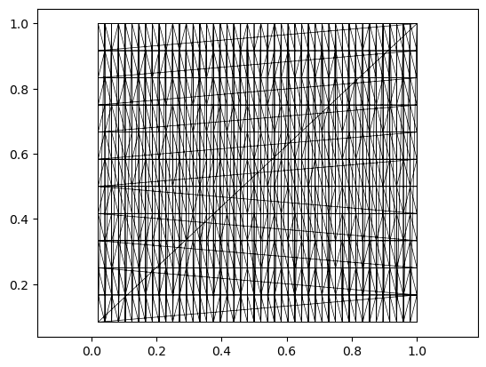

<!-- WARNING: THIS FILE WAS AUTOGENERATED! DO NOT EDIT! -->

## Geometric quantities in periodic boundary conditions

In many 2D biophysical simulations (see tutorial 3 on “vertex models”),
it is convenient to work with *periodic boundary conditions*,
i.e. simulate cells in a box with lengths
**L** = \[*L*<sub>*x*</sub>, *L*<sub>*y*</sub>\] where opposite sides
are identified. This module contains tools for mesh geometry in periodic
boundary conditions.

In `triangulax`, mesh connectivity and geometry are decoupled, so
periodic boundary conditions are easy to implement. One need two
ingredients:

1.  A triangulation whose connectivity has the desired periodicity
    (e.g. a triangulation of a torus).

There are different ways to generate a triangulation of the torus - one
example is included in `test_meshes/torus_2d.obj`. Note: edge flips/T1
on this mesh will preserve its topology, no further bookkeeping is
needed. In particular, one does not need to keep track of any boundary
vertices since there is no boundary. All `triangulax` tools related to
the mesh connectivity (like the
[`HeMesh`](https://nikolas-claussen.github.io/triangulax/src/halfedge_datastructure.html#hemesh)
class) can be used without modification.

2.  A distance function that takes into account the periodicity.

For a square domain with length *L* the displacement vector between two
points **r**<sub>1</sub>, **r**<sub>2</sub> can be computed as
$$\mathbf{d} = \mathbf{r}\_1 - \mathbf{r}\_2 - \mathrm{round}\left(\frac{|\mathbf{r}\_1 - \mathbf{r}\_2 |}{L} \right)L$$

This always gives the shortest displacement vector between the two
points. With this distance function, one can compute edge lengths,
angles, Voronoi duals, etc. Note: nothing prevents you from changing the
shape of your domain, i.e. *L* dynamically during your simulation (for
instance, to simulare growing tissues). You can even take gradients with
respect to *L*.

------------------------------------------------------------------------

<a
href="https://github.com/nikolas-claussen/triangulax/blob/main/triangulax/periodic.py#L40"
target="_blank" style="float:right; font-size:smaller">source</a>

### displacement_periodic_twisted

``` python

def displacement_periodic_twisted(
    r_1:Float[Array, '2'], r_2:Float[Array, '2'], L:Float[Array, '2'], # Box lengths [L_x, L_y].
    s:float, # Shear factor relating vertical wraps to an x-shift of s * L_x.
)->Float[Array, '2']:

```

*Return the minimum-image displacement on a sheared periodic torus.*

------------------------------------------------------------------------

<a
href="https://github.com/nikolas-claussen/triangulax/blob/main/triangulax/periodic.py#L25"
target="_blank" style="float:right; font-size:smaller">source</a>

### displacement_periodic

``` python

def displacement_periodic(
    r_1:Float[Array, '2'], r_2:Float[Array, '2'], L:Float[Array, '2'], # Box lengths [L_x, L_y].
)->Float[Array, '2']:

```

*Return the minimum-image displacement on a rectangular torus.*

``` python
L = jnp.array([2.0, 3.0])

assert jnp.allclose(
    displacement_periodic(
        jnp.array([0.1, 0.2]),
        jnp.array([1.9, 2.8]),
        L,
    ),
    jnp.array([-0.2, -0.4]),
)

assert jnp.allclose(
    displacement_periodic(
        jnp.array([1.9, 2.8]),
        jnp.array([0.1, 0.2]),
        L,
    ),
    jnp.array([0.2, 0.4]),
)

assert jnp.allclose(
    displacement_periodic_twisted(
        jnp.array([0.0, 0.0]),
        jnp.array([0.9, 1.1]),
        jnp.array([1.0, 1.0]),
        0.25,
    ),
    jnp.array([0.15, 0.1]),
)

assert jnp.allclose(
    displacement_periodic_twisted(
        jnp.array([0.9, 0.9]),
        jnp.array([0.1, -0.1]),
        jnp.array([1.0, 1.0]),
        0.25,
    ),
    jnp.array([-0.05, 0.0]),
)
```

### Edge lengths, angles, and areas

Geometric quantities like angles and triangle areas can be computed
using the displacement functions defined above. To do this, we can use
the “intrinsic” geometry functions from the trigonometry module to
compute everything in terms of edge lengths.

``` python
# this is an example of a 2d mesh with "periodic boundary conditions" - topologically, it is just a torus.
# Thus, the faces that wrap around the boundary.

trimesh = TriMesh.read_obj("../test_meshes/torus_2d.obj", dim=2)
hemesh = HeMesh.from_triangles(trimesh.vertices.shape[0], trimesh.faces)

vertices = trimesh.vertices

plt.triplot(vertices[:,0], vertices[:,1], trimesh.faces, lw=0.5, color="k")
plt.axis("equal")
```

    (np.float64(-0.028125350000000004),
     np.float64(1.04895835),
     np.float64(0.03749965),
     np.float64(1.04583335))



``` python
hemesh.bdry_loops  # the mesh has no boundary
```

    []

``` python
# to compute angles, we use the intrinsic geometry of the mesh

L = jnp.array([1.0, 1.0]) # box lengths
def my_distance_function(r_1, r_2): return displacement_periodic(r_1, r_2, L)

edge_lengths = jax.vmap(my_distance_function)(vertices[hemesh.orig], vertices[hemesh.dest])
edge_lengths_nonperiodic = jnp.linalg.norm(vertices[hemesh.orig] - vertices[hemesh.dest], axis=1)

edge_lengths.max(), edge_lengths_nonperiodic.max()
```

    (Array(0.083334, dtype=float64), Array(1.34128535, dtype=float64))

``` python
# let's group together the edge lengths for each face, then compute the area

la, lb, lc = (edge_lengths[hemesh.prv[hemesh.face_incident]],
              edge_lengths[hemesh.face_incident],
              edge_lengths[hemesh.nxt[hemesh.face_incident]],)

angles = jax.vmap(trig.get_angles_from_lengths)(la, lb, lc)
areas = jax.vmap(trig.get_triangle_area_from_lengths)(la, lb, lc)
```

------------------------------------------------------------------------

<a
href="https://github.com/nikolas-claussen/triangulax/blob/main/triangulax/periodic.py#L98"
target="_blank" style="float:right; font-size:smaller">source</a>

### get_periodic_corner_cotangents

``` python

def get_periodic_corner_cotangents(
    vertices:Float[Array, 'n_vertices 2'], hemesh:HeMesh, distance_function:Callable
)->Float[Array, 'n_faces 3']:

```

*Compute all face corner cotangents using a periodic displacement
function.*

------------------------------------------------------------------------

<a
href="https://github.com/nikolas-claussen/triangulax/blob/main/triangulax/periodic.py#L90"
target="_blank" style="float:right; font-size:smaller">source</a>

### get_periodic_corner_angles

``` python

def get_periodic_corner_angles(
    vertices:Float[Array, 'n_vertices 2'], hemesh:HeMesh, distance_function:Callable
)->Float[Array, 'n_faces 3']:

```

*Compute all face corner angles using a periodic distance function.*

------------------------------------------------------------------------

<a
href="https://github.com/nikolas-claussen/triangulax/blob/main/triangulax/periodic.py#L81"
target="_blank" style="float:right; font-size:smaller">source</a>

### get_periodicb_arycentric_cell_areas

``` python

def get_periodicb_arycentric_cell_areas(
    vertices:Float[Array, 'n_vertices 2'], hemesh:HeMesh, distance_function:Callable
)->Float[Array, 'n_faces']:

```

*Get area of barycentric dual cell around each vertex, using a periodic
distance function.* Defined as 1/3 \* sum of adjacent triangle areas.

------------------------------------------------------------------------

<a
href="https://github.com/nikolas-claussen/triangulax/blob/main/triangulax/periodic.py#L73"
target="_blank" style="float:right; font-size:smaller">source</a>

### get_periodic_triangle_areas

``` python

def get_periodic_triangle_areas(
    vertices:Float[Array, 'n_vertices 2'], hemesh:HeMesh, distance_function:Callable
)->Float[Array, 'n_faces']:

```

*Compute triangle areas using a periodic distance function.*

``` python
periodic_distance = lambda r_1, r_2: displacement_periodic(r_1, r_2, L)

periodic_areas = get_periodic_triangle_areas(vertices, hemesh, periodic_distance)
periodic_angles = get_periodic_corner_angles(vertices, hemesh, periodic_distance)
periodic_cotangents = get_periodic_corner_cotangents(vertices, hemesh, periodic_distance)

manual_edge_lengths = jnp.linalg.norm(
    jax.vmap(periodic_distance)(vertices[hemesh.orig], vertices[hemesh.dest]),
    axis=-1,
 )
la_test, lb_test, lc_test = (manual_edge_lengths[hemesh.prv[hemesh.face_incident]],
                             manual_edge_lengths[hemesh.face_incident],
                             manual_edge_lengths[hemesh.nxt[hemesh.face_incident]],)

assert periodic_areas.shape == (hemesh.n_faces,)
assert periodic_angles.shape == (hemesh.n_faces, 3)
assert periodic_cotangents.shape == (hemesh.n_faces, 3)

assert jnp.allclose(
    periodic_areas,
    jax.vmap(trig.get_triangle_area_from_lengths)(la_test, lb_test, lc_test),
)
assert jnp.allclose(
    periodic_angles,
    jax.vmap(trig.get_angles_from_lengths)(la_test, lb_test, lc_test),
)
assert jnp.allclose(
    periodic_cotangents,
    jax.vmap(trig.get_cotangents_from_lengths)(la_test, lb_test, lc_test),
)

zero_twist_distance = lambda r_1, r_2: displacement_periodic_twisted(r_1, r_2, L, 0.0)
assert jnp.allclose(
    periodic_areas,
    get_periodic_triangle_areas(vertices, hemesh, zero_twist_distance),
)
assert jnp.allclose(
    periodic_angles,
    get_periodic_corner_angles(vertices, hemesh, zero_twist_distance),
)
assert jnp.allclose(
    periodic_cotangents,
    get_periodic_corner_cotangents(vertices, hemesh, zero_twist_distance),
)

print("periodic geometry tests passed")
```

    periodic geometry tests passed

### Voronoi dual

We can also compute the Voronoi dual for a periodic boundary conditions.
To do so, we use the intrisic “circumcenter” function.

------------------------------------------------------------------------

<a
href="https://github.com/nikolas-claussen/triangulax/blob/main/triangulax/periodic.py#L141"
target="_blank" style="float:right; font-size:smaller">source</a>

### get_periodic_voronoi_face_positions

``` python

def get_periodic_voronoi_face_positions(
    vertices:Float[Array, 'n_vertices 2'], hemesh:HeMesh, distance_function:Callable
)->Float[Array, 'n_faces 2']:

```

*Compute periodic Voronoi dual positions from intrinsic circumcenter
barycentric coordinates.*

------------------------------------------------------------------------

<a
href="https://github.com/nikolas-claussen/triangulax/blob/main/triangulax/periodic.py#L130"
target="_blank" style="float:right; font-size:smaller">source</a>

### get_periodic_voronoi_areas

``` python

def get_periodic_voronoi_areas(
    vertices:Float[Array, 'n_vertices 2'], hemesh:HeMesh, distance_function:Callable
)->Float[Array, 'n_vertices']:

```

*Compute Voronoi cell areas from periodic edge lengths and cotangent
weights.*

``` python
periodic_voronoi_areas = get_periodic_voronoi_areas(vertices, hemesh, periodic_distance)
periodic_face_positions = get_periodic_voronoi_face_positions(vertices, hemesh, periodic_distance)

periodic_he_lengths = _get_periodic_he_lengths(vertices, hemesh, periodic_distance)
periodic_cotan_weights = _get_periodic_cotan_weights_per_edge(vertices, hemesh, periodic_distance)

assert periodic_voronoi_areas.shape == (hemesh.n_vertices,)
assert periodic_face_positions.shape == (hemesh.n_faces, 2)

assert jnp.allclose(
    periodic_voronoi_areas,
    adj.sum_he_to_vertex_incoming(
        hemesh,
        periodic_cotan_weights * periodic_he_lengths**2 / 4,
    ),
)
assert jnp.allclose(periodic_voronoi_areas.sum(), periodic_areas.sum())

face_hes = hemesh.face_incident
a = vertices[hemesh.orig[face_hes]]
ab = jax.vmap(periodic_distance)(vertices[hemesh.orig[face_hes]], vertices[hemesh.dest[face_hes]])
bc = jax.vmap(periodic_distance)(vertices[hemesh.orig[hemesh.nxt[face_hes]]],
                                 vertices[hemesh.dest[hemesh.nxt[face_hes]]])
b = a + ab
c = b + bc
radii_a = jnp.linalg.norm(periodic_face_positions - a, axis=1)
radii_b = jnp.linalg.norm(periodic_face_positions - b, axis=1)
radii_c = jnp.linalg.norm(periodic_face_positions - c, axis=1)
assert jnp.allclose(radii_a, radii_b)
assert jnp.allclose(radii_b, radii_c)

zero_twist_distance = lambda r_1, r_2: displacement_periodic_twisted(r_1, r_2, L, 0.0)
assert jnp.allclose(
    periodic_voronoi_areas,
    get_periodic_voronoi_areas(vertices, hemesh, zero_twist_distance),
)
assert jnp.allclose(
    periodic_face_positions,
    get_periodic_voronoi_face_positions(vertices, hemesh, zero_twist_distance),
)

print("periodic Voronoi tests passed")
```

    periodic Voronoi tests passed
