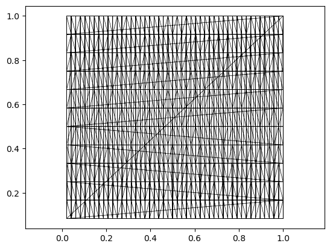

<!-- WARNING: THIS FILE WAS AUTOGENERATED! DO NOT EDIT! -->

## `periodic`: Geometry in periodic boundary conditions

In many 2D biophysical simulations (see tutorial 3 on “vertex models”),
it is convenient to work with *periodic boundary conditions*,
i.e. simulate cells in a box with lengths
**L** = \[*L*<sub>*x*</sub>, *L*<sub>*y*</sub>\] where opposite sides
are identified. This module contains tools for mesh geometry in periodic
boundary conditions.

In `triangulax`, mesh connectivity and geometry are decoupled, so
periodic boundary conditions are easy to implement. One needs two
ingredients:

1.  A triangulation whose connectivity has the desired periodicity
    (e.g. a triangulation of a torus).

There are different ways to generate a triangulation of the torus - one
example is included in `test_meshes/torus_2d.obj`. Note: edge flips/T1
on this mesh will preserve its topology, no further bookkeeping is
needed. In particular, one does not need to keep track of any boundary
vertices since there is no boundary. All `triangulax` tools related to
the mesh connectivity (like the
[`HeMesh`](https://nikolas-claussen.github.io/triangulax/src/halfedge_datastructure.html#hemesh)
class) can be used without modification.

2.  A displacement function that takes into account the periodicity.

For a rectangular domain with lengths **L** the displacement vector
between two points **r**<sub>1</sub>, **r**<sub>2</sub> can be computed
as
$$\mathbf{d} = \mathbf{r}\_2 - \mathbf{r}\_1 - \mathrm{round}\left(\frac{\mathbf{r}\_2 - \mathbf{r}\_1}{L} \right)\mathbf{L}$$

This always gives the shortest displacement vector between the two
points (minimum-image convention). Note: nothing prevents you from
changing the shape of your domain, i.e. **L** dynamically during your
simulation (for instance, to simulate growing tissues). You can even
take gradients with respect to **L**.

For sheared domains (e.g. to impose simple shear), we also provide a
displacement function implementing [Lees-Edwards boundary
conditions](https://doi.org/10.1088/0022-3719/5/15/006), which add an
x-shift proportional to a shear factor *s* when wrapping in the
y-direction.

**Note:** throughout this module, the `displacement_fn` argument is a
callable `(r_1, r_2) -> d` that returns a 2D displacement *vector*, not
a scalar distance.

### How this module is organized

Most mesh geometry is **intrinsic**: triangle areas, angles, cotangent
weights, Voronoi cell areas and perimeters, the Laplacian, the mass
matrix and the Gaussian curvature all depend on the vertex positions
only through the *edge lengths* (see the “Intrinsic geometry” sections
of notebooks 00, 05 and 06). Edge lengths remain perfectly well defined
across a periodic boundary - one just measures them with a displacement
function. So the periodic workflow is:

``` python
displacement_fn = lambda r_1, r_2: displacement_periodic(r_1, r_2, L)
he_lengths = get_periodic_he_lengths(vertices, hemesh, displacement_fn)

areas      = geometry.get_triangle_areas_intrinsic(he_lengths, hemesh)
cell_areas = geometry.get_voronoi_areas_robust_intrinsic(he_lengths, hemesh)
lap_u      = linops.compute_cotan_laplace_intrinsic(he_lengths, hemesh, u)
```

That is: **compute the edge lengths once, then use the ordinary
intrinsic functions**.

The functions in this module cover what cannot be reduced to edge
lengths, i.e. anything that returns a *position* or an *orientation*:
the displacement functions themselves, the edge vectors and lengths they
induce, unwrapped face corner positions, face centroids, Voronoi
(circumcenter) positions, and signed triangle areas.

------------------------------------------------------------------------

<a
href="https://github.com/nikolas-claussen/triangulax/blob/main/triangulax/periodic.py#L50"
target="_blank" style="float:right; font-size:smaller">source</a>

### displacement_periodic_twisted

``` python

def displacement_periodic_twisted(
    r_1:Float[Array, 'dim'], r_2:Float[Array, 'dim'], L:Float[Array, 'dim'], # Box lengths ([L_x, L_y] in 2d).
    s:float, # Shear factor: wrapping in y shifts x by ``s * L_x``. This corresponds to vertex
positions carrying the shear as ``x -> x - s * y``; the opposite sign stretches
the edges instead of shearing them.
)->Float[Array, 'dim']:

```

*Return the minimum-image displacement on a sheared periodic torus
(Lees-Edwards BCs).*

------------------------------------------------------------------------

<a
href="https://github.com/nikolas-claussen/triangulax/blob/main/triangulax/periodic.py#L21"
target="_blank" style="float:right; font-size:smaller">source</a>

### displacement_periodic

``` python

def displacement_periodic(
    r_1:Float[Array, 'dim'], r_2:Float[Array, 'dim'], L:Float[Array, 'dim'], # Box lengths ([L_x, L_y] in 2d).
)->Float[Array, 'dim']: # Displacement ``r_2 - r_1`` under the minimum-image convention.

```

*Return the minimum-image displacement on a rectangular torus.*

IMPORTANT: the minimum-image convention always returns the *shortest*
periodic image, so it only reproduces the intended mesh edge when every
edge is shorter than `min(L)/2`. For a longer edge it silently returns
the displacement to a different periodic image, giving wrong lengths,
areas and angles with no error raised. Check with
`get_periodic_he_lengths(...).max() < L.min()/2`. This matters for
coarse periodic meshes and for a shrinking or strongly sheared box.

``` python
L = jnp.array([2.0, 3.0])

assert jnp.allclose(
    displacement_periodic(
        jnp.array([0.1, 0.2]),
        jnp.array([1.9, 2.8]),
        L,
    ),
    jnp.array([-0.2, -0.4]),
)

assert jnp.allclose(
    displacement_periodic(
        jnp.array([1.9, 2.8]),
        jnp.array([0.1, 0.2]),
        L,
    ),
    jnp.array([0.2, 0.4]),
)

assert jnp.allclose(
    displacement_periodic_twisted(
        jnp.array([0.0, 0.0]),
        jnp.array([0.9, 1.1]),
        jnp.array([1.0, 1.0]),
        0.25,
    ),
    jnp.array([0.15, 0.1]),
)

assert jnp.allclose(
    displacement_periodic_twisted(
        jnp.array([0.9, 0.9]),
        jnp.array([0.1, -0.1]),
        jnp.array([1.0, 1.0]),
        0.25,
    ),
    jnp.array([-0.05, 0.0]),
)
```

### Edge vectors and edge lengths

These two functions are the only bridge that periodic boundary
conditions need: they turn vertex positions plus a displacement function
into per-half-edge vectors and lengths. Everything intrinsic follows
from the lengths, and the vectors are what the position-dependent
quantities further below are built from.

``` python
# this is an example of a 2d mesh with "periodic boundary conditions" - topologically, it is just a torus.
# Thus, the faces that wrap around the boundary.

trimesh = TriMesh.read_obj("../test_meshes/torus_2d.obj", dim=2)
hemesh = HeMesh.from_triangles(trimesh.vertices.shape[0], trimesh.faces)

vertices = trimesh.vertices

plt.triplot(vertices[:,0], vertices[:,1], trimesh.faces, lw=0.5, color="k")
plt.axis("equal")
```

    (np.float64(-0.028125350000000004),
     np.float64(1.04895835),
     np.float64(0.03749965),
     np.float64(1.04583335))



``` python
hemesh.bdry_loops  # the mesh has no boundary
```

    []

------------------------------------------------------------------------

<a
href="https://github.com/nikolas-claussen/triangulax/blob/main/triangulax/periodic.py#L101"
target="_blank" style="float:right; font-size:smaller">source</a>

### get_periodic_he_lengths

``` python

def get_periodic_he_lengths(
    vertices:Float[Array, 'n_vertices dim'], hemesh:HeMesh, displacement_fn:Callable
)->Float[Array, 'n_hes']:

```

*Get lengths of half-edges using a periodic displacement function.*

This is the periodic counterpart of `geometry.get_he_length`, and the
entry point to all intrinsic geometry under periodic boundary
conditions: pass the result to any `*_intrinsic` function of the
`geometry` or `linops` modules.

------------------------------------------------------------------------

<a
href="https://github.com/nikolas-claussen/triangulax/blob/main/triangulax/periodic.py#L78"
target="_blank" style="float:right; font-size:smaller">source</a>

### get_periodic_edge_vectors

``` python

def get_periodic_edge_vectors(
    vertices:Float[Array, 'n_vertices dim'], # Vertex positions in the periodic box.
    hemesh:HeMesh, # Half-edge mesh.
    displacement_fn:Callable, # Periodic displacement function ``(r_1, r_2) -> r_2 - r_1 (mod L)``, e.g.
[`displacement_periodic`](https://nikolas-claussen.github.io/triangulax/src/geometric_quantities_periodic_bcs.html#displacement_periodic).
)->Float[Array, 'n_hes dim']: # Displacement vector per half-edge.

```

*Edge vectors `r_dest - r_orig` per half-edge, using a periodic
displacement function.*

``` python
# box lengths, and the displacement function they define

L = jnp.array([1.0, 1.0])
displacement_fn = lambda r_1, r_2: displacement_periodic(r_1, r_2, L)

he_lengths = get_periodic_he_lengths(vertices, hemesh, displacement_fn)
he_lengths_naive = jnp.linalg.norm(vertices[hemesh.orig] - vertices[hemesh.dest], axis=1)

print(f"longest edge: {he_lengths.max():.3f} (periodic) vs {he_lengths_naive.max():.3f} (naive)")
print(f"{int((~jnp.isclose(he_lengths, he_lengths_naive)).sum())} of {hemesh.n_hes} "
      "half-edges wrap around the boundary")

# the minimum-image convention only reproduces the intended mesh edges if every edge is
# shorter than min(L)/2 -- worth asserting once for a new mesh or a shrinking box
assert he_lengths.max() < L.min() / 2
```

    longest edge: 0.086 (periodic) vs 1.341 (naive)
    238 of 3456 half-edges wrap around the boundary

### Intrinsic geometry under periodic boundary conditions

With the edge lengths in hand, all intrinsic geometry is available
through the ordinary functions of the `geometry` and `linops` modules -
no periodic version required. The cell below computes triangle and
Voronoi areas, corner angles, cotangent weights, the Laplacian and a
mass matrix on the torus mesh, and checks them against exact results (a
flat torus has zero angle defect everywhere, its dual cells tile the
surface, and a Fourier mode is an approximate eigenfunction of the
Laplacian).

``` python
# the whole intrinsic toolkit, on a periodic mesh

areas = geom.get_triangle_areas_intrinsic(he_lengths, hemesh)
corner_angles = geom.get_corner_angles_intrinsic(he_lengths, hemesh)
cotan_weights = geom.get_cotan_weights_per_edge_intrinsic(he_lengths, hemesh)
voronoi_areas = geom.get_voronoi_areas_robust_intrinsic(he_lengths, hemesh)
voronoi_perimeters = geom.get_voronoi_perimeters_intrinsic(he_lengths, hemesh)

# the torus mesh tiles a 1x1 box, and its dual cells tile it as well
assert jnp.allclose(areas.sum(), L[0] * L[1])
assert jnp.allclose(voronoi_areas.sum(), areas.sum())
assert jnp.allclose(geom.get_voronoi_areas_intrinsic(he_lengths, hemesh).sum(), areas.sum())
assert jnp.all(voronoi_areas > 0) and jnp.all(voronoi_perimeters > 0)

# the torus is flat and has no boundary: every angle sum is 2*pi, and by Gauss-Bonnet
# the total angle defect vanishes (chi = 0)
assert jnp.allclose(geom.get_angle_sum_intrinsic(he_lengths, hemesh), 2 * jnp.pi, atol=1e-10)
assert jnp.allclose(geom.get_angle_defect_intrinsic(he_lengths, hemesh).sum(), 0.0, atol=1e-10)
assert jnp.allclose(corner_angles.sum(), jnp.pi * hemesh.n_faces, atol=1e-10)

# a Fourier mode is an approximate eigenfunction of the Laplacian, with eigenvalue -2*(2*pi)^2
u = jnp.sin(2*jnp.pi*vertices[:, 0]) * jnp.cos(2*jnp.pi*vertices[:, 1])
lap_u = linops.compute_cotan_laplace_intrinsic(he_lengths, hemesh, u, normalize=True)
rel_err = jnp.linalg.norm(lap_u + 2*(2*jnp.pi)**2 * u) / jnp.linalg.norm(2*(2*jnp.pi)**2 * u)
print(f"periodic Laplacian rel. error vs -2k^2 u: {rel_err:.3f}")
assert rel_err < 0.05

# constants are in the kernel of the Laplacian, and the mass matrix is positive
assert jnp.allclose(linops.compute_cotan_laplace_intrinsic(he_lengths, hemesh, jnp.ones(hemesh.n_vertices)),
                    0.0, atol=1e-10)
mass = linops.mass_matrix_sparse_intrinsic(he_lengths, hemesh)
assert jnp.all(mass.data > 0) and jnp.allclose(mass.data.sum(), areas.sum())

# Lees-Edwards: shearing the box changes the geometry but not the topology, and the
# dual cells still tile the (equal-area) box
sheared = lambda r_1, r_2: displacement_periodic_twisted(r_1, r_2, L, 0.2)
he_lengths_sheared = get_periodic_he_lengths(vertices, hemesh, sheared)
assert not jnp.allclose(he_lengths_sheared, he_lengths)
assert jnp.allclose(geom.get_voronoi_areas_robust_intrinsic(he_lengths_sheared, hemesh).sum(),
                    geom.get_area_intrinsic(he_lengths_sheared, hemesh))
```

    periodic Laplacian rel. error vs -2k^2 u: 0.012

### Quantities that need explicit positions

What is *not* intrinsic is anything that returns a position or an
orientation: edge lengths fix the shape of every triangle, but not where
the triangles sit or how they are turned. These quantities do need a
displacement function, and they are what remains of this module.

They all follow from the **unwrapped face corners**: pick one vertex of
a face and place the other two relative to it by following displacement
vectors. The resulting triangle is contiguous even if it wraps around
the boundary, but its corners are expressed in the periodic image of
that face and are *not* wrapped back into the box. Face centroids,
circumcenters (the Voronoi dual vertices) and signed areas are then
computed from these corners exactly as in the non-periodic case.

Two consequences worth remembering:

- The returned positions may lie outside the box. Do not feed them to
  functions that assume ordinary Euclidean coordinates for the *whole*
  mesh (`geometry.get_dual_he_length`, `mesh.cellplot`); dual edge
  lengths, for instance, come from
  `geometry.get_voronoi_edge_lengths_intrinsic` instead.
- Signed areas, unlike the unsigned intrinsic ones, detect inverted
  triangles - the event a vertex-model simulation has to watch for.

------------------------------------------------------------------------

<a
href="https://github.com/nikolas-claussen/triangulax/blob/main/triangulax/periodic.py#L197"
target="_blank" style="float:right; font-size:smaller">source</a>

### get_periodic_triangle_orientations

``` python

def get_periodic_triangle_orientations(
    vertices:Float[Array, 'n_vertices dim'], hemesh:HeMesh, displacement_fn:Callable
)->Float[Array, 'n_faces']:

```

*Per-face orientation (+1, -1 or 0) under periodic boundary conditions.*

Periodic counterpart of `geometry.get_triangle_orientations`.

------------------------------------------------------------------------

<a
href="https://github.com/nikolas-claussen/triangulax/blob/main/triangulax/periodic.py#L183"
target="_blank" style="float:right; font-size:smaller">source</a>

### get_periodic_oriented_triangle_areas

``` python

def get_periodic_oriented_triangle_areas(
    vertices:Float[Array, 'n_vertices dim'], hemesh:HeMesh, displacement_fn:Callable
)->Float[Array, 'n_faces']:

```

*Signed triangle areas under periodic boundary conditions.*

Positive for counter-clockwise (positively oriented) triangles, negative
for inverted ones. Unlike the intrinsic
`geometry.get_triangle_areas_intrinsic`, which goes through Heron’s
formula and is therefore unconditionally non-negative, this detects
triangle inversion.

------------------------------------------------------------------------

<a
href="https://github.com/nikolas-claussen/triangulax/blob/main/triangulax/periodic.py#L159"
target="_blank" style="float:right; font-size:smaller">source</a>

### get_periodic_voronoi_face_positions

``` python

def get_periodic_voronoi_face_positions(
    vertices:Float[Array, 'n_vertices dim'], hemesh:HeMesh, displacement_fn:Callable
)->Float[Array, 'n_faces dim']:

```

*Voronoi dual positions (circumcenters) using a periodic displacement
function.*

The circumcenter is computed in intrinsic barycentric coordinates
(`trigonometry.get_circumcenter_from_lengths`) from the periodic edge
lengths, then mapped back onto the unwrapped face corners.

Like
[`get_periodic_face_centroids`](https://nikolas-claussen.github.io/triangulax/src/geometric_quantities_periodic_bcs.html#get_periodic_face_centroids),
the returned positions are in the periodic image of their own face and
are not wrapped back into the box. Do not feed them to
`geometry.get_dual_he_length` or `mesh.cellplot`, which assume unwrapped
Euclidean coordinates – for dual edge lengths use
`geometry.get_voronoi_edge_lengths_intrinsic`.

------------------------------------------------------------------------

<a
href="https://github.com/nikolas-claussen/triangulax/blob/main/triangulax/periodic.py#L148"
target="_blank" style="float:right; font-size:smaller">source</a>

### get_periodic_face_centroids

``` python

def get_periodic_face_centroids(
    vertices:Float[Array, 'n_vertices dim'], hemesh:HeMesh, displacement_fn:Callable
)->Float[Array, 'n_faces dim']:

```

*Face centroids (barycenters) using a periodic displacement function.*

Returned in the periodic image of their own face, not wrapped back into
the box (see
[`get_periodic_face_corners`](https://nikolas-claussen.github.io/triangulax/src/geometric_quantities_periodic_bcs.html#get_periodic_face_corners)).

------------------------------------------------------------------------

<a
href="https://github.com/nikolas-claussen/triangulax/blob/main/triangulax/periodic.py#L113"
target="_blank" style="float:right; font-size:smaller">source</a>

### get_periodic_face_corners

``` python

def get_periodic_face_corners(
    vertices:Float[Array, 'n_vertices dim'], # Vertex positions in the periodic box.
    hemesh:HeMesh, # Half-edge mesh.
    displacement_fn:Callable, # Periodic displacement function ``(r_1, r_2) -> r_2 - r_1 (mod L)``.
)->Float[Array, 'n_faces 3 dim']: # Unwrapped positions of the three corners of each face.

```

*Vertex positions of each face, unwrapped into a single periodic image.*

The first corner is the origin vertex of the face’s incident half-edge
and keeps its position in the box; the other two are placed relative to
it by following displacement vectors, so that the triangle is contiguous
even if it wraps around the periodic boundary. The positions are
therefore NOT wrapped back into the box.

Corners are ordered as in `mesh.HeMesh.faces`, so the result can be used
like `vertices[hemesh.faces]` in the non-periodic case.
