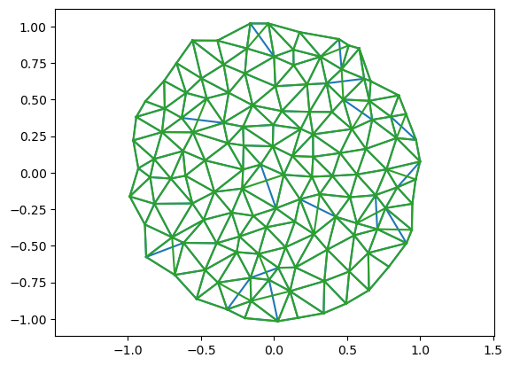
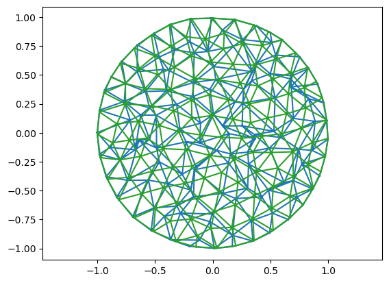

<!-- WARNING: THIS FILE WAS AUTOGENERATED! DO NOT EDIT! -->

## Geometry-processing algorithms

This notebook defines geometry processing algorithms building on the
geometric primitives defined in the preceding modules.

### Smoothing and remeshing

Two operations to improve mesh quality without altering surface
shape: 1. Tangential smoothing moves mesh vertices to the area-weighted
average of the neighbors, along the tangential direction only 2.
Delaunay flips improve triangle aspect ratio by edge flips. This
modifies the mesh topology, but leaves the vertex set unchanged.

``` python
# Load test mesh
mesh = TriMesh.read_obj("../test_meshes/disk.obj")
hemesh = msh.HeMesh.from_triangles(mesh.vertices.shape[0], mesh.faces)
vertices = mesh.vertices
```

    Warning: readOBJ() ignored non-comment line 3:
      o flat_tri_ecmc

### Mesh quality assessment

Functions to evaluate triangle mesh quality: per-face maximum corner
angle, summary statistics, and a human-readable quality report.

------------------------------------------------------------------------

<a
href="https://github.com/nikolas-claussen/triangulax/blob/main/triangulax/algorithms.py#L29"
target="_blank" style="float:right; font-size:smaller">source</a>

### get_face_angles

``` python

def get_face_angles(
    vertices:Float[Array, 'n_vertices dim'], # Vertex positions.
    hemesh:HeMesh, # Half-edge mesh connectivity.
)->Float[Array, 'n_faces 3']: # Maximum interior angle per triangle.

```

*Get corner angle per face (radians).*

Uses the half-edge corner angles and takes the max over the three
corners of every face.

``` python
# Test get_face_max_angles
angles = get_face_angles(vertices, hemesh)
max_angles = jnp.max(angles, axis=-1)
print(f"max angles: min={jnp.rad2deg(max_angles.min()):.1f}°,max={jnp.rad2deg(max_angles.max()):.1f}°, mean={jnp.rad2deg(max_angles.mean()):.1f}°")
assert max_angles.shape == (hemesh.n_faces,)
assert jnp.all(max_angles >= jnp.pi / 3 - 1e-6)  # max angle >= 60° always
```

    max angles: min=60.4°,max=106.6°, mean=75.0°

------------------------------------------------------------------------

<a
href="https://github.com/nikolas-claussen/triangulax/blob/main/triangulax/algorithms.py#L54"
target="_blank" style="float:right; font-size:smaller">source</a>

### get_mesh_quality_stats

``` python

def get_mesh_quality_stats(
    vertices:Float[Array, 'n_vertices dim'], # Vertex positions.
    hemesh:HeMesh, # Half-edge mesh connectivity.
    degenerate_angle:float=5.0, # Threshold (degrees) for a triangle to be considered degenerate.
(I.e. if max angle > pi-threshold or min angle < threshold.)
    digits:int=5, # Number of decimal digits to round the statistics to.
)->dict:

```

*Compute mesh quality statistics.*

``` python
# Test mesh quality report
stats = get_mesh_quality_stats(vertices, hemesh)
stats
```

    {'areas_min': 0.00615,
     'areas_max': 0.0218,
     'areas_cv': 0.18788,
     'max_angle': 106.60695,
     'min_angle': 31.15478,
     'angles_std': 13.73223,
     'n_degenerate': 0,
     'n_total_faces': 224}

### Delaunay flipping

Flip edges to improve triangle quality based on the Delaunay criterion:
for each interior edge, the sum of the two opposite angles should not
exceed π. Based on [GeometryCentral: Extrinsic Delaunay
Flipping](https://geometry-central.net/surface/algorithms/remeshing/#extrinsic-delaunay-flipping).

Note: extrinsic flipping is *not* guaranteed to produce a fully Delaunay
mesh, but generally improves quality in practice.

------------------------------------------------------------------------

<a
href="https://github.com/nikolas-claussen/triangulax/blob/main/triangulax/algorithms.py#L94"
target="_blank" style="float:right; font-size:smaller">source</a>

### is_locally_delaunay

``` python

def is_locally_delaunay(
    vertices:Float[Array, 'n_vertices dim'], # Vertex positions.
    hemesh:HeMesh, # Half-edge mesh connectivity.
)->Bool[Array, 'n_hes']: # True where the edge satisfies the Delaunay condition.

```

*Check the local Delaunay condition for each edge.*

An interior edge is locally Delaunay when the sum of the two opposite
angles does not exceed π. Boundary edges are always considered Delaunay.

``` python
# Test is_locally_delaunay
delaunay = is_locally_delaunay(vertices, hemesh)
print(f"Non-Delaunay edges: {(~delaunay & hemesh.is_unique & ~hemesh.is_bdry_edge).sum()}")
assert delaunay.shape == (hemesh.n_hes,)
assert jnp.all(delaunay[hemesh.is_bdry_edge])  # boundary edges are always Delaunay
```

    Non-Delaunay edges: 4

------------------------------------------------------------------------

<a
href="https://github.com/nikolas-claussen/triangulax/blob/main/triangulax/algorithms.py#L120"
target="_blank" style="float:right; font-size:smaller">source</a>

### fix_delaunay

``` python

def fix_delaunay(
    vertices:Float[Array, 'n_vertices dim'], # Vertex positions (unchanged by flips).
    hemesh:HeMesh, # Half-edge mesh connectivity.
    max_iters:int=2, # Maximum number of sweep iterations.
)->tuple: # Updated half-edge mesh with improved Delaunay quality.

```

*Flip non-Delaunay edges iteratively until convergence.*

Each iteration identifies non-Delaunay interior edges and flips them
using `topology.flip_all`. Stops when no more flips are needed or
`max_iters` is reached.

``` python
# Test fix_delaunay: perturb vertices to create non-Delaunay edges, then fix
key = jax.random.PRNGKey(42)
noise = 0.025 * jax.random.normal(key, shape=vertices.shape)
noisy_vertices = vertices + noise

n_bad_before = (~is_locally_delaunay(noisy_vertices, hemesh) & hemesh.is_unique & ~hemesh.is_bdry_edge).sum()
print(f"Non-Delaunay edges before: {n_bad_before}")

hemesh_fixed, n_flips = fix_delaunay(noisy_vertices, hemesh, max_iters=1)
n_bad_after = (~is_locally_delaunay(noisy_vertices, hemesh_fixed) & hemesh_fixed.is_unique & ~hemesh_fixed.is_bdry_edge).sum()
print(f"Flips performed: {n_flips}")
print(f"Non-Delaunay edges after:  {n_bad_after}")

print("\nBefore fix_delaunay:")
print(get_mesh_quality_stats(noisy_vertices, hemesh))
print("\nAfter fix_delaunay:")
print(get_mesh_quality_stats(noisy_vertices, hemesh_fixed))
```

    Non-Delaunay edges before: 15
    Flips performed: 15
    Non-Delaunay edges after:  0

    Before fix_delaunay:
    {'areas_min': 0.00301, 'areas_max': 0.02994, 'areas_cv': 0.32373, 'max_angle': 126.89138, 'min_angle': 9.82493, 'angles_std': 18.8009, 'n_degenerate': 0, 'n_total_faces': 224}

    After fix_delaunay:
    {'areas_min': 0.00301, 'areas_max': 0.03013, 'areas_cv': 0.32043, 'max_angle': 120.57028, 'min_angle': 9.82493, 'angles_std': 17.33338, 'n_degenerate': 0, 'n_total_faces': 224}

``` python
plt.triplot(noisy_vertices[:, 0], noisy_vertices[:, 1], hemesh.faces)
plt.triplot(noisy_vertices[:, 0], noisy_vertices[:, 1], hemesh_fixed.faces)
plt.axis('equal')
```

    (np.float64(-1.0870901427296413),
     np.float64(1.097853572442067),
     np.float64(-1.1177076607221643),
     np.float64(1.1221007508660394))



### Tangential vertex smoothing

Vertex smoothing moves each vertex towards the average of its
neighborhood. `triangulax` implements **laplacian smoothing**, which
moves vertices towards the average of neighboring vertex positions.

In either case, for 3D meshes the displacement is projected tangentially
(normal component removed). Boundary conditions can be `'fixed'`
(boundary vertices immobile) or `'free'`.

Based on: [GeometryCentral: Tangential Vertex
Smoothing](https://geometry-central.net/surface/algorithms/remeshing/#tangential-vertex-smoothing).

------------------------------------------------------------------------

<a
href="https://github.com/nikolas-claussen/triangulax/blob/main/triangulax/algorithms.py#L162"
target="_blank" style="float:right; font-size:smaller">source</a>

### smooth_vertices_laplacian

``` python

def smooth_vertices_laplacian(
    vertices:Float[Array, 'n_vertices dim'], # Vertex positions.
    hemesh:HeMesh, # Half-edge mesh connectivity.
    step_size:float=1.0, # Fraction of displacement to apply (1 = full step).
    bc:str='fixed', # Boundary condition: 'fixed' freezes boundary vertices,
'free' allows them to move, and 'slide' allows them to
move only tangentially along the boundary.
)->Float[Array, 'n_vertices dim']: # Updated vertex positions.

```

*One step of tangential Laplacian vertex smoothing.*

Moves each vertex towards the mean position of its neighbours. For 3D
meshes, the displacement is projected onto the tangent plane.

``` python
# Test Laplacian smoothing on a noisy 2D mesh

key = jax.random.PRNGKey(0)
noise = 0.05 * jax.random.normal(key, shape=vertices.shape)
noisy_v = vertices + jnp.where(hemesh.is_bdry[:, None], 0.0, noise)

n_iter = 10
bc = 'slide'  # try 'fixed', 'free', 'slide'

print("Before smoothing:")
print(get_mesh_quality_stats(noisy_v, hemesh))

smoothed_v = noisy_v
for _ in range(n_iter):
    smoothed_v = smooth_vertices_laplacian(smoothed_v, hemesh, step_size=0.5, bc=bc)

print("\nAfter 10 Laplacian smoothing steps:")
print(get_mesh_quality_stats(smoothed_v, hemesh))

# Boundary vertices should not have moved if bc='fixed', but should have moved otherwise
if bc == 'fixed':
    assert jnp.allclose(smoothed_v[hemesh.is_bdry], noisy_v[hemesh.is_bdry])
else:
    assert ~jnp.allclose(smoothed_v[hemesh.is_bdry], noisy_v[hemesh.is_bdry])
```

    Before smoothing:
    {'areas_min': 0.00012, 'areas_max': 0.04031, 'areas_cv': 0.56271, 'max_angle': 178.81132, 'min_angle': 0.47529, 'angles_std': 30.37956, 'n_degenerate': 4, 'n_total_faces': 224}

    After 10 Laplacian smoothing steps:
    {'areas_min': 0.00831, 'areas_max': 0.01891, 'areas_cv': 0.14408, 'max_angle': 100.82169, 'min_angle': 28.69297, 'angles_std': 9.49095, 'n_degenerate': 0, 'n_total_faces': 224}

``` python
plt.triplot(noisy_v[:, 0], noisy_v[:, 1], hemesh.faces)
plt.triplot(smoothed_v[:, 0], smoothed_v[:, 1], hemesh.faces)
plt.axis('equal')
```

    (np.float64(-1.10003475),
     np.float64(1.09628575),
     np.float64(-1.0993484814751877),
     np.float64(1.090674110978944))



``` python
# Test 3D tangential smoothing on a sphere
mesh_3d = TriMesh.read_obj("../test_meshes/sphere.obj", dim=3)
hemesh_3d = msh.HeMesh.from_triangles(mesh_3d.vertices.shape[0], mesh_3d.faces)
verts_3d = mesh_3d.vertices

key = jax.random.PRNGKey(1)
noise_3d = 0.1 * jax.random.normal(key, shape=verts_3d.shape)
noisy_3d = verts_3d + noise_3d

print("Before 3D smoothing:")
print(get_mesh_quality_stats(noisy_3d, hemesh_3d))

smoothed_3d = noisy_3d
for _ in range(5):
    smoothed_3d = smooth_vertices_laplacian(smoothed_3d, hemesh_3d, step_size=0.3, bc='free')

print("\nAfter 5 Laplacian smoothing steps (3D):")
print(get_mesh_quality_stats(smoothed_3d, hemesh_3d))
```

    Warning: readOBJ() ignored non-comment line 3:
      o Icosphere

    Before 3D smoothing:
    {'areas_min': 0.05567, 'areas_max': 0.31956, 'areas_cv': 0.35048, 'max_angle': 120.09799, 'min_angle': 19.84483, 'angles_std': 17.23441, 'n_degenerate': 0, 'n_total_faces': 80}

    After 5 Laplacian smoothing steps (3D):
    {'areas_min': 0.10323, 'areas_max': 0.20764, 'areas_cv': 0.13673, 'max_angle': 79.5562, 'min_angle': 45.60472, 'angles_std': 7.12533, 'n_degenerate': 0, 'n_total_faces': 80}

``` python
p = meshplot.plot(noisy_3d, hemesh_3d.faces, shading={"wireframe":True}, return_plot=True)

p.add_mesh(smoothed_3d + np.array([3, 0, 0]), hemesh_3d.faces, shading={"wireframe":True})
```

    Renderer(camera=PerspectiveCamera(children=(DirectionalLight(color='white', intensity=0.6, position=(-0.023059…

    1
