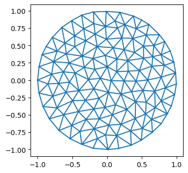
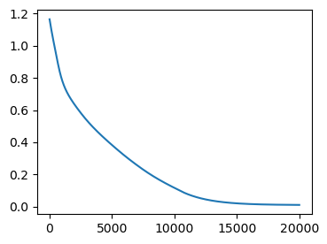
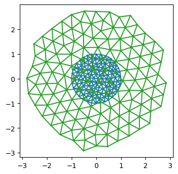
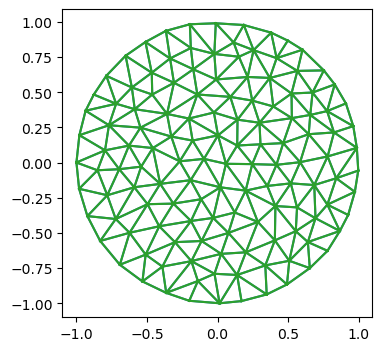
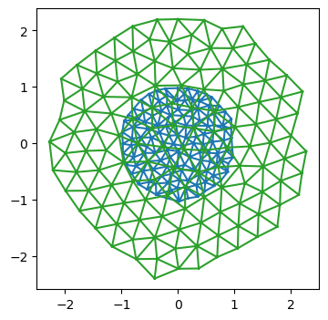

# Tutorial: Mesh optimization and inverse problems (toy examples)


Let’s start with a simple test case to see `triangulax` in action. The
goal is to move the vertices **v**<sub>*i*</sub> of a triangulation so
that all triangle edge lengths are as close to some ℓ<sub>0</sub> as
possible. We specify a pseudo-energy
*E*({**v**<sub>*i*</sub>}<sub>*i*</sub>; ℓ<sub>0</sub>) = ∑<sub>*i**j*</sub>(|**v**<sub>*i*</sub> − **v**<sub>*j*</sub>| − ℓ<sub>0</sub>)<sup>2</sup>,
and then minimize it using the gradients w.r.t the vertex positions,
computed with JAX.

This defines the “forward pass” of our “dynamical” model. In a second
step, we can meta-optimize over the model parameters (here
ℓ<sub>0</sub>), to “learn” the dynamics that generate a desired shape.

<!-- WARNING: THIS FILE WAS AUTOGENERATED! DO NOT EDIT! -->

``` python
import numpy as np
import matplotlib.pyplot as plt

import copy

from tqdm.notebook import tqdm
```

``` python
import jax
import jax.numpy as jnp
```

``` python
jax.config.update("jax_enable_x64", True)
jax.config.update("jax_debug_nans", True)
jax.config.update('jax_log_compiles', False)
```

``` python
import diffrax
import equinox as eqx

# equinox has automated "filtering" of JAX-transforms. So we can work with objects which are not just pytrees of arrays
# (like neural networks) and appy jit, vmap etc
```

``` python
from jaxtyping import Float

from typing import Tuple
import dataclasses
import functools
```

``` python
# import previously defined modules

from triangulax import trigonometry as trg
from triangulax import mesh as msh
from triangulax.triangular import TriMesh
from triangulax.mesh import HeMesh, GeomMesh
from triangulax import geometry as geom
from triangulax import linops as lin
```

**Load example mesh**

``` python
mesh = TriMesh.read_obj("tutorial_meshes/disk.obj", dim=2)
hemesh = HeMesh.from_triangles(mesh.vertices.shape[0], mesh.faces)
geommesh = GeomMesh(vertices=mesh.vertices)

hemesh
```

    Warning: readOBJ() ignored non-comment line 3:
      o flat_tri_ecmc

    HeMesh(N_V=131, N_HE=708, N_F=224)

``` python
fig = plt.figure(figsize=(4, 4))
plt.triplot(*geommesh.vertices.T, mesh.faces)
plt.axis("equal");
```



### Forward pass - minimize energy

We write the energy_function using a
[`GeomMesh`](https://nikolas-claussen.github.io/triangulax/src/halfedge_datastructure.html#geommesh)
as an argument, which serves as wrapper for the various arrays that
describe mesh geometry and properties.

``` python
@jax.jit
def energy_function(geommesh: GeomMesh, hemesh: HeMesh, ell_0: float=1):
    edge_lengths = geom.get_he_length(geommesh.vertices, hemesh)
    edge_energy = jnp.mean((edge_lengths/ell_0-1)**2) # this way, term is "auto-normalized"
    # let's add a term for the triangle areas. Use the oriented area to penalize invalid mesh configurations
    a_0 = (np.sqrt(3)/4) * ell_0**2 # area of equilateral triangle
    tri_area = geom.get_oriented_triangle_areas(geommesh.vertices, hemesh)
    area_energy = jnp.mean((tri_area/a_0-1)**2)
    #jax.debug.print("E_l: {E_l}, E_a: {E_a}",  E_l=edge_energy, E_a=area_energy)
    # this is how you can print inside a JITed-function
    return edge_energy + area_energy
```

``` python
val, grad = jax.value_and_grad(energy_function)(geommesh, hemesh) # computing value and gradient of the energy
val, grad, grad.vertices.shape # the gradient is another GeomMesh. 1.60519339
```

    (Array(1.60519339, dtype=float64),
     GeomMesh(D=2, N_V=131, N_HE=N/A, N_F=N/A),
     (131, 2))

``` python
connectivity_grad = jax.grad(energy_function, argnums=1, allow_int=True)(geommesh, hemesh)
# we can even compute the gradient w.r.t to the connectivity matrix. It is also a HeMesh
connectivity_grad, connectivity_grad.dest[0] # whatever that means
```

    (HeMesh(N_V=131, N_HE=708, N_F=224), np.void((b'',), dtype=[('float0', 'V')]))

#### Energy optimization

Let’s follow the patterns described in the JAX tutorial to write a
simulation time-stepping loop.

``` python
# time-stepping function
@jax.jit
def make_step(geommesh: GeomMesh, hemesh: HeMesh,
              current_time: Float[jax.Array, ""], next_time: Float[jax.Array, ""], ell_0: float = 1):
    loss, grad = jax.value_and_grad(energy_function)(geommesh, hemesh, ell_0=ell_0)
    updated_vertices = geommesh.vertices - (next_time-current_time)*grad.vertices
    geommesh = dataclasses.replace(geommesh, vertices=updated_vertices)
    return (geommesh, hemesh), loss # explicitly return the hemesh - may need to be updated by flips!
```

``` python
# simulation timesteps
step_size = 0.02
N_steps = 20000
timepoints = step_size * jnp.arange(N_steps) 

# parameters of the energy
ell_0 = 0.5

# inital condition
init = ((geommesh, hemesh), timepoints[0])

# scanning function - applied at each time-step
def scan_function(carry, next_time: jax.Array):
    (geommesh, hemesh), current_time = carry 
    (geommesh, hemesh), loss = make_step(geommesh, hemesh, current_time, next_time, ell_0=ell_0)
    return ((geommesh, hemesh), next_time), loss # log the loss/energy
```

``` python
# run the simulation
((geommesh_optimized, hemesh_optimized), _), loss = jax.lax.scan(scan_function, init, timepoints)
```

``` python
fig = plt.figure(figsize=(4, 3))
plt.plot(loss)
```



``` python
fig = plt.figure(figsize=(4, 4))
plt.triplot(*geommesh.vertices.T, hemesh.faces)
plt.triplot(*geommesh_optimized.vertices.T, hemesh_optimized.faces)
plt.axis("equal");
```



#### Using an ODE solver - `diffrax`

Above, we implemented “gradient descent” for the pseudo-energy, or,
equivalently, a basic forward-Euler scheme for the ODE
∂<sub>*t*</sub>**v**<sub>*i*</sub> = −∇<sub>**v**<sub>*i*</sub></sub>*E*.
For more complicated models, and to minimize coding effort, it makes
sense to use a pre-made ODE solver instead. The `diffrax` library
implements ODE and SDE solvers in JAX and is compatible with autodiff
(you can differentiate through the solver), since it was designed for
neural differential equations.

For “adiabatic” dynamics, which involve minimizing an energy at every
time step, we can use the `optimistix` library.

The below is based on the [Stepping through a
solver](https://docs.kidger.site/diffrax/usage/manual-stepping/)
tutorial in `diffrax`. The reason we want to step through the solver
one-by-one is to carry out T1s (in future simulations).

``` python
# define the RHS for the ODE solver
@jax.jit
def vector_field(t, y, args):
    return jax.tree_util.tree_map(lambda x: -1*x, jax.grad(energy_function)(y, *args))
term = diffrax.ODETerm(vector_field)

# define time parameters and initial condition
dt = 0.05
t0 = 0.0
t1 = 1000.0
step_times = jnp.arange(t0, t1, dt)

y0 = geommesh
args = (hemesh, ell_0)

# initialize the solver
solver = diffrax.Tsit5()
y = y0
state = solver.init(term, t0, t0+dt, y0, args)
```

    /Users/nc1333/miniforge3/envs/triangulax/lib/python3.14/site-packages/equinox/_eval_shape.py:35: UserWarning: A JAX array is being set as static! This can result in unexpected behavior and is usually a mistake to do.
      return _dynamic_out, Static(_static_out)

``` python
solver.step(term, t0, t0, t0+dt, y, args, state)
```

    TypeError: unsupported operand type(s) for |: 'HeMesh' and 'tuple'
    ---------------------------------------------------------------------------
    TypeError                                 Traceback (most recent call last)
    Cell In[36], line 1
    ----> 1 solver.step(term, t0, t0, t0+dt, y, args, state)

        [... skipping hidden 1 frame]

    File ~/miniforge3/envs/triangulax/lib/python3.14/site-packages/diffrax/_solver/runge_kutta.py:685, in AbstractRungeKutta.step(self, terms, t0, t1, y0, args, solver_state, made_jump)
        683 assert solver_state is not None
        684 first_step, f0 = solver_state
    --> 685 eval_first_stage = eqxi.unvmap_any(first_step | made_jump)
        686 init_stage_index = jnp.where(eval_first_stage, 0, 1)
        687 # We do `fs.at[0].set(f0)` below. If we're actually going to evaluate the
        688 # first stage, then zero out `f0` so that that is a no-op.

    TypeError: unsupported operand type(s) for |: 'HeMesh' and 'tuple'

``` python
# scan through the solve

def scan_fun(carry, t):
    state, y, tprev = carry 
    y, _, _, state, _ = solver.step(term, tprev, t, y, args, state, made_jump=False)
    return (state, y, t), None

init = (state, y0, t0)
(state, y, t), _ = jax.lax.scan(scan_fun, init, step_times[1:])
```

    /Users/nc1333/miniforge3/envs/triangulax/lib/python3.14/site-packages/equinox/_ad.py:708: UserWarning: A JAX array is being set as static! This can result in unexpected behavior and is usually a mistake to do.
      closure_converted = _ClosureConvert(
    /Users/nc1333/miniforge3/envs/triangulax/lib/python3.14/site-packages/equinox/_make_jaxpr.py:41: UserWarning: A JAX array is being set as static! This can result in unexpected behavior and is usually a mistake to do.
      return _out_dynamic, Static(_out_static)

    UnexpectedTracerError: Found a JAX Tracer object passed as an argument to a custom_vjp function in a position indicated by nondiff_argnums as non-differentiable. Tracers cannot be passed as non-differentiable arguments to custom_vjp functions; instead, nondiff_argnums should only be used for arguments that can't be or contain JAX tracers, e.g. function-valued arguments. In particular, array-valued arguments should typically not be indicated as nondiff_argnums.
    See https://docs.jax.dev/en/latest/errors.html#jax.errors.UnexpectedTracerError
    ---------------------------------------------------------------------------
    UnexpectedTracerError                     Traceback (most recent call last)
    Cell In[19], line 9
          6     return (state, y, t), None
          8 init = (state, y0, t0)
    ----> 9 (state, y, t), _ = jax.lax.scan(scan_fun, init, step_times[1:])

        [... skipping hidden 10 frame]

    Cell In[19], line 5, in scan_fun(carry, t)
          3 def scan_fun(carry, t):
          4     state, y, tprev = carry 
    ----> 5     y, _, _, state, _ = solver.step(term, tprev, t, y, args, state, made_jump=False)
          6     return (state, y, t), None

        [... skipping hidden 1 frame]

    File ~/miniforge3/envs/triangulax/lib/python3.14/site-packages/diffrax/_solver/runge_kutta.py:1149, in AbstractRungeKutta.step(***failed resolving arguments***)
       1142 const_result = const_result_sentinel = object()
       1143 # Needs to be an `eqxi.while_loop` as:
       1144 # (a) we may have variable length: e.g. an FSAL explicit RK scheme will have one
       1145 #     more stage on the first step.
       1146 # (b) to work around a limitation of JAX's autodiff being unable to express
       1147 #     "triangular computations" (every stage depends on all previous stages)
       1148 #     without spurious copies.
    -> 1149 final_val = eqxi.while_loop(
       1150     cond_stage,
       1151     rk_stage,
       1152     init_val,
       1153     max_steps=num_stages,
       1154     buffers=buffers,
       1155     kind="checkpointed" if self.scan_kind is None else self.scan_kind,
       1156     checkpoints=num_stages,
       1157     base=num_stages,
       1158 )
       1159 _, y1, f1_for_fsal, _, _, fs, ks, result = final_val
       1160 assert const_result is not const_result_sentinel

    File ~/miniforge3/envs/triangulax/lib/python3.14/site-packages/equinox/internal/_loop/loop.py:107, in while_loop(***failed resolving arguments***)
        105 elif kind == "checkpointed":
        106     del kind, base
    --> 107     return checkpointed_while_loop(
        108         cond_fun,
        109         body_fun,
        110         init_val,
        111         max_steps=max_steps,
        112         buffers=buffers,
        113         checkpoints=checkpoints,
        114     )
        115 elif kind == "bounded":
        116     del kind, checkpoints

    File ~/miniforge3/envs/triangulax/lib/python3.14/site-packages/equinox/internal/_loop/checkpointed.py:249, in checkpointed_while_loop(***failed resolving arguments***)
        247 body_fun_ = filter_closure_convert(body_fun_, init_val_)
        248 vjp_arg = (init_val_, body_fun_)
    --> 249 final_val_ = _checkpointed_while_loop(
        250     vjp_arg, cond_fun_, checkpoints, buffers_, max_steps
        251 )
        252 _, _, _, final_val = _stop_gradient_on_unperturbed(init_val_, final_val_, body_fun_)
        253 return final_val

        [... skipping hidden 3 frame]

    File ~/miniforge3/envs/triangulax/lib/python3.14/site-packages/jax/_src/custom_derivatives.py:830, in _check_for_tracers(x)
        822 if isinstance(leaf, core.Tracer):
        823   msg = ("Found a JAX Tracer object passed as an argument to a custom_vjp "
        824         "function in a position indicated by nondiff_argnums as "
        825         "non-differentiable. Tracers cannot be passed as non-differentiable "
       (...)    828         "e.g. function-valued arguments. In particular, array-valued "
        829         "arguments should typically not be indicated as nondiff_argnums.")
    --> 830   raise UnexpectedTracerError(msg)

    UnexpectedTracerError: Found a JAX Tracer object passed as an argument to a custom_vjp function in a position indicated by nondiff_argnums as non-differentiable. Tracers cannot be passed as non-differentiable arguments to custom_vjp functions; instead, nondiff_argnums should only be used for arguments that can't be or contain JAX tracers, e.g. function-valued arguments. In particular, array-valued arguments should typically not be indicated as nondiff_argnums.
    See https://docs.jax.dev/en/latest/errors.html#jax.errors.UnexpectedTracerError

``` python
fig = plt.figure(figsize=(4, 4))
plt.triplot(*y0.vertices.T, hemesh.faces)
plt.triplot(*y.vertices.T, hemesh.faces)
plt.axis("equal");
```



### Backward pass - inverse problem

One use case for JAX is *differentiating through* a scientific
simulation to optimize the simulation parameters towards some desired
behavior. For example, we may wish to find a triangulation dynamics that
creates some target shape.

As a toy example, let’s take the above “dynamics” which minimizes the
pseudo-energy to make all triangles equilateral. It depends on the
parameter ℓ<sub>0</sub>. Relaxation of the pseudo-energy for some number
of steps defines our “forward pass”. Let’s optimize ℓ<sub>0</sub> so
that the mesh has some target size at the end of the energy relaxation
(of course, this is a contrived problem, since we know the solution from
the start).

First, we wrap our dynamical model as an `eqx.Module`, so we can
optimize it just like a neural net.

``` python
class RelaxationDynamics(eqx.Module):
    ell_0: jax.Array
    step_size : float = eqx.field(static=True)
    N_steps : int = eqx.field(static=True)

    def __call__(self, initial_geommesh: GeomMesh, initial_hemesh: HeMesh) -> Tuple[GeomMesh, HeMesh]:
        init = ((initial_geommesh, initial_hemesh), 0)
        def scan_fun(i, carry):
            (geommesh, hemesh), _ = carry
            return make_step(geommesh, hemesh, ell_0=self.ell_0,
                             current_time=i*self.step_size, next_time=(i+1)*self.step_size)
        (geommesh_optimized, hemesh_optimized), _ = jax.lax.fori_loop(0, N_steps, scan_fun, init, unroll=None)
        return geommesh_optimized, hemesh_optimized
```

#### Define Meta-training loss

Now we need to define our meta-training loss. In this case, it’s just
the deviation of the average edge length from the total. Note how the
meta-loss is *distinct* from the pseudo-energy we minimize during the
forward pass.

Let’s use the `equinox` library to handle our problem, in anticipation
of more complex ones down the line.

``` python
# define the meta-loss

def meta_loss(model: RelaxationDynamics, initial_geommesh: GeomMesh, initial_hemesh: HeMesh,  meta_ell0: float) -> float:
    geommesh_optimized, hemesh_optimized = model(initial_geommesh, initial_hemesh)
    lengths = geom.get_he_length(geommesh_optimized.vertices,  hemesh_optimized)
    return jnp.mean((lengths/meta_ell0-1)**2)
```

``` python
# initialize the model, and test the meta loss

initial_ell0 = 0.4
meta_ell0 = 0.3

model_initial = RelaxationDynamics(ell_0=jnp.array([initial_ell0]), step_size=step_size, N_steps=N_steps)
model_initial(geommesh, hemesh), meta_loss(model_initial, geommesh, hemesh, meta_ell0=meta_ell0)
```

    ((GeomMesh(D=2, N_V=131, N_HE=N/A, N_F=N/A),
      HeMesh(N_V=131, N_HE=708, N_F=224)),
     Array(0.13074658, dtype=float64))

#### Batching

To evaluate the loss, we want to average over a bunch of initial
conditions. These are analogous to *batches* in a normal ML problem.

``` python
## Let's create a bunch of meshes with different initial positions and see if we can batch over them using vmap

key = jax.random.key(0)
sigma = 0.02
N_batch = 3

batch_geom = []
batch_he = []
for i in range(N_batch):
    key, subkey = jax.random.split(key)
    random_noise = jax.random.normal(subkey, shape=geommesh.vertices.shape)
    batch_geom.append(dataclasses.replace(geommesh, vertices=geommesh.vertices+sigma*random_noise))
    batch_he.append(copy.copy(hemesh))

# we use a jax.tree.map to "push" the list axis into the underlying arrays.
# the result is a single mesh object with batch axes

batch_he_array = msh.tree_stack(batch_he)
batch_geom_array = msh.tree_stack(batch_geom)

batch_geom_array, batch_geom_array.vertices.shape
```

    (GeomMesh(D=2, N_V=3, N_HE=N/A, N_F=3), (3, 131, 2))

``` python
# We can apply the simulation and upack the results into a list

batch_geom_array_out, batch_he_array_out = jax.vmap(model_initial)(batch_geom_array, batch_he_array) 
batch_geom_out = msh.tree_unstack(batch_geom_array_out)
batch_he_out = msh.tree_unstack(batch_he_array_out)
```

``` python
# still works

i = 2
fig = plt.figure(figsize=(4, 4))
plt.triplot(*batch_geom[i].vertices.T, batch_he[i].faces)
plt.triplot(*batch_geom_out[i].vertices.T, batch_he_out[i].faces)
plt.axis("equal");
```



##### Compute the batched loss

``` python
# This is the right way to vmap the loss
jax.vmap(meta_loss, in_axes=(None, 0, 0, None))(model_initial, batch_geom_array, batch_he_array, 0.8)
```

    Array([0.24862355, 0.24863542, 0.24863226], dtype=float64)

``` python
# check against non-vmapped version. pretty similar, floating point errors likely at origin of differences
[meta_loss(model_initial, batch_geom_out[i], batch_he_out[i], 0.8) for i in range(3)]
```

    [Array(0.24848931, dtype=float64),
     Array(0.24848805, dtype=float64),
     Array(0.2484898, dtype=float64)]

#### Meta-optimization

Now we are in a position to “optimize” our model parameter `ell_0`.
Based on [equinox CNN
tutorial](https://docs.kidger.site/equinox/examples/mnist/#training).

``` python
def batched_meta_loss(model, batch_geom_array, batch_he_array, meta_ell0):
    return jnp.mean(jax.vmap(meta_loss, in_axes=(None, 0,0, None))(model, batch_geom_array, batch_he_array, meta_ell0))

batched_meta_loss_jit = jax.jit(batched_meta_loss)
```

``` python
# hyper-parameters for the outer learning step.

LEARNING_RATE = 1e-2
LEARNING_STEPS = 20
print_every = 2

step_size = 0.01
N_steps = 20000

META_ELL0 = 0.4
initial_ell0 = 0.2

model_initial = RelaxationDynamics(ell_0=jnp.array([initial_ell0]), step_size=step_size, N_steps=N_steps)
```

``` python
loss, grads = eqx.filter_jit(eqx.filter_value_and_grad(batched_meta_loss))(model_initial,
                                                                           batch_geom_array,
                                                                           batch_he_array,
                                                                           META_ELL0)

loss, grads, grads.ell_0
```

    (Array(0.24848878, dtype=float64),
     RelaxationDynamics(ell_0=f64[1], step_size=0.01, N_steps=20000),
     Array([-2.48070057], dtype=float64))

#### Forward and reverse mode autodiff

Since we are differentiation w.r.t. a small number of parameters (just
1: ℓ<sub>0</sub>), we can use forward mode automatic differentiation for
increased efficiency. This may be the case more generally: if we want to
learn “translationally invariant” models, where the parameters for all
cells are equal, the parameter count we want to differentiate by may be
small. Forward mode autodiff is also somewhat more “forgiving” when it
comes to control flow.

See: https://docs.jax.dev/en/latest/notebooks/autodiff_cookbook.html

``` python
@eqx.filter_jit
def outer_optimizer_step(model: RelaxationDynamics,
                         batch_geom: GeomMesh, batch_he: HeMesh) -> Tuple[RelaxationDynamics, float]:
    
    # compute loss and grad on batch
    loss, grads = eqx.filter_value_and_grad(batched_meta_loss)(model, batch_geom_array, batch_he_array, META_ELL0)
    updates = jax.tree.map(lambda g: None if g is None else -LEARNING_RATE * g, grads)
    model = eqx.apply_updates(model, updates)
    # grads is a PyTree with the same leaves as the trainable arrays of the model

    # same story, but using forward mode autodiff
    #loss, grads = eqx.filter_jvp(lambda model: batched_meta_loss(model, batch_geom_array, batch_he_array, META_ELL0),
    #                             primals=[model,], tangents=[model,])
    #grads = grads/model.ell_0 # we used the current model values as a tangent vector, so we need to normalize
    #model = dataclasses.replace(model, ell_0=model.ell_0-LEARNING_RATE*grads)
    
    return model, loss
```

``` python
model = model_initial

for step in tqdm(range(LEARNING_STEPS)): # in the future, could also iterate over the initial conditions/batches
    model, loss = outer_optimizer_step(model, batch_geom_array, batch_he_array)
    if (step % print_every) == 0:
        print(f"Step: {step}, loss: {loss}, param: {model.ell_0}")

# 19s with forward mode vs 32s with reverse mode.
```

      0%|          | 0/20 [00:00<?, ?it/s]

    Step: 0, loss: 0.24848877513396528, param: [0.22480701]
    Step: 2, loss: 0.14704976288187882, param: [0.26531774]
    Step: 4, loss: 0.08837946252729935, param: [0.29610925]
    Step: 6, loss: 0.05458715535792712, param: [0.31944763]
    Step: 8, loss: 0.03524215346058218, param: [0.33709312]
    Step: 10, loss: 0.02417654272859851, param: [0.35045283]
    Step: 12, loss: 0.01779509451762013, param: [0.36062556]
    Step: 14, loss: 0.014058191845006396, param: [0.36843856]
    Step: 16, loss: 0.01182824053575723, param: [0.37449757]
    Step: 18, loss: 0.010471449413490624, param: [0.37924151]

### Next steps

Looks good - the optimizer converges to the correct value of
ℓ<sub>0</sub>. We have solved our toy problem. The next tutorials
simulate more interesting physical models using `triangulax`, and
tutorial 6 looks at a non-trivial inverse problem (design of a
shape-shifting material).
