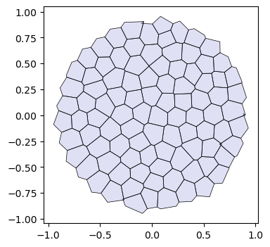
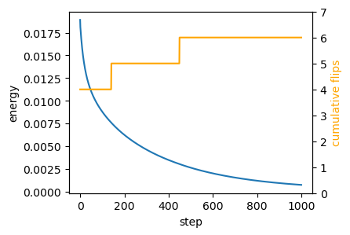
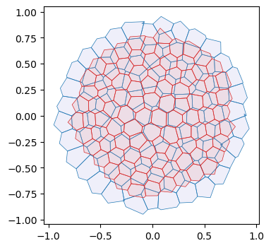
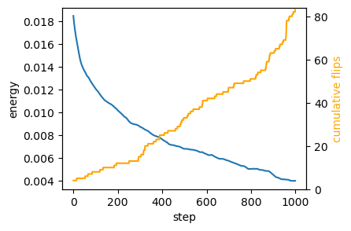
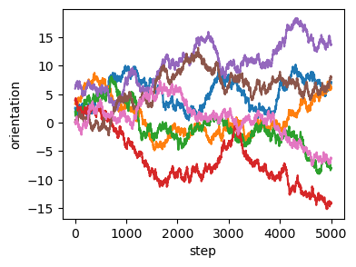
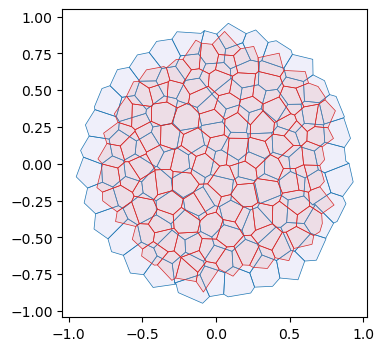
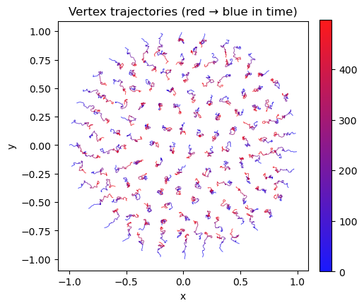
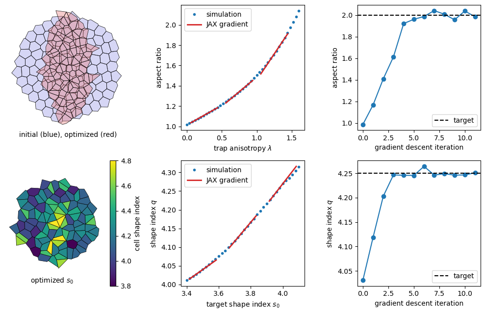

# Tutorial: Self-propelled Voronoi model


After the toy example of notebook 05, let’s implement a slightly more
complicated model, the self-propelled Voronoi area-perimeter Voronoi
(SVP) model of [Bi et al.,
2016](https://journals.aps.org/prx/abstract/10.1103/PhysRevX.6.021011).
This 2D model comprises most of the ingredients we will see in more
general tissue mechanics simulations, from a coding perspective.

In brief, in the SVP, cells are modeled as the Voronoi tesselation for a
series of centroids **v**<sub>*i*</sub> (our triangulation vertices).
Their overdamped dynamics comprises two terms: self-propulsion and
relaxation of an elastic energy:
$$\partial_t \mathbf{v}\_i = -\nabla\_{\mathbf{v}\_i} E\_{AP} + v_0 \hat{\mathbf{n}}\_i$$
For each cell *i*, $\hat{\mathbf{n}}\_i$ is a unit vector (so we will
represent it by an angle *θ*<sub>*i*</sub>) that determines the
direction of motion. Units of time are chosen so that the coefficient of
∇*E*<sub>*A**P*</sub> is 1. The energy is defined in terms of the
Voronoi area *a*<sub>*i*</sub> and Voronoi perimeter *p*<sub>*i*</sub>
of each cell:
*E*<sub>*A**P*</sub> = ∑<sub>*i*</sub>*k*<sub>*a*</sub>(*a*<sub>*i*</sub> − *a*<sub>0</sub>)<sup>2</sup> + *k*<sub>*p*</sub>(*p*<sub>*i*</sub> − *p*<sub>0</sub>)<sup>2</sup>
where *k*<sub>*a*</sub>, *k*<sub>*p*</sub> are elastic constants, and
*a*<sub>0</sub>, *p*<sub>0</sub> are the target area and perimeter. They
define the “shape index” $s_0= p_0/\sqrt{a_0}$. The key physics is that
above a critical shape index *s*<sub>0</sub><sup>\*</sup>, the model has
a degenerate set of ground states, since for a large *p*<sub>0</sub>,
there are many polygons with the given target area and perimeter (think
floppy balloon).

The orientation *θ*<sub>*i*</sub> of each cell is also dynamic. It
undergoes rotational diffusion:
*d**θ*<sub>*i*</sub> = *D*<sub>*θ*</sub>*d**W*<sub>*t*, *i*</sub>
where *d**W*<sub>*t*, *i*</sub> is Brownian motion, independent for each
cell *i*, and *D*<sub>*θ*</sub> is the diffusion constant.

#### Numerics

The cell array connectivity will be represented by a
[`HeMesh`](https://nikolas-claussen.github.io/triangulax/src/halfedge_datastructure.html#hemesh)
(see notebook 01). The geometry is fully described by the triangulation
vertex positions, the Voronoi cell centroids. We also need a scalar
vertex attribute for the angle *θ*<sub>*i*</sub>. To calculate the
energy *E*<sub>*A**P*</sub>, we obtain Voronoi area and perimeter using
the `linops` module. Boundary cells can be handled by “mirroring”, i.e.,
all corners count twice when computing the area/perimeter. Given the
energy, JAX autodiff gives us the gradients. To time-evolve the mesh
geometry, we can use `diffrax`, like in notebook 05. `diffrax` can also
deal with SDEs, like the Langevin equation for cell angles.

**Note** This notebook is an example, and not meant to be numerically
efficient!

<!-- WARNING: THIS FILE WAS AUTOGENERATED! DO NOT EDIT! -->

``` python
from typing import Tuple

import dataclasses
import copy

import numpy as np

import matplotlib.pyplot as plt
import matplotlib as mpl

import jax
import jax.numpy as jnp

import diffrax
import lineax

from jaxtyping import Float, Bool, Int
from enum import IntEnum

import functools
```

``` python
jax.config.update("jax_enable_x64", True)
jax.config.update("jax_debug_nans", True)
jax.config.update("jax_log_compiles", False)
jax.config.update("jax_disable_jit", False)
```

``` python
from triangulax import trigonometry as trig
from triangulax.triangular import TriMesh
from triangulax import mesh as msh
from triangulax.mesh import HeMesh, GeomMesh
from triangulax.topology import flip_by_id
from triangulax import adjacency as adj
from triangulax import geometry as geom
```

``` python
from importlib import reload

#reload(msh)
#reload(trig)
```

### Read in test data

``` python
mesh = TriMesh.read_obj("tutorial_meshes/disk.obj", dim=2) # try disk_fine for an example with 10x more cells
hemesh = HeMesh.from_triangles(mesh.vertices.shape[0], mesh.faces)
geommesh = GeomMesh(vertices=mesh.vertices)
geommesh = geom.set_voronoi_face_positions(geommesh, hemesh)

hemesh, geommesh
```

    Warning: readOBJ() ignored non-comment line 3:
      o flat_tri_ecmc

    (HeMesh(N_V=131, N_HE=708, N_F=224), GeomMesh(D=2, N_V=131, N_HE=N/A, N_F=224))

``` python
fig, ax = plt.subplots(figsize=(4, 4))
ax.add_collection(msh.cellplot(hemesh, geommesh.face_positions,
                               cell_colors=np.array([0.7, 0.7, 0.9, 0.4]),
                               mpl_polygon_kwargs={"lw": 0.5, "ec": "k"}))
ax.set_aspect("equal")
ax.autoscale_view();
```



### A note on periodic boundary conditions

The mesh we just loaded is a disk, and thus has a boundary. You may
instead want to do simulations with *periodic* boundary conditions,
i.e. simulate cells in a box with lengths
**L** = \[*L*<sub>*x*</sub>, *L*<sub>*y*</sub>\] where opposite sides
are identified. The tools for this are implemented in the `periodic`
module.

In `triangulax`, mesh connectivity and geometry are decoupled, so
periodic boundary conditions are easy to implement. You need two
ingredients:

1.  A triangulation whose connectivity has the desired periodicity
    (e.g. a triangulation of a torus).

There are different ways to generate a triangulation of the torus - one
example is included in `test_meshes/torus_2d.obj`. Note: doing edge
flips/T1 on this mesh will preserve its topology, no further bookkeeping
needed. In particular, one does not need to keep track of any boundary
vertices. There is no boundary! All `triangulax` tools related to the
mesh connectivity (like the
[`HeMesh`](https://nikolas-claussen.github.io/triangulax/src/halfedge_datastructure.html#hemesh)
class) can be used without modification.

2.  A distance function that takes into account the periodicity.

For a rectangular domain with lengths
**L** = \[*L*<sub>*x*</sub>, *L*<sub>*y*</sub>\], the displacement
vector between two points **r**<sub>1</sub>, **r**<sub>2</sub> can be
computed like this:

``` python
def displacement_periodic(r_1, r_2, L):
    d = r_2 – r_1
    return d – L*jnp.round(d/L)
```

This always gives the shortest displacement vector between the two
points. With this distance function, you can compute edge lengths,
angles, Voronoi duals, etc.

For a domain twisted/sheared along the *x*-axis by an amount *s* (i.e. a
torus where (*x*, *y*) and
(*x* + *s**L*<sub>*x*</sub>, *y* + *L*<sub>*y*</sub>) are identified),
the distance function becomes

``` python
def displacement_periodic_twisted(r_1, r_2, L, s):
    d = r_2 – r_1
    twist = s * L[0] * jnp.round(d[1] / L[1]) # compute the amount of twist
    d = d.at[0].set(d[0] + twist)
    return d – L*jnp.round(d/L)
```

Note: nothing prevents you from changing the shape of your domain,
i.e. **L**, *s* dynamically during your simulation! You can even take
gradients with respect to them.

``` python
# this is an example of a 2d mesh with "periodic boundary conditions" - topologically, it is just a torus.
# you can see the faces that wrap around the boundary.

import igl

vertices, _, _, faces, _, _ = igl.readOBJ("tutorial_meshes/torus_2d.obj")

plt.triplot(vertices[:,0], vertices[:,1], faces, lw=0.5, color="k")
plt.axis("equal")
```

    (np.float64(-0.028125350000000004),
     np.float64(1.04895835),
     np.float64(0.03749965),
     np.float64(1.04583335))


``` python
igl.boundary_loop_all(faces) # the mesh has no boundary
```

    []

### Voronoi geometry and area-perimeter energy

``` python
def get_voronoi_perimeters(vertices: Float[jax.Array, "n_vertices dim"], hemesh: msh.HeMesh) -> Float[jax.Array, " n_vertices"]:
    """Compute Voronoi perimeters for each vertex."""
    voronoi_lengths = geom.get_voronoi_edge_lengths(vertices, hemesh)
    cell_perims = adj.sum_he_to_vertex_incoming(hemesh, voronoi_lengths)
    return cell_perims
```

``` python
@jax.jit
def energy_ap(geommesh: GeomMesh, hemesh: HeMesh, a0: float, p0: float,
              k_a: float = 1.0, k_p: float = 1.0, k_penalty: float = 1e4) -> Float[jax.Array, ""]:
    """Area-perimeter energy for Voronoi cells.

    Adds a penalty for thin or inverted triangles (area < a0/8). It acts as a short-range repulsion
    between cell centers and keeps a vertex from crossing an edge, which edge flips cannot undo.
    `k_penalty` must be large enough that the penalty force can balance the self-propulsion.
    """
    cell_areas = geom.get_voronoi_areas(geommesh.vertices, hemesh)    
    cell_perimeters = get_voronoi_perimeters(geommesh.vertices, hemesh)
    tri_areas = geom.get_oriented_triangle_areas(geommesh.vertices, hemesh)
    # add a factor 2x for boundary vertices to account for missing triangles
    cell_areas = jnp.where(hemesh.is_bdry, 2.0 * cell_areas, cell_areas)
    cell_perimeters = jnp.where(hemesh.is_bdry, 2.0 * cell_perimeters, cell_perimeters)

    a_min = 0.25*(a0/2)
    penality = jnp.where(tri_areas < a_min, k_a * (tri_areas-a_min)**2, 0.0).mean()

    return k_a*jnp.mean((cell_areas-a0)**2) + k_p * jnp.mean((cell_perimeters-p0)**2) + k_penalty*penality
```

``` python
cell_areas, cell_perimeters = (geom.get_voronoi_areas(geommesh.vertices, hemesh),
                               get_voronoi_perimeters(geommesh.vertices, hemesh))

a_mean, p_mean = (cell_areas[~hemesh.is_bdry].mean(), cell_perimeters[~hemesh.is_bdry].mean())
a_mean, p_mean, p_mean/np.sqrt(a_mean)
```

    (Array(0.02756258, dtype=float64),
     Array(0.63463959, dtype=float64),
     Array(3.82267399, dtype=float64))

``` python
_ = jax.block_until_ready(energy_ap(geommesh, hemesh, a0=a_mean, p0=3*jnp.sqrt(a_mean)))
```

    66.5 μs ± 1.14 μs per loop (mean ± std. dev. of 7 runs, 10,000 loops each)

``` python
grad_energy = jax.jit(jax.grad(energy_ap))
```

``` python
_ = jax.block_until_ready(grad_energy(geommesh, hemesh, a0=a_mean, p0=3*jnp.sqrt(a_mean)))
```

    202 μs ± 38 μs per loop (mean ± std. dev. of 7 runs, 1 loop each)

### Edge flips

After each time step, we need to check if the Voronoi edge lengths are
below some threshold (the edge lengths can be computed on the fly), and,
if so, we need to carry out edge flips. In vertex models, one often
wants to avoid “re-flipping” an edge, which can be done via a “cool
down” period (an edge flipped at step *t* cannot be flipped again for
the next few steps).

**For the Voronoi model, the cooldown should be 0** (and
`l_min_T1 = 0`). A negative Voronoi edge length is exactly the Delaunay
criterion, and the energy is continuous across the flip, so re-flipping
an edge is harmless. A cooldown, on the other hand, keeps non-Delaunay
edges in the mesh. The triangles adjacent to such an edge can become
arbitrarily thin, so their circumcenters (the Voronoi vertices) run off
to infinity. The cooldown can be useful if you want to implement extra
dynamics on cell edges after a T1.

``` python
@functools.partial(jax.jit, static_argnames=['cooldown_steps', 'max_flips'])
def apply_flips(geommesh: GeomMesh, hemesh: HeMesh, l_min_T1: float, 
                cooldown_counter: Int[jax.Array, " n_hes"], cooldown_steps: int, max_flips: int = 10
                ) -> Tuple[HeMesh, Int[jax.Array, " n_hes"], Bool[jax.Array, " n_hes"],]:
    """
    Apply T1 edge flips with a per-edge cooldown.
    
    Flipps edges if they are shorter than l_min_T1. Bondary edges are not flipped.

    Only flips the max_flips shortest edges for efficiency.
    """
    edge_lengths = geom.get_voronoi_edge_lengths(geommesh.vertices, hemesh)

    allow_flip = (cooldown_counter == 0) & hemesh.is_unique & ~hemesh.is_bdry_edge
    edge_lengths = jnp.where(allow_flip, edge_lengths, jnp.inf)
    ids = jnp.argsort(edge_lengths)[:max_flips]
    
    hemesh_next = flip_by_id(hemesh, ids, edge_lengths[ids] < l_min_T1)
    did_flip = (edge_lengths < l_min_T1) & (edge_lengths < edge_lengths[ids[-1]])    
    cooldown_counter = jnp.where(did_flip, cooldown_steps, jnp.clip(cooldown_counter-1, 0))

    return hemesh_next, cooldown_counter, did_flip
```

``` python
hemesh_next, cooldown_counter, did_flip = apply_flips(geommesh, hemesh, l_min_T1=0.0,
                                                      cooldown_counter=0*jnp.ones(hemesh.n_hes),
                                                      cooldown_steps=1, max_flips=10)
did_flip.sum()
```

    Array(4, dtype=int64)

``` python
_ = apply_flips(geommesh, hemesh, l_min_T1=0.0, cooldown_counter=jnp.zeros(hemesh.n_hes, dtype=jnp.int32),
                cooldown_steps=5, max_flips=10)
```

    108 μs ± 10.6 μs per loop (mean ± std. dev. of 7 runs, 10,000 loops each)

### Energy relaxation (no self-propulsion)

We first only relax the area–perimeter energy. We also need to allow for
topological modifications of the mesh (T1s/edge flips). At every
timestep, we check if any dual cell edge has negative length and flip
it. To ensure we don’t flip the same edge multiple times, let’s use a
cooldown period.

``` python
# energy parameters
a0 = a_mean
s0 = 3
p0 = s0*jnp.sqrt(a0)

# numerical parameters
step_size = 0.02
n_steps = 10000

cooldown_steps = 0 # no cooldown for Voronoi models, see above
l_min_T1 = 0.0

cooldown_counter=0*jnp.ones(hemesh.n_hes)
```

``` python
# relax energy
@jax.jit
def relax_energy_step(geommesh: GeomMesh, hemesh: HeMesh,
              a0: float, p0: float,
              step_size: float = 0.01,
              k_a: float = 1.0, k_p: float = 1.0) -> Tuple[GeomMesh, Float[jax.Array, ""]]:
    loss, grad = jax.value_and_grad(energy_ap)(geommesh, hemesh, a0, p0, k_a, k_p)
    updated_vertices = geommesh.vertices - step_size * grad.vertices
    geommesh_updated = dataclasses.replace(geommesh, vertices=updated_vertices)
    return geommesh_updated, loss

# package simulation time step into a function for jax.lax.scan
@jax.jit
def scan_fun(carry: Tuple[GeomMesh, HeMesh, Int[jax.Array, " n_steps"]], x: Float[jax.Array, " n_steps"]):
    (geommesh_relaxed, hemesh_relaxed), cooldown_counter = carry
    # step energy
    geommesh_relaxed, loss = relax_energy_step(geommesh_relaxed, hemesh_relaxed, a0, p0, step_size=step_size)
    # carry out T1s
    hemesh_relaxed, cooldown_counter, to_flip = apply_flips(geommesh_relaxed, hemesh_relaxed, l_min_T1,
                                                            cooldown_counter, cooldown_steps)
    #to_flip = jnp.zeros(2)

    # return updated carry and metrics
    log = jnp.array([loss, to_flip.sum()])

    return ((geommesh_relaxed, hemesh_relaxed), cooldown_counter), log
```

``` python
cooldown_counter = jnp.zeros(hemesh.n_hes)
sim_steps = jnp.arange(n_steps)

init = ((geommesh, hemesh), cooldown_counter)
((geommesh_relaxed, hemesh_relaxed), _), logs = jax.lax.scan(scan_fun, init, sim_steps) 

energy, flip_count = logs.T
```

``` python
fig = plt.figure(figsize=(4, 3))
plt.plot(energy[::int(n_steps/1000)])
plt.xlabel("step")
plt.ylabel("energy")

# add a twin y axis that shows the cummulative number of flips
ax2 = plt.gca().twinx()
ax2.plot(jnp.cumsum(flip_count)[::int(n_steps/1000)], color="orange")
ax2.set_ylabel("cumulative flips", color="orange")
ax2.set_ylim([0,flip_count.sum()+1])
```



``` python
geommesh_relaxed = geom.set_voronoi_face_positions(geommesh_relaxed, hemesh_relaxed)

fig, ax = plt.subplots(figsize=(4, 4))
ax.add_collection(msh.cellplot(hemesh, geommesh.face_positions,
                               cell_colors=np.array([0.7, 0.7, 0.9, 0.2]),
                               mpl_polygon_kwargs={"lw": 0.5, "ec": "tab:blue"}))
ax.add_collection(msh.cellplot(hemesh_relaxed, geommesh_relaxed.face_positions,
                               cell_colors=np.array([0.9, 0.6, 0.6, 0.2]),
                               mpl_polygon_kwargs={"lw": 0.5, "ec": "tab:red"}))
ax.set_aspect("equal")
ax.autoscale_view();
```



## Overdamped dynamics with self-propulsion

Next, let’s add the self-propulsion term. We initialize the angles
*θ*<sub>*i*</sub> at random. We can store the angles as an extra
`vertex_attrib` in our `geommesh`, using the functionality of the
[`GeomMesh`](https://nikolas-claussen.github.io/triangulax/src/halfedge_datastructure.html#geommesh)
dataclass. We already have an `IntEnum` which we can use as keys to the
`vertex_attrib` dictionary, like described in notebook 01.

In addition to incorporating the self-propulusion term
$\partial_t \mathbf{v}\_i = -\nabla\_{\mathbf{v}\_i} E\_{AP} + v_0\hat{\mathbf{n}}\_i$,
we need to do (stochastic) time steps for the angle orientation. Let’s
do that with `diffrax`’s SDE solver, like in [this
tutorial](https://docs.kidger.site/diffrax/usage/getting-started/#stochastic-differential-equations-sdes).
Let’s also implement the “pattern” for simulation loops with
`jax.lax.scan`.

Note that the simulation still diverge if the self-propulsion is too
strong (here, for *v*<sub>0</sub> ≳ 0.05). In this case, self-propulsion
can push one cell center across an edge of the triangulation (i.e., into
a neighboring cell) within a single time step. This inverts a triangle,
which breaks the simulation. The penalty term in `energy_ap` counteracts
this up to a point.

### Random numbers in JAX

JAX takes a [different
approach](https://docs.jax.dev/en/latest/random-numbers.html) to random
numbers (and hence the noise in our SDE) than numpy. The random numbers
that will be used are specified by a `key` and will thus be reproducible
across simulations. In particular, random numbers are no impediment to
auto-differentiation; they are “frozen” when taking automatic
derivatives.

``` python
## for this model, the simulation state becomes quite complex. Let's define a dataclass to hold it.

@jax.tree_util.register_dataclass
@dataclasses.dataclass
class SimState:
    geommesh: GeomMesh
    hemesh: HeMesh
    cooldown_counter: Int[jax.Array, " n_hes"]
    tprev: Float[jax.Array, ""]
    solver_state_sp: object
    solver_state_sde: object

## we also define a dataclass to hold logging information

@jax.tree_util.register_dataclass
@dataclasses.dataclass
class Log:
    geommesh: GeomMesh
    hemesh: HeMesh
    energy: Float[jax.Array, ""]
    n_flips: Int[jax.Array, ""]
```

``` python
# initialize orientations and store as a vertex attribute

class VertexAttribs(IntEnum):
    SP_ORIENTATION = 1

key = jax.random.key(0)
theta0 = jax.random.uniform(key, shape=(hemesh.n_vertices,), minval=0.0, maxval=2*jnp.pi)

geommesh_sp = dataclasses.replace(geommesh,
                                  vertex_attribs={VertexAttribs.SP_ORIENTATION: theta0})

hemesh_sp = copy.copy(hemesh)
```

``` python
## set simulation parameters

# energy parameters
a0 = a_mean
s0 = 3
p0 = s0*jnp.sqrt(a0)
v0 = 0.005 # self-propulsion speed
ka = 1.0
kp = 1.0

# orientation dynamics parameters
diffusion_coeff_theta = 1.0

# timestepping parameters
step_size = 0.02
n_steps = 5000

cooldown_steps = 0 # no cooldown for Voronoi models, see above
l_min_T1 = 0.0
```

``` python
# check magnitude of the gradient forces vs the self-propulsion 

grad0 = jax.grad(energy_ap)(geommesh_sp, hemesh, a0, p0, 1, 1).vertices
sp0 = v0*jnp.stack([jnp.cos(theta0), jnp.sin(theta0)], axis=-1)

jnp.linalg.norm(sp0, axis=-1).mean() / jnp.linalg.norm(grad0, axis=-1).mean()
```

    Array(1.5736791, dtype=float64)

``` python
## define the ODE for vertex positions

@jax.jit
def ap_selfprop_vector_field(t: Float[jax.Array, ""],
                             y: GeomMesh,
                             args: Tuple[HeMesh, float, float, float, float, float]) -> GeomMesh:
    """RHS for overdamped area-perimeter dynamics with self-propulsion."""
    hemesh, a0, p0, v0, k_a, k_p = args
    theta = y.vertex_attribs[VertexAttribs.SP_ORIENTATION]
    # combine energy gradient with self-propulsion
    grad = jax.grad(energy_ap)(y, hemesh, a0, p0, k_a, k_p)
    n_hat = jnp.stack([jnp.cos(theta), jnp.sin(theta)], axis=-1)
    velocity = -grad.vertices + v0 * n_hat
    # velocity = jnp.where(hemesh.is_bdry[:,None], 0, velocity)
    # don't update the orientations here
    zero_vertex_attribs = {key: jnp.zeros_like(val) for key, val in y.vertex_attribs.items()} 
    return dataclasses.replace(y, vertices=velocity, vertex_attribs=zero_vertex_attribs,)
term_sp = diffrax.ODETerm(ap_selfprop_vector_field)

## define the SDE and solver for orientation dynamics

key_sde = jax.random.key(0)
def diffusion(t, y, args):
    return lineax.DiagonalLinearOperator(diffusion_coeff_theta*jnp.ones(hemesh_sp.n_vertices))
def drift(t, y, args):
    return jnp.zeros(hemesh_sp.n_vertices)
brownian_motion =  diffrax.VirtualBrownianTree(0, step_size*n_steps,
                                               tol=1e-3, shape=(hemesh_sp.n_vertices,), key=key_sde)
term_sde = diffrax.MultiTerm(diffrax.ODETerm(drift), diffrax.ControlTerm(diffusion, brownian_motion))
## Define solvers

solver_sp = diffrax.Euler()
solver_sde = diffrax.EulerHeun()
```

``` python
# initialize the ancillary variables (solver state, cooldown)

solver_state_sp = solver_sp.init(term_sp, 0, step_size, geommesh_sp, (hemesh_sp, a0, p0, v0, ka, kp))
solver_state_sde = solver_sde.init(term_sde, 0, step_size, geommesh_sp.vertex_attribs[VertexAttribs.SP_ORIENTATION], None)

timepoints = step_size * jnp.arange(n_steps)

init = SimState(geommesh=geommesh_sp, hemesh=hemesh_sp,
                cooldown_counter= jnp.zeros(hemesh_sp.n_hes), tprev=timepoints[0],
                solver_state_sp=solver_state_sp, solver_state_sde=solver_state_sde)
```

``` python
# define the scan function - one step of the SDE + ODE coupled system

@jax.jit
def scan_fun(state: SimState, tnext: Float[jax.Array, ""],) -> tuple[SimState, Log]:
    # time-step SDE for self-propulsion orientation
    theta = state.geommesh.vertex_attribs[VertexAttribs.SP_ORIENTATION]
    theta, _, _, solver_state_sde, _ = solver_sde.step(term_sde, state.tprev, tnext, theta,
                                                       None, state.solver_state_sde, made_jump=False)
    # time-step ODE for vertex positions
    args_sp = (state.hemesh, a0, p0, v0, ka, kp,)
    geommesh, _, _, solver_state_sp, _ = solver_sp.step(term_sp, state.tprev, tnext, state.geommesh, args_sp,
                                                        state.solver_state_sp, made_jump=False,)
    geommesh = dataclasses.replace(geommesh, vertex_attribs={VertexAttribs.SP_ORIENTATION: theta})
    # T1 transitions for connectivity
    hemesh, cooldown_counter, to_flip = apply_flips(geommesh, state.hemesh,l_min_T1,
                                                    state.cooldown_counter, cooldown_steps,)
    
    # make measurements for log
    energy = energy_ap(geommesh, hemesh, a0, p0, ka, kp)
    n_flips=to_flip.sum()
    log = Log(geommesh=geommesh, hemesh=hemesh,
              energy=energy, n_flips=n_flips)
    # package next state
    next_state = SimState(geommesh=geommesh, hemesh=hemesh,
                          cooldown_counter=cooldown_counter, tprev=tnext,
                          solver_state_sp=solver_state_sp, solver_state_sde=solver_state_sde)
    
    return next_state, log
```

``` python
final_state, logs = jax.lax.scan(scan_fun, init, timepoints)
```

#### Numerical efficiency

`%%timeit` shows that the simulation run above take about 1.7s. - The
most expensive step is scanning for edge flips. One could accelerate the
simulation by checking only every *n* steps. - One could likely use
[adaptive
timestepping](https://docs.kidger.site/diffrax/api/stepsize_controller/)
to greatly accelerate the simulation.

``` python
# Time stepping: scan advances (tprev -> tnext) for both theta and vertex dynamics.
final_state, logs = jax.lax.scan(scan_fun, init, timepoints)
```

    1.74 s ± 25.2 ms per loop (mean ± std. dev. of 7 runs, 1 loop each)

### Visualize trajectory

``` python
# Measurements logged at each step: geometry, connectivity, energy, and T1 flip counts.

geommesh_traj = msh.tree_unstack(logs.geommesh)
hemesh_traj = msh.tree_unstack(logs.hemesh)
```

``` python
# total displacement - about 50% of a cell distance

mean_edge_len = geom.get_he_length(geommesh.vertices, hemesh).mean()
np.linalg.norm(geommesh_traj[0].vertices-geommesh_traj[-1].vertices, axis=-1).mean() / mean_edge_len
```

    Array(0.54202478, dtype=float64)

``` python
fig = plt.figure(figsize=(4, 3))

skip = int(np.ceil(n_steps/1000))
plt.plot(logs.energy[::skip])
plt.xlabel("step")
plt.ylabel("energy")

# add a twin y axis that shows the cummulative number of flips
ax2 = plt.gca().twinx()
ax2.plot(jnp.cumsum(logs.n_flips)[::skip], color="orange")
ax2.set_ylabel("cumulative flips", color="orange")
ax2.set_ylim([0,logs.n_flips.sum()+1])
```



``` python
# angle dynamics are stochastic

fig = plt.figure(figsize=(4, 3))

cell_id = 50

plt.plot(logs.geommesh.vertex_attribs[VertexAttribs.SP_ORIENTATION][:, ::20])

plt.xlabel("step")
plt.ylabel("orientation")
```

    Text(0, 0.5, 'orientation')



``` python
# plot initial and final mesh
fig, ax = plt.subplots(figsize=(4, 4))

geommesh_traj[-1] = geom.set_voronoi_face_positions(geommesh_traj[-1], hemesh_traj[-1])

ax.add_collection(msh.cellplot(hemesh_traj[0], geommesh_traj[0].face_positions,
                               cell_colors=np.array([0.7, 0.7, 0.9, 0.2]),
                               mpl_polygon_kwargs={"lw": 0.5, "ec": "tab:blue"}))
ax.add_collection(msh.cellplot(hemesh_traj[-1], geommesh_traj[-1].face_positions,
                               cell_colors=np.array([0.9, 0.6, 0.6, 0.2]),
                               mpl_polygon_kwargs={"lw": 0.5, "ec": "tab:red"}))


ax.set_aspect("equal")
ax.autoscale_view();
```



``` python
## plot trajectories of vertices (color = time: blue → red)

# logs.geommesh.vertices: (n_steps, n_vertices, 2), downsample in time 
stride = 10
X = np.asarray(logs.geommesh.vertices)[::stride] 
T = X.shape[0]

# Build line segments connecting consecutive time points for each vertex.
segments = np.stack([X[:-1], X[1:]], axis=2).reshape(-1, 2, 2)
t_idx = np.repeat(np.arange(T - 1), hemesh.n_vertices)

cmap = mpl.colors.LinearSegmentedColormap.from_list("blue_to_red", ["blue", "red"])
norm = mpl.colors.Normalize(vmin=0, vmax=T - 2)

lc = mpl.collections.LineCollection(segments, cmap=cmap, norm=norm, linewidths=0.6, alpha=0.9)
lc.set_array(t_idx)

fig, ax = plt.subplots(figsize=(5, 5))
ax.add_collection(lc)
ax.set_aspect("equal")
ax.autoscale_view()
ax.set_title("Vertex trajectories (red → blue in time)")
ax.set_xlabel("x")
ax.set_ylabel("y")

cbar = fig.colorbar(lc, ax=ax, fraction=0.046, pad=0.04)
```



## Differentiating through stochastic simulations with T1 transitions

All `triangulax` operations are differentiable, so we can differentiate
the output of an entire simulation run with respect to model parameters.
This allows optimizing the simulation parameters, for example to fit to
experimental data, or to optimize a design objective (make the model
carry out a desired behavior).

Automatic differentiation works even in simulations that include
stochastic forces and edge flips (T1 transitions). Intuitively, edge
flips seem non-differentiable: they are discrete changes of the mesh
connectivity. However, in the Voronoi model, the cell positions evolve
continuously through a T1 transition, because the flipped Voronoi edge
has zero length at the moment of the flip. The gradient JAX computes is
the derivative with the *sequence of flips held fixed*. This is not
exactly the derivative of the simulation output, since the forces (from
the perimeter term) jump across a T1, and the timing of the flips also
depends on the parameters. Below, we check that the gradient is
nevertheless “good enough”: it agrees with finite differences and it can
be used to optimize model parameters.

The stochastic forces pose no problem for automatic differentiation
since the noise does not depend on simulation parameters and drops out
from the gradient. When computing derivatives, the noise is kept fixed.

As a toy example, we consider cells are confined by an anisotropic
harmonic trap potential with stiffnesses *k**e*<sup>±*λ*</sup> along *x*
and *y*. We will then compute the gradient of the tissue patch shape
w.r.t. to the potential’s parameters.

For brevity, we use a plain Euler-Maruyama time step inside
`jax.lax.scan` instead of `diffrax`. The function below returns two
observables, averaged over the final `n_avg` time steps: the aspect
ratio of the tissue and the mean shape index $q = p_i/\sqrt{a_i}$ of the
interior cells.

``` python
@functools.partial(jax.jit, static_argnames=["n_steps", "n_avg"])
def simulate(params: dict, geommesh: GeomMesh, hemesh: HeMesh, key: jax.Array,
             n_steps: int = 2500, n_avg: int = 500, dt: float = 0.02, v0: float = 0.005, d_theta: float = 1.0,
             ) -> tuple[Float[jax.Array, "2"], tuple[GeomMesh, HeMesh, Int[jax.Array, ""]]]:
    """Self-propelled Voronoi model in an anisotropic harmonic trap, with T1 transitions.

    `params` contains the target shape index "s0", the trap stiffness "k_trap", and the trap anisotropy "lam".
    Returns the tissue aspect ratio and the mean shape index of interior cells (averaged over the final
    n_avg time steps), and the final mesh and total number of T1s.
    """
    p0 = params["s0"]*jnp.sqrt(a0)
    k_xy = params["k_trap"]*jnp.exp(jnp.array([params["lam"], -params["lam"]]))
    energy = lambda x, hemesh: energy_ap(GeomMesh(vertices=x), hemesh, a0, p0) + 0.5*jnp.mean(jnp.sum(k_xy*x**2, axis=1))

    def step(carry, inputs):
        x, hemesh, theta = carry
        d_w, weight = inputs
        x = x + dt*(-jax.grad(energy)(x, hemesh) + v0*jnp.stack([jnp.cos(theta), jnp.sin(theta)], axis=-1))
        hemesh, _, did_flip = apply_flips(GeomMesh(vertices=x), hemesh, 0.0, jnp.zeros(hemesh.n_hes, dtype=int), 0)
        x_c = x - x.mean(axis=0)
        aspect_ratio = jnp.sqrt(jnp.mean(x_c[:, 1]**2) / jnp.mean(x_c[:, 0]**2))
        areas = jnp.where(hemesh.is_bdry, 1.0, geom.get_voronoi_areas(x, hemesh))  # can be < 0 at the boundary
        shape_index = jnp.where(hemesh.is_bdry, 0, get_voronoi_perimeters(x, hemesh)/jnp.sqrt(areas))
        shape_index = shape_index.sum() / (~hemesh.is_bdry).sum()
        return (x, hemesh, theta + d_theta*d_w), (weight*jnp.stack([aspect_ratio, shape_index]), did_flip.sum())

    key_theta, key_w = jax.random.split(key)
    theta0 = jax.random.uniform(key_theta, (hemesh.n_vertices,), maxval=2*jnp.pi)
    d_w = jnp.sqrt(dt)*jax.random.normal(key_w, (n_steps, hemesh.n_vertices))
    weights = (jnp.arange(n_steps) >= n_steps - n_avg) / n_avg
    # jax.checkpoint: recompute each step in the backward pass instead of storing all intermediates
    (x, hemesh, _), (observables, n_flips) = jax.lax.scan(jax.checkpoint(step), (geommesh.vertices, hemesh, theta0),
                                                         (d_w, weights))
    return observables.sum(axis=0), (GeomMesh(vertices=x), hemesh, n_flips.sum())
```

### Example 1: shaping the tissue with an anisotropic trap

We start from the relaxed tissue of the first section
(*s*<sub>0</sub> = 3) and compute the final aspect ratio as a function
of the trap anisotropy *λ*, with a fixed noise realization (`key`).
Then, we compare the gradient computed by JAX with finite differences.
Each run comprises hundreds to thousands of T1 transitions.

``` python
params_trap = {"s0": 3.0, "k_trap": 0.5, "lam": 0.0}

def aspect_ratio(lam, key): return simulate(params_trap | {"lam": lam}, geommesh_relaxed, hemesh_relaxed, key)[0][0]

key = jax.random.key(1)

# aspect ratio vs trap anisotropy, for a fixed noise realization
lams = jnp.linspace(0, 1.6, 41)
ar_curve = jax.vmap(aspect_ratio, (0, None))(lams, key)

# compare gradients from JAX with central finite differences (same noise)
lams_test, h = jnp.array([0.25, 0.75, 1.25]), 1e-2
ar_test, grad_ad = jax.vmap(jax.value_and_grad(aspect_ratio), (0, None))(lams_test, key)
grad_fd = (jax.vmap(aspect_ratio, (0, None))(lams_test+h, key) - jax.vmap(aspect_ratio, (0, None))(lams_test-h, key)) / (2*h)
n_flips = jax.vmap(lambda lam: simulate(params_trap | {"lam": lam}, geommesh_relaxed, hemesh_relaxed, key)[1][2])(lams_test)

for row in zip(lams_test, n_flips, grad_ad, grad_fd):
    print("lambda = {:.2f}: {:5d} T1s | dAR/dlambda: JAX {:.3f}, finite differences {:.3f}".format(*row))
```

    lambda = 0.25:  1341 T1s | dAR/dlambda: JAX 0.388, finite differences 0.385
    lambda = 0.75:  1735 T1s | dAR/dlambda: JAX 0.577, finite differences 0.564
    lambda = 1.25:  4926 T1s | dAR/dlambda: JAX 1.030, finite differences 0.962

The gradient agrees well with finite differences, even though each
simulation contains thousands of T1s. Let’s use it to find the trap
anisotropy that produces a tissue with aspect ratio 2, by gradient
descent. We draw new noise in every iteration, so this is stochastic
gradient descent on the expected aspect ratio.

``` python
target_ar, learning_rate, lam = 2.0, 1.0, 0.0

def loss_trap(lam: float, key: jax.Array) -> tuple[Float[jax.Array, ""], Float[jax.Array, ""]]:
    ar = aspect_ratio(lam, key)
    return jnp.log(ar/target_ar)**2, ar

history_trap = []
for i in range(12):
    key, subkey = jax.random.split(key)
    (loss, ar), grad = jax.value_and_grad(loss_trap, has_aux=True)(lam, subkey)
    history_trap.append(ar)
    lam = lam - learning_rate*grad
print(f"optimized lambda = {lam:.3f}, aspect ratio = {history_trap[-1]:.3f}")
```

    optimized lambda = 1.545, aspect ratio = 1.984

### Example 2: tuning the cell shape index

Next, we turn off the trap and tune the target shape index
*s*<sub>0</sub> such that the observed mean shape index *q* of the cells
reaches a desired value. Here, we start from a tissue equilibrated at
*s*<sub>0</sub> = 3.9 (fluid, above the rigidity transition at
*s*<sub>0</sub> ≈ 3.8) and simulate for a shorter time *t* = 20. To
reduce the noise, we average *q* over 8 noise realizations.

**Note:** in the fluid regime, gradients through *long* simulations
become unreliable. There, edges flip very frequently, often back and
forth. With the flip sequence held fixed, small perturbations then grow
exponentially in time, while in the true dynamics they are reset by the
T1s. The computed gradient explodes over long time horizons (in this
example, for *s*<sub>0</sub> ≳ 3.8 and *t* = 50). Shorter time horizons
avoid this.

``` python
params_q = {"s0": 3.9, "k_trap": 0.0, "lam": 0.0}
_, (geommesh_fluid, hemesh_fluid, _) = simulate(params_q, geommesh_relaxed, hemesh_relaxed, jax.random.key(2), n_steps=5000)
shape_index = lambda s0, key: jax.vmap(lambda k: simulate(params_q | {"s0": s0}, geommesh_fluid, hemesh_fluid, k,
                                                          n_steps=1000)[0][1])(jax.random.split(key, 8)).mean()
key = jax.random.key(3)

s0s = jnp.linspace(3.4, 4.1, 36)
q_curve = jax.vmap(shape_index, (0, None))(s0s, key)

s0s_test, h = jnp.array([3.5, 3.75, 4.0]), 2e-2
q_test, grad_q_ad = jax.vmap(jax.value_and_grad(shape_index), (0, None))(s0s_test, key)
grad_q_fd = (jax.vmap(shape_index, (0, None))(s0s_test+h, key) - jax.vmap(shape_index, (0, None))(s0s_test-h, key)) / (2*h)
n_flips_q = jax.vmap(lambda s0: simulate(params_q | {"s0": s0}, geommesh_fluid, hemesh_fluid, key,
                                         n_steps=1000)[1][2])(s0s_test)

for row in zip(s0s_test, n_flips_q, grad_q_ad, grad_q_fd):
    print("s0 = {:.2f}: {:5d} T1s per run | dq/ds0: JAX {:.3f}, finite differences {:.3f}".format(*row))
```

    s0 = 3.50:    78 T1s per run | dq/ds0: JAX 0.303, finite differences 0.321
    s0 = 3.75:   269 T1s per run | dq/ds0: JAX 0.510, finite differences 0.514
    s0 = 4.00:   968 T1s per run | dq/ds0: JAX 0.552, finite differences 0.493

``` python
target_q, learning_rate, s0 = 4.25, 1.5, 3.5

def loss_q(s0: float, key: jax.Array) -> tuple[Float[jax.Array, ""], Float[jax.Array, ""]]:
    q = shape_index(s0, key)
    return (q-target_q)**2, q

history_q = []
for i in range(12):
    key, subkey = jax.random.split(key)
    (loss, q), grad = jax.value_and_grad(loss_q, has_aux=True)(s0, subkey)
    history_q.append(q)
    s0 = s0 - learning_rate*grad
print(f"optimized s0 = {s0:.3f}, shape index = {history_q[-1]:.3f}")
```

    optimized s0 = 3.972, shape index = 4.251

We now generate summary figure: final tissues (left), observable
vs. parameter with JAX gradients as tangents (center),and optimization
history (right).

``` python
_, (geommesh_trap, hemesh_trap, _) = simulate(params_trap | {"lam": lam}, geommesh_relaxed, hemesh_relaxed, key)
_, (geommesh_q, hemesh_q, _) = simulate(params_q | {"s0": s0}, geommesh_fluid, hemesh_fluid, key, n_steps=1000)

fig, axes = plt.subplots(2, 3, figsize=(10, 6.5))
rows = [(lams, ar_curve, lams_test, ar_test, grad_ad, history_trap, target_ar, r"trap anisotropy $\lambda$", "aspect ratio"),
        (s0s, q_curve, s0s_test, q_test, grad_q_ad, history_q, target_q, r"target shape index $s_0$", r"shape index $q$")]
for ax_row, (x, y, x_test, y_test, dydx, history, target, xlabel, ylabel) in zip(axes, rows):
    ax_row[1].plot(x, y, "o", ms=3, color="tab:blue", label="simulation")
    for x0, y0, g in zip(x_test, y_test, dydx):
        dx = 0.12*(x[-1]-x[0])
        ax_row[1].plot([x0-dx, x0+dx], [y0-g*dx, y0+g*dx], color="tab:red", lw=2,
                       label="JAX gradient" if x0 == x_test[0] else None)
    ax_row[1].set(xlabel=xlabel, ylabel=ylabel)
    ax_row[1].legend()
    ax_row[2].plot(history, "o-", color="tab:blue")
    ax_row[2].axhline(target, ls="--", color="k", label="target")
    ax_row[2].set(xlabel="gradient descent iteration", ylabel=ylabel)
    ax_row[2].legend()

# tissues. top: initial (blue) and optimized (red) tissue in the trap. bottom: cells colored by shape index
for hemesh_plot, geommesh_plot, color in [(hemesh_relaxed, geommesh_relaxed, [0.6, 0.6, 0.9, 0.4]),
                                           (hemesh_trap, geommesh_trap, [0.9, 0.5, 0.5, 0.4])]:
    face_positions = geom.get_voronoi_face_positions(geommesh_plot.vertices, hemesh_plot)
    axes[0, 0].add_collection(msh.cellplot(hemesh_plot, face_positions, cell_colors=np.array(color),
                                           mpl_polygon_kwargs={"lw": 0.5, "ec": "k"}))
areas_q = jnp.where(hemesh_q.is_bdry, 1.0, geom.get_voronoi_areas(geommesh_q.vertices, hemesh_q))  # boundary: not plotted
q_cells = get_voronoi_perimeters(geommesh_q.vertices, hemesh_q) / jnp.sqrt(areas_q)
axes[1, 0].add_collection(msh.cellplot(hemesh_q, geom.get_voronoi_face_positions(geommesh_q.vertices, hemesh_q),
                                       cell_colors=plt.cm.viridis(mpl.colors.Normalize(3.8, 4.8)(np.asarray(q_cells))),
                                       mpl_polygon_kwargs={"lw": 0.5, "ec": "k"}))
fig.colorbar(mpl.cm.ScalarMappable(mpl.colors.Normalize(3.8, 4.8), "viridis"), ax=axes[1, 0], label="cell shape index")

#axes[1, 0].set_title(r"optimized $s_0$")
#axes[0, 0].set_title("initial (blue), optimized (red)")

axes[0, 0].text(-0.7, -1, "initial (blue), optimized (red)")
axes[1, 0].text(-0.5, -1.2, r"optimized $s_0$")

for ax in axes[:, 0]:
    ax.set_aspect("equal")
    ax.autoscale_view()
    ax.axis("off")

fig.tight_layout()
fig.savefig("tutorial_plots/03_differentiable_simulation.pdf")
```


