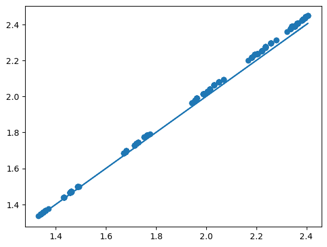
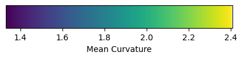

# Tutorial: Membrane mechanics


This tutorial uses `triangulax` to study the mechanics of membranes. We
numerically represent a membrane as a triangular mesh, and finds its
mechanically balanced configuration by energy minimization, using
automatic differentiation to calculate energy gradients.

<!-- WARNING: THIS FILE WAS AUTOGENERATED! DO NOT EDIT! -->

``` python
import numpy as np
from scipy import sparse, optimize
import matplotlib.pyplot as plt
import meshplot

import igl
```

``` python
import jax.numpy as jnp
import jax
```

``` python
jax.config.update("jax_enable_x64", True)
jax.config.update("jax_debug_nans", True)
```

``` python
import lineax
import optimistix
```

``` python
from triangulax import trigonometry as trig
from triangulax import geometry as geom
from triangulax import adjacency as adj
from triangulax import linops as lin
from triangulax.triangular import TriMesh
from triangulax.mesh import HeMesh, GeomMesh
from triangulax import linops
from triangulax import algorithms as algo
```

## Computing the mean curvature

The mean curvature of a surface (see
[wikipedia](https://en.wikipedia.org/wiki/Differential_geometry_of_surfaces),
and [Crane, Chpt.
5](https://www.cs.cmu.edu/~kmcrane/Projects/DDG/paper.pdf)) can be
computed from the Laplace operator, applied to the vertex positions
**v** as *Δ***v** = 2*H***n**, where **n** is the surface normal. To
compute the curvature *H* numerically, one can also use the *dihedral
angles* *θ*<sub>*i**j*</sub> of each edge *i**j*: the angles between the
normal vectors of adjacent triangles. The mean curvature at vertex *i*
can be approximated by
$$H_i = \frac{1}{4a_i} \sum\_{j\sim i} \ell\_{ij} \theta\_{ij} $$
where the sum is over all *j* neighboring *i*, and *a*<sub>*i*</sub> is
the barycentric area around vertex *i*. This discretization can be more
robust numerically. Both are already implemented in the `geometry`
module.

``` python
# let's look at a torus which has varying mean curvature

torus = TriMesh.read_obj("../test_meshes/torus.obj",dim =3)
hemesh_torus = HeMesh.from_triangles(torus.vertices.shape[0], torus.faces)

H_torus_lap = geom.get_mean_curvature_laplace(torus.vertices, hemesh_torus, normalize=True)
H_torus_dihed = geom.get_mean_curvature_dihedral(torus.vertices, hemesh_torus, normalize=True)
```

    Warning: readOBJ() ignored non-comment line 3:
      o Torus

``` python
# two methods for discretizing the mean curvature give similar results

plt.scatter(H_torus_lap, H_torus_dihed)
plt.plot(H_torus_lap, H_torus_lap)
```



``` python
meshplot.plot(torus.vertices, hemesh_torus.faces , np.array(H_torus_lap), shading={"wireframe": True})

#meshplot.plot(torus.vertices, hemesh_torus.faces , np.array(H_torus_dihed), shading={"wireframe": True})


# add a colorbar
fig, ax = plt.subplots(figsize=(5, 0.5))
sm = plt.cm.ScalarMappable(cmap='viridis',norm=plt.Normalize(vmin=np.array(H_torus_lap).min(),
                                                             vmax=np.array(H_torus_lap).max()))
cbar = fig.colorbar(sm, cax=ax, orientation='horizontal')
cbar.set_label('Mean Curvature')
plt.show()
```

    Renderer(camera=PerspectiveCamera(children=(DirectionalLight(color='white', intensity=0.6, position=(0.0, 0.0,…



## Minimal surfaces

As a first example, let’s consider a membrane ℳ whose energy is
dominated by surface tension, so the energy is proportional to the
membrane area *E*<sub>*A*</sub> = ∫<sub>ℳ</sub>*d**A*. Note that moving
vertices *within* the plane of the mesh does not change the total
area/energy (physically, this is because membranes are fluid in-plane,
rather than thin elastic sheets). This has important numerical
consequences: we will want to arrange the mesh vertices so as to avoid a
highly distorted mesh with very stretched triangles.

A nice algorithm by [Pinkall and
Poitier](https://projecteuclid.org/journalArticle/Download?urlId=em%2F1062620735)
takes care of this problem. It uses the discretized Laplacian which we
already used in the previous notebook for the heat equation. The idea is
that to minimize the area, the position of a vertex **v**<sub>*i*</sub>
should be equal to the (geometry-weighted) average of its neighbors, and
therefore *Δ***v**<sub>*i*</sub> = 0. The resulting iterative algorithm
works as follows.

1.  Given the vertex-positions **v**<sub>*i*</sub><sup>(*t*)</sup> at
    step *t*, compute the cotan-Laplacian matrix
    *Δ*<sub>*i**j*</sub><sup>(*t*)</sup>
2.  Solve
    *Δ*<sub>*i**j*</sub><sup>(*t*)</sup> ⋅ **v**<sub>*i*</sub><sup>(*t* + 1)</sup> = 0,
    subject to fixed boundary conditions.

``` python
# let's load a simple test mesh

trimesh = TriMesh.read_obj("../test_meshes/disk.obj", dim=3)
hemesh = HeMesh.from_triangles(trimesh.vertices.shape[0], trimesh.faces)

fig = plt.figure(figsize=(4,4))
plt.triplot(*trimesh.vertices[:,:2].T, trimesh.faces)
plt.axis("equal");
```

    Warning: readOBJ() ignored non-comment line 3:
      o flat_tri_ecmc


``` python
# let's impose some boundary conditions on the disk mesh - think of this as finding the shape of a "soap film"
# with a given boundary curve.

bdry_verts = np.where(hemesh.is_bdry)[0]
interior_verts = np.where(~hemesh.is_bdry)[0]

phi_bdry = np.atan2(*trimesh.vertices[bdry_verts, :2].T)
h = 0.5*np.sin(2*phi_bdry)
bdry_pos = np.array(trimesh.vertices[bdry_verts, :])
bdry_pos[:, -1] = h

vertices_bdry_imposed = np.copy(trimesh.vertices)
vertices_bdry_imposed[bdry_verts] = bdry_pos
```

``` python
# the non-optimized membrane is pretty creased

meshplot.plot(vertices_bdry_imposed, hemesh.faces, shading={"wireframe":False}, return_plot=True)
```

    Renderer(camera=PerspectiveCamera(children=(DirectionalLight(color='white', intensity=0.6, position=(-0.001874…

    <meshplot.Viewer.Viewer at 0x35e8f9d10>

``` python
# compute the area of the initial configuration - this is the energy we will minimize
initial_area = geom.get_area(vertices_bdry_imposed, hemesh)
print(f"Initial area: {initial_area:.4f}")
```

    Initial area: 4.3650

``` python
# let's check the cotan-Laplacian gives us the area via A = 1/2 * v^T L v, where v are the vertex positions

L = linops.cotan_laplace_sparse(vertices_bdry_imposed, hemesh)
area_L = -jnp.diag(vertices_bdry_imposed.T.dot(L @ vertices_bdry_imposed)).sum() /2

print(f"Initial area from Laplace operator: {area_L:.4f}")
```

    Initial area from Laplace operator: 4.3650

``` python
# Let's use the iterative Pinkall-Poitier method to find the mininum energy configuration.

vertices_iterated = [np.copy(vertices_bdry_imposed)] 

for t in range(10):
    L = linops.bcoo_to_scipy(linops.cotan_laplace_sparse(vertices_iterated[-1], hemesh)) # compute Laplace matrix

    # impose boundary conditions by splitting the Laplace matrix into interior and boundary vertices
    L_ii = L[interior_verts, :][:, interior_verts] 
    L_ib = L[interior_verts, :][:, bdry_verts]
    bcs = vertices_bdry_imposed[bdry_verts,:]
    
    new_vertices = np.zeros_like(vertices_iterated[-1])
    new_vertices[bdry_verts] = bcs

    solution = np.stack([sparse.linalg.spsolve(-L_ii, L_ib.dot(bc)) for bc in bcs.T], axis=-1)
    # iterate over x/y/z coordinates
    new_vertices[interior_verts] = solution
    vertices_iterated.append(new_vertices)
```

``` python
# as a result of the optimization, we get an area-minimizing "Pringles" surface

meshplot.plot(vertices_iterated[-1], hemesh.faces, shading={"wireframe":True}, return_plot=True)
```

    Renderer(camera=PerspectiveCamera(children=(DirectionalLight(color='white', intensity=0.6, position=(-0.001874…

    <meshplot.Viewer.Viewer at 0x37487c050>

``` python
final_area = geom.get_area(vertices_iterated[-1], hemesh)
print(f"Initial area: {initial_area:.4f}", f"Final area: {final_area:.4f}")
```

    Initial area: 4.3650 Final area: 3.7981

``` python
# the gradient of the area is very small after optimization:   

(jnp.linalg.norm(jax.grad(geom.get_area)(vertices_iterated[0], hemesh), axis=-1)[interior_verts].mean(),
 jnp.linalg.norm(jax.grad(geom.get_area)(vertices_iterated[-1], hemesh), axis=-1)[interior_verts].mean())
```

    (Array(0.06015605, dtype=float64), Array(0.00068703, dtype=float64))

``` python
# the mean curvature is also very small after optimization, as expected for a minimal surface:
H_laplace = geom.get_mean_curvature_laplace(vertices_iterated[-1], hemesh)
jnp.abs(H_laplace).mean()
```

    Array(0.06962044, dtype=float64)

### Helfrich energy

Next, let’s consider a membrane for which the surface tension is
negligible. This is the case for many of the lipid bilayer membranes
that make up the cell and its interior organelles. Instead, the energy
is dominated by *bending*.

The *Helfrich energy* is an elegant, geometric model of bending energy.
It uses the mean and Gaussian curvatures *H*, *K* of the surface ℳ. The
energy reads:

$$E_H  =\int dA \left( \frac{\kappa_H}{2}(H-H_0)^2 + \kappa_G K \right) $$

If the surface is closed, the ∫*K*-term is a topological invariant and
can be dropped (and we will do so here). A nonzero *spontaneous
curvature* *H*<sub>0</sub> means that the membrane “prefers” to be
curved; this can result, for instance, from molecules that bind to the
membrane.

``` python
# let's load a sphere as a test mesh for the Helfrich energy

trimesh = TriMesh.read_obj("../test_meshes/sphere_fine.obj", dim=3) # sphere_fine sphere

trimesh.vertices -= trimesh.vertices.mean(axis=0)
trimesh.vertices = (trimesh.vertices.T / np.linalg.norm(trimesh.vertices, axis=1)).T

hemesh = HeMesh.from_triangles(trimesh.vertices.shape[0], trimesh.faces)
```

    Warning: readOBJ() ignored non-comment line 4:
      o Icosphere

``` python
meshplot.plot(trimesh.vertices, hemesh.faces, shading={"wireframe":True})
```

    Renderer(camera=PerspectiveCamera(children=(DirectionalLight(color='white', intensity=0.6, position=(0.0, 0.0,…

    <meshplot.Viewer.Viewer at 0x358cd3230>

``` python
# let's define the discrete Helfrich energy.

@jax.jit
def get_helfrich_energy(vertices, args):
    """Compute the discrete Helfrich energy of a triangulated surface. args = (hemesh, H0, kappa)"""
    hemesh, H0, kappa = args
    # the cell areas are needed to discretize the area integral
    cell_areas = geom.get_voronoi_areas_robust(vertices, hemesh)
    #H = geom.get_mean_curvature_laplace(vertices, hemesh)
    H = geom.get_mean_curvature_dihedral(vertices, hemesh, normalize=True)

    return (kappa/2) * ((H - H0) **2 * cell_areas).sum()
```

``` python
args = (hemesh, 0, 1)
# exact helfrich for a sphere is 2*pi, here smaller due to discretization error. The energy is scale invariant.
get_helfrich_energy(trimesh.vertices, args), get_helfrich_energy(2*trimesh.vertices, args), 2*np.pi
```

    (Array(6.29326108, dtype=float64),
     Array(6.29326108, dtype=float64),
     6.283185307179586)

``` python
# now, let's deform the sphere and minimize the Helfrich energy to find the equilibrium shape.

deformed_vertices = trimesh.vertices.at[:, 1].add(0.5*trimesh.vertices[:, 1]**3)
deformed_vertices = trimesh.vertices.at[:, 2].add(0.5*trimesh.vertices[:, 0]**3)

print("Minimum vs deformed energy:", get_helfrich_energy(trimesh.vertices, args),
                                     get_helfrich_energy(deformed_vertices, args))
```

    Minimum vs deformed energy: 6.293261081171555 7.118657237550066

``` python
meshplot.plot(deformed_vertices, hemesh.faces, shading={"wireframe":True})
```

    Renderer(camera=PerspectiveCamera(children=(DirectionalLight(color='white', intensity=0.6, position=(0.0, 0.0,…

    <meshplot.Viewer.Viewer at 0x37e730050>

``` python
# we can compute the energy gradient using JAX

grad = jax.grad(get_helfrich_energy)(deformed_vertices, args)
normal = geom.get_vertex_normals(deformed_vertices, hemesh)
grad_norm = jnp.linalg.norm(grad, axis=-1)

 # gradient is along normal

(jnp.abs(jnp.linalg.vecdot(grad, normal)) / grad_norm).mean()
```

    Array(0.99466172, dtype=float64)

``` python
# the gradient computed via autodiff matches the finite difference approximation

eps = 1e-2
step = eps * normal / jnp.linalg.norm(normal)

grad_autodiff = jnp.sum(grad * step)
grad_fd = (get_helfrich_energy(deformed_vertices+step, args) - get_helfrich_energy(deformed_vertices, args))

1e4*grad_autodiff, 1e4*grad_fd
```

    (Array(-9.05360294, dtype=float64), Array(-9.04334675, dtype=float64))

#### Nonlinear minimization

To minimize the energy, we can use one of many non-linear minimization
algorithms, all of which use the gradient ∇*E*<sub>*H*</sub> which we
can compute using JAX. Here, we use the JAX-based optimization library
`optimistix`.

``` python
#solver = optimistix.GradientDescent(rtol=1e-8, atol=1e-8, learning_rate=0.5*1e-2)
solver = optimistix.NonlinearCG(rtol=1e-8, atol=1e-8)

y0 = deformed_vertices
args = (hemesh, 0, 1) 

sol = optimistix.minimise(get_helfrich_energy, solver, y0, args, max_steps=10000, throw=False)
vertices_final = sol.value
```

``` python
print("Initial/final/minimal energy:", get_helfrich_energy(y0, args),
                                       get_helfrich_energy(sol.value, args),
                                       get_helfrich_energy(trimesh.vertices, args))
```

    Initial/final/minimal energy: 7.118657237550066 6.300880738246545 6.293261081171555

``` python
# displacement from initial condition.

jnp.linalg.norm(y0-sol.value, axis=-1).mean(), jnp.linalg.norm(y0-trimesh.vertices, axis=-1).mean()
```

    (Array(0.03848122, dtype=float64), Array(0.12507872, dtype=float64))

``` python
# after minimization, the deviation from being a perfect sphere is fairly low

center = jnp.average(vertices_final, weights=geom.get_voronoi_areas(vertices_final, hemesh), axis=0)
Rs =  jnp.linalg.norm(vertices_final - center, axis=1)

Rs.std() / Rs.mean()
```

    Array(0.01461819, dtype=float64)

``` python
p = meshplot.plot(y0, hemesh.faces, np.array(grad_norm),shading={"wireframe":True}, return_plot=True)
p.add_mesh(sol.value + np.array([0, 0, 3]), hemesh.faces, shading={"wireframe":True})
```

    Renderer(camera=PerspectiveCamera(children=(DirectionalLight(color='white', intensity=0.6, position=(0.0, 0.0,…

    1

## Constrained minimization using Penalty and Augmented Lagrangian methods

Much of the physics of membranes arises from balancing the Helfrich
bending energy with constraints on the volume *V* and area *A* of the
membrane. For simplicity, we softly enforce these contrstraints with
quadratic penalty terms in the energy:
*E*<sub>*P*</sub> = *μ*<sub>*V*</sub>(*V* − *V*<sub>0</sub>)<sup>2</sup>/(2*V*<sub>0</sub>) + *μ*<sub>*A*</sub>(*A* − *A*<sub>0</sub>)<sup>2</sup>/(2*A*<sub>0</sub>)

``` python
trimesh = TriMesh.read_obj("../test_meshes/sphere_fine.obj", dim=3)
trimesh.vertices -= trimesh.vertices.mean(axis=0)
trimesh.vertices = (trimesh.vertices.T / np.linalg.norm(trimesh.vertices, axis=1)).T

hemesh = HeMesh.from_triangles(trimesh.vertices.shape[0], trimesh.faces)
```

    Warning: readOBJ() ignored non-comment line 4:
      o Icosphere

``` python
# verify volume and area on the sphere mesh
A_sphere = geom.get_area(trimesh.vertices, hemesh)
V_sphere = geom.get_volume(trimesh.vertices, hemesh)
print(f"Sphere area: {A_sphere:.4f} (exact 4π = {4*jnp.pi:.4f})")
print(f"Sphere volume: {V_sphere:.4f} (exact 4π/3 = {4*jnp.pi/3:.4f})")
```

    Sphere area: 12.5062 (exact 4π = 12.5664)
    Sphere volume: 4.1527 (exact 4π/3 = 4.1888)

``` python
@jax.jit
def get_helfrich_energy_with_penalty(vertices, args):
    """Compute the discrete Helfrich energy of a triangulated surface with a penalty method.
    args = (hemesh, H0, kappa, mu_A, mu_V, A0, V0)"""
    hemesh, H0, kappa, mu_A, mu_V, A0, V0 = args
    E = get_helfrich_energy(vertices, (hemesh, H0, kappa))
    contraint_area = mu_A/2 * (geom.get_area(vertices, hemesh) - A0)**2/A0
    constraint_volume = mu_V/2 *(geom.get_volume(vertices, hemesh) - V0)**2 / V0**2

    # penalty to avaoid degenerate meshes
    #parametrization_penalty = 1e-3 * ((geom.get_corner_angles(vertices, hemesh) - jnp.pi/3)**2).sum()

    return E + contraint_area + contraint_area  + constraint_volume #+ parametrization_penalty
```

``` python
A0 = geom.get_area(trimesh.vertices, hemesh)
V0 = 0.9 * geom.get_volume(trimesh.vertices, hemesh)
kappa, H0 = 1.0, 0.0
mu_A = 300.0
mu_V = 600.0
args = (hemesh, H0, kappa, mu_A, mu_V, A0, V0)

y0 = trimesh.vertices * np.array([1, 1.05, 1]) # let's start from a stretched configuration
```

``` python
solver = optimistix.GradientDescent(rtol=1e-8, atol=1e-8, learning_rate=1e-3)
#solver = optimistix.NonlinearCG(rtol=1e-8, atol=1e-8)

sol = optimistix.minimise(get_helfrich_energy_with_penalty, solver, y0, args, max_steps=10000, throw=False)


vertices_final = sol.value
```

``` python
# constraints are approximately satisfied after optimization
geom.get_area(vertices_final, hemesh)/A0, geom.get_volume(vertices_final, hemesh)/V0
```

    (Array(0.99693748, dtype=float64), Array(1.0253752, dtype=float64))

``` python
p = meshplot.plot(y0, hemesh.faces, np.array(grad_norm),
                  shading={"wireframe":True}, return_plot=True)

p.add_mesh(sol.value + np.array([3, 0, 0]), hemesh.faces, shading={"wireframe":True})
```

    Renderer(camera=PerspectiveCamera(children=(DirectionalLight(color='white', intensity=0.6, position=(0.0, 0.0,…

    1

### Regularization tangential mesh motion

If you play around with the above code, you will notice that it is
rather unstable (try using a different minimizer). The reason is the
*reparametrization* invariance of the Helfrich energy we already alluded
to - moving vertices in the local tangent plane does not change the
energy. Therefore, the triangles of the mesh can easily degenerate
during energy minimization, leading to numerical instability. To avoid
this, we can add a smoothing step that repositions the vertices
tangentially to improve mesh quality between energy minimization steps.

``` python
solver = optimistix.NonlinearCG(rtol=1e-8, atol=1e-8)

vertices_smoothed = y0
n_iterations = 50
n_smoothing = 10
smoothing_step_size = 0.1
n_minimization = 100

for i in range(n_iterations):
    sol = optimistix.minimise(get_helfrich_energy_with_penalty, solver, vertices_smoothed, args,
    max_steps=n_minimization, throw=False)
    vertices_smoothed = sol.value
    for j in range(n_smoothing):
        vertices_smoothed = algo.smooth_vertices_laplacian(vertices_smoothed, hemesh, step_size=smoothing_step_size)
```

``` python
geom.get_area(vertices_smoothed, hemesh)/A0, geom.get_volume(vertices_smoothed, hemesh)/V0
```

    (Array(0.99779543, dtype=float64), Array(1.01800399, dtype=float64))

``` python
p = meshplot.plot(y0, hemesh.faces, np.array(grad_norm),
                  shading={"wireframe":True}, return_plot=True)

p.add_mesh(vertices_smoothed + np.array([3, 0, 0]), hemesh.faces, shading={"wireframe":True})
```

    Renderer(camera=PerspectiveCamera(children=(DirectionalLight(color='white', intensity=0.6, position=(0.0, 0.0,…

    1

Tangential smoothing is the simplest example of a more general method in
which one alternatingly minimizes the physical energy by moving vertices
in the surface normal direction, and a parametrization pseudo-energy by
moving vertices along the tangential directions.

More precisely, let *E*<sub>*N*</sub> be the physical energy (like the
Helfrich bending energy), and let *E*<sub>*T*</sub> be a pseudo energy
that penalizes poor mesh configurations. Note that *E*<sub>*T*</sub>
should only depend on the in-plane shear of the mesh and not on bending
to minimize overlap with the physical energy. A simple gradient-descent
scheme reads like so:

**v**<sub>*i*</sub><sup>(*t* + 1)</sup> = **v**<sub>*i*</sub><sup>(*t*)</sup> + *η*(*P*<sub>**n**<sub>*i*</sub><sup>(*t*)</sup></sub> ⋅ ∇*E*<sub>*N*</sub> + (𝕀 − *P*<sub>**n**<sub>*i*</sub><sup>(*t*)</sup></sub>) ⋅ ∇*E*<sub>*T*</sub>))

where *P*<sub>**n**</sub> = 𝕀 − **n** ⊗ **n** is the projector on the
normal **n**

``` python
def get_neo_hookean_energy(deformation, mod_bulk, mod_shear):
    """Compute the neo-Hookean energy from Cauchy-Green deformation tensor.
    See https://en.wikipedia.org/wiki/Neo-Hookean_solid
    """
    I1 = jnp.trace(deformation)
    J = jnp.sqrt(jnp.linalg.det(deformation))
    return mod_shear/2*(I1 - 2 - 2*jnp.log(J)) + mod_bulk/2*(J-1)**2


def get_metric(vertices, hemesh):
    """Compute the metric tensor per triangle of a triangulated surface"""
    a, b, c = vertices[hemesh.faces.T]
    J = jnp.stack([b-a, c-a], axis=1)
    return jnp.einsum("vix,vjx->vij", J, J)

@jax.jit
def get_elastic_energy(vertices, args):
    """Compute the elastic energy of a triangulated surface. args = (hemesh, metric_orig, mod_bulk, mod_shear)"""
    hemesh, metric_orig, mod_bulk, mod_shear = args
    triangle_areas = geom.get_triangle_areas(vertices, hemesh)
    metric = get_metric(vertices, hemesh)
    deformation = jnp.einsum("vij,vjk->vik", jnp.linalg.inv(metric_orig), metric)
    energies = jax.vmap(get_neo_hookean_energy, in_axes=(0,None,None))(deformation, mod_bulk, mod_shear)
    return (triangle_areas*energies).sum()
```

``` python
# this is how the elastic energy penalizes deformation, expressed in terms of the deformation gradient F,
# so that F-I is the usual strain tensor.

s = -0.1 # dilation
t = 0. # shear

F = jnp.array([[1+s, t],[t, 1+s]])
g0 = jnp.eye(2)
g1 = F @ F.T
deformation = jnp.linalg.inv(g0) @ g1

get_neo_hookean_energy(jnp.eye(2), 1, 1), get_neo_hookean_energy(deformation, 1, 1)
```

    (Array(0., dtype=float64), Array(0.03877103, dtype=float64))

``` python
A0 = geom.get_area(trimesh.vertices, hemesh)
V0 = 0.75 * geom.get_volume(trimesh.vertices, hemesh)
metric_orig = get_metric(trimesh.vertices, hemesh)

kappa, H0 = 1.0, 0.0
mu_A, mu_V = 300.0, 600.0
args_helfrich_penalty = (hemesh, H0, kappa, mu_A, mu_V, A0, V0)

mod_bulk, mod_shear = 1.0, 1.0
args_elastic = (hemesh, metric_orig, mod_bulk, mod_shear)

step_size = 0.5*1e-3

@jax.jit
def get_step(vertices):
    grad_helfrich = jax.grad(get_helfrich_energy_with_penalty)(vertices, args_helfrich_penalty)
    grad_elastic = jax.grad(get_elastic_energy)(vertices, args_elastic)
    normals = geom.get_vertex_normals(vertices, hemesh)
    step = (jax.vmap(trig.project_out_vector)(grad_elastic, normals) +
            jax.vmap(trig.project_on_vector)(grad_helfrich, normals))
    return step
```

``` python
n_iterations = 10000

vertices_initial = trimesh.vertices * np.array([0.95, 1.1, 0.95]) # let's start from a stretched configuration
vertices_iterated = jnp.copy(vertices_initial)
for t in range(n_iterations):
    vertices_iterated = vertices_iterated - step_size * get_step(vertices_iterated)
```

``` python
jnp.linalg.norm(vertices_iterated - vertices_initial, axis=-1).mean()
```

    Array(0.21841703, dtype=float64)

``` python
p = meshplot.plot(vertices_initial, hemesh.faces,
                  shading={"wireframe":True}, return_plot=True)

p.add_mesh(vertices_iterated + np.array([3, 0, 0]), hemesh.faces, shading={"wireframe":True})
```

    Renderer(camera=PerspectiveCamera(children=(DirectionalLight(color='white', intensity=0.6, position=(0.0, 0.0,…

    1

``` python
# something is going wrong with the gradient of the Helfrich energy - it loooks like it depends strongly
# on the local coordination number, with more displacement near the 5-fold coordinated vertices.
# this is clearly visible when computing a smaller number of gradient descent steps (say 1000)
```

## Below - work in progress, ignore

### Augmented Lagrangian method

A more systematic way to include the area and volume constraints is via
two Lagrange multipliers *λ*, *p*, surface tension and pressure:

ℒ = *E*<sub>*H*</sub> − *λ*(*A* − *A*<sub>0</sub>) − *p*(*V* − *V*<sub>0</sub>)

Minimization under the boundary constraint is equivalent to stationarity
of the Lagrangian:

∇<sub>*λ*</sub>ℒ = 0  and  ∇<sub>**v**</sub>ℒ = 0

Finding these stationary points - the aim of *numerical constrained
minimization* - can be quite challenging. If the number of constraints
(here, 2) is small compared to the number of variables (here,
3\#vertices), *augmented Lagrangian methods* are a suitable approach
[(Nocedal & Wright,
2006)](https://link.springer.com/book/10.1007/978-0-387-40065-5).

Let’s combine all constraints into a vectorial function **c**(**x**) so
that **c**(**x**) = 0 when the constraint is fulfilled. All Lagrange
multipliers are packaged into a vector *λ*. The *augmented Lagrangian*
ℒ<sub>*A*</sub> adds a quadratic penalty for constraint violations, with
strength *μ*:

ℒ<sub>*A*</sub> = *E*(**x**) − *λ*<sup>*T*</sup> ⋅ **c**(**x**) + *μ*|**c**(**x**)|<sup>2</sup>

The AL method now iteratively (1) minimizes ℒ<sub>*A*</sub> w.r.t. to
the variables **x** and (2) updates the Lagrange multiplier *λ* and
penalty strength *μ*. The big advantage of the AL method compared to the
naive approach of using only a penalty for constraint violation is that
*μ* does not need to be increased to large values, which generally leads
to numerical difficulties.

In pseudo-code, the AL method works like this:

    Initialize μ > 0, tolerance τ > 0, starting points x and λ:
    for k = 0, 1, 2, . . .
        Update x: x = minimizer of LA(·, λ; μ) with tolerance τ, starting from x   
        if convergence test for Lagrangian stationarity is satisfied:
            return x
        Update Lagrange multipliers: λ =  λ - μ * c(x)
        Increase penalty parameter μ
        Select new tolerance

``` python
@jax.jit
def augmented_lagrangian(vertices, args):
    """Augmented Lagrangian: E_H - λᵀc + (μ/2)|c|², where c = [A-A0, V-V0]."""
    hemesh, H0, kappa, lam, mu, A0, V0 = args
    E = get_helfrich_energy(vertices, (hemesh, H0, kappa))
    c = jnp.array([get_area(vertices, hemesh) - A0,
                    get_volume(vertices, hemesh) - V0])
    area_penalty = ((geom.get_triangle_areas(vertices, hemesh)-0.146)**2).sum()
    return E - lam @ c + (mu / 2) * (c @ c) + area_penalty
```

``` python
def al_minimize(vertices, hemesh, H0, kappa, A0, V0,
                mu0=1.0, mu_growth=1.5, max_outer=10, tol=1e-4, max_inner=500):
    """Augmented Lagrangian method for constrained Helfrich energy minimization."""
    lam = jnp.zeros(2)
    mu = mu0
    solver = optimistix.NonlinearCG(rtol=1e-5, atol=1e-5)

    for k in range(max_outer):
        args = (hemesh, H0, kappa, lam, mu, A0, V0)
        sol = optimistix.minimise(augmented_lagrangian, solver, vertices, args,
                                  max_steps=max_inner, throw=False)
        vertices = sol.value

        A = get_area(vertices, hemesh)
        V = get_volume(vertices, hemesh)
        c = jnp.array([A - A0, V - V0])
        E = get_helfrich_energy(vertices, (hemesh, H0, kappa))

        # stationarity of the Lagrangian (μ=0): ∇_v L = 0 and ∇_λ L = -c = 0
        lagrangian_args = (hemesh, H0, kappa, lam, 0.0, A0, V0)
        grad_v = jax.grad(augmented_lagrangian)(vertices, lagrangian_args)
        grad_norm = jnp.sqrt(jnp.sum(grad_v**2) + jnp.sum(c**2))

        print(f"  iter {k:2d} | E_H={E:.4f} | A={A:.4f} (target {A0:.4f}) | "
              f"V={V:.4f} (target {V0:.4f}) | |∇L|={grad_norm:.2e} | μ={mu:.1f}")

        if grad_norm < tol:
            print("Converged!")
            break

        lam = lam - mu * c
        mu = mu * mu_growth

    return vertices, lam
```

``` python
# minimize Helfrich energy of a sphere with constrained area and reduced volume (deflated)

A0 = get_area(trimesh.vertices, hemesh)
V0 = 0.6 * get_volume(trimesh.vertices, hemesh)
kappa, H0 = 1.0, 0.0

# small perturbation to break spherical symmetry
key = jax.random.PRNGKey(0)
v0 = trimesh.vertices + 0.02 * jax.random.normal(key, trimesh.vertices.shape)

print(f"Target: A0={A0:.4f}, V0={V0:.4f}")
print(f"Initial: A={get_area(v0, hemesh):.4f}, V={get_volume(v0, hemesh):.4f}")

v_opt, lam_opt = al_minimize(v0, hemesh, H0, kappa, A0, V0)
```

    Target: A0=11.6659, V0=2.1952
    Initial: A=11.6992, V=3.6646
      iter  0 | E_H=6.5829 | A=11.1221 (target 11.6659) | V=3.4060 (target 2.1952) | |∇L|=1.33e+00 | μ=1.0
      iter  1 | E_H=6.5841 | A=11.1126 (target 11.6659) | V=3.4011 (target 2.1952) | |∇L|=1.34e+00 | μ=1.5
      iter  2 | E_H=6.6155 | A=11.1184 (target 11.6659) | V=3.3931 (target 2.1952) | |∇L|=1.37e+00 | μ=2.2
      iter  3 | E_H=6.6155 | A=11.1184 (target 11.6659) | V=3.3931 (target 2.1952) | |∇L|=4.39e+00 | μ=3.4
      iter  4 | E_H=6.6155 | A=11.1184 (target 11.6659) | V=3.3931 (target 2.1952) | |∇L|=1.49e+00 | μ=5.1
      iter  5 | E_H=12.7387 | A=11.7214 (target 11.6659) | V=2.5791 (target 2.1952) | |∇L|=1.71e+02 | μ=7.6
      iter  6 | E_H=12.7386 | A=11.7214 (target 11.6659) | V=2.5791 (target 2.1952) | |∇L|=1.77e+02 | μ=11.4
      iter  7 | E_H=12.7386 | A=11.7214 (target 11.6659) | V=2.5791 (target 2.1952) | |∇L|=1.75e+02 | μ=17.1
      iter  8 | E_H=12.7386 | A=11.7214 (target 11.6659) | V=2.5791 (target 2.1952) | |∇L|=1.73e+02 | μ=25.6
      iter  9 | E_H=12.7386 | A=11.7214 (target 11.6659) | V=2.5791 (target 2.1952) | |∇L|=1.88e+02 | μ=38.4

``` python
# visualize the deflated shape

E_final = get_helfrich_energy(v_opt, (hemesh, H0, kappa))
E_sphere = get_helfrich_energy(trimesh.vertices, (hemesh, H0, kappa))
print(f"Helfrich energy: sphere={E_sphere:.4f}, deflated={E_final:.4f}")
print(f"Final area: {get_area(v_opt, hemesh):.4f} (target {A0:.4f})")
print(f"Final volume: {get_volume(v_opt, hemesh):.4f} (target {V0:.4f})")
print(f"Lagrange multipliers (tension, pressure): {lam_opt}")

meshplot.plot(v_opt, hemesh.faces, shading={"wireframe": True})
```

    Helfrich energy: sphere=6.5831, deflated=12.7386
    Final area: 11.7214 (target 11.6659)
    Final volume: 2.5791 (target 2.1952)
    Lagrange multipliers (tension, pressure): [  1.66632623 -54.26580124]

    Renderer(camera=PerspectiveCamera(children=(DirectionalLight(color='white', intensity=0.6, position=(0.0167619…

    <meshplot.Viewer.Viewer at 0x464ec5310>

### Non-linear optimization

We have found the desired solution, but using a pretty “custom”
algorithm. Let’s try to use a more general-purpose strategy for
constrained non-linear optimization. To do so, we use the method of
Lagrange multipliers, and define the Lagrangian

ℒ = ∫<sub>ℳ</sub>*d**A* − ∫<sub>∂ℳ</sub>*λ*(*s*)<sup>*T*</sup> ⋅ (**b**(*s*) − **v**(*s*))

where the first term is the mesh area, and the second term forces vertex
positions **v**(*s*) at the boundary to lie at the targets **b**(*s*).

Minimization under the boundary constraint is equivalent to stationarity
of the Lagrangian:

∇<sub>*λ*</sub>ℒ = 0  and  ∇<sub>**v**</sub>ℒ = 0

We can attempt to solve this non-linear system of equations using the
Newton method, or using non-linear least squares.

``` python
def get_lagrangian(vertices, lagrange_mult, bdry_verts, bdry_pos, hemesh):
    """Compute the Lagrangian for the area minimization problem with boundary conditions."""
    area = geom.get_triangle_areas(vertices, hemesh).sum()
    lagrange_term = jax.vmap(jnp.dot)(lagrange_mult, vertices[bdry_verts] - bdry_pos).sum()
    return area - lagrange_term

@jax.jit
def stationarity_condition(y, args):
    vertices, lagrange_mult = y
    v_term = jax.grad(get_lagrangian, argnums=0)(vertices, lagrange_mult, *args)
    l_term = jax.grad(get_lagrangian, argnums=1)(vertices, lagrange_mult, *args)

    return (v_term, l_term)
```

``` python
args = (jnp.array(bdry_verts), jnp.array(bdry_pos), hemesh)

vertices_initial = jnp.array(vertices_bdry_imposed)
lagrange_mult_initial = 1*jnp.ones_like(bdry_pos)
```

``` python
_ = stationarity_condition((vertices_initial, lagrange_mult_initial), args)
get_lagrangian(vertices_initial, lagrange_mult_initial, *args)
```

    Array(4.36495664, dtype=float64)

``` python
solver = optimistix.LevenbergMarquardt(rtol=1e-8, atol=1e-8, ) 

y0 = (vertices_initial, lagrange_mult_initial)
sol = optimistix.root_find(stationarity_condition, solver, y0, args, max_steps=50, throw=False)
vertices_final, lagrange_mult_final = sol.value
```

``` python
vertices_final.max(axis=0), vertices_final.min(axis=0) # that doesn't look good
```

    (Array([1.00112636, 0.98954106, 0.49702471], dtype=float64),
     Array([-0.99658605, -0.99661577, -0.4918562 ], dtype=float64))

``` python
meshplot.plot(vertices_final, hemesh.faces, shading={"wireframe":True}, return_plot=True)
```

    Renderer(camera=PerspectiveCamera(children=(DirectionalLight(color='white', intensity=0.6, position=(0.0022701…

    <meshplot.Viewer.Viewer at 0x3709a5a70>
