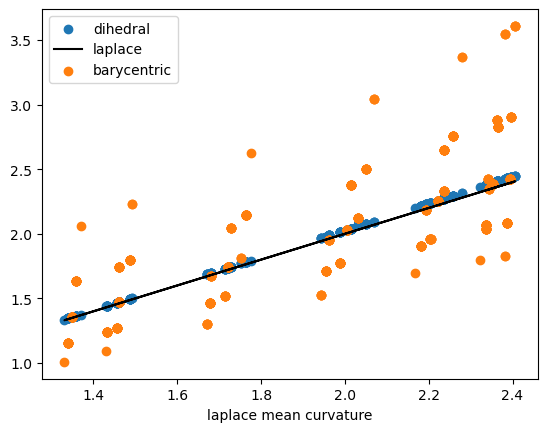
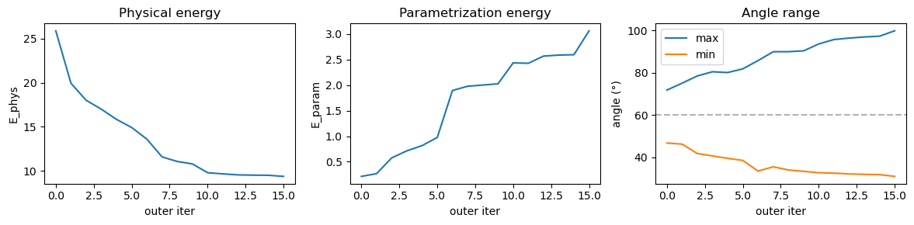
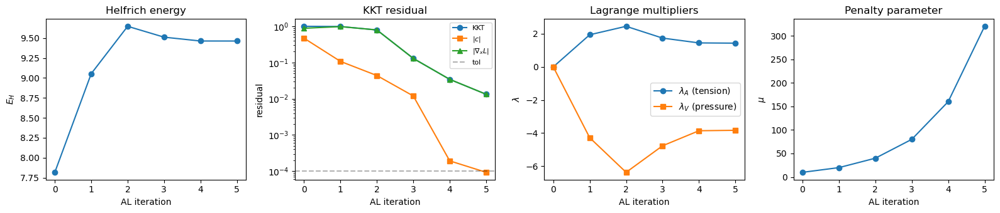

# Tutorial: Membrane mechanics


This tutorial uses `triangulax` to study the mechanics of membranes. We
numerically represent a membrane as a triangular mesh, and finds its
mechanically balanced configuration by energy minimization, using
automatic differentiation to calculate energy gradients.

<!-- WARNING: THIS FILE WAS AUTOGENERATED! DO NOT EDIT! -->

``` python
import numpy as np
from scipy import sparse
import matplotlib.pyplot as plt
import meshplot

import igl
```

``` python
from IPython.display import IFrame
```

``` python
import jax.numpy as jnp
import jax
```

``` python
from jaxtyping import Float
```

``` python
jax.config.update("jax_enable_x64", True)
jax.config.update("jax_debug_nans", True)
```

``` python
import optimistix
```

``` python
from triangulax import trigonometry as trig
from triangulax import geometry as geom
from triangulax.triangular import TriMesh
from triangulax.mesh import HeMesh
from triangulax import linops
from triangulax import algorithms as algo
from triangulax import elastic
```

## Computing the mean curvature

The mean curvature of a surface (see
[wikipedia](https://en.wikipedia.org/wiki/Differential_geometry_of_surfaces),
and [Crane, Chpt.
5](https://www.cs.cmu.edu/~kmcrane/Projects/DDG/paper.pdf)) can be
computed from the Laplace operator, applied to the vertex positions
**v** as *Δ***v** = 2*H***n**, where **n** is the surface normal. To
compute the curvature *H* numerically, one can also use the *dihedral
angles* *θ*<sub>*i**j*</sub> of each edge *i**j*: the angles between the
normal vectors of adjacent triangles. The mean curvature at vertex *i*
can be approximated by
$$H_i = \frac{1}{4a_i} \sum\_{j\sim i} \ell\_{ij} \theta\_{ij} $$
where the sum is over all *j* neighboring *i*, and *a*<sub>*i*</sub> is
the Voronoi area around vertex *i*. This discretization can be more
robust numerically. Both are already implemented in the `geometry`
module.

``` python
# let's look at a torus which has varying mean curvature

torus = TriMesh.read_obj("tutorial_meshes/torus.obj",dim =3)
hemesh_torus = HeMesh.from_triangles(torus.vertices.shape[0], torus.faces)

# we can compute the mean curvature using two different methods

H_torus_lap = geom.get_mean_curvature_laplace(torus.vertices, hemesh_torus, normalize=True)
H_torus_dihed = geom.get_mean_curvature_dihedral(torus.vertices, hemesh_torus, normalize=True)

# however, not all discretizations are created equal. Using the barycentric area instead of the Voronoi area
# leads to inaccurate estimates

H_torus_barycentric = geom.get_mean_curvature_dihedral(torus.vertices, hemesh_torus, normalize=False)
H_torus_barycentric = H_torus_barycentric / geom.get_barycentric_cell_areas(torus.vertices, hemesh_torus)
```

    Warning: readOBJ() ignored non-comment line 3:
      o Torus

``` python
# the two methods for discretizing the mean curvature give similar results

plt.scatter(H_torus_lap, H_torus_dihed, label="dihedral")
plt.plot(H_torus_lap, H_torus_lap, color='k', label="laplace")
plt.scatter(H_torus_lap, H_torus_barycentric, label="barycentric")
plt.xlabel("laplace mean curvature")
plt.legend()
```



``` python
# top plot shows Voronoi, and bottom plot barycentric normalization

p1 = meshplot.plot(np.array(torus.vertices), np.array(hemesh_torus.faces), np.array(H_torus_lap),
                   shading={"wireframe": True})
p1.save("tutorial_plots/05_torus_curvature.html")
p2 = meshplot.plot(np.array(torus.vertices), np.array(hemesh_torus.faces), np.array(H_torus_barycentric),
              shading={"wireframe": True})
p2.save("tutorial_plots/05_torus_curvature_barycentric.html")

# add a colorbar
fig, ax = plt.subplots(figsize=(5, 0.5))
sm = plt.cm.ScalarMappable(cmap='viridis',norm=plt.Normalize(vmin=np.array(H_torus_lap).min(),
                                                             vmax=np.array(H_torus_lap).max()))
cbar = fig.colorbar(sm, cax=ax, orientation='horizontal')
cbar.set_label('Mean Curvature')
plt.show()
```

    Renderer(camera=PerspectiveCamera(children=(DirectionalLight(color='white', intensity=0.6, position=(0.0, 0.0,…

    Plot saved to file tutorial_plots/05_torus_curvature.html.

    Renderer(camera=PerspectiveCamera(children=(DirectionalLight(color='white', intensity=0.6, position=(0.0, 0.0,…

    Plot saved to file tutorial_plots/05_torus_curvature_barycentric.html.


``` python
IFrame(src="tutorial_plots/05_torus_curvature.html", width="100%", height=400) # for display in docs webpage
```

        <iframe
            width="100%"
            height="400"
            src="tutorial_plots/05_torus_curvature.html"
            frameborder="0"
            allowfullscreen
            &#10;        ></iframe>
        &#10;

``` python
IFrame(src="tutorial_plots/05_torus_curvature_barycentric.html", width="100%", height=400)
```

        <iframe
            width="100%"
            height="400"
            src="tutorial_plots/05_torus_curvature_barycentric.html"
            frameborder="0"
            allowfullscreen
            &#10;        ></iframe>
        &#10;

## Minimal surfaces

As a first example, let’s consider a membrane ℳ whose energy is
dominated by surface tension, so the energy is proportional to the
membrane area *E*<sub>*A*</sub> = ∫<sub>ℳ</sub>*d**A*. Note that moving
vertices *within* the plane of the mesh does not change the total
area/energy (physically, this is because membranes are fluid in-plane,
rather than thin elastic sheets). This has important numerical
consequences: we will want to arrange the mesh vertices so as to avoid a
highly distorted mesh with very stretched triangles.

A nice algorithm by [Pinkall and
Poitier](https://projecteuclid.org/journalArticle/Download?urlId=em%2F1062620735)
takes care of this problem. It uses the discretized Laplacian which we
already used in the previous notebook for the heat equation. The idea is
that to minimize the area, the position of a vertex **v**<sub>*i*</sub>
should be equal to the (geometry-weighted) average of its neighbors, and
therefore *Δ***v**<sub>*i*</sub> = 0. The resulting iterative algorithm
works as follows.

1.  Given the vertex-positions **v**<sub>*i*</sub><sup>(*t*)</sup> at
    step *t*, compute the cotan-Laplacian matrix
    *Δ*<sub>*i**j*</sub><sup>(*t*)</sup>
2.  Solve
    *Δ*<sub>*i**j*</sub><sup>(*t*)</sup> ⋅ **v**<sub>*i*</sub><sup>(*t* + 1)</sup> = 0,
    subject to fixed boundary conditions.

``` python
# let's load a simple test mesh

trimesh = TriMesh.read_obj("tutorial_meshes/disk.obj", dim=3)
hemesh = HeMesh.from_triangles(trimesh.vertices.shape[0], trimesh.faces)

fig = plt.figure(figsize=(4,4))
plt.triplot(*trimesh.vertices[:,:2].T, trimesh.faces)
plt.axis("equal");
```

    Warning: readOBJ() ignored non-comment line 3:
      o flat_tri_ecmc


``` python
# let's impose some boundary conditions on the disk mesh - think of this as finding the shape of a "soap film"
# with a given boundary curve.

bdry_verts = np.where(hemesh.is_bdry)[0]
interior_verts = np.where(~hemesh.is_bdry)[0]

phi_bdry = np.atan2(*trimesh.vertices[bdry_verts, :2].T)
h = 0.5*np.sin(2*phi_bdry)
bdry_pos = np.array(trimesh.vertices[bdry_verts, :])
bdry_pos[:, -1] = h

vertices_bdry_imposed = np.copy(trimesh.vertices)
vertices_bdry_imposed[bdry_verts] = bdry_pos
```

``` python
# the non-optimized membrane is pretty creased

p = meshplot.plot(vertices_bdry_imposed, hemesh.faces, shading={"wireframe":False}, return_plot=True)
p.save("tutorial_plots/05_minimal_surface_initial.html")
```

    Renderer(camera=PerspectiveCamera(children=(DirectionalLight(color='white', intensity=0.6, position=(-0.001874…

    Plot saved to file tutorial_plots/05_minimal_surface_initial.html.

``` python
IFrame(src="tutorial_plots/05_minimal_surface_initial.html", width="100%", height=400)
```

        <iframe
            width="100%"
            height="400"
            src="tutorial_plots/05_minimal_surface_initial.html"
            frameborder="0"
            allowfullscreen
            &#10;        ></iframe>
        &#10;

``` python
# compute the area of the initial configuration - this is the energy we will minimize
initial_area = geom.get_area(vertices_bdry_imposed, hemesh)
print(f"Initial area: {initial_area:.4f}")
```

    Initial area: 4.3650

``` python
# let's check the cotan-Laplacian gives us the area via A = 1/2 * v^T L v, where v are the vertex positions

L = linops.cotan_laplace_sparse(vertices_bdry_imposed, hemesh)
area_L = -jnp.diag(vertices_bdry_imposed.T.dot(L @ vertices_bdry_imposed)).sum() /2

print(f"Initial area from Laplace operator: {area_L:.4f}")
```

    Initial area from Laplace operator: 4.3650

``` python
# Let's use the iterative Pinkall-Poitier method to find the mininum energy configuration.

vertices_iterated = [np.copy(vertices_bdry_imposed)] 

for t in range(10):
    L = linops.bcoo_to_scipy(linops.cotan_laplace_sparse(vertices_iterated[-1], hemesh)) # compute Laplace matrix

    # impose boundary conditions by splitting the Laplace matrix into interior and boundary vertices
    L_ii = L[interior_verts, :][:, interior_verts] 
    L_ib = L[interior_verts, :][:, bdry_verts]
    bcs = vertices_bdry_imposed[bdry_verts,:]
    
    new_vertices = np.zeros_like(vertices_iterated[-1])
    new_vertices[bdry_verts] = bcs

    solution = np.stack([sparse.linalg.spsolve(-L_ii, L_ib.dot(bc)) for bc in bcs.T], axis=-1)
    # iterate over x/y/z coordinates
    new_vertices[interior_verts] = solution
    vertices_iterated.append(new_vertices)
```

``` python
# as a result of the optimization, we get an area-minimizing "Pringles" surface

p = meshplot.plot(vertices_iterated[-1], hemesh.faces, shading={"wireframe":True}, return_plot=True)
p.save("tutorial_plots/05_minimal_surface_final.html")
```

    Renderer(camera=PerspectiveCamera(children=(DirectionalLight(color='white', intensity=0.6, position=(-0.001874…

    Plot saved to file tutorial_plots/05_minimal_surface_final.html.

``` python
IFrame(src="tutorial_plots/05_minimal_surface_final.html", width="100%", height=400)
```

        <iframe
            width="100%"
            height="400"
            src="tutorial_plots/05_minimal_surface_final.html"
            frameborder="0"
            allowfullscreen
            &#10;        ></iframe>
        &#10;

``` python
final_area = geom.get_area(vertices_iterated[-1], hemesh)
print(f"Initial area: {initial_area:.4f}", f"Final area: {final_area:.4f}")
```

    Initial area: 4.3650 Final area: 3.7981

``` python
# the gradient of the area is very small after optimization:   

(jnp.linalg.norm(jax.grad(geom.get_area)(vertices_iterated[0], hemesh), axis=-1)[interior_verts].mean(),
 jnp.linalg.norm(jax.grad(geom.get_area)(vertices_iterated[-1], hemesh), axis=-1)[interior_verts].mean())
```

    (Array(0.06015605, dtype=float64), Array(0.00068703, dtype=float64))

``` python
# the mean curvature is also very small after optimization, as expected for a minimal surface:
H_laplace = geom.get_mean_curvature_laplace(vertices_iterated[-1], hemesh)
jnp.abs(H_laplace).mean()
```

    Array(0.06962044, dtype=float64)

### Helfrich energy

Next, let’s consider a membrane for which the surface tension is
negligible. This is the case for many of the lipid bilayer membranes
that make up the cell and its interior organelles. Instead, the energy
is dominated by *bending*.

The *Helfrich energy* is an elegant, geometric model of bending energy.
It uses the mean and Gaussian curvatures *H*, *K* of the surface ℳ. The
energy reads:

$$E_H  =\int dA \left( \frac{\kappa_H}{2}(H-H_0)^2 + \kappa_G K \right) $$

If the surface is closed, the ∫*K*-term is a topological invariant and
can be dropped (and we will do so here). A nonzero *spontaneous
curvature* *H*<sub>0</sub> means that the membrane “prefers” to be
curved; this can result, for instance, from molecules that bind to the
membrane.

``` python
# let's load a sphere as a test mesh for the Helfrich energy

trimesh = TriMesh.read_obj("tutorial_meshes/sphere_fine.obj", dim=3) # sphere_fine sphere

trimesh.vertices -= trimesh.vertices.mean(axis=0)
trimesh.vertices = (trimesh.vertices.T / np.linalg.norm(trimesh.vertices, axis=1)).T

hemesh = HeMesh.from_triangles(trimesh.vertices.shape[0], trimesh.faces)
```

    Warning: readOBJ() ignored non-comment line 4:
      o Icosphere

``` python
p = meshplot.plot(np.array(trimesh.vertices), np.array(hemesh.faces),
                  shading={"wireframe":True}, return_plot=True)
p.save("tutorial_plots/05_sphere_mesh.html")
```

    Renderer(camera=PerspectiveCamera(children=(DirectionalLight(color='white', intensity=0.6, position=(0.0, 0.0,…

    Plot saved to file tutorial_plots/05_sphere_mesh.html.

``` python
IFrame(src="tutorial_plots/05_sphere_mesh.html", width="100%", height=400)
```

        <iframe
            width="100%"
            height="400"
            src="tutorial_plots/05_sphere_mesh.html"
            frameborder="0"
            allowfullscreen
            &#10;        ></iframe>
        &#10;

The Helfrich energy is implemented in the elastic module. Under the
hood, it combines the dihedral-angle mean curvature, the angle-defect
Gaussian curvature, and the cell areas from the geometry module to
discretize the energy integral:

``` python
cell_areas = geom.get_voronoi_areas_robust(vertices, hemesh)
H = geom.get_mean_curvature_dihedral(vertices, hemesh, normalize=True)
K = geom.get_gaussian_curvature(vertices, hemesh)
energy = ((kappa_H/2 * (H - H0)**2 + kappa_K * K) * cell_areas).sum()
```

As you can see, defining modified energies from the geometric building
blocks is not too hard.

``` python
get_helfrich_energy = jax.jit(elastic.get_helfrich_energy)
```

``` python
# For compatibility with the optimistix library, we bundle all arguments into a single tuple:
# args = (hemesh, H0, kappa_H, kappa_K). We set the Gaussian modulus kappa_K = 0:

args = (hemesh, 0.0, 1.0, 0.0)
# exact helfrich for a sphere is 2*pi, here smaller due to discretization error. The energy is scale invariant.
get_helfrich_energy(trimesh.vertices, args), get_helfrich_energy(2*trimesh.vertices, args), 2*np.pi
```

    (Array(6.29326108, dtype=float64),
     Array(6.29326108, dtype=float64),
     6.283185307179586)

``` python
# now, let's deform the sphere and minimize the Helfrich energy to find the equilibrium shape.

deformed_vertices = trimesh.vertices.at[:, 1].add(0.5*trimesh.vertices[:, 1]**3)
deformed_vertices = trimesh.vertices.at[:, 2].add(0.5*trimesh.vertices[:, 0]**3)

print("Minimum vs deformed energy:", get_helfrich_energy(trimesh.vertices, args),
                                     get_helfrich_energy(deformed_vertices, args))
```

    Minimum vs deformed energy: 6.293261081171555 7.118657237550065

``` python
p = meshplot.plot(np.array(deformed_vertices), np.array(hemesh.faces),
                  shading={"wireframe":True}, return_plot=True)
p.save("tutorial_plots/05_sphere_mesh_deformed.html")
```

    Renderer(camera=PerspectiveCamera(children=(DirectionalLight(color='white', intensity=0.6, position=(0.0, 0.0,…

    Plot saved to file tutorial_plots/05_sphere_mesh_deformed.html.

``` python
IFrame(src="tutorial_plots/05_sphere_mesh_deformed.html", width="100%", height=400)
```

        <iframe
            width="100%"
            height="400"
            src="tutorial_plots/05_sphere_mesh_deformed.html"
            frameborder="0"
            allowfullscreen
            &#10;        ></iframe>
        &#10;

``` python
# we can compute the energy gradient using JAX

grad = jax.grad(get_helfrich_energy)(deformed_vertices, args)
normal = geom.get_vertex_normals(deformed_vertices, hemesh)
grad_norm = jnp.linalg.norm(grad, axis=-1)

 # gradient is along normal

(jnp.abs(jnp.linalg.vecdot(grad, normal)) / grad_norm).mean()
```

    Array(0.99466172, dtype=float64)

``` python
# the gradient computed via autodiff matches the finite difference approximation

eps = 1e-2
step = eps * normal / jnp.linalg.norm(normal)

grad_autodiff = jnp.sum(grad * step)
grad_fd = (get_helfrich_energy(deformed_vertices+step, args) - get_helfrich_energy(deformed_vertices, args))

1e4*grad_autodiff, 1e4*grad_fd
```

    (Array(-9.05360294, dtype=float64), Array(-9.04334675, dtype=float64))

#### Nonlinear minimization

To minimize the energy, we can use one of many non-linear minimization
algorithms, all of which use the gradient ∇*E*<sub>*H*</sub> which we
can compute using JAX. Here, we use the JAX-based optimization library
`optimistix`.

``` python
#solver = optimistix.GradientDescent(rtol=1e-8, atol=1e-8, learning_rate=0.5*1e-2)
solver = optimistix.NonlinearCG(rtol=1e-8, atol=1e-8)

y0 = deformed_vertices
args = (hemesh, 0.0, 1.0, 0.0)

sol = optimistix.minimise(get_helfrich_energy, solver, y0, args, max_steps=10000, throw=False)
vertices_final = sol.value
```

``` python
print("Initial/final/minimal energy:", get_helfrich_energy(y0, args),
                                       get_helfrich_energy(sol.value, args),
                                       get_helfrich_energy(trimesh.vertices, args))
```

    Initial/final/minimal energy: 7.118657237550065 6.294315988091331 6.293261081171555

``` python
# displacement from initial condition.

jnp.linalg.norm(y0-sol.value, axis=-1).mean(), jnp.linalg.norm(y0-trimesh.vertices, axis=-1).mean()
```

    (Array(0.04972836, dtype=float64), Array(0.12507872, dtype=float64))

``` python
# after minimization, the deviation from being a perfect sphere is fairly low

center = jnp.average(vertices_final, weights=geom.get_voronoi_areas(vertices_final, hemesh), axis=0)
Rs =  jnp.linalg.norm(vertices_final - center, axis=1)

Rs.std() / Rs.mean()
```

    Array(0.0003852, dtype=float64)

``` python
p = meshplot.plot(np.array(y0), np.array(hemesh.faces), np.array(grad_norm),shading={"wireframe":True},
                  return_plot=True)
p.add_mesh(np.array(sol.value) + np.array([0, 0, 3]), np.array(hemesh.faces), shading={"wireframe":True})
p.save("tutorial_plots/05_helfrich_optimization.html")
```

    Renderer(camera=PerspectiveCamera(children=(DirectionalLight(color='white', intensity=0.6, position=(0.0, 0.0,…

    Plot saved to file tutorial_plots/05_helfrich_optimization.html.

``` python
IFrame(src="tutorial_plots/05_helfrich_optimization.html", width="100%", height=400)
```

        <iframe
            width="100%"
            height="400"
            src="tutorial_plots/05_helfrich_optimization.html"
            frameborder="0"
            allowfullscreen
            &#10;        ></iframe>
        &#10;

## Constrained minimization using Penalty and Augmented Lagrangian methods

Much of the physics of membranes arises from balancing the Helfrich
bending energy with constraints on the volume *V* and area *A* of the
membrane. For simplicity, we softly enforce these contrstraints with
quadratic penalty terms in the energy:
*E*<sub>*P*</sub> = *μ*<sub>*V*</sub>(*V* − *V*<sub>0</sub>)<sup>2</sup>/(2*V*<sub>0</sub>) + *μ*<sub>*A*</sub>(*A* − *A*<sub>0</sub>)<sup>2</sup>/(2*A*<sub>0</sub>)

``` python
trimesh = TriMesh.read_obj("tutorial_meshes/sphere_fine.obj", dim=3)
trimesh.vertices -= trimesh.vertices.mean(axis=0)
trimesh.vertices = (trimesh.vertices.T / np.linalg.norm(trimesh.vertices, axis=1)).T

hemesh = HeMesh.from_triangles(trimesh.vertices.shape[0], trimesh.faces)
```

    Warning: readOBJ() ignored non-comment line 4:
      o Icosphere

``` python
# verify volume and area on the sphere mesh
A_sphere = geom.get_area(trimesh.vertices, hemesh)
V_sphere = geom.get_volume(trimesh.vertices, hemesh)
print(f"Sphere area: {A_sphere:.4f} (exact 4π = {4*jnp.pi:.4f})")
print(f"Sphere volume: {V_sphere:.4f} (exact 4π/3 = {4*jnp.pi/3:.4f})")
```

    Sphere area: 12.5062 (exact 4π = 12.5664)
    Sphere volume: 4.1527 (exact 4π/3 = 4.1888)

``` python
@jax.jit
def get_helfrich_energy_with_penalty(vertices, args):
    """Discrete Helfrich energy with quadratic area/volume penalties.
    args = (hemesh, H0, kappa, mu_A, mu_V, A0, V0)"""
    hemesh, H0, kappa, mu_A, mu_V, A0, V0 = args
    E = get_helfrich_energy(vertices, (hemesh, H0, kappa, 0.0))
    penalty_area = mu_A/2 * (geom.get_area(vertices, hemesh) - A0)**2 / A0
    penalty_volume = mu_V/2 * (geom.get_volume(vertices, hemesh) - V0)**2 / V0**2
    return E + penalty_area + penalty_volume
```

``` python
A0 = geom.get_area(trimesh.vertices, hemesh)
V0 = 0.8 * geom.get_volume(trimesh.vertices, hemesh)
kappa, H0 = 1.0, 0.0
mu_A = 300.0
mu_V = 600.0
args = (hemesh, H0, kappa, mu_A, mu_V, A0, V0)

y0 = trimesh.vertices * np.array([1, 1.05, 1]) # start from stretched configuration to break symmetrty
```

``` python
solver = optimistix.GradientDescent(rtol=1e-8, atol=1e-8, learning_rate=1e-3)
#solver = optimistix.NonlinearCG(rtol=1e-8, atol=1e-8)

sol = optimistix.minimise(get_helfrich_energy_with_penalty, solver, y0, args, max_steps=10000, throw=False)

vertices_final = sol.value
```

``` python
# constraints are approximately satisfied after optimization
geom.get_area(vertices_final, hemesh)/A0, geom.get_volume(vertices_final, hemesh)/V0
```

    (Array(0.99227256, dtype=float64), Array(1.03085984, dtype=float64))

``` python
p = meshplot.plot(np.array(y0), np.array(hemesh.faces), np.array(grad_norm),
                  shading={"wireframe":True}, return_plot=True)

p.add_mesh(np.array(sol.value) + np.array([3, 0, 0]), np.array(hemesh.faces), shading={"wireframe":True})
p.save("tutorial_plots/05_constrained_optimization.html")
```

    Renderer(camera=PerspectiveCamera(children=(DirectionalLight(color='white', intensity=0.6, position=(0.0, 0.0,…

    Plot saved to file tutorial_plots/05_constrained_optimization.html.

``` python
IFrame(src="tutorial_plots/05_constrained_optimization.html", width="100%", height=400)
```

        <iframe
            width="100%"
            height="400"
            src="tutorial_plots/05_constrained_optimization.html"
            frameborder="0"
            allowfullscreen
            &#10;        ></iframe>
        &#10;

### Regularization tangential mesh motion

If you play around with the above code, you will notice that it is
rather unstable (try using a different minimizer). The reason is the
*reparametrization* invariance of the Helfrich energy - moving vertices
in the local tangent plane does not change the energy. This means the
optimization landscape has flat directions that cause mesh degeneration,
leading to numerical instability. To avoid this, we can add a smoothing
step that repositions the vertices tangentially to improve mesh quality
between energy minimization steps.

``` python
solver = optimistix.NonlinearCG(rtol=1e-8, atol=1e-8)

vertices_smoothed = y0
n_iterations = 50
n_smoothing = 10
smoothing_step_size = 0.1
n_minimization = 100

for i in range(n_iterations):
    sol = optimistix.minimise(get_helfrich_energy_with_penalty, solver, vertices_smoothed, args,
    max_steps=n_minimization, throw=False)
    vertices_smoothed = sol.value
    for j in range(n_smoothing):
        vertices_smoothed = algo.smooth_vertices_laplacian(vertices_smoothed, hemesh, step_size=smoothing_step_size)
```

``` python
geom.get_area(vertices_smoothed, hemesh)/A0, geom.get_volume(vertices_smoothed, hemesh)/V0
```

    (Array(0.99570047, dtype=float64), Array(1.01750478, dtype=float64))

``` python
p = meshplot.plot(np.array(y0), np.array(hemesh.faces), np.array(grad_norm),
                  shading={"wireframe":True}, return_plot=True)
p.add_mesh(np.array(vertices_smoothed) + np.array([3, 0, 0]), np.array(hemesh.faces),
           shading={"wireframe":True})

p.save("tutorial_plots/05_constrained_optimization_smoothed.html")
```

    Renderer(camera=PerspectiveCamera(children=(DirectionalLight(color='white', intensity=0.6, position=(0.0, 0.0,…

    Plot saved to file tutorial_plots/05_constrained_optimization_smoothed.html.

``` python
IFrame(src="tutorial_plots/05_constrained_optimization_smoothed.html", width="100%", height=400)
```

        <iframe
            width="100%"
            height="400"
            src="tutorial_plots/05_constrained_optimization_smoothed.html"
            frameborder="0"
            allowfullscreen
            &#10;        ></iframe>
        &#10;

### Split normal–tangential optimization

More generally, we can address the reparametrization invariance and the
resulting mesh degeneracy issues by **splitting vertex updates** into
two independent sub-problems:

1.  **Normal phase**: minimize the physical energy *E*<sub>*N*</sub>
    (Helfrich + constraints) by moving vertices only along surface
    normals.
2.  **Tangential phase**: minimize a conformal regularization energy
    *E*<sub>*T*</sub> by moving vertices only in the tangent plane.

We **reparametrize** each sub-problem and express vertex displacements
in the local normal/tangent basis (recomputed each outer iteration),
then run a standard unconstrained optimizer on the reduced coordinates.
This is compatible with any optimizer (CG, L-BFGS, …).

**Parametrization energy.** For *E*<sub>*T*</sub>, many choices are
possible. We use the *neo-Hookean* energy from the `elastic` module:

$$E\_{\mathrm{NH}} = \sum_f A^0_f \left\[ \frac{\mu}{2}\left(\frac{\mathrm{tr}(C_f)}{\sqrt{\det C_f}} - 2\right)
+\frac{K}{2}\left(\sqrt{\det C_f} - 1\right)^2
\right\], \qquad C_f = g_0^{-1} g_f$$

Here, *C*<sub>*f*</sub> is the Cauchy-Green tensor (a nonlinear measure
of strain), computed from the current and reference metric tensors
*g*<sub>*f*</sub>, *g*<sub>0</sub>, evaluated per triangle by
`elastic.get_metric`. The total energy sums over all faces, weighted by
the *reference* areas *A*<sub>*f*</sub><sup>0</sup>. *K* and *μ* are the
bulk and shear moduli.

An important special case is *K* = 0 (zero bulk modulus), in which
triangle shear relative to a reference is penalized. The energy reduces
to the LSCM (Least Squares Conformal Mapping) energy, which is invariant
to uniform area changes. Penalizing shear is particularly important,
since it more rapidly leads to numerical divergence than area changes,
which only result in losing detail.

``` python
# the in-plane elastic energies are implemented in the elastic module:
# elastic.get_metric computes the per-triangle metric tensors, and
# elastic.get_neo_hookean_energy the total energy, integrated over the
# reference configuration

get_neo_hookean_energy = jax.jit(elastic.get_neo_hookean_energy)
```

``` python
# with zero bulk modulus, the neo-Hookean density reduces to the LSCM conformal energy
# often used in geometry processing: zero for uniform scaling, nonzero for shear
C_identity = jnp.eye(2)
C_scaled = 4 * jnp.eye(2)  # uniform 2x scaling
C_sheared = jnp.array([[1.5, 0.3], [0.3, 0.8]])

print("Identity:", elastic.get_neo_hookean_energy_density(C_identity, 0.0, 1.0))
print("Uniform scale:", elastic.get_neo_hookean_energy_density(C_scaled, 0.0, 1.0))
print("Sheared:", elastic.get_neo_hookean_energy_density(C_sheared, 0.0, 1.0))
```

    Identity: 0.0
    Uniform scale: 0.0
    Sheared: 0.09153169511537373

As a warmup, let’s minimize the physical and parametrization energies by
projected gradient descent: 1. Compute the current surface normals **n**
2. Compute the parametrization and physical energy gradients
∇*E*<sub>*T*</sub>, ∇*E*<sub>*N*</sub> 3. Move vertices by projecting
the physical gradient onto the normal and the parametrization gradient
onto the tangential direction:
**v** → **v** + *η*(*P*<sub>**n**</sub> ⋅ ∇*E*<sub>*N*</sub> + (𝕀 − *P*<sub>**n**</sub>) ⋅ ∇*E*<sub>*T*</sub>)
where *P*<sub>**n**</sub> = **n** ⊗ **n** is the projecion operator

``` python
A0 = geom.get_area(trimesh.vertices, hemesh)
V0 = 0.75 * geom.get_volume(trimesh.vertices, hemesh)
metric_orig = elastic.get_metric(trimesh.vertices, hemesh)

kappa, H0 = 1.0, 0.0
mu_A, mu_V = 300.0, 600.0
args_helfrich_penalty = (hemesh, H0, kappa, mu_A, mu_V, A0, V0)

mod_bulk, mod_shear = 1.0, 1.0 # strength of regularization
args_elastic = (hemesh, metric_orig, mod_bulk, mod_shear)

step_size = 0.5*1e-3

@jax.jit
def get_step(vertices):
    grad_helfrich = jax.grad(get_helfrich_energy_with_penalty)(vertices, args_helfrich_penalty)
    grad_elastic = jax.grad(get_neo_hookean_energy)(vertices, args_elastic)
    
    normals = geom.get_vertex_normals(vertices, hemesh)
    step = (jax.vmap(trig.project_out_vector)(grad_elastic, normals) +
            jax.vmap(trig.project_on_vector)(grad_helfrich, normals))
    return step
```

``` python
n_iterations = 20000

vertices_initial = trimesh.vertices * np.array([0.95, 1.1, 0.95]) # start from a stretched configuration
v_opt = jnp.copy(vertices_initial)
for t in range(n_iterations):
    v_opt = v_opt - step_size * get_step(v_opt)
```

``` python
# check constraints and mesh quality

grad_helfrich = jax.grad(get_helfrich_energy_with_penalty)(v_opt, args_helfrich_penalty)
print(f"Physical energy gradient norm: {jnp.linalg.norm(grad_helfrich, axis=-1).mean():.4f}")
print(f"A/A0 = {geom.get_area(v_opt, hemesh)/A0:.4f},  V/V0 = {geom.get_volume(v_opt, hemesh)/V0:.4f}")
print(f"Helfrich energy: {get_helfrich_energy(v_opt, (hemesh, H0, kappa, 0.0)):.4f}")
algo.get_mesh_quality_stats(v_opt, hemesh)
```

    Physical energy gradient norm: 0.0039
    A/A0 = 0.9950,  V/V0 = 1.0204
    Helfrich energy: 9.1663

    {'areas_min': 0.00451,
     'areas_max': 0.01958,
     'areas_cv': 0.50785,
     'max_angle': 96.26808,
     'min_angle': 33.31538,
     'angles_std': 16.72197,
     'n_degenerate': 0,
     'n_total_faces': 1280}

``` python
p = meshplot.plot(np.array(vertices_initial), np.array(hemesh.faces),
                  shading={"wireframe":True}, return_plot=True)

p.add_mesh(np.array(v_opt) + np.array([3, 0, 0]), np.array(hemesh.faces), shading={"wireframe":True})
p.save("tutorial_plots/05_constrained_optimization_gradient_descent.html")
```

    Renderer(camera=PerspectiveCamera(children=(DirectionalLight(color='white', intensity=0.6, position=(0.0, 0.0,…

    Plot saved to file tutorial_plots/05_constrained_optimization_gradient_descent.html.

``` python
IFrame(src="tutorial_plots/05_constrained_optimization_gradient_descent.html", width="100%", height=400)
```

        <iframe
            width="100%"
            height="400"
            src="tutorial_plots/05_constrained_optimization_gradient_descent.html"
            frameborder="0"
            allowfullscreen
            &#10;        ></iframe>
        &#10;

Now we turn to the more sophisticated method described above: using an
arbitrary optimizer for the normal and tangential subproblems. The
reparametrization wrappers (`elastic.make_normal_energy`,
`elastic.make_tangential_energy`) and the corresponding reconstruction
helpers are provided by the `elastic` module.

``` python
def alternating_minimize(energy_normal_fn, args_normal,
                        energy_tangential_fn, args_tangential,
                        vertices, hemesh,
                        solver_normal=None, solver_tangential=None,
                        n_outer: int = 20,
                        n_inner_normal: int = 100, n_inner_tangential: int = 50,
                        verbose: bool = True):
    """Alternating normal–tangential optimization.

    Parameters
    ----------
    energy_normal_fn : callable
        Physical energy: (vertices, args_normal) → scalar.
    args_normal
        Arguments for the physical energy.
    energy_tangential_fn : callable
        Mesh regularization energy: (vertices, args_tangential) → scalar.
    args_tangential
        Arguments for the regularization energy.
    vertices : Float[Array, "n 3"]
        Initial vertex positions.
    hemesh : HeMesh
        Half-edge mesh connectivity.
    solver_normal, solver_tangential : optimistix solver, optional
        Solvers for normal and tangential phases. Default: NonlinearCG.
    n_outer : int
        Number of alternating iterations.
    n_inner_normal, n_inner_tangential : int
        Max inner steps per phase.
    verbose : bool
        Print diagnostics each iteration.

    Returns
    -------
    vertices : Float[Array, "n 3"]
        Optimized vertex positions.
    history : list[dict]
        Per-iteration diagnostics.
    """
    solver_normal = solver_normal or optimistix.NonlinearCG(rtol=1e-8, atol=1e-8)
    solver_tangential = solver_tangential or optimistix.NonlinearCG(rtol=1e-8, atol=1e-8)
    history = []

    for k in range(n_outer):
        normals = geom.get_vertex_normals(vertices, hemesh)
        basis = geom.get_vertex_tangent_basis(vertices, hemesh)

        # --- Phase 1: normal ---
        E_normal = elastic.make_normal_energy(energy_normal_fn, vertices, normals)
        h0 = jnp.zeros(vertices.shape[0])
        sol_n = optimistix.minimise(E_normal, solver_normal, h0, args_normal,
                                    max_steps=n_inner_normal, throw=False)
        vertices = elastic.vertices_from_normal(vertices, sol_n.value, normals)

        # --- Phase 2: tangential ---
        E_tangential = elastic.make_tangential_energy(energy_tangential_fn, vertices, basis)
        t0 = jnp.zeros((vertices.shape[0], 2))
        sol_t = optimistix.minimise(E_tangential, solver_tangential, t0, args_tangential,
                                    max_steps=n_inner_tangential, throw=False)
        vertices = elastic.vertices_from_tangential(vertices, sol_t.value, basis)

        # --- Diagnostics ---
        stats = algo.get_mesh_quality_stats(vertices, hemesh)
        E_phys = float(energy_normal_fn(vertices, args_normal))
        E_param = float(energy_tangential_fn(vertices, args_tangential))
        record = {"iter": k, "E_phys": E_phys, "E_param": E_param, **stats}
        history.append(record)

        if verbose:
            print(f"  {k:3d} | E_phys={E_phys:.4f} | E_param={E_param:.6f} | "
                  f"angles=[{stats['min_angle']:.1f}°, {stats['max_angle']:.1f}°] | "
                  f"degen={stats['n_degenerate']}")

    return vertices, history
```

``` python
# --- Demo: deflated sphere with alternating minimization ---

A0 = geom.get_area(trimesh.vertices, hemesh)
V0 = 0.75 * geom.get_volume(trimesh.vertices, hemesh)
metric_ref = elastic.get_metric(trimesh.vertices, hemesh)

kappa, H0 = 1.0, 0.0
mu_A, mu_V = 300.0, 600.0
args_helfrich = (hemesh, H0, kappa, mu_A, mu_V, A0, V0)

mod_bulk, mod_shear = 1.0, 1.0
args_elastic = (hemesh, metric_ref, mod_bulk, mod_shear)

# start from a slightly stretched configuration to break spherical symmetry
vertices_initial = trimesh.vertices * np.array([0.95, 1.1, 0.95])

solver_normal =  optimistix.NonlinearCG(rtol=1e-8, atol=1e-8) # NonlinearCG, BFGS OK. LBFGS bad. 
solver_tangential = optimistix.NonlinearCG(rtol=1e-8, atol=1e-8)

#solver_normal =  optimistix.GradientDescent(rtol=1e-8, atol=1e-8, learning_rate=1e-3)
#solver_tangential = optimistix.GradientDescent(rtol=1e-8, atol=1e-8, learning_rate=1e-3)

v_opt, history = alternating_minimize(
    get_helfrich_energy_with_penalty, args_helfrich,
    get_neo_hookean_energy, args_elastic,
    vertices_initial, hemesh,
    solver_normal=solver_normal, solver_tangential=solver_tangential,
    n_outer=16, n_inner_normal=100, n_inner_tangential=50)
```

        0 | E_phys=25.8904 | E_param=0.213559 | angles=[46.7°, 71.8°] | degen=0
        1 | E_phys=19.9344 | E_param=0.266370 | angles=[46.2°, 75.1°] | degen=0
        2 | E_phys=18.0009 | E_param=0.576449 | angles=[41.7°, 78.5°] | degen=0
        3 | E_phys=16.9878 | E_param=0.714379 | angles=[40.6°, 80.5°] | degen=0
        4 | E_phys=15.8328 | E_param=0.816525 | angles=[39.5°, 80.1°] | degen=0
        5 | E_phys=14.9033 | E_param=0.975853 | angles=[38.4°, 81.9°] | degen=0
        6 | E_phys=13.5897 | E_param=1.896049 | angles=[33.4°, 85.8°] | degen=0
        7 | E_phys=11.5697 | E_param=1.978953 | angles=[35.4°, 90.0°] | degen=0
        8 | E_phys=11.0483 | E_param=2.002730 | angles=[33.9°, 90.0°] | degen=0
        9 | E_phys=10.7725 | E_param=2.026758 | angles=[33.3°, 90.4°] | degen=0
       10 | E_phys=9.7762 | E_param=2.436826 | angles=[32.6°, 93.7°] | degen=0
       11 | E_phys=9.6403 | E_param=2.428811 | angles=[32.4°, 95.7°] | degen=0
       12 | E_phys=9.5278 | E_param=2.569646 | angles=[32.1°, 96.4°] | degen=0
       13 | E_phys=9.4946 | E_param=2.589421 | angles=[31.9°, 97.0°] | degen=0
       14 | E_phys=9.4817 | E_param=2.596742 | angles=[31.7°, 97.3°] | degen=0
       15 | E_phys=9.3556 | E_param=3.064751 | angles=[30.9°, 99.9°] | degen=0

``` python
# check constraints and mesh quality
grad_helfrich = jax.grad(get_helfrich_energy_with_penalty)(v_opt, args_helfrich_penalty)
print(f"gradient norm: {jnp.linalg.norm(grad_helfrich, axis=-1).mean():.4f}")
print(f"A/A0 = {geom.get_area(v_opt, hemesh)/A0:.4f},  V/V0 = {geom.get_volume(v_opt, hemesh)/V0:.4f}")
print(f"Helfrich energy: {get_helfrich_energy(v_opt, (hemesh, H0, kappa, 0.0)):.4f}")
algo.get_mesh_quality_stats(v_opt, hemesh)
```

    gradient norm: 0.0632
    A/A0 = 0.9949,  V/V0 = 1.0182
    Helfrich energy: 9.2071

    {'areas_min': 0.00481,
     'areas_max': 0.0179,
     'areas_cv': 0.4205,
     'max_angle': 99.88617,
     'min_angle': 30.88945,
     'angles_std': 17.94072,
     'n_degenerate': 0,
     'n_total_faces': 1280}

``` python
# convergence plot
fig, axes = plt.subplots(1, 3, figsize=(12, 3))
iters = [h["iter"] for h in history]
axes[0].plot(iters, [h["E_phys"] for h in history])
axes[0].set(xlabel="outer iter", ylabel="E_phys", title="Physical energy")
axes[1].plot(iters, [h["E_param"] for h in history])
axes[1].set(xlabel="outer iter", ylabel="E_param", title="Parametrization energy")
axes[2].plot(iters, [h["max_angle"] for h in history], label="max")
axes[2].plot(iters, [h["min_angle"] for h in history], label="min")
axes[2].axhline(60, ls="--", color="k", alpha=0.3)
axes[2].set(xlabel="outer iter", ylabel="angle (°)", title="Angle range")
axes[2].legend()
fig.tight_layout()
```



``` python
# visualize initial and optimized shape
p = meshplot.plot(np.array(vertices_initial), np.array(hemesh.faces), shading={"wireframe": True},
                  return_plot=True)
p.add_mesh(np.array(v_opt) + np.array([3, 0, 0]), np.array(hemesh.faces), shading={"wireframe": True})
p.save("tutorial_plots/05_alternating_optimization.html")
```

    Renderer(camera=PerspectiveCamera(children=(DirectionalLight(color='white', intensity=0.6, position=(0.0, 0.0,…

    Plot saved to file tutorial_plots/05_alternating_optimization.html.

``` python
IFrame(src="tutorial_plots/05_alternating_optimization.html", width="100%", height=400)
```

        <iframe
            width="100%"
            height="400"
            src="tutorial_plots/05_alternating_optimization.html"
            frameborder="0"
            allowfullscreen
            &#10;        ></iframe>
        &#10;

### Augmented Lagrangian method

A more systematic way to include the area and volume constraints is via
two Lagrange multipliers *λ*, *p*, surface tension and pressure:

ℒ = *E*<sub>*H*</sub> − *λ*(*A* − *A*<sub>0</sub>) − *p*(*V* − *V*<sub>0</sub>)

Minimization under the boundary constraint is equivalent to stationarity
of the Lagrangian (so-called KKLT-condition):

∇<sub>*λ*</sub>ℒ = 0  and  ∇<sub>**v**</sub>ℒ = 0

Finding these stationary points - the aim of *numerical constrained
minimization* - can be quite challenging. If the number of constraints
(here, 2) is small compared to the number of variables (here,
3\#vertices), *augmented Lagrangian methods* are a suitable approach
[(Nocedal & Wright,
2006)](https://link.springer.com/book/10.1007/978-0-387-40065-5).

Let’s combine all constraints into a vectorial function **c**(**x**) so
that **c**(**x**) = 0 when the constraint is fulfilled. All Lagrange
multipliers are packaged into a vector *λ*. The *augmented Lagrangian*
ℒ<sub>*A*</sub> adds a quadratic penalty for constraint violations, with
strength *μ*:

ℒ<sub>*A*</sub> = *E*(**x**) − *λ*<sup>*T*</sup> ⋅ **c**(**x**) + *μ*|**c**(**x**)|<sup>2</sup>

The AL method now iteratively (1) minimizes ℒ<sub>*A*</sub> w.r.t. to
the variables **x** and (2) updates the Lagrange multiplier *λ* and
penalty strength *μ*. The big advantage of the AL method compared to the
naive approach of using only a penalty for constraint violation is that
*μ* does not need to be increased to large values, which generally leads
to numerical difficulties.

``` python
def augmented_lagrangian_method(objective_fn, constraints_fn, minimize_fn, x0,
                                lam0=None, mu0=10.0, mu_growth=2.0,
                                max_outer=15, atol=1e-4, verbose=True):
    """Generic augmented Lagrangian method for constrained minimization.

    Solves:  min objective_fn(x)  s.t. constraints_fn(x) = 0. This implements the AL method described in Nocedal & Wright, "Numerical Optimization", Algorithm 17.3.

    The AL method is suitable for equality constrained problems where the number of constraints is significantly smaller than the number of variables.

    Parameters
    ----------
    objective_fn : callable
        Unconstrained objective: x → scalar.
    constraints_fn : callable
        Equality constraints: x → array of shape (m,). Satisfied when = 0.
    minimize_fn : callable
        Inner minimizer: (augmented_energy_fn, x0) → x_optimized.
        augmented_energy_fn has signature (x) → scalar. This can 
        be any unconstrained optimizer, e.g. from optimistix:
        lambda augmented_energy_fn, x0: optimistix.minimise(E_normal, optimistix.NonlinearCG(), x0) 
    x0
        Initial guess for the variables.
    lam0 : array, optional
        Initial Lagrange multipliers. Default: zeros.
    mu0 : float
        Initial penalty parameter.
    mu_growth : float
        Factor by which μ is increased each iteration.
    max_outer : int
        Maximum number of outer AL iterations.
    atol : float
        Convergence tolerance on KKT residual √(|∇ₓL|² + |c|²).
    verbose : bool
        Print diagnostics each iteration.

    Returns
    -------
    x : optimized variables
    lam : final Lagrange multipliers
    history : list[dict] with keys 'objective', 'constraints', 'lam', 'mu',
              'c_norm', 'grad_norm', 'kkt_norm'
    """
    c0 = constraints_fn(x0)
    n_constraints = c0.shape[0]
    lam = jnp.zeros(n_constraints) if lam0 is None else lam0
    mu = mu0
    x = x0
    history = []

    for k in range(max_outer):
        # Capture current λ, μ in the augmented energy
        lam_k, mu_k = lam, mu
        def augmented_energy(x):
            c = constraints_fn(x)
            return objective_fn(x) - lam_k @ c + (mu_k / 2) * (c @ c)

        # Inner minimization
        x = minimize_fn(augmented_energy, x)

        # Evaluate KKT residual: ∇ₓL = ∇f - λᵀ∇c = 0 and c = 0
        c = constraints_fn(x)
        obj = float(objective_fn(x))
        c_norm = float(jnp.linalg.norm(c))

        lam_k_kkt = lam  # current multiplier estimate
        def lagrangian(x):
            return objective_fn(x) - lam_k_kkt @ constraints_fn(x)
        grad_L = jax.grad(lagrangian)(x)
        grad_norm = float(jnp.linalg.norm(grad_L))
        kkt_norm = float(jnp.sqrt(grad_norm**2 + c_norm**2))

        record = {"iter": k, "objective": obj, "constraints": np.array(c),
                  "lam": np.array(lam), "mu": mu, "c_norm": c_norm,
                  "grad_norm": grad_norm, "kkt_norm": kkt_norm}
        history.append(record)

        if verbose:
            c_str = ", ".join(f"{ci:.2e}" for ci in np.array(c))
            lam_str = ", ".join(f"{li:.4f}" for li in np.array(lam))
            print(f"  AL {k:2d} | obj={obj:.4f} | c=[{c_str}] | "
                  f"|∇L|={grad_norm:.2e} | λ=[{lam_str}] | μ={mu:.1f}")

        if kkt_norm < atol:
            if verbose:
                print(f"  Converged: KKT = {kkt_norm:.2e} < {atol:.0e}")
            break

        # Update multipliers and penalty
        lam = lam - mu * c
        mu = mu * mu_growth

    return x, lam, history
```

``` python
# --- Helfrich-specific wrappers for the AL method ---

def helfrich_objective(vertices):
    """Helfrich bending energy (no constraints)."""
    return get_helfrich_energy(vertices, (hemesh, H0, kappa, 0.0))

def helfrich_constraints(vertices):
    """Equality constraints: [A - A0, V - V0]."""
    return jnp.array([geom.get_area(vertices, hemesh) - A0,
                      geom.get_volume(vertices, hemesh) - V0])
```

``` python
# --- Run: deflated sphere with AL + normal/tangential optimization ---

A0 = geom.get_area(trimesh.vertices, hemesh)
V0 = 0.75 * geom.get_volume(trimesh.vertices, hemesh)
kappa, H0 = 1.0, 0.0
metric_ref = elastic.get_metric(trimesh.vertices, hemesh)

mod_bulk, mod_shear = 1.0, 1.0
args_elastic = (hemesh, metric_ref, mod_bulk, mod_shear)

# start from a slightly stretched sphere to break symmetry
vertices_initial = trimesh.vertices * np.array([0.95, 1.1, 0.95])

# inner minimizer: alternating normal/tangential with conformal regularization
def minimize_fn(energy_fn, vertices):
    v_opt, _ = alternating_minimize(
        lambda v, args: energy_fn(v), None,
        get_neo_hookean_energy, args_elastic,
        vertices, hemesh,
        n_outer=15, n_inner_normal=100, n_inner_tangential=50,
        verbose=False)
    return v_opt

# run the augmented Lagrangian method
v_al, lam_al, history_al = augmented_lagrangian_method(
    helfrich_objective, helfrich_constraints, minimize_fn,
    vertices_initial,
    mu0=10.0, mu_growth=2.0, max_outer=6, atol=1e-4)
```

      AL  0 | obj=7.8166 | c=[-1.94e-01, 4.28e-01] | |∇L|=8.87e-01 | λ=[0.0000, 0.0000] | μ=10.0
      AL  1 | obj=9.0543 | c=[-2.56e-02, 1.05e-01] | |∇L|=9.85e-01 | λ=[1.9412, -4.2842] | μ=20.0
      AL  2 | obj=9.6483 | c=[1.78e-02, -4.01e-02] | |∇L|=7.95e-01 | λ=[2.4531, -6.3784] | μ=40.0
      AL  3 | obj=9.5120 | c=[3.65e-03, -1.14e-02] | |∇L|=1.30e-01 | λ=[1.7404, -4.7747] | μ=80.0
      AL  4 | obj=9.4639 | c=[9.27e-05, -1.69e-04] | |∇L|=3.44e-02 | λ=[1.4487, -3.8633] | μ=160.0
      AL  5 | obj=9.4635 | c=[2.67e-05, -8.93e-05] | |∇L|=1.33e-02 | λ=[1.4339, -3.8362] | μ=320.0

``` python
# --- Diagnostics ---

E_al = get_helfrich_energy(v_al, (hemesh, H0, kappa, 0.0))
print(f"Helfrich energy: {E_al:.4f}")
print(f"A/A0 = {geom.get_area(v_al, hemesh)/A0:.6f},  V/V0 = {geom.get_volume(v_al, hemesh)/V0:.6f}")
print(f"Lagrange multipliers (tension, pressure): λ = {lam_al}")
print(f"Final μ: {history_al[-1]['mu']:.1f}")
algo.get_mesh_quality_stats(v_al, hemesh)
```

    Helfrich energy: 9.4635
    A/A0 = 1.000002,  V/V0 = 0.999971
    Lagrange multipliers (tension, pressure): λ = [ 1.42534983 -3.80762343]
    Final μ: 320.0

    {'areas_min': 0.005,
     'areas_max': 0.01798,
     'areas_cv': 0.43516,
     'max_angle': 103.60756,
     'min_angle': 26.86507,
     'angles_std': 19.67602,
     'n_degenerate': 0,
     'n_total_faces': 1280}

``` python
# --- Convergence plots ---

fig, axes = plt.subplots(1, 4, figsize=(16, 3.5))
iters = [h["iter"] for h in history_al]

axes[0].plot(iters, [h["objective"] for h in history_al], "o-")
axes[0].set(xlabel="AL iteration", ylabel="$E_H$", title="Helfrich energy")

axes[1].semilogy(iters, [h["kkt_norm"] for h in history_al], "o-", label="KKT")
axes[1].semilogy(iters, [h["c_norm"] for h in history_al], "s-", label="$|c|$")
axes[1].semilogy(iters, [h["grad_norm"] for h in history_al], "^-", label="$|\\nabla_x L|$")
axes[1].axhline(1e-4, ls="--", color="k", alpha=0.3, label="tol")
axes[1].set(xlabel="AL iteration", ylabel="residual", title="KKT residual")
axes[1].legend(fontsize=8)

lam_A = [h["lam"][0] for h in history_al]
lam_V = [h["lam"][1] for h in history_al]
axes[2].plot(iters, lam_A, "o-", label="$\\lambda_A$ (tension)")
axes[2].plot(iters, lam_V, "s-", label="$\\lambda_V$ (pressure)")
axes[2].set(xlabel="AL iteration", ylabel="$\\lambda$", title="Lagrange multipliers")
axes[2].legend()

axes[3].plot(iters, [h["mu"] for h in history_al], "o-")
axes[3].set(xlabel="AL iteration", ylabel="$\\mu$", title="Penalty parameter")

fig.tight_layout()
```



``` python
# --- Visualize initial and AL-optimized shape ---
p = meshplot.plot(np.array(vertices_initial), np.array(hemesh.faces), shading={"wireframe": True}, return_plot=True)
p.add_mesh(np.array(v_al) + np.array([3, 0, 0]), np.array(hemesh.faces), shading={"wireframe": True})
p.save("tutorial_plots/05_augmented_lagrangian_optimization.html")
```

    Renderer(camera=PerspectiveCamera(children=(DirectionalLight(color='white', intensity=0.6, position=(0.0, 0.0,…

    Plot saved to file tutorial_plots/05_augmented_lagrangian_optimization.html.

``` python
IFrame(src="tutorial_plots/05_augmented_lagrangian_optimization.html", width="100%", height=400)
```

        <iframe
            width="100%"
            height="400"
            src="tutorial_plots/05_augmented_lagrangian_optimization.html"
            frameborder="0"
            allowfullscreen
            &#10;        ></iframe>
        
