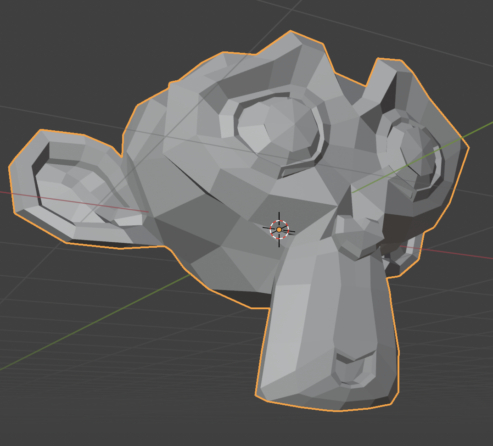
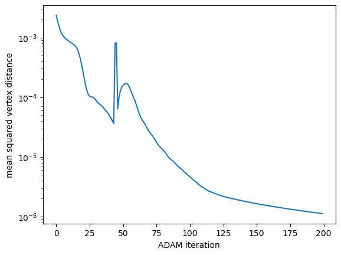
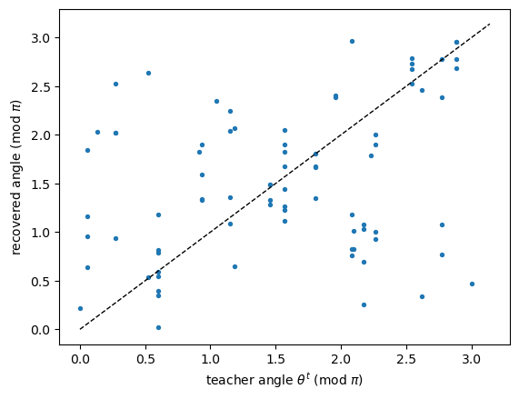
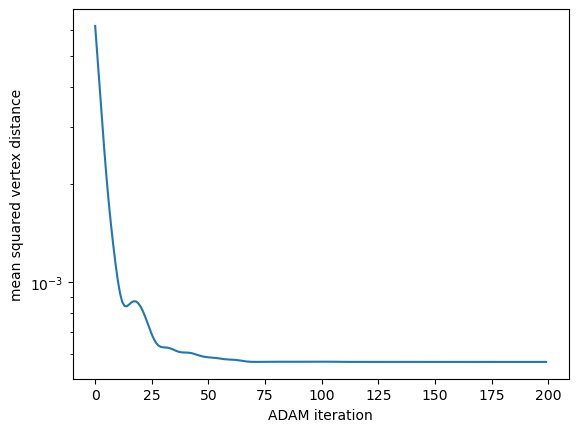
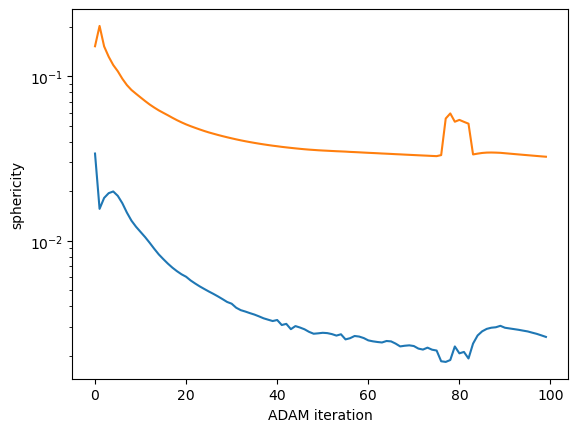

# Tutorial: Elastic inverse problems


This tutorial uses `triangulax` to study a geometric inverse problem:
given a physical **forward model**, find parameters so that the
simulation generates a target surface 𝒮<sub>1</sub> from an initial
state 𝒮<sub>0</sub>. Inverse problems are important both in engineering
and design, as well as in fitting a model to experimental data. We saw a
very simple inverse problem in tutorial 2, “mesh optimization”. Now we
will consider a more complex problem in 3d. From an ML perspective, the
simulation is effectively treated like a “neural network” which maps
initial conditions to simulation results, and simulation parameters as
trainable “weights”.

For example, consider an elastic energy *E*(**v**; **θ**) that depends
on both mesh vertex positions **v** and parameters **θ** (like elastic
moduli or reference shapes). The output of the simulation is the
minimum-energy configuration
**v**<sup>\*</sup>(**θ**) = arg min *E*(⋅; *θ*). The goal is to find
parameters **θ**<sup>\*</sup> so that the equilibrated vertex positions
**v**<sup>\*</sup>(**θ**<sup>\*</sup>) match the target shape. Via
automatic differentiation, one can differentiate
**v**<sup>\*</sup>(**θ**) with respect to the parameters **θ**, and use
gradient-based optimizers like ADAM to find the desired parameter value
**θ**<sup>\*</sup>.

The optimization library `optimistix` and the ODE library `diffrax`
allow automatically differentiating through complex simulations. More
generally, differentiating through a simulation facilitates sensitivity
analyses and fitting simulations to (experimental) data.

### Design of a shape-shifting material

In this notebook, we apply `triangulax` to the design of a shape
shifting-material, a thin liquid crystal elastomer sheet (see [Aharoni
et al., 2014](http://dx.doi.org/10.1103/PhysRevLett.113.257801), [van
Rees et al., 2017](http://www.pnas.org/cgi/doi/10.1073/pnas.1709025114),
and [Aharoni et al.,
2018](http://www.pnas.org/cgi/doi/10.1073/pnas.1804702115)).

These sheets have a nematic direction imprinted. When heated, the
material locally shrinks along the nematic director and expands in the
orthogonal direction. To relax the elastic energy, the material changes
shape and buckles into the third dimension. To control the curvature of
the material, one can glue together two sheets with different directors.
Differences in strain across the two layers induces curvature. The goal
is to paint two nematic director fields onto the surface so that the
elastically relaxed shape after heating matches a desired target.
Because the elastomer shrinks and contracts by equal amounts, the
problem is constrained: it is not possible to “morph” each piece of the
material into the target shape.

Note that Aharoni et al., 2018 already propose a numerical algorithm for
this inverse problem, based on elegant geometry and computer-graphics
techniques. However, the automatic-differentiation-based approach we
will use below (while less efficient) is more easily generalized. It is
a **black-box** approach that works with *any* forward simulation model
and does not exploit special structure, like the differential geometry
that underlies Aharoni et al.’s algorithm.

#### Suzanne

As a toy problem, we will aim for a nematic pattern on an initially
spherical surfaces that reproduces “Suzanne”, a mesh model of a monkey’s
head that is a common test case in the 3d software Blender:

<div>



</div>

<!-- WARNING: THIS FILE WAS AUTOGENERATED! DO NOT EDIT! -->

#### Elastic energy

The elastic energy combines an in-plane and a bending contribution,
using the framework of **metric elasticity**. The physical and “target”
shape of an elastic sheet are described by two metric tensors, *g* and
*g*<sub>*r*</sub>.

For the in-plane/stretch term, we use the St.-Venant-Kirchhoff elastic
energy:

$$E\_{\mathrm{SK}} = \frac{h}{4} \int dA \left\[\alpha \\ (\mathrm{tr}\[g_r^{-1} \cdot g - \mathbb{I}\])^2 + 2\beta \\ \mathrm{tr}\\\left\[(g_r^{-1} \cdot g - \mathbb{I})^2\right\] \right\]$$
where *α*, *β* are Lamé coefficients and
*g*<sub>*r*</sub><sup>−1</sup> ⋅ *g* − 𝕀 is a measure of strain (2x the
Green-Lagrange strain tensor). The `elastic` module implements a
discrete version of this energy, by computing the metric *g* for each
triangle from the 3D vertex positions. The integral becomes a sum over
all triangles. The overall scale is set by the shell thickness *h*.

Bending resistance is modeled using the **2nd fundamental form** *b*,
which quantifies the extrinsic curvature of the surface:
$$E\_{\mathrm{B}} = \frac{h^3}{12} \int dA \left\[\alpha \\ \mathrm{tr}\\\left(g_r^{-1}(b-b_r)\right)^2 + 2\beta \\ \mathrm{tr}\\\left((g_r^{-1}(b-b_r))^2\right) \right\]$$
The overall scale is set by *h*<sup>3</sup>: thin shells are much easier
to bend than to stretch, as one may verify using a sheet of paper.
*b*<sub>*r*</sub> is the target curvature. The combination of bending
and stretching energy *E*<sub>SK</sub> + *E*<sub>B</sub> is called the
“Koiter” shell energy.

One way to generate target curvature is a bilayer with two different
target metrics
*g*<sub>*r*</sub><sup>*t*</sup>, *g*<sub>*r*</sub><sup>*b*</sup> (for
top and bottom). Van Rees et al. showed that a bilayer is equivalent to
a monolayer with

$$g_r = \frac{1}{2}(g_r^{t} + g_r^{b}), \quad b_r = \frac{3}{4h}(g_r^{t} - g_r^{b})$$

**Sign convention**: `triangulax` uses the “positive-convex” convention
(a sphere with outward-pointing normals has *b* = +*g*), and the *top*
layer is the side the face normals point to. With the + sign above, an
expanding top layer creates positive target curvature.

#### Elastomers

Upon heating, a liquid crystal elastomer contracts along the local
nematic director and expands orthogonal to it. In this model, this is
captured by the *reference metric*. Initially, the reference metric
equals the physical metric of the initial shape 𝒮<sub>0</sub>,
*g*<sub>*r*</sub> = *g*<sub>0</sub>.

The change of target shape upon heating is described by a local strain
tensor
$$\Lambda(\theta) = R(\theta)^T \cdot \begin{pmatrix} \lambda & 0 \\ 0 & 1/\lambda \end{pmatrix} \cdot R(\theta) $$
where *R* is a rotation matrix, *θ* the local nematic angle, and *λ* the
local expansion ratio along the director (by convention, *λ* \< 1 for a
heated elastomer; choosing *λ* \> 1 is equivalent up to a rotation of
the pattern). Since det *Λ* = 1, the actuation is locally
**area-preserving**, which constrains the reachable target shapes. The
reference metric deforms according to
*g*<sub>*r*</sub> = *Λ*<sup>*T*</sup> ⋅ *g*<sub>0</sub> ⋅ *Λ*

**Important — frames**:

Our numerical implementation of the elastic energy follows [Chen et al.,
2018](https://doi.org/10.1145/3197517.3201395). The angles
*θ*<sup>*t*</sup>, *θ*<sup>*b*</sup> are encoded per triangle, as an
angle w.r.t. the first edge of the triangle. In the discrete elastic
energies, the metric tensor and the curvature form are expressed in the
basis of the triangle edges.

However, the rotation-matrix form of *Λ* holds in an *orthonormal*
frame, but the discrete metrics of the `elastic` module are expressed in
the (non-orthonormal) basis of the triangle edges. For a triangle with
vertices *a*, *b*, *c*, the edges are *u* = *b* − *a*, *v* = *c* − *a*,
and the metric in the edge basis becomes
$$g = \begin{pmatrix} u^2 & u\cdot v \\ v\cdot u & v^2 \end{pmatrix}$$
We therefore use a change of basis *B* per triangle which moves from the
*u*, *v* basis to an orthogonal basis. The rows of *B* are the edge
vectors in the orthonormal frame with *e*<sub>1</sub> = *u*/|*u*| and
*e*<sub>2</sub> ⟂ *e*<sub>1</sub>, |*e*<sub>2</sub>| = 1. In the
*B*-basis, *g*<sub>*B*</sub> = 𝕀 so that in the edge basis,
*g* = *B*<sup>*T*</sup>*B*. The actuated reference metric in the edge
basis is then
$$g_r = B^T \cdot \Lambda(\theta)^T\Lambda(\theta) \cdot B, \qquad \Lambda^T\Lambda = \frac{\lambda^2 + \lambda^{-2}}{2}\\\mathbb{I} + \frac{\lambda^2 - \lambda^{-2}}{2}\begin{pmatrix} \cos 2\theta & \sin 2\theta \\ \sin 2\theta & -\cos 2\theta \end{pmatrix}$$
The 2*θ*-dependence makes explicit that the director is a *nematic*
(headless) degree of freedom: *θ* and *θ* + *π* are the same state.

For a bilayer elastomer, there are two local nematic orientations
*θ*<sup>*t*</sup>, *θ*<sup>*b*</sup> that control the reference metrics
of the top and bottom sheet. As we saw above, this is equivalent to
changing the reference curvature of the sheet.

#### Inverse design

Our goal will be to program the local nematic orientations
*θ*<sup>*t*</sup>, *θ*<sup>*b*</sup> so that an initially spherical mesh
turns into a target shape. Given a nematic pattern
*θ*<sup>*t*</sup>, *θ*<sup>*b*</sup>, we simulate forward by minimizing
the elastic energy. We can then compute a loss: the mean squared
difference between the final vertex positions and the target. We can add
extra terms to the loss, for example, encouraging smooth nematic fields.
To solve the inverse design problem, we minimize the loss w.r.t.
*θ*<sup>*t*</sup>, *θ*<sup>*b*</sup> using gradient-based optimization
(the ADAM optimizer from `optax`). The gradient of the loss requires
differentiating *through* the energy minimization
**v**<sup>\*</sup>(**θ**) = arg min *E*(⋅ ; **θ**): `optimistix` does
this automatically via the implicit function theorem (no need to
backpropagate through the iterations of the inner optimizer).

Since the elastic energy is invariant under rigid motions (translations
and rotations), we first align the relaxed shape to the target with the
differentiable [Kabsch
algorithm](https://en.wikipedia.org/wiki/Kabsch_algorithm).

#### Targets

Before we turn to Suzanne, we will try this on less complex targets:

1.  A *teacher* shape generated by the forward model itself (so we know
    a solution exists and can compare the recovered pattern to the
    ground truth).

2.  A hand-designed deformed sphere (an ellipsoid).

``` python
import numpy as np
import matplotlib.pyplot as plt
import meshplot
from tqdm.notebook import tqdm
import igl

from IPython.display import IFrame
```

``` python
import jax.numpy as jnp
import jax
```

``` python
jax.config.update("jax_enable_x64", True)
# note: keep jax_debug_nans off. the line searches inside the minimizers produce
# (safely handled) NaNs that would trigger false positives
jax.config.update("jax_debug_nans", False)
```

``` python
from jaxtyping import Float
```

``` python
import optimistix
import optax
```

``` python
from triangulax import geometry as geom
from triangulax import elastic
from triangulax import algorithms as algo
from triangulax import adjacency as adj
from triangulax.triangular import TriMesh
from triangulax.mesh import HeMesh
```

### Load mesh

We start with a very coarse unit sphere (42 vertices) so that
experiments run in seconds. The sphere serves as both the initial
condition and the rest configuration of the shell.

Throughout the tutorial, we consider meshes without boundary.

``` python
def load_sphere(name):
    """Loads, centers, and scales a sphere mesh from the tutorial_meshes/ directory."""
    mesh = TriMesh.read_obj(f"tutorial_meshes/{name}.obj", dim=3)
    vertices = mesh.vertices - mesh.vertices.mean(axis=0)
    vertices = jnp.asarray((vertices.T / np.linalg.norm(vertices, axis=1)).T)
    return vertices, HeMesh.from_triangles(vertices.shape[0], mesh.faces)

v0, hemesh = load_sphere("sphere")
metric_rest = elastic.get_metric(v0, hemesh)
b_rest = elastic.get_second_fundamental_form(v0, hemesh)

thickness, lam = 0.1, 1.1  # shell thickness h and nematic expansion ratio lambda
hemesh
```

    Warning: readOBJ() ignored non-comment line 3:
      o Icosphere

    HeMesh(N_V=42, N_HE=240, N_F=80)

### Programming the reference metric with nematic directors

We now implement the actuation: per-face director angles
*θ*<sup>*t*</sup>, *θ*<sup>*b*</sup>↦ reference metric *g*<sub>*r*</sub>
and reference curvature *b*<sub>*r*</sub>, following the formulas above.

``` python
def get_face_basis_from_metric(metric):
    """Per-face upper-triangular B with metric = B^T B (columns = edge vectors u, v
    in the orthonormal face frame e1 = u/|u|, e2 in-plane perpendicular)."""
    g00, g01 = metric[..., 0, 0], metric[..., 0, 1]
    det, sq = jnp.linalg.det(metric), jnp.sqrt(metric[..., 0, 0])
    zero = jnp.zeros_like(g00)
    return jnp.stack([jnp.stack([sq, g01 / sq], axis=-1),
                      jnp.stack([zero, jnp.sqrt(det) / sq], axis=-1)], axis=-2)


def get_nematic_metric(theta, lam, metric_rest):
    """Reference metric after nematic actuation: stretch lam along the director
    (angle theta from the first triangle edge), 1/lam orthogonal. Area-preserving.
    Final argument is the reference metric, which is used to compute the face basis
    in which the nematic metric is evaluated.
    """
    m = (lam**2 + lam**-2) / 2
    d = (lam**2 - lam**-2) / 2
    c2, s2 = jnp.cos(2 * theta), jnp.sin(2 * theta)
    Lam2 = jnp.stack([jnp.stack([m + d * c2, d * s2], axis=-1),
                      jnp.stack([d * s2, m - d * c2], axis=-1)], axis=-2)
    B = get_face_basis_from_metric(metric_rest)
    return jnp.einsum("...ji,...jk,...kl->...il", B, Lam2, B)


def get_bilayer_metric_and_curvature(theta_top, theta_bot, lam, metric_rest, b_rest, thickness):
    """Monolayer-equivalent (metric_ref, b_ref) for a bilayer with two director fields
    (van Rees et al. 2017). Top layer = side the face normals point to."""
    g_top = get_nematic_metric(theta_top, lam, metric_rest)
    g_bot = get_nematic_metric(theta_bot, lam, metric_rest)
    return (g_top + g_bot) / 2, b_rest + 3 / (4 * thickness) * (g_top - g_bot)
```

``` python
# tests: B^T B recovers the metric; lam=1 is the identity; actuation is area-preserving
B = get_face_basis_from_metric(metric_rest)
assert np.allclose(jnp.einsum("fji,fjk->fik", B, B), metric_rest)
assert np.allclose(get_nematic_metric(jnp.zeros(hemesh.n_faces), 1.0, metric_rest), metric_rest)
g_nem = get_nematic_metric(jnp.linspace(0, np.pi, hemesh.n_faces), lam, metric_rest)
assert np.allclose(jnp.linalg.det(g_nem), jnp.linalg.det(metric_rest))
```

``` python
# to define smooth test patterns and to visualize directors, we need the orthonormal
# face frames (e1 along the first edge) in 3D world coordinates

def angle_from_global_direction(D, vertices, hemesh):
    """Per-face director angle (w.r.t. first edge) of a global 3D direction D
    projected onto each face."""
    e1, e2 = geom.get_face_tangent_basis(vertices, hemesh)
    D = jnp.broadcast_to(D, e1.shape)
    return jnp.arctan2(jnp.sum(D * e2, axis=-1), jnp.sum(D * e1, axis=-1))


def director_segments(theta, vertices, hemesh, scale=0.1, offset=0.0):
    """Line segments visualizing a per-face director field (for meshplot.add_lines)."""
    e1, e2 = geom.get_face_tangent_basis(vertices, hemesh)
    d = jnp.cos(theta)[:, None] * e1 + jnp.sin(theta)[:, None] * e2
    centroids = geom.get_face_centroids(vertices, hemesh) + offset
    return np.array(centroids - scale * d), np.array(centroids + scale * d)
```

``` python
# example: the projection of the z-axis onto the sphere gives a smooth director
# field with defects at the poles (a nematic field on a sphere must have defects!)
theta_example = angle_from_global_direction(jnp.array([0., 0., 1.]), v0, hemesh)

p = meshplot.plot(np.array(v0), np.array(hemesh.faces), shading={"wireframe": True},
                  return_plot=True)
p.add_lines(*director_segments(theta_example, v0, hemesh), shading={"line_color": "red"})
p.save("tutorial_plots/06_director_field.html")
```

    Renderer(camera=PerspectiveCamera(children=(DirectionalLight(color='white', intensity=0.6, position=(0.0, 0.0,…

    Plot saved to file tutorial_plots/06_director_field.html.

``` python
IFrame(src="tutorial_plots/06_director_field.html", width="100%", height=400) # for display in docs webpage
```

        <iframe
            width="100%"
            height="400"
            src="tutorial_plots/06_director_field.html"
            frameborder="0"
            allowfullscreen
            &#10;        ></iframe>
        &#10;

### Forward model: elastic relaxation

The forward model relaxes the shell to its energy minimum for given
director fields. The total energy is the sum of the St.-Venant-Kirchhoff
in-plane and bending energies with the thickness scaling from above. We
minimize with BFGS (the mesh is small; for larger meshes, use
`optimistix.NonlinearCG` or a limited-memory method).

``` python
def get_shell_energy(vertices, args):
    """Koiter shell energy: E = h/4 * E_SK(g_r) + h^3/12 * E_B(g_r, b_r)."""
    hemesh, metric_ref, b_ref, thickness = args
    E_s = elastic.get_st_venant_kirchhoff_energy(vertices, (hemesh, metric_ref, 1.0, 1.0))
    E_b = elastic.get_svk_bending_energy(vertices, (hemesh, metric_ref, b_ref, 1.0, 1.0))
    return thickness / 4 * E_s + thickness**3 / 12 * E_b

solver = optimistix.NonlinearCG(rtol=1e-9, atol=1e-9)

def relax_shell(theta_top, theta_bot, v_init, hemesh, metric_rest, b_rest):
    """Minimize the shell energy for a given nematic pattern (differentiable)."""
    metric_ref, b_ref = get_bilayer_metric_and_curvature(theta_top, theta_bot, lam,
                                                         metric_rest, b_rest, thickness)
    sol = optimistix.minimise(get_shell_energy, solver, v_init,
                              (hemesh, metric_ref, b_ref, thickness),
                              max_steps=4000, throw=False)
    return sol.value
```

``` python
# at lam = 1 (no actuation), the sphere is the exact rest state
metric_ref, b_ref = get_bilayer_metric_and_curvature(jnp.zeros(hemesh.n_faces),
                                                     jnp.zeros(hemesh.n_faces),
                                                     1.0, metric_rest, b_rest, thickness)
args = (hemesh, metric_ref, b_ref, thickness)
assert np.isclose(get_shell_energy(v0, args), 0.0, atol=1e-12)
assert np.allclose(jax.grad(get_shell_energy)(v0, args), 0.0, atol=1e-10)
```

#### What does a nematic pattern do?

Let’s actuate the sphere with a simple hand-picked *teacher* pattern
where the top director is along the (projected) *z*-axis. If the bottom
director is parallel to the top, the sphere is stretched along the *z*
axis. Orthogonal directors in the two layers create a large metric
mismatch, i.e. mainly a change of the reference *curvature*. This leads
to buckling.

``` python
theta_teacher_top = angle_from_global_direction(jnp.array([0., 0., 1.]), v0, hemesh)

#theta_teacher_bot = theta_teacher_top  # equal top and bottom directors
theta_teacher_bot = theta_teacher_top + np.pi / 2 # opposite top and bottom directors

v_teacher = relax_shell(theta_teacher_top, theta_teacher_bot, v0, hemesh, metric_rest, b_rest)
displacement = jnp.linalg.norm(v_teacher - v0, axis=-1)
print(f"max displacement: {displacement.max():.3f} (sphere radius 1)")

p = meshplot.plot(np.array(v0), np.array(hemesh.faces), shading={"wireframe": True},
                  return_plot=True)
p.add_mesh(np.array(v_teacher) + np.array([2.5, 0, 0]), np.array(hemesh.faces),
           shading={"wireframe": True})
p.save("tutorial_plots/06_teacher_forward.html")
```

    max displacement: 0.393 (sphere radius 1)

    Renderer(camera=PerspectiveCamera(children=(DirectionalLight(color='white', intensity=0.6, position=(0.0, 0.0,…

    Plot saved to file tutorial_plots/06_teacher_forward.html.

``` python
IFrame(src="tutorial_plots/06_teacher_forward.html", width="100%", height=400)
```

        <iframe
            width="100%"
            height="400"
            src="tutorial_plots/06_teacher_forward.html"
            frameborder="0"
            allowfullscreen
            &#10;        ></iframe>
        &#10;

### Inverse design 1: recovering a hidden nematic pattern

We now treat the deformed shape produced by the teacher pattern as the
*target*, forget the pattern, and try to recover it from the shape alone
by gradient descent through the simulation. This is the cleanest first
test: we know the target is exactly reachable.

Two ingredients:

- **Alignment**: the elastic energy is invariant under rigid motions, so
  we align the relaxed shape to the target with the (differentiable)
  Kabsch algorithm before comparing.
- **Smoothness regularization**: to encourage smooth director fields, we
  penalize differences of the nematic **Q-tensor** *Q* = *d* ⊗ *d* − 𝕀/2
  between adjacent faces (where *d* is the unit director in 3D world
  coordinates). This respects the nematic gauge symmetry *θ* ∼ *θ* + *π*
  and ensures valid comparison across different faces.

#### 2nd-level optimizer

To minimize the elastic energy, we used a “classical” optimization
algorithm (BFGS, or CG). For the 2nd level of optimization (over the
model parameters), we use the ADAM optimizer, a standard choice in
machine learning. ADAM is better suited to large-scale problems.

Classical optimizers like BFGS make multiple function calls at each step
(line search) and compute an approximation of the function’s Hessian.
This becomes too expensive for large parameter counts and functions
which take a long time to evaluate.

``` python
from triangulax.algorithms import kabsch_align
```

``` python
def compute_nematic_tensor(theta, e1, e2):
    """Compute the nematic Q-tensor from a director angle theta and a face basis (e1, e2)."""
    d = jnp.cos(theta)[:, None] * e1 + jnp.sin(theta)[:, None] * e2
    return d[:, :, None] * d[:, None, :] - jnp.eye(3) / 2

def make_loss(v_target, v_init, hemesh, metric_rest, b_rest, reg=0.0):
    """Loss = mean squared vertex distance after alignment + Q-tensor smoothness.

    The relaxation always starts from v_init (the rest configuration), so the loss
    evaluates the state that an experiment starting from rest would actually reach.
    """
    e1, e2 = geom.get_face_tangent_basis(v_init, hemesh)
    f1, f2 = hemesh.heface, hemesh.heface[hemesh.twin]
    interior = hemesh.is_unique & ~hemesh.is_bdry_edge

    def smoothness(theta):
        Q = compute_nematic_tensor(theta, e1, e2)
        dQ = ((Q[f1] - Q[f2]) ** 2).sum(axis=(-1, -2))
        return jnp.where(interior, dQ, 0.0).sum() / interior.sum()

    def loss(params):
        theta_top, theta_bot = params
        v_star = relax_shell(theta_top, theta_bot, v_init, hemesh, metric_rest, b_rest)
        fit = jnp.mean((kabsch_align(v_star, v_target)[0] - v_target) ** 2)
        return fit + reg * (smoothness(theta_top) + smoothness(theta_bot)), fit

    return loss
```

``` python
# check the gradient through the energy minimization against finite differences
loss = make_loss(v_teacher, v0, hemesh, metric_rest, b_rest)
params = (jnp.zeros(hemesh.n_faces), jnp.zeros(hemesh.n_faces))
(L, fit), grads = jax.value_and_grad(loss, has_aux=True)(params)

v_recovered_initial = relax_shell(*params, v0, hemesh, metric_rest, b_rest)

eps = 1e-5
L_pert, _ = loss((params[0].at[3].add(eps), params[1]))
fd = (L_pert - L) / eps
print(f"autodiff {grads[0][3]:.6e} vs finite difference {fd:.6e}")
assert np.isclose(grads[0][3], fd, rtol=0.05)
```

    autodiff 1.678055e-05 vs finite difference 1.678099e-05

``` python
# ADAM loop. on this coarse mesh, each iteration (forward relaxation + implicit
# backward pass) takes a few milliseconds once compiled
value_and_grad = jax.jit(jax.value_and_grad(loss, has_aux=True))

optimizer = optax.adam(learning_rate=0.1)
opt_state = optimizer.init(params)
history = []
for k in tqdm(range(200)):
    (L, fit), grads = value_and_grad(params)
    updates, opt_state = optimizer.update(grads, opt_state)
    params = optax.apply_updates(params, updates)
    history.append(fit)

plt.semilogy(history)
plt.xlabel("ADAM iteration"); plt.ylabel("mean squared vertex distance");
```

      0%|          | 0/200 [00:00<?, ?it/s]



``` python
# the recovered pattern reproduces the target shape to a fraction of a percent ...
v_recovered = relax_shell(*params, v0, hemesh, metric_rest, b_rest)
err = jnp.linalg.norm(kabsch_align(v_recovered, v_teacher)[0] - v_teacher, axis=-1)
print(f"max vertex error {err.max():.4f} vs target displacement scale {displacement.max():.3f}")
```

    max vertex error 0.0031 vs target displacement scale 0.393

``` python
# plot the initial and final recovered shapes next to the teacher shape
p = meshplot.plot(np.array(v_recovered_initial), np.array(hemesh.faces), shading={"wireframe": True},
                  return_plot=True)

p.add_mesh(np.array(v_recovered) + np.array([2.5, 0, 0]), np.array(hemesh.faces), shading={"wireframe": True},)

p.add_mesh(np.array(v_teacher) + np.array([5, 0, 0]), np.array(hemesh.faces), shading={"wireframe": True})
p.save("tutorial_plots/06_teacher_vs_student.html")
```

    Renderer(camera=PerspectiveCamera(children=(DirectionalLight(color='white', intensity=0.6, position=(0.0145714…

    Plot saved to file tutorial_plots/06_teacher_vs_student.html.

``` python
IFrame(src="tutorial_plots/06_teacher_vs_student.html", width="100%", height=400)
```

        <iframe
            width="100%"
            height="400"
            src="tutorial_plots/06_teacher_vs_student.html"
            frameborder="0"
            allowfullscreen
            &#10;        ></iframe>
        &#10;

``` python
# Let's plot the recovered director field and the hidden teacher pattern

delta = (params[0] - theta_teacher_top + np.pi / 2) % np.pi - np.pi / 2
print(f"median director angle error: {np.degrees(np.median(np.abs(delta))):.1f} deg")

plt.scatter(theta_teacher_top % np.pi, params[0] % np.pi, s=8)
plt.plot([0, np.pi], [0, np.pi], "k--", lw=1)
plt.xlabel(r"teacher angle $\theta^t$ (mod $\pi$)"); plt.ylabel("recovered angle (mod $\pi$)");
```

    median director angle error: 25.6 deg

    <>:8: SyntaxWarning: "\p" is an invalid escape sequence. Such sequences will not work in the future. Did you mean "\\p"? A raw string is also an option.
    <>:8: SyntaxWarning: "\p" is an invalid escape sequence. Such sequences will not work in the future. Did you mean "\\p"? A raw string is also an option.
    /var/folders/vm/1jl6rjln6n9cjt54vsr9n4800000gr/T/ipykernel_7507/1643597439.py:8: SyntaxWarning: "\p" is an invalid escape sequence. Such sequences will not work in the future. Did you mean "\\p"? A raw string is also an option.
      plt.xlabel(r"teacher angle $\theta^t$ (mod $\pi$)"); plt.ylabel("recovered angle (mod $\pi$)");



#### Non-uniqueness in inverse problems

The shape is reproduced almost exactly — but the *pattern* is only
partially identified: the difference between teacher and student
parameters is substantial. The reason is that many patterns produce
similar relaxed shapes. This non-uniqueness is a generic feature of
inverse problems. Adding the smoothness regularizer selects *one*
well-behaved solution (with smooth director fields) among the
near-degenerate ones. But this is not necessarily the teacher pattern
(you can check by `reg`).

### Inverse design 2: a hand-designed target

Now for a real design task: deform the sphere into a *prescribed* shape,
in this case, an ellipsoid. Unlike the teacher target, an ellipsoid is
generally **not exactly reachable**: the nematic actuation is locally
area-preserving (det *Λ* = 1) and the expansion ratio is fixed at *λ*,
so the design space is constrained. Gradient descent will find the best
compromise.

``` python
v_ellipsoid = v0 * jnp.array([0.95, 0.95, 1.2])

loss = make_loss(v_ellipsoid, v0, hemesh, metric_rest, b_rest, reg=1e-3)
value_and_grad = jax.jit(jax.value_and_grad(loss, has_aux=True))

params = (jnp.zeros(hemesh.n_faces), jnp.zeros(hemesh.n_faces))
optimizer = optax.adam(learning_rate=0.1)
opt_state = optimizer.init(params)
history = []
for k in tqdm(range(200)):
    (L, fit), grads = value_and_grad(params)
    updates, opt_state = optimizer.update(grads, opt_state)
    params = optax.apply_updates(params, updates)
    history.append(fit)

v_designed = relax_shell(*params, v0, hemesh, metric_rest, b_rest)
err = jnp.linalg.norm(kabsch_align(v_designed, v_ellipsoid)[0] - v_ellipsoid, axis=-1)
print(f"fit {history[0]:.2e} -> {history[-1]:.2e}, max vertex error {err.max():.3f} "
      f"(target displacement scale {jnp.linalg.norm(v_ellipsoid - v0, axis=-1).max():.2f})")

plt.semilogy(history)
plt.xlabel("ADAM iteration"); plt.ylabel("mean squared vertex distance");
```

      0%|          | 0/200 [00:00<?, ?it/s]

    fit 6.18e-03 -> 5.66e-04, max vertex error 0.054 (target displacement scale 0.20)



``` python
# left: designed shape (colored by vertex error, with the optimized top director
# field); right: the ellipsoid target
p = meshplot.plot(np.array(v_designed), np.array(hemesh.faces), np.array(err),
                  shading={"wireframe": True}, return_plot=True)
p.add_lines(*director_segments(params[0], v_designed, hemesh), shading={"line_color": "red"})
p.add_mesh(np.array(v_ellipsoid) + np.array([2.5, 0, 0]), np.array(hemesh.faces),
           shading={"wireframe": True})
p.save("tutorial_plots/06_ellipsoid_design.html")
```

    Renderer(camera=PerspectiveCamera(children=(DirectionalLight(color='white', intensity=0.6, position=(-0.002212…

    Plot saved to file tutorial_plots/06_ellipsoid_design.html.

``` python
IFrame(src="tutorial_plots/06_ellipsoid_design.html", width="100%", height=400)
```

        <iframe
            width="100%"
            height="400"
            src="tutorial_plots/06_ellipsoid_design.html"
            frameborder="0"
            allowfullscreen
            &#10;        ></iframe>
        &#10;

### Scaling up

The same code runs on finer meshes, only slower: the inner elastic
relaxation (and the linear solve in the implicit-differentiation
backward pass) dominates, so on a 642-vertex sphere one ADAM iteration
takes on the order of a second.

**Warm-starting.** An obvious acceleration idea is to “warm” start each
relaxation from the equilibrium of the previous outer iteration. But
this can lead to biased results: the elastic energy equilibrium reached
from the warm-start is not necessarily the same as the one reached from
the desired initial condition.

``` python
v0_fine, hemesh_fine = load_sphere("sphere_fine")
metric_rest_fine = elastic.get_metric(v0_fine, hemesh_fine)
b_rest_fine = elastic.get_second_fundamental_form(v0_fine, hemesh_fine)
v_target_fine = v0_fine * jnp.array([0.95, 0.95, 1.2])

loss = make_loss(v_target_fine, v0_fine, hemesh_fine, metric_rest_fine, b_rest_fine,
                 reg=1e-3)
value_and_grad = jax.jit(jax.value_and_grad(loss, has_aux=True))

params = (jnp.zeros(hemesh_fine.n_faces), jnp.zeros(hemesh_fine.n_faces))
optimizer = optax.adam(learning_rate=0.1)
opt_state = optimizer.init(params)
history_fine = []
for k in tqdm(range(100)):
    (L, fit), grads = value_and_grad(params)
    updates, opt_state = optimizer.update(grads, opt_state)
    params = optax.apply_updates(params, updates)
    history_fine.append(fit)

v_designed_fine = relax_shell(*params, v0_fine, hemesh_fine, metric_rest_fine, b_rest_fine)
err_fine = jnp.linalg.norm(kabsch_align(v_designed_fine, v_target_fine)[0] - v_target_fine,
                           axis=-1)
print(f"fit {history_fine[0]:.2e} -> {history_fine[-1]:.2e}, "
      f"max vertex error {err_fine.max():.3f}")
```

    Warning: readOBJ() ignored non-comment line 4:
      o Icosphere

      0%|          | 0/100 [00:00<?, ?it/s]

    fit 5.94e-03 -> 5.31e-04, max vertex error 0.052

The final result shows a beautiful nematic pattern with two 1/2 defects
on the poles of the ellipsoid.

``` python
p = meshplot.plot(np.array(v_designed_fine), np.array(hemesh_fine.faces), np.array(err_fine),
                  shading={"wireframe": False}, return_plot=True)
p.add_lines(*director_segments(params[0], v_designed_fine, hemesh_fine, scale=0.05),
            shading={"line_color": "red"})
p.add_mesh(np.array(v_target_fine) + np.array([2.5, 0, 0]), np.array(hemesh_fine.faces),
           shading={"wireframe": False})
p.save("tutorial_plots/06_ellipsoid_design_fine.html")
```

    Renderer(camera=PerspectiveCamera(children=(DirectionalLight(color='white', intensity=0.6, position=(-0.000453…

    Plot saved to file tutorial_plots/06_ellipsoid_design_fine.html.

``` python
IFrame(src="tutorial_plots/06_ellipsoid_design_fine.html", width="100%", height=400)
```

        <iframe
            width="100%"
            height="400"
            src="tutorial_plots/06_ellipsoid_design_fine.html"
            frameborder="0"
            allowfullscreen
            &#10;        ></iframe>
        &#10;

### Suzanne

Generating `suzanne` from the introduction from an initially spherical
mesh will require a more complex pattern than an ellipsoid. We expect
the outer optimizer to take longer (our Suzanne mesh has 1362 vertices,
so a single relaxation takes several seconds).

Second, we need to rethink our loss function. If we start our simulation
from the `sphere_fine.obj` mesh, we will have to compare meshes with
*different* connectivity (simulation output vs Suzanne). Finding a good
metric to compare meshes is challenging, and at the heart of [active
research in inverse design](https://arxiv.org/abs/2512.17129).

Therefore, we **side-step** the difficult mesh-mesh alignment problem.
Instead, we turn the problem on its head. We start with a Suzanne mesh
and attempt to find a nematic pattern that turns `suzanne` into a sphere
(of arbitrary radius). For our loss function, we only need to evaluate
whether the relaxed mesh vertices lie on a sphere. The position of the
vertices in the final shape is now only constrained in the normal
direction - we do not care where the vertices lie on the sphere. In
addition, we add a penalty term that ensures that the mesh does not “get
folded” (i.e., no two mesh points get mapped to the same point on the
sphere). A folded configuration clearly is not a valid design! To do
this, we penalize bending in the final configuration.

For the purpose of this tutorial, we will thus solve the simpler
**reverse problem** of turning the Suzanne mesh into a sphere.

#### The mesh

Inverse design requires a well-conditioned underlying mesh:
near-degenerate triangles make the discrete elastic energy
ill-conditioned, and the outer optimization stalls or destroys the mesh.
We therefore replace the Blender `suzanne.obj` mesh with a smoothed,
cleaned-up version, `suzanne_smooth.obj`. The cell below verifies that
it meets our requirements: closed, connected, manifold,
outward-oriented, and with well-shaped triangles.

``` python
suzanne = TriMesh.read_obj("tutorial_meshes/suzanne_smooth.obj", dim=3) # suzanne_smooth
v0_suz = suzanne.vertices - suzanne.vertices.mean(axis=0)
v0_suz = jnp.asarray(v0_suz / np.sqrt((v0_suz**2).sum(axis=1).mean()))  # rms radius 1
hemesh_suz = HeMesh.from_triangles(v0_suz.shape[0], suzanne.faces)
metric_rest_suz = elastic.get_metric(v0_suz, hemesh_suz)
b_rest_suz = elastic.get_second_fundamental_form(v0_suz, hemesh_suz)

assert geom.get_volume(v0_suz, hemesh_suz) > 0  # outward normals
print(algo.get_mesh_quality_stats(v0_suz, hemesh_suz))
hemesh_suz
```

    {'areas_min': 0.00057, 'areas_max': 0.00764, 'areas_cv': 0.22016, 'max_angle': 122.49484, 'min_angle': 21.59996, 'angles_std': 8.79166, 'n_degenerate': 0, 'n_total_faces': 2720}

    Warning: readOBJ() ignored non-comment line 3:
      o suzanne_alpha_wrap_iso_remesh

    HeMesh(N_V=1362, N_HE=8160, N_F=2720)

#### Sphericity loss

The “time-reversed” problem needs no mesh-to-mesh comparison at all: the
loss only measures whether the relaxed vertices lie on *some* sphere. We
use the relative radius variance,

$$\mathcal{L}\_{\mathrm{sphere}}(\mathbf{v}) = \sum_i w_i \left(\frac{r_i}{\bar r} - 1\right)^2, \qquad r_i = |\mathbf{v}\_i - \mathbf{c}|, \quad \bar r = \sum_i w_i r_i,$$

which is zero iff the vertices lie on **any** sphere (no alignment
needed). The vertices are free to slide tangentially. The center **c**
and the mean radius are computed with **barycentric-area weights**
*w*<sub>*i*</sub> ∝ *A*<sub>*i*</sub>, since the vertices need not be
distributed uniformly on the sphere.

**Avoiding fold-overs.** During a first attempt with this loss, we found
that the optimizer *folds* the protruding features (ears, snout) flat
onto the sphere — not an acceptable elastomer design. To fix this, we
penalize creases in the *final configuration* using the bending energy
`elastic.get_dihedral_bending_energy` with flat target angles
(*θ*<sub>*e*</sub><sup>0</sup> = 0).

**Choice of the in-plane energy.** Due to the large deformations the
`suzanne` mesh needs to undergo, we replace the St.-Venant-Kirchhoff
energy (which is quadratic in the strain) with the more robust
**neo-Hookean** in-plane energy instead. Its density diverges as a mesh
triangle get squashed, improving numerical robustness.

The optimization is also more challenging: the ADAM optimizer can
overshoot in this rugged loss landscape, so we keep the best parameters
seen.

``` python
# overall material parameters

thickness_suz = 0.1
lam_suz = 1.5 # Suzanne's drastic deformations require a larger expansion factor.

solver = optimistix.NonlinearCG(rtol=1e-9, atol=1e-9)

def get_shell_energy_nh(vertices, args):
    """Shell energy with neo-Hookean in-plane term (diverges on triangle inversion)."""
    hemesh, metric_ref, b_ref, thickness = args
    E_s = elastic.get_neo_hookean_energy(vertices, (hemesh, metric_ref, 1.0, 1.0))

    E_b = elastic.get_svk_bending_energy(vertices, (hemesh, metric_ref, b_ref, 1.0, 1.0))
    return thickness / 4 * E_s + thickness**3 / 12 * E_b


def relax_suzanne(theta_top, theta_bot, v_init, lam=lam_suz):
    """Relax the Suzanne shell; lam_faces can be a scalar solver per-face array."""
    metric_ref, b_ref = get_bilayer_metric_and_curvature(theta_top, theta_bot, lam,
                                                         metric_rest_suz, b_rest_suz,
                                                         thickness_suz)
    sol = optimistix.minimise(get_shell_energy_nh, solver, v_init,
                              (hemesh_suz, metric_ref, b_ref, thickness_suz),
                              max_steps=8000, throw=False)
    return sol.value


def sphericity(v):
    """Area-weighted relative radius variance: 0 iff v lies on a sphere."""
    areas = geom.get_barycentric_cell_areas(v, hemesh_suz)
    w = areas / areas.sum()
    center = (w[:, None] * v).sum(axis=0)
    r = jnp.linalg.norm(v - center, axis=-1)
    r_mean = (w * r).sum()
    return (w * (r / r_mean - 1.0) ** 2).sum()


e1_suz, e2_suz = geom.get_face_tangent_basis(v0_suz, hemesh_suz)
f1_suz, f2_suz = hemesh_suz.heface, hemesh_suz.heface[hemesh_suz.twin]


def smoothness_suz(theta):
    Q = compute_nematic_tensor(theta, e1_suz, e2_suz)
    dQ_norm = ((Q[f1_suz] - Q[f2_suz]) ** 2).sum(axis=(-1, -2))
    return dQ_norm.mean()

def loss_suzanne(params, reg_theta=1e-2, w_fold=1e-4):
    theta_top, theta_bot = params
    v_star = relax_suzanne(theta_top, theta_bot, v0_suz)
    fit = sphericity(v_star)
    fold = elastic.get_dihedral_bending_energy(v_star, (hemesh_suz, 0.0, 1.0))
    penalty = (reg_theta * (smoothness_suz(theta_top) + smoothness_suz(theta_bot)) + w_fold * fold)

    return fit + penalty, fit

print(f"initial sphericity of Suzanne: {sphericity(v0_suz):.4f}")
```

    initial sphericity of Suzanne: 0.0322

``` python
value_and_grad = jax.jit(jax.value_and_grad(loss_suzanne, has_aux=True))

params = (jnp.zeros(hemesh_suz.n_faces), jnp.zeros(hemesh_suz.n_faces))

# to avoid instability, we need to decrease the learning rate of the optimizer over time
schedule = optax.piecewise_interpolate_schedule(
    interpolate_type='linear',
    init_value=0.5, 
    boundaries_and_scales={25: 0.2, 50: 0.2}) # decreases the lr by given factors at given times

optimizer = optax.adam(learning_rate=schedule) 
opt_state = optimizer.init(params)
history_suz, history_suz_loss, best_L, best_params = [], [], jnp.inf, params

for k in tqdm(range(100)):
    (L, fit), grads = value_and_grad(params)
    updates, opt_state = optimizer.update(grads, opt_state, params=params, value=L)
    params = optax.apply_updates(params, updates)
    history_suz.append(fit)
    history_suz_loss.append(L)
    print(f"iter {k:03d}: sphericity {fit:.4f}, penalty {L - fit:.2e}, loss {L:.4f}")
    if L < best_L:
        best_L, best_params = L, params
```

      0%|          | 0/100 [00:00<?, ?it/s]

    iter 000: sphericity 0.0339, penalty 1.18e-01, loss 0.1522
    iter 001: sphericity 0.0156, penalty 1.87e-01, loss 0.2023
    iter 002: sphericity 0.0182, penalty 1.34e-01, loss 0.1519
    iter 003: sphericity 0.0195, penalty 1.12e-01, loss 0.1315
    iter 004: sphericity 0.0200, penalty 9.71e-02, loss 0.1170
    iter 005: sphericity 0.0188, penalty 8.85e-02, loss 0.1073
    iter 006: sphericity 0.0169, penalty 7.97e-02, loss 0.0966
    iter 007: sphericity 0.0148, penalty 7.36e-02, loss 0.0884
    iter 008: sphericity 0.0133, penalty 6.93e-02, loss 0.0825
    iter 009: sphericity 0.0122, penalty 6.61e-02, loss 0.0783
    iter 010: sphericity 0.0113, penalty 6.31e-02, loss 0.0744
    iter 011: sphericity 0.0105, penalty 6.02e-02, loss 0.0707
    iter 012: sphericity 0.0097, penalty 5.76e-02, loss 0.0674
    iter 013: sphericity 0.0089, penalty 5.56e-02, loss 0.0646
    iter 014: sphericity 0.0083, penalty 5.38e-02, loss 0.0621
    iter 015: sphericity 0.0077, penalty 5.22e-02, loss 0.0599
    iter 016: sphericity 0.0073, penalty 5.07e-02, loss 0.0579
    iter 017: sphericity 0.0069, penalty 4.91e-02, loss 0.0559
    iter 018: sphericity 0.0065, penalty 4.76e-02, loss 0.0541
    iter 019: sphericity 0.0063, penalty 4.62e-02, loss 0.0525
    iter 020: sphericity 0.0060, penalty 4.50e-02, loss 0.0510
    iter 021: sphericity 0.0057, penalty 4.40e-02, loss 0.0497
    iter 022: sphericity 0.0055, penalty 4.31e-02, loss 0.0486
    iter 023: sphericity 0.0053, penalty 4.22e-02, loss 0.0475
    iter 024: sphericity 0.0051, penalty 4.14e-02, loss 0.0465
    iter 025: sphericity 0.0049, penalty 4.06e-02, loss 0.0456
    iter 026: sphericity 0.0048, penalty 4.00e-02, loss 0.0448
    iter 027: sphericity 0.0046, penalty 3.94e-02, loss 0.0440
    iter 028: sphericity 0.0044, penalty 3.88e-02, loss 0.0433
    iter 029: sphericity 0.0043, penalty 3.83e-02, loss 0.0426
    iter 030: sphericity 0.0041, penalty 3.78e-02, loss 0.0420
    iter 031: sphericity 0.0039, penalty 3.74e-02, loss 0.0414
    iter 032: sphericity 0.0038, penalty 3.70e-02, loss 0.0408
    iter 033: sphericity 0.0037, penalty 3.66e-02, loss 0.0403
    iter 034: sphericity 0.0036, penalty 3.62e-02, loss 0.0398
    iter 035: sphericity 0.0036, penalty 3.58e-02, loss 0.0394
    iter 036: sphericity 0.0035, penalty 3.55e-02, loss 0.0390
    iter 037: sphericity 0.0034, penalty 3.52e-02, loss 0.0386
    iter 038: sphericity 0.0033, penalty 3.49e-02, loss 0.0382
    iter 039: sphericity 0.0033, penalty 3.46e-02, loss 0.0379
    iter 040: sphericity 0.0033, penalty 3.43e-02, loss 0.0376
    iter 041: sphericity 0.0031, penalty 3.42e-02, loss 0.0372
    iter 042: sphericity 0.0031, penalty 3.38e-02, loss 0.0370
    iter 043: sphericity 0.0029, penalty 3.38e-02, loss 0.0367
    iter 044: sphericity 0.0030, penalty 3.34e-02, loss 0.0365
    iter 045: sphericity 0.0030, penalty 3.33e-02, loss 0.0362
    iter 046: sphericity 0.0029, penalty 3.31e-02, loss 0.0360
    iter 047: sphericity 0.0028, penalty 3.30e-02, loss 0.0358
    iter 048: sphericity 0.0027, penalty 3.29e-02, loss 0.0357
    iter 049: sphericity 0.0027, penalty 3.28e-02, loss 0.0355
    iter 050: sphericity 0.0028, penalty 3.26e-02, loss 0.0354
    iter 051: sphericity 0.0027, penalty 3.25e-02, loss 0.0353
    iter 052: sphericity 0.0027, penalty 3.24e-02, loss 0.0352
    iter 053: sphericity 0.0027, penalty 3.24e-02, loss 0.0350
    iter 054: sphericity 0.0027, penalty 3.22e-02, loss 0.0349
    iter 055: sphericity 0.0025, penalty 3.23e-02, loss 0.0348
    iter 056: sphericity 0.0026, penalty 3.21e-02, loss 0.0347
    iter 057: sphericity 0.0026, penalty 3.20e-02, loss 0.0346
    iter 058: sphericity 0.0026, penalty 3.19e-02, loss 0.0345
    iter 059: sphericity 0.0026, penalty 3.18e-02, loss 0.0344
    iter 060: sphericity 0.0025, penalty 3.18e-02, loss 0.0343
    iter 061: sphericity 0.0025, penalty 3.17e-02, loss 0.0342
    iter 062: sphericity 0.0024, penalty 3.16e-02, loss 0.0341
    iter 063: sphericity 0.0024, penalty 3.15e-02, loss 0.0339
    iter 064: sphericity 0.0025, penalty 3.14e-02, loss 0.0338
    iter 065: sphericity 0.0024, penalty 3.13e-02, loss 0.0337
    iter 066: sphericity 0.0024, penalty 3.12e-02, loss 0.0336
    iter 067: sphericity 0.0023, penalty 3.12e-02, loss 0.0335
    iter 068: sphericity 0.0023, penalty 3.11e-02, loss 0.0334
    iter 069: sphericity 0.0023, penalty 3.10e-02, loss 0.0333
    iter 070: sphericity 0.0023, penalty 3.09e-02, loss 0.0332
    iter 071: sphericity 0.0022, penalty 3.09e-02, loss 0.0331
    iter 072: sphericity 0.0022, penalty 3.08e-02, loss 0.0330
    iter 073: sphericity 0.0022, penalty 3.07e-02, loss 0.0329
    iter 074: sphericity 0.0022, penalty 3.06e-02, loss 0.0328
    iter 075: sphericity 0.0022, penalty 3.06e-02, loss 0.0327
    iter 076: sphericity 0.0019, penalty 3.13e-02, loss 0.0332
    iter 077: sphericity 0.0018, penalty 5.35e-02, loss 0.0554
    iter 078: sphericity 0.0019, penalty 5.76e-02, loss 0.0595
    iter 079: sphericity 0.0023, penalty 5.07e-02, loss 0.0529
    iter 080: sphericity 0.0021, penalty 5.22e-02, loss 0.0543
    iter 081: sphericity 0.0021, penalty 5.07e-02, loss 0.0528
    iter 082: sphericity 0.0019, penalty 4.96e-02, loss 0.0515
    iter 083: sphericity 0.0024, penalty 3.11e-02, loss 0.0335
    iter 084: sphericity 0.0027, penalty 3.12e-02, loss 0.0339
    iter 085: sphericity 0.0028, penalty 3.14e-02, loss 0.0342
    iter 086: sphericity 0.0029, penalty 3.15e-02, loss 0.0344
    iter 087: sphericity 0.0030, penalty 3.14e-02, loss 0.0344
    iter 088: sphericity 0.0030, penalty 3.14e-02, loss 0.0344
    iter 089: sphericity 0.0030, penalty 3.12e-02, loss 0.0343
    iter 090: sphericity 0.0030, penalty 3.11e-02, loss 0.0341
    iter 091: sphericity 0.0029, penalty 3.09e-02, loss 0.0339
    iter 092: sphericity 0.0029, penalty 3.08e-02, loss 0.0337
    iter 093: sphericity 0.0029, penalty 3.06e-02, loss 0.0335
    iter 094: sphericity 0.0028, penalty 3.05e-02, loss 0.0333
    iter 095: sphericity 0.0028, penalty 3.03e-02, loss 0.0331
    iter 096: sphericity 0.0028, penalty 3.02e-02, loss 0.0330
    iter 097: sphericity 0.0027, penalty 3.01e-02, loss 0.0328
    iter 098: sphericity 0.0027, penalty 2.99e-02, loss 0.0326
    iter 099: sphericity 0.0026, penalty 2.98e-02, loss 0.0324

``` python
theta_top_suz, theta_bot_suz = best_params

v_sphered = relax_suzanne(theta_top_suz, theta_bot_suz, v0_suz)
r = jnp.linalg.norm(v_sphered - v_sphered.mean(axis=0), axis=-1)
r0 = jnp.linalg.norm(v0_suz - v0_suz.mean(axis=0), axis=-1)
dihedrals = jnp.abs(geom.get_dihedral_angles(v_sphered, hemesh_suz))

print(f"sphericity {history_suz[0]:.4f} -> {sphericity(v_sphered):.4f}, "
      f"std(r)/mean(r): {r.std()/r.mean():.3f} (initially {r0.std()/r0.mean():.3f})")
print(f"largest dihedral angle: {jnp.degrees(dihedrals.max()):.0f} deg, "
      f"edges folded beyond 90 deg: {int((dihedrals > jnp.pi/2).sum()) // 2}")
print(algo.get_mesh_quality_stats(v_sphered, hemesh_suz))

plt.semilogy(history_suz)
plt.semilogy(history_suz_loss)
plt.xlabel("ADAM iteration"); plt.ylabel("sphericity");
```

    sphericity 0.0339 -> 0.0026, std(r)/mean(r): 0.060 (initially 0.192)
    largest dihedral angle: 45 deg, edges folded beyond 90 deg: 0
    {'areas_min': 0.00053, 'areas_max': 0.01047, 'areas_cv': 0.31436, 'max_angle': 124.37489, 'min_angle': 17.03894, 'angles_std': 18.49525, 'n_degenerate': 0, 'n_total_faces': 2720}



``` python
# the design is protocol-independent: quasi-statically ramping the actuation
# (slow heating, lambda(t) = 1 + t*(lambda - 1)) reaches the same final state

v_ramp = v0_suz
for t in [0.25, 0.5, 0.75, 1.0]:
    v_ramp = relax_suzanne(theta_top_suz, theta_bot_suz, v_ramp, lam=1.0 + t * (lam_suz - 1.0))
print(f"sphericity: direct relaxation {sphericity(v_sphered):.4f}, "
      f"quasi-static ramp {sphericity(v_ramp):.4f}")
```

    sphericity: direct relaxation 0.0026, quasi-static ramp 0.0026

``` python
# left: Suzanne colored by the optimized expansion factor lambda (per vertex,
# averaged from faces), with the top director field; right: the "spherized" result

view = np.diag([1, -1, -1])

p = meshplot.plot(np.array(v0_suz)@view, np.array(hemesh_suz.faces),
                  shading={"wireframe": False}, return_plot=True)

p.add_lines(*director_segments(theta_top_suz, v0_suz@view, hemesh_suz, scale=0.04),
            shading={"line_color": "red"})
p.add_mesh(np.array(v_sphered)@view + np.array([3.0, 0, 0]), np.array(hemesh_suz.faces),
           np.array(r / r.mean() - 1), shading={"wireframe": False})
p.save("tutorial_plots/06_suzanne_spherized_random_initial_cond_uniform_lam.html")
```

    Renderer(camera=PerspectiveCamera(children=(DirectionalLight(color='white', intensity=0.6, position=(0.0076903…

    Plot saved to file tutorial_plots/06_suzanne_spherized_random_initial_cond_uniform_lam.html.

``` python
IFrame(src="tutorial_plots/06_suzanne_spherized_random_initial_cond_uniform_lam.html",
       width="100%", height=400)
```

        <iframe
            width="100%"
            height="400"
            src="tutorial_plots/06_suzanne_spherized_random_initial_cond_uniform_lam.html"
            frameborder="0"
            allowfullscreen
            &#10;        ></iframe>
        &#10;

The design is close to flattening Suzanne into a smooth sphere: the
relative radius spread drops from 0.19 to about 0.06, and — thanks to
the fold penalty — the mesh has no creases. The final mesh quality is
good (no degenerate triangles).

Unfortunately, we cannot quite flatten the snouts and ears!
